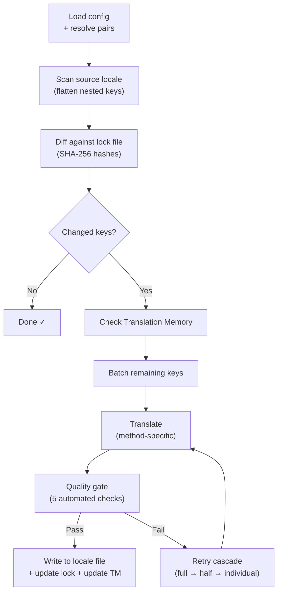

# i18n-rosetta 작동 방식

i18n-rosetta는 단일 명령으로 앱의 로케일 파일을 번역해요. 내부적으로 어떤 일이 일어나는지 살펴볼게요.

## 파이프라인

`npx i18n-rosetta sync`을(를) 실행하면, rosetta는 6단계 파이프라인을 실행해요.



**주요 설계 결정 사항:**

- **SHA-256 해시를 통한 변경 사항 감지.** Rosetta는 `.i18n-rosetta.lock`에서 해시를 사용해 모든 소스 값을 추적해요. 영어 문자열을 업데이트하면 해당 키만 다시 번역돼요. 이것이 반복 실행 시 `sync`이(가) 빠른 이유예요. 최소한의 작업만 수행하거든요.

- **Translation Memory 캐싱.** API 호출을 하기 전에, rosetta는 `.rosetta/tm.json`에서 캐시된 번역(소스 텍스트 + 로케일 + 메서드를 키로 사용)이 있는지 확인해요. 키 하나를 변경한 후 일반적인 재동기화를 수행하면, 142개의 키는 캐시에서 가져오고 1개의 키만 API를 호출해요.

- **쓰기 전 품질 게이트(Quality gate).** 모든 번역은 파일에 적용되기 전에 5가지 자동화된 검사(빈 값, 소스 에코, 환각 루프, 길이 팽창, 스크립트 준수)를 통과해야 해요. 실패한 항목은 기록되며, 절대 조용히 넘어가지 않아요.

- **실패 시 재시도 캐스케이드(Retry cascade).** 배치 처리가 실패하면(JSON 파싱 오류, API 시간 초과 등), rosetta는 전체 → 절반 → 개별 단위로 점차 배치의 크기를 줄여가며 재시도해요. 이를 통해 나머지 작업에 영향을 주지 않고 문제가 있는 키를 격리할 수 있어요.

## 번역 메서드

Rosetta는 4가지 번역 메서드를 지원하며, 각각 다른 시나리오에 적합해요.

| 메서드 | 작동 방식 | 추천 대상 |
|--------|-------------|----------|
| **`llm`** | 모든 OpenRouter 모델에 대한 구조화된 프롬프트 | 리소스가 풍부한 언어 |
| **`llm-coached`** | 동일한 프롬프트 + 문법 규칙, 사전 및 스타일 노트 | LLM이 예측 가능한 오류를 범하는 언어 |
| **`google-translate`** | Google Cloud Translation API 배치 요청 | GT 지원이 우수한 고자원 언어 |
| **`api`** | 자체 엔드포인트로의 HTTP POST | 커스텀 파이프라인, 커뮤니티 제어 모델 |

메서드는 언어 쌍별로 구성돼요. 프랑스어에는 `google-translate`을(를) 사용하고 평원 크리어(Plains Cree)에는 `llm-coached`을(를) 사용할 수 있어요. 각 언어 쌍에 가장 적합한 메서드를 적용하는 거죠.

## 코칭 데이터

`llm-coached` 쌍의 경우, 코칭 데이터는 LLM에 문법 규칙, 필수 용어, 스타일 선호도 등 명시적인 언어 지식을 제공해요. 이는 구조화된 컨텍스트로서 모든 프롬프트에 주입돼요.

```json title="coaching/crk.json"
{
  "grammar_rules": ["Animate nouns take different plural forms than inanimate nouns"],
  "dictionary": {"welcome": "ᑕᓂᓯ", "settings": "ᐃᑕᐢᑌᐘᐃᓇ"},
  "style_notes": "Use Standard Roman Orthography (SRO) unless explicitly configured otherwise."
}
```

코칭 데이터는 모델을 파인튜닝하지 않고도 번역 품질을 향상시키는 주요 메커니즘이에요. 규칙 변경 → 동기화 재실행 → 효과 확인의 과정을 거치죠. 반복 작업이 즉각적으로 이루어져요.

## 플러그인

플러그인은 특정 언어 쌍을 위해 미리 패키징된 번역 레시피예요. 코드가 아닌 JSON 매니페스트 형식이며, rosetta에게 어떤 메서드를 사용할지, 어떤 설정을 적용할지, 그리고 벤치마크된 품질은 어느 정도인지 알려줘요.

```bash
i18n-rosetta plugin install ./crk-coached-v3/
i18n-rosetta sync   # uses the installed plugin for en→crk
```

플러그인은 연구와 프로덕션 사이의 격차를 해소해요. [MT Eval Arena](https://mtevalarena.org)에서 좋은 점수를 받은 메서드를 플러그인으로 패키징하여 여기에 배포할 수 있어요.

## 더 큰 그림

i18n-rosetta는 두 부분으로 구성된 생태계의 한 축이에요.

- **[MT Eval Arena](https://mtevalarena.org)** — 재현 가능한 벤치마킹을 통해 번역 메서드가 **개발되고 검증되는** 곳이에요.
- **i18n-rosetta** — 검증된 메서드가 실제 콘텐츠를 번역하기 위해 **배포되는** 곳이에요.

[Eval Harness Bridge](/docs/guides/bridge)가 이 둘을 연결해요. Arena에서 검증된 메서드가 이곳에 배포되죠. 프로덕션 환경에서 수집된 화자의 피드백은 다음 버전을 개선하는 데 사용돼요.

---

## 더 알아보기

- [동기화 작동 방식](/docs/concepts/how-sync-works) — 상세한 단계별 파이프라인 설명
- [품질 게이트](/docs/concepts/quality-gate) — 5가지 자동화된 검사
- [Translation Memory](/docs/concepts/translation-memory) — 캐싱 및 비용 절감
- [번역 메서드](/docs/guides/translation-methods) — 상세한 메서드 비교
- [아키텍처](/docs/concepts/architecture) — 시스템 설계 개요