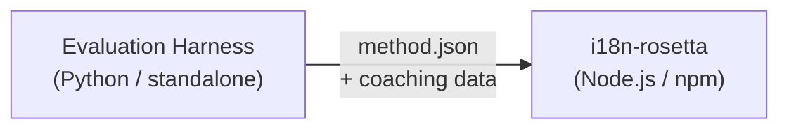

# 메서드 플러그인 사양

> **버전**: 1.1  
> **대상**: 플러그인 개발자  
> **표준 스키마**: [`schemas/rosetta-plugin.schema.json`](https://github.com/gamedaysuits/i18n-rosetta/blob/main/schemas/rosetta-plugin.schema.json)

## 개요

i18n-rosetta는 **플러그형 메서드 시스템**을 사용해요. 각 언어 쌍은 서로 다른 번역 메서드(LLM, coached, script-converter 등)를 사용할 수 있어요. 메서드는 `lib/translate.js`에 등록되며 `lib/pairs.js`를 통해 언어 쌍별로 확인돼요.

평가 하네스(eval harness)의 역할은 번역 메서드를 **개발, 테스트 및 내보내기**하는 것이에요. i18n-rosetta의 역할은 이를 **소비하고 실행**하는 것이죠. 하네스는 rosetta 내부에서 절대 실행되지 않아요.

### 데이터 흐름



---

## 메서드 플러그인 형식

메서드 플러그인은 단일 JSON 파일(`method.json`)과 선택적인 코칭 데이터 파일로 구성돼요.

### `method.json` — 필수

```json
{
  "name": "french-formal-v1",
  "type": "llm-coached",
  "version": "1.0.0",
  "description": "Formally-tuned French with terminology enforcement and grammar coaching",
  "author": "Plugin Author",

  "config": {
    "model": "google/gemini-3.5-flash",
    "register": "formal",
    "batchSize": 80,
    "temperature": 0.2
  },

  "locales": ["fr"],

  "benchmarks": {
    "fr": {
      "date": "2026-05-11T00:00:00Z",
      "corpus_size": 500,
      "exact_match_rate": 0.42,
      "corpus_chrf": 72.3,
      "corpus_bleu": 45.1,
      "model": "google/gemini-3.5-flash",
      "harness_version": "1.0.0"
    }
  },

  "provenance": {
    "resources": [],
    "commercialReady": false,
    "flags": ["license-unclear"]
  },

  "coaching": {
    "dir": "coaching"
  }
}
```

### 필드 참조

| 필드 | 유형 | 필수 여부 | 설명 |
|-------|------|----------|-------------|
| `name` | string | ✅ | 고유 메서드 식별자 (kebab-case) |
| `type` | string | ✅ | Rosetta 메서드 유형: `llm`, `llm-coached`, `api`, `google-translate`, `deepl`, `microsoft-translator`, `libretranslate`, `openai`, `anthropic`, `gemini` |
| `version` | string | ✅ | Semver 버전 (예: `1.0.0`) |
| `locales` | string[] | ✅ | 이 메서드가 대상으로 하는 로캘 코드 (최소 1개) |
| `description` | string | — | 사람이 읽을 수 있는 설명 |
| `author` | string | — | 이 메서드를 개발/테스트한 사람 |
| `config.model` | string | — | OpenRouter 모델 식별자 |
| `config.register` | string | — | 대상 언어의 어조/말투(register/tone) |
| `config.batchSize` | number | — | API 배치당 키 수 (1–200, 기본값: 80) |
| `config.temperature` | number | — | LLM 온도 (0.0–2.0, 기본값: 0.3) |
| `benchmarks` | object | — | 로캘별 벤치마크 결과 |
| `provenance` | object | — | 라이선스 및 리소스 종속성 |
| `coaching.dir` | string | — | 코칭 데이터 디렉터리의 상대 경로 |

### 벤치마크 객체 (로캘별)

| 필드 | 유형 | 필수 여부 | 설명 |
|-------|------|----------|-------------|
| `date` | string | ✅ | 벤치마크 실행의 ISO 8601 타임스탬프 |
| `corpus_size` | number | ✅ | 평가된 항목 수 |
| `exact_match_rate` | number | ✅ | 0.0–1.0, 정확히 일치하는(exact match) 비율 |
| `corpus_chrf` | number | — | chrF++ 점수 (0–100) |
| `corpus_bleu` | number | — | BLEU 점수 (0–100) |
| `model` | string | ✅ | 평가 중 사용된 모델 |
| `harness_version` | string | ✅ | 사용된 평가 하네스 버전 |

:::info 어떤 지표가 표시되나요?
`rosetta status` 명령은 벤치마크 블록의 **chrF++** 및 **정확도(exact match rate)**를 표시해요. `corpus_bleu`는 매니페스트에서 허용되지만 현재 어떤 rosetta 명령에서도 표시되거나 사용되지 않아요. [메서드 리더보드](/leaderboard)는 chrF++, 정확도 및 FST 수락률을 추적해요.
:::

---

### 출처(Provenance) 객체

출처 블록은 플러그인에 번들로 제공되는 리소스의 라이선스 상태를 전달해요.

| 필드 | 유형 | 기본값 | 설명 |
|-------|------|---------|-------------|
| `resources` | object[] | `[]` | `name`, `license` 및 `type`가 포함된 번들 리소스 목록 |
| `commercialReady` | boolean | `false` | 플러그인이 상업적 배포를 위해 승인되었는지 여부 |
| `flags` | string[] | `["license-unclear"]` | 기계가 읽을 수 있는 상태 플래그 |

**기본 상태** — 내보낸 플러그인은 `commercialReady: false` 및 `flags: ["license-unclear"]`와 함께 제공돼요.

**승인된 상태** — 라이선스가 확인된 경우: `commercialReady: true`을 설정하고 플래그를 지워요.

---

## 코칭 데이터 형식

`type`가 `llm-coached`인 경우, 플러그인은 `coaching/` 하위 디렉터리에 코칭 데이터 파일을 포함해야 해요.

### `coaching/<locale>.json`

```json
{
  "grammar_rules": [
    "French adjectives agree in gender and number with the noun they modify",
    "Use 'vous' for formal contexts, 'tu' for informal"
  ],
  "dictionary": {
    "dashboard": "tableau de bord",
    "deployment": "déploiement",
    "settings": "paramètres"
  },
  "style_notes": "Prefer active voice. Avoid anglicisms where a native French term exists."
}
```

| 필드 | 유형 | 필수 여부 | 설명 |
|-------|------|----------|-------------|
| `grammar_rules` | string[] | — | 이 로캘의 모든 LLM 프롬프트에 주입되는 규칙 |
| `dictionary` | object | — | 용어 → 번역 매핑. 일치하는 용어는 필수 용어로 주입돼요. |
| `style_notes` | string | — | 프롬프트에 추가되는 자유 형식의 스타일 지침 |

---

## 디렉터리 구조

```
french-formal-v1/
  method.json                 # Method manifest with benchmarks
  coaching/
    fr.json                   # Coaching data for French
```

다중 로캘 메서드의 경우:

```
european-formal-v2/
  method.json                 # locales: ["fr", "de", "es", "it"]
  coaching/
    fr.json
    de.json
    es.json
    it.json
```

---

## Rosetta가 플러그인을 사용하는 방법

### 설치

```bash
i18n-rosetta plugin install ./french-formal-v1/
```

`.rosetta/methods/french-formal-v1/`에 저장돼요.

### 구성

```json title="i18n-rosetta.config.json"
{
  "pairs": {
    "en:fr": {
      "methodPlugin": "french-formal-v1"
    }
  }
}
```

:::info 병합 의미론(Merge semantics)
플러그인은 *어떤* 메서드를 사용할지 정의해요(`type`). 언어 쌍 구성은 이를 *어떻게* 실행할지 조정해요(`model`, `register`, `batchSize`). 언어 쌍에서 `model`를 설정하면 플러그인의 기본값을 재정의해요.
:::

### 런타임

1. Rosetta가 `.rosetta/methods/french-formal-v1/`에서 `method.json`을 읽어요.
2. 플러그인의 `type` 필드가 번역 메서드를 설정해요(예: `llm-coached`).
3. 플러그인의 `coaching/` 디렉터리에서 코칭 데이터를 로드해요.
4. `config` 블록을 사용하여 모델/어조/온도의 빈 공간을 채워요.
5. `benchmarks` 블록은 `rosetta status` 출력에 표시돼요.
6. `rosetta provenance`가 `provenance` 블록에서 라이선스 플래그를 확인해요.

---

## 스키마 유효성 검사

플러그인 매니페스트는 설치 시 [`schemas/rosetta-plugin.schema.json`](https://github.com/gamedaysuits/i18n-rosetta/blob/main/schemas/rosetta-plugin.schema.json)에 대해 유효성 검사를 거쳐요.

IDE 자동 완성을 위해 `method.json`에서 스키마를 참조하세요.

```json
{
  "$schema": "./node_modules/i18n-rosetta/schemas/rosetta-plugin.schema.json",
  "name": "my-method-v1"
}
```

---

## 포함하지 말아야 할 항목

- ❌ Python 코드나 하네스 종속성을 포함하지 마세요.
- ❌ 원시 말뭉치(corpus) 데이터나 실행 로그를 포함하지 마세요.
- ❌ API 키나 자격 증명을 포함하지 마세요.
- ❌ 하네스 구성을 포함하지 마세요.
- ❌ 내부 프롬프트 템플릿을 포함하지 마세요(이는 rosetta의 메서드 구현에 포함되어 있어요).

플러그인은 구성, 코칭 콘텐츠, 벤치마크 결과 등 **데이터 전용**이에요.

---

## 참고 항목

- [번역 메서드](/docs/guides/translation-methods) — 각 내장 메서드의 작동 방식
- [구성](/docs/getting-started/configuration) — 언어 쌍별 및 언어별 구성
- [API를 통한 메서드 제공](/docs/guides/serving-a-method) — HTTP 서비스로 메서드 호스팅
- [쿡북: FST-Gated 파이프라인](https://mtevalarena.org/docs/tutorials/fst-gated-pipeline) — 파이프라인 구축 및 패키징
- [MT 평가](https://mtevalarena.org/docs/leaderboard/rules) — 리더보드 제출을 위한 메서드 벤치마킹
- [저자원 언어 지원](https://mtevalarena.org/docs/community/low-resource-languages) — 커뮤니티 플러그인의 사용 사례