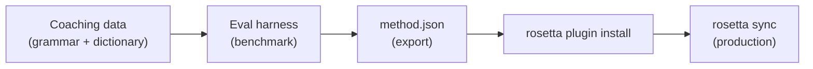

# 튜토리얼: Translation Plugin 만들기

처음부터 사용자 지정 translation method를 만들고, 벤치마크를 수행한 다음, rosetta plugin으로 배포해 보세요. 기성 API가 지원하지 않는 새로운 언어 쌍을 추가하기 위한 전체 워크플로우예요.

**만들게 될 내용:** 용어, 문법 규칙, 벤치마크 점수가 적용된 격식 있는 프랑스어용 coached translation plugin을 만들게 돼요.

**소요 시간:** 30–45분

**사전 준비 사항:**
- i18n-rosetta 설치 (`npm install --save-dev i18n-rosetta`)
- OpenRouter API 키 (`OPENROUTER_API_KEY`)
- Python 3.10 이상 (eval harness용)

---

## 1단계: 문제 식별하기

SaaS 대시보드를 프랑스어로 번역하려고 합니다. 기본 `llm` method는 정확하지만 일관성 없는 번역을 생성해요.

- 어떨 때는 "dashboard"가 "tableau de bord"로, 어떨 때는 "panneau de contrôle"로 번역돼요.
- 어조가 `tu` 형태와 `vous` 형태 사이를 오가요.
- 기술 용어가 일관성 없이 영어식으로 표현돼요.

일반적인 LLM 프롬프트가 제공하지 않는 **용어 강제 적용**과 **어조 제어**가 필요해요.

## 2단계: Coaching Data 만들기

언어적 요구 사항을 담은 coaching file을 만들어 보세요.

```bash
mkdir -p .rosetta/coaching
```

```json title=".rosetta/coaching/fr.json"
{
  "grammar_rules": [
    "Always use the 'vous' form for formal register",
    "French adjectives agree in gender and number with their noun",
    "Use the present tense for UI instructions, not the imperative",
    "Preserve sentence-final punctuation style from the source"
  ],
  "dictionary": {
    "dashboard": "tableau de bord",
    "deployment": "déploiement",
    "settings": "paramètres",
    "environment variable": "variable d'environnement",
    "webhook": "webhook",
    "API key": "clé API",
    "sign in": "se connecter",
    "sign out": "se déconnecter",
    "repository": "dépôt",
    "pull request": "demande de tirage"
  },
  "style_notes": "Formal technical French. Prefer native French terms over anglicisms where established equivalents exist. Keep UI labels concise — 3 words maximum where possible."
}
```

**각 필드의 역할:**
- **`grammar_rules`** — 명시적인 제약 조건으로 LLM 시스템 프롬프트에 주입돼요.
- **`dictionary`** — 소스 키와 대조하여 일치하는지 확인해요. 사전 용어가 나타나면 프롬프트에 "필수 용어"로 주입돼요.
- **`style_notes`** — 일반적인 스타일 가이드로 시스템 프롬프트에 추가돼요.

## 3단계: 언어 쌍 구성하기

프랑스어에 `llm-coached`을 사용하도록 rosetta에 알려주세요.

```json title="i18n-rosetta.config.json"
{
  "version": 3,
  "inputLocale": "en",
  "localesDir": "./locales",
  "pairs": {
    "en:fr": {
      "method": "llm-coached",
      "model": "google/gemini-3.5-flash"
    }
  },
  "languages": {
    "fr": {
      "register": "Formal technical French (vous-form)",
      "name": "French"
    }
  }
}
```

## 4단계: 테스트하기

```bash
npx i18n-rosetta sync --dry
```

dry-run 출력을 검토해 보세요. 다음을 확인해 주세요.
- ✅ 사전 용어가 일관되게 사용되었는지 ("panneau de contrôle"이 아닌 "tableau de bord")
- ✅ `vous` 형태가 전체적으로 사용되었는지
- ✅ 기술 용어가 사전과 일치하는지

그런 다음 실제 동기화를 실행해 보세요.

```bash
npx i18n-rosetta sync
```

## 5단계: Eval Harness로 벤치마크하기 (선택 사항)

품질 점수를 원하신다면(플러그인에는 벤치마크 데이터가 함께 제공되므로 원하실 거예요) 함께 제공되는 eval harness를 사용해 보세요.

### Harness 설치하기

```bash
git clone https://github.com/gamedaysuits/gds-mt-eval-harness.git
cd gds-mt-eval-harness
pip install -r requirements.txt
```

### Reference Corpus 만들기

소스 문자열과 검증된 번역이 포함된 파일을 만들어 보세요.

```json title="corpus/french-formal.json"
[
  {
    "source": "Dashboard",
    "reference": "Tableau de bord"
  },
  {
    "source": "Sign in to your account",
    "reference": "Connectez-vous à votre compte"
  },
  {
    "source": "Your deployment is ready",
    "reference": "Votre déploiement est prêt"
  },
  {
    "source": "Environment variables",
    "reference": "Variables d'environnement"
  }
]
```

### 벤치마크 실행하기

```bash
python harness.py eval \
  --corpus corpus/french-formal.json \
  --source en \
  --target fr \
  --method llm-coached \
  --model google/gemini-3.5-flash
```

harness는 다음을 출력해요.
- **chrF++** — 문자 수준의 F-score(0–100)예요. 70 이상이면 우수해요.
- **BLEU** — N-gram 중복도(0–100)예요. 40 이상이면 coached translation으로서 탄탄해요.
- **Exact match rate** — 레퍼런스와 정확히 일치하는 번역의 비율이에요.

### Plugin 내보내기

점수에 만족하신다면 다음을 실행해 보세요.

```bash
python harness.py export \
  --name french-formal-v1 \
  --output ./french-formal-v1/
```

그러면 다음이 생성돼요.

```
french-formal-v1/
├── method.json          # Manifest with config + benchmarks
└── coaching/
    └── fr.json          # Your coaching data
```

## 6단계: Rosetta에 Plugin 설치하기

```bash
npx i18n-rosetta plugin install ./french-formal-v1/
```

이렇게 하면 플러그인이 `.rosetta/methods/french-formal-v1/`에 복사돼요.

플러그인을 사용하도록 구성을 업데이트해 보세요.

```json title="i18n-rosetta.config.json"
{
  "pairs": {
    "en:fr": {
      "methodPlugin": "french-formal-v1"
    }
  }
}
```

## 7단계: 확인하기

```bash
# Check plugin is installed and shows benchmark scores
npx i18n-rosetta status

# Run a sync with the plugin
npx i18n-rosetta sync

# Audit licensing status
npx i18n-rosetta provenance
```

`status` 출력에 다음이 표시돼요.

```
en → fr
  Method:    french-formal-v1 (llm-coached)
  Model:     google/gemini-3.5-flash
  Quality:   high
  chrF++:    74.2
  BLEU:      46.8
  Exact:     42%
```

## 완성된 결과물



이제 다음을 갖추게 되었어요.
1. **Coaching data** — 일관성을 강제하는 문법 규칙과 용어
2. **Benchmark scores** — 플러그인과 함께 제공되는 정량화된 품질 점수
3. **A portable plugin** — 어느 기기에서나 설치 가능한 `method.json` + coaching data
4. **Production deployment** — 동기화 파이프라인에 통합된 프로덕션 배포

## 다음 단계

- **[Plugin Specification](/docs/reference/plugin-spec)** — 전체 매니페스트 형식 레퍼런스
- **[Translation Methods](/docs/guides/translation-methods)** — 4가지 method 모두 비교하기
- **[Low-Resource Languages](https://mtevalarena.org/docs/community/low-resource-languages)** — API가 지원되지 않는 언어에 이 패턴 적용하기
- **[Translate 30 Languages](/docs/tutorials/translate-30-languages)** — 글로벌 사용자를 대상으로 프로젝트 확장하기