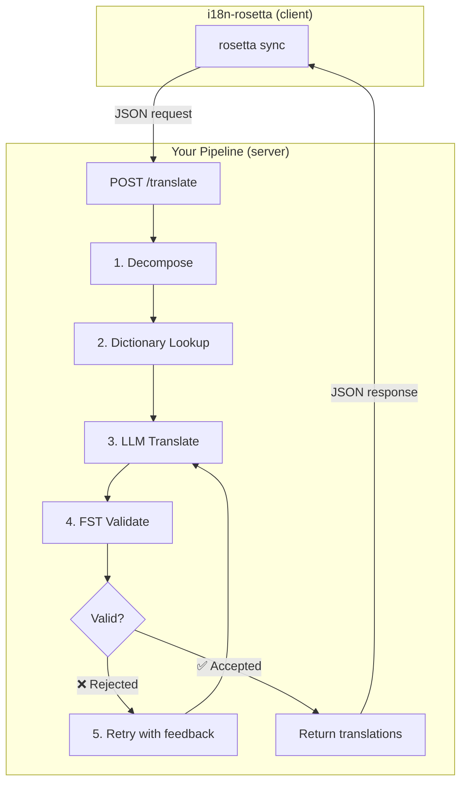
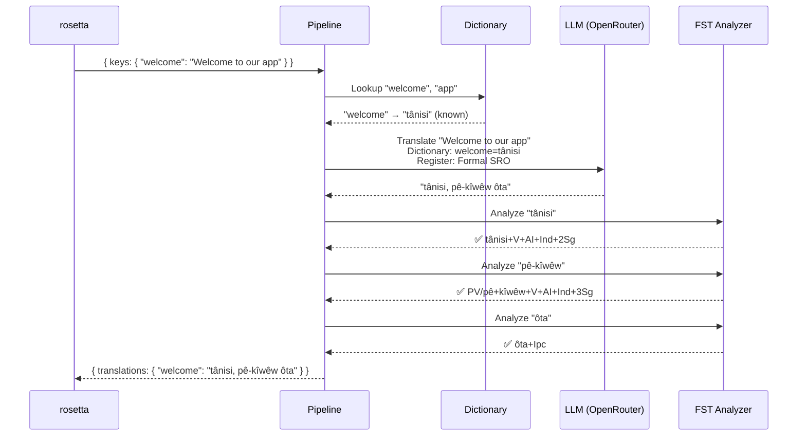
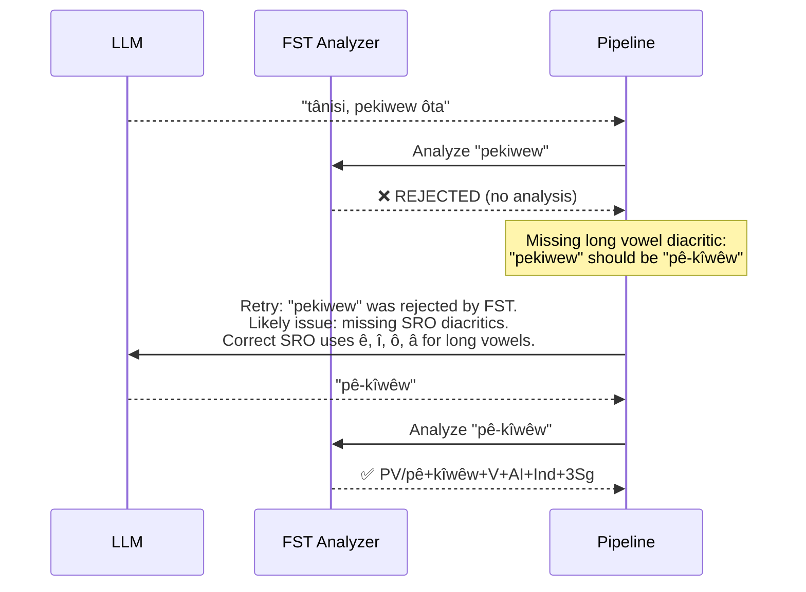
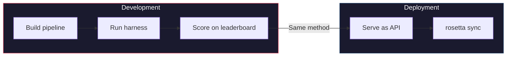

# 쿡북: FST-Gated 번역 파이프라인

원본 텍스트를 분해하고, LLM을 통해 번역하며, 유한 상태 변환기(finite-state transducer, FST)로 출력을 검증하고, 이 전체 과정을 rosetta가 `api` 메서드를 통해 호출하는 HTTP 엔드포인트로 제공하는 다단계 번역 파이프라인을 구축해 보세요.

**무엇을 만들게 되나요:** 로케일 파일에 도달하기 *전에* 형태론적으로 잘못된 번역을 잡아내는 Plains Cree용 번역 API를 만들게 돼요.

:::info 사전 준비 사항
- 실행 중인 FST 바이너리 (예: [ALTLab의 Plains Cree 분석기](https://github.com/UAlbertaALTLab/lang-crk))
- Node.js 20+ 또는 Python 3.10+
- LLM 단계를 위한 OpenRouter API 키
:::

---

## 아키텍처

파이프라인은 독립적인 HTTP 서비스로 실행돼요. rosetta는 내부에서 무슨 일이 일어나는지 알거나 신경 쓰지 않아요. 그저 키를 보내고 번역을 돌려받을 뿐이에요.



### 이 아키텍처를 사용하는 이유

각 단계에는 특정 역할이 있어요.

| 단계 | 하는 일 | 중요한 이유 |
|-------|-------------|---------------|
| **분해 (Decompose)** | 복합 UI 문자열을 번역 가능한 세그먼트로 나눠요 | 포합어(Polysynthetic language)는 하나의 단어에 전체 문장을 인코딩하므로 LLM에는 더 작은 단위가 필요해요 |
| **사전 검색 (Dictionary Lookup)** | 알려진 번역이 있는지 이중 언어 사전을 확인해요 | LLM의 추측에 의존하지 않고 알려진 용어에 대해 올바른 용어를 사용하도록 강제해요 |
| **LLM 번역 (LLM Translate)** | 레지스터 및 문법 컨텍스트와 함께 세그먼트를 LLM에 보내요 | 새로운 문구를 처리하고 자연스러운 출력을 생성해요 |
| **FST 검증 (FST Validate)** | 형태소 분석기를 통해 출력을 실행해요 | 잘못된 단어 형태를 잡아내요. FST가 단어를 거부하면 해당 언어에서 유효하지 않은 단어예요 |
| **재시도 (Retry)** | FST의 오류 피드백과 함께 거부된 단어를 다시 보내요 | 단어가 *왜* 틀렸는지에 대한 구체적인 정보를 LLM에 제공해요 |

---

## 데이터 흐름

단일 키(`"welcome": "Welcome to our app"`)가 파이프라인을 통과할 때 일어나는 일은 다음과 같아요.



### FST가 거부할 때



---

## 구현

### 1단계: 서버 스켈레톤

서버는 rosetta의 [API 메서드 계약](/docs/guides/serving-a-method)인 단일 `POST /translate` 엔드포인트를 구현해요.

```javascript title="server.js"
import express from 'express';
import { translateBatch } from './pipeline.js';

const app = express();
app.use(express.json());

/**
 * rosetta API contract:
 *
 * Request:  { source_locale, target_locale, method, keys: { "key": "source" } }
 * Response: { translations: { "key": "translated" }, meta: { ... } }
 */
app.post('/translate', async (req, res) => {
  const { source_locale, target_locale, method, keys } = req.body;

  // Validate request
  if (!keys || typeof keys !== 'object') {
    return res.status(400).json({ error: { message: 'Missing keys object' } });
  }

  try {
    const startTime = Date.now();
    const { translations, stats } = await translateBatch(keys, {
      sourceLang: source_locale,
      targetLang: target_locale,
    });

    res.json({
      translations,
      meta: {
        model: 'custom-pipeline/fst-gated-v1',
        method: 'decompose-lookup-translate-validate',
        elapsed_ms: Date.now() - startTime,
        fst_acceptance_rate: stats.fstAccepted / stats.total,
        retries: stats.retries,
      },
    });
  } catch (err) {
    console.error('[ERR] Pipeline failed:', err.message);
    res.status(500).json({ error: { message: err.message } });
  }
});

// Health check for rosetta connectivity verification
app.get('/health', (req, res) => res.json({ status: 'ok' }));

app.listen(3001, () => {
  console.log('FST-gated pipeline running on http://localhost:3001');
});
```

### 2단계: 파이프라인

각 단계는 함수예요. 파이프라인은 이들을 하나로 연결해요.

```javascript title="pipeline.js"
import { lookupDictionary } from './dictionary.js';
import { callLLM } from './llm.js';
import { analyzeWithFST } from './fst.js';

const MAX_RETRIES = 3;

/**
 * Translate a batch of keys through the full pipeline.
 *
 * @param {object} keys - Map of key → source string
 * @param {object} options - { sourceLang, targetLang }
 * @returns {{ translations: object, stats: object }}
 */
export async function translateBatch(keys, options) {
  const translations = {};
  const stats = { total: 0, fstAccepted: 0, retries: 0, dictionaryHits: 0 };

  for (const [key, sourceText] of Object.entries(keys)) {
    stats.total++;
    translations[key] = await translateSingle(sourceText, options, stats);
  }

  return { translations, stats };
}

/**
 * Translate a single string through all pipeline stages.
 */
async function translateSingle(sourceText, options, stats) {

  // ── Stage 1: Decompose ──────────────────────────────────
  // Split compound strings into segments the LLM can handle.
  // For UI strings this is often a no-op, but for longer content
  // it prevents the LLM from losing context in long prompts.
  const segments = decompose(sourceText);

  // ── Stage 2: Dictionary Lookup ──────────────────────────
  // Check each segment against the bilingual dictionary.
  // Known terms are forced — the LLM won't override them.
  const knownTerms = {};
  for (const segment of segments) {
    const entry = lookupDictionary(segment.toLowerCase());
    if (entry) {
      knownTerms[segment] = entry;
      stats.dictionaryHits++;
    }
  }

  // ── Stage 3: LLM Translate ──────────────────────────────
  let translation = await callLLM(sourceText, {
    ...options,
    knownTerms,
    register: 'nêhiyawêwin (Plains Cree). Use SRO orthography. '
            + 'Professional register for educational contexts.',
  });

  // ── Stage 4: FST Validate ──────────────────────────────
  // Split the translation into words and check each one.
  let { accepted, rejected } = await validateWords(translation);

  // ── Stage 5: Retry Loop ─────────────────────────────────
  // If any words were rejected, retry with FST feedback.
  let attempt = 0;
  while (rejected.length > 0 && attempt < MAX_RETRIES) {
    attempt++;
    stats.retries++;

    const feedback = rejected
      .map(w => `"${w}" was rejected by the morphological analyzer`)
      .join('; ');

    translation = await callLLM(sourceText, {
      ...options,
      knownTerms,
      register: 'nêhiyawêwin (Plains Cree). Use SRO orthography.',
      feedback: `Previous attempt had invalid words. ${feedback}. `
              + 'Use correct SRO diacritics (ê, î, ô, â for long vowels). '
              + 'Ensure verb forms match expected conjugation patterns.',
    });

    ({ accepted, rejected } = await validateWords(translation));
  }

  if (rejected.length === 0) stats.fstAccepted++;

  return translation;
}

/**
 * Decompose source text into translatable segments.
 *
 * For simple key-value UI strings, this usually returns the
 * original string as a single segment. For longer content,
 * it splits on sentence boundaries.
 */
function decompose(text) {
  // Simple sentence-boundary split. Replace with your own
  // morphological decomposition for more complex needs.
  return text
    .split(/(?<=[.!?])\s+/)
    .filter(s => s.trim().length > 0);
}

/**
 * Validate each word in a translation against the FST.
 *
 * @returns {{ accepted: string[], rejected: string[] }}
 */
async function validateWords(translation) {
  // Split on whitespace and punctuation, keeping only words
  const words = translation
    .split(/[\s,;:.!?'"()[\]{}]+/)
    .filter(w => w.length > 0);

  const accepted = [];
  const rejected = [];

  for (const word of words) {
    const analyses = await analyzeWithFST(word);
    if (analyses.length > 0) {
      accepted.push(word);
    } else {
      rejected.push(word);
    }
  }

  return { accepted, rejected };
}
```

### 3단계: FST 래퍼

FST 바이너리를 비동기 함수로 래핑해요. 이 예제에서는 ALTLab의 HFST 기반 Plains Cree 분석기를 사용해요.

```javascript title="fst.js"
import { execFile } from 'node:child_process';
import { promisify } from 'node:util';

const execFileAsync = promisify(execFile);

// Path to your FST analyzer binary
const FST_PATH = process.env.FST_ANALYZER_PATH || './bin/crk-analyzer';

/**
 * Run a word through the FST morphological analyzer.
 *
 * Returns an array of analyses. Empty array = rejected.
 *
 * Example:
 *   analyzeWithFST("tânisi")
 *   → ["tânisi+V+AI+Ind+2Sg", "tânisi+V+AI+Cnj+2Sg"]
 *
 *   analyzeWithFST("pekiwew")
 *   → []  // rejected — missing diacritics
 *
 * @param {string} word - A single word in SRO orthography
 * @returns {string[]} Array of FST analyses (empty = rejected)
 */
export async function analyzeWithFST(word) {
  try {
    // HFST lookup: pipe the word to stdin, read analyses from stdout
    const { stdout } = await execFileAsync(
      FST_PATH,
      ['--quiet'],
      { input: word + '\n', timeout: 5000 }
    );

    // Parse HFST output: each line is "input\tanalysis\tweight"
    // Lines with "+?" indicate unrecognized forms
    return stdout
      .split('\n')
      .filter(line => line.includes('\t') && !line.includes('+?'))
      .map(line => line.split('\t')[1]);

  } catch (err) {
    // If the FST binary isn't available, log and reject
    console.error(`[WARN] FST analysis failed for "${word}": ${err.message}`);
    return [];
  }
}
```

### 4단계: 사전 및 LLM 모듈

```javascript title="dictionary.js"
/**
 * Simple bilingual dictionary backed by a JSON file.
 *
 * In production, you'd load from the coaching data directory
 * or query itwêwina (https://itwewina.altlab.app/) via API.
 */
const DICTIONARY = {
  'hello': 'tânisi',
  'welcome': 'tânisi',
  'thank you': 'kinanâskomitin',
  'home': 'kīwēwin',
  'search': 'nānātawāpahtam',
  'settings': 'isi-nākatohkēwin',
  'help': 'nīsōhkamākēwin',
  'back': 'kīwē',
};

/**
 * @param {string} term - Lowercase English term
 * @returns {string|null} Cree translation or null
 */
export function lookupDictionary(term) {
  return DICTIONARY[term] || null;
}
```

```javascript title="llm.js"
/**
 * Call an LLM via OpenRouter for translation.
 */
const OPENROUTER_API = 'https://openrouter.ai/api/v1/chat/completions';

export async function callLLM(sourceText, options) {
  const { knownTerms = {}, register, feedback } = options;

  // Build the system prompt with register and known terms
  let systemPrompt = `You are translating English to Plains Cree.\n\n`;
  systemPrompt += `Register: ${register}\n\n`;

  if (Object.keys(knownTerms).length > 0) {
    systemPrompt += `Required terminology (use these exact translations):\n`;
    for (const [en, crk] of Object.entries(knownTerms)) {
      systemPrompt += `  "${en}" → "${crk}"\n`;
    }
    systemPrompt += '\n';
  }

  if (feedback) {
    systemPrompt += `IMPORTANT correction from previous attempt:\n${feedback}\n\n`;
  }

  systemPrompt += `Rules:\n`;
  systemPrompt += `- Use Standard Roman Orthography (SRO)\n`;
  systemPrompt += `- Use macron/circumflex for long vowels: ê, î, ô, â\n`;
  systemPrompt += `- Return ONLY the Cree translation, nothing else\n`;

  const response = await fetch(OPENROUTER_API, {
    method: 'POST',
    headers: {
      'Authorization': `Bearer ${process.env.OPENROUTER_API_KEY}`,
      'Content-Type': 'application/json',
    },
    body: JSON.stringify({
      model: 'google/gemini-2.5-pro',
      messages: [
        { role: 'system', content: systemPrompt },
        { role: 'user', content: sourceText },
      ],
      temperature: 0.2,
    }),
  });

  const json = await response.json();
  return json.choices[0].message.content.trim();
}
```

---

## rosetta에 연결하기

### 언어 쌍 구성하기

언어 쌍이 실행 중인 서비스를 가리키도록 설정해요.

```json title="i18n-rosetta.config.json"
{
  "version": 3,
  "inputLocale": "en",
  "pairs": {
    "en:crk": {
      "method": "api",
      "endpoint": "http://localhost:3001/translate"
    }
  },
  "languages": {
    "crk": {
      "name": "Plains Cree",
      "register": "SRO syllabics with grammatical precision."
    }
  }
}
```

### API 키 설정하기

```bash
export ROSETTA_API_KEY="your-service-auth-token"
export OPENROUTER_API_KEY="sk-or-v1-..."  # for the LLM step inside the pipeline
```

### 실행하기

```bash
# Start the pipeline
node server.js

# In another terminal, run rosetta
npx i18n-rosetta sync
```

rosetta는 영어 키를 파이프라인에 POST 요청으로 보내요. 파이프라인은 분해, 검색, 번역, 검증, 재시도를 거쳐 Cree 번역을 반환해요. rosetta는 이를 `crk.json`에 기록해요.

---

## 파이프라인 평가하기

동일한 파이프라인을 [평가 하네스(eval harness)](/docs/eval/harness)로 평가할 수 있어요. 하네스는 동일한 JSON-in/JSON-out 패턴을 사용해요.

```bash
# Clone the harness
git clone https://github.com/gamedaysuits/gds-mt-eval-harness.git
cd gds-mt-eval-harness

# Run against the EDTeKLA dataset
python eval/baseline_experiment.py \
  --dataset data/edtekla-dev-v1.json \
  --model google/gemini-2.5-pro \
  --fst-analyzer ./bin/crk-analyzer \
  --condition fst-gated-v1 \
  --submit
```

`--fst-analyzer` 플래그는 하네스에게 모든 출력에 대해 FST 검증을 실행하도록 지시해요. 이는 파이프라인이 수행하는 것과 동일한 검증이에요. 이를 통해 파이프라인의 점수를 베이스라인과 비교할 수 있어요.



**증명한 다음 사용하세요.** 하네스에서 벤치마크하는 메서드는 프로덕션 환경에서 rosetta가 호출하는 것과 동일한 메서드예요.

---

## 플러그인으로 패키징하기

파이프라인이 리더보드 점수를 얻으면, 다른 사람들도 사용할 수 있도록 rosetta 플러그인으로 패키징해요.

```json title="crk-fst-gated-v1/method.json"
{
  "name": "crk-fst-gated-v1",
  "type": "api",
  "version": "1.0.0",
  "description": "FST-gated Plains Cree translation with morphological validation",
  "author": "Your Name",

  "config": {
    "endpoint": "https://your-server.example.com/translate"
  },

  "locales": ["crk"],

  "benchmarks": {
    "crk": {
      "date": "2026-06-01T00:00:00Z",
      "corpus_size": 124,
      "exact_match_rate": 0.12,
      "corpus_chrf": 48.7,
      "model": "google/gemini-2.5-pro",
      "harness_version": "2.0"
    }
  },

  "provenance": {
    "resources": [
      { "name": "ALTLab CRK Analyzer", "license": "LGPL-3.0", "type": "fst" },
      { "name": "Wolvengrey Dictionary", "license": "CC-BY-NC-SA-4.0", "type": "dictionary" }
    ],
    "commercialReady": false,
    "flags": ["nc-resource"]
  }
}
```

설치해 보세요.

```bash
i18n-rosetta plugin install ./crk-fst-gated-v1/
```

이제 서버에 액세스할 수 있는 사람이라면 누구나 플러그인을 사용할 수 있어요.

```json title="i18n-rosetta.config.json"
{
  "pairs": {
    "en:crk": { "methodPlugin": "crk-fst-gated-v1" }
  }
}
```

---

## 이 패턴 확장하기

이 쿡북에서는 하나의 파이프라인 아키텍처를 보여드려요. 이를 어떤 언어나 메서드에도 맞게 조정할 수 있어요.

| 변형 | 변경되는 부분 |
|-----------|-------------|
| **다른 FST** | 바이너리 경로를 교체해요. [GiellaLT GitHub](https://github.com/giellalt) 또는 [Apertium GitHub](https://github.com/apertium)에서 100개 이상의 언어에 대한 사전 컴파일된 FST(`.hfstol` 또는 `lttoolbox` 바이너리 등)를 다운로드할 수 있어요. |
| **사용 가능한 FST가 없는 경우** | FST 실행 단계를 제거하고 Hugging Face의 [UniMorph 플랫 패러다임 파일](https://huggingface.co/datasets/unimorph/universal_morphologies)을 사용하여 굴절형에 대한 정적 데이터베이스 조회 검증을 수행해요. |
| **다중 LLM** | 모델을 연결해요. 초기 초안 작성에는 빠른 모델을, 수정에는 추론 모델을 사용해요. |
| **Human-in-the-loop (사람의 개입)** | 불확실한 번역을 반환하기 전에 전문가의 검토를 위해 대기하는 큐(queue) 단계를 추가해요. |
| **파인튜닝된 모델** | OpenRouter 호출을 로컬 모델(Ollama, vLLM 등)로 대체해요. |
| **다른 언어** | 사전, FST, 레지스터를 변경해요. 아키텍처는 동일하게 유지돼요. |

파이프라인은 하나의 패턴이에요. 각 단계는 교체할 수 있어요. 여러분의 언어에 맞는 것을 구축하고, [리더보드](/leaderboard)에서 증명한 다음 배포해 보세요.

---

## 함께 보기

- **[API를 통해 메서드 제공하기](/docs/guides/serving-a-method)** — API 계약 사양
- **[플러그인 사양](/docs/reference/plugin-spec)** — method.json 매니페스트 형식
- **[저자원 언어 지원하기](/docs/guides/low-resource-languages)** — 더 넓은 컨텍스트 및 OCAP 원칙
- **[기계 번역(MT) 평가](/docs/eval/)** — 좋은 메서드와 나쁜 메서드, 실격 처리되는 경우
- **[평가 하네스](/docs/eval/harness)** — 파이프라인을 벤치마크하는 방법
- **[메서드 리더보드](/leaderboard)** — 점수 제출하기
- **[ALTLab](https://altlab.artsrn.ualberta.ca/)** — Alberta Language Technology Lab (Plains Cree FST)
- **[번역 메서드](/docs/guides/translation-methods)** — 각 기본 제공 메서드의 작동 방식