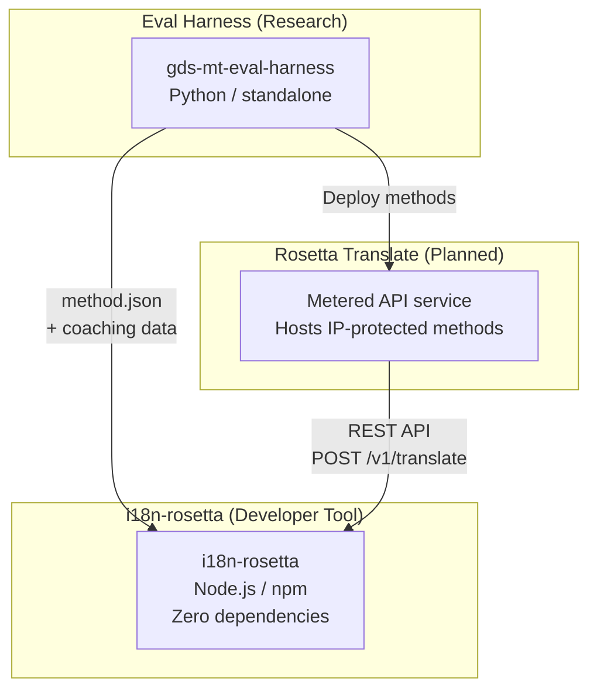
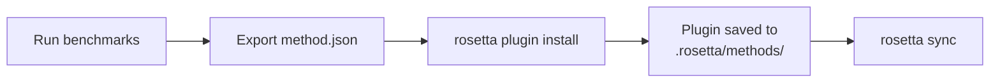
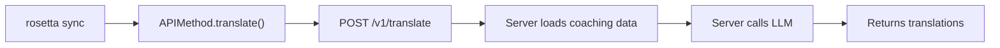

# Architectuur

Het Rosetta-vertaalecosysteem bestaat uit drie onafhankelijke tools die samenwerken via goed gedefinieerde contracten. Geen van deze is tijdens de build-tijd afhankelijk van de andere. Ze communiceren via een gedeeld **method plugin format** en een **REST API contract**.

## De drie onderdelen



### i18n-rosetta (dit project)

De open-source developer tool. Vertaalt locale-bestanden met behulp van pluggable methods. Geen dependencies, config-optional, werkt out of the box.

**Ingebouwde methoden:**
- `llm` → OpenRouter / elke LLM
- `llm-coached` → LLM + grammatica/woordenboek-coaching
- `google-translate` → Google Cloud Translation API
- `api` → Thin pipe naar elke externe API

### Eval Harness (begeleidend project)

Een onderzoekstool voor het ontwikkelen, testen en benchmarken van vertaalmethoden. Wanneer een methode een acceptabele kwaliteit bereikt, exporteert de harness een **method plugin** — een `method.json`-manifest en optionele coaching-databestanden.

De harness draait nooit binnen rosetta. Het is een afzonderlijke tool die statische output (JSON-bestanden) produceert. Rosetta leest deze bestanden simpelweg in.

[→ Eval Harness op GitHub](https://github.com/gamedaysuits/gds-mt-eval-harness)

### Rosetta Translate (gepland)

Een metered API-service die propriëtaire vertaalmethoden server-side host — de prompts, coaching-data en linguïstische pipelines verlaten de server nooit.

## Hoe ze verbonden zijn

### Eval Harness → i18n-rosetta (eenrichtingsexport)



**Contract**: [Plugin-specificatie](/docs/reference/plugin-spec)

### Rosetta Translate → i18n-rosetta (API tijdens runtime)



Rosetta's `APIMethod` is een **dumb pipe**. Het stuurt keys naar buiten en ontvangt vertalingen terug. Het bevat geen enkele vertaallogica en geen propriëtaire content.

## Wat elk onderdeel over de andere weet

| Tool | Weet van rosetta? | Weet van Rosetta Translate? | Weet van harness? |
|------|---------------------|-------------------------------|---------------------|
| **i18n-rosetta** | *(is rosetta)* | Ja — `api`-methode roept het aan | Nee — leest alleen plugin-exports |
| **Rosetta Translate** | Ja — bedient de verzoeken ervan | *(is Rosetta Translate)* | Nee — ontvangt gedeployde methoden |
| **Eval Harness** | Ja — exporteert plugin-formaat | Nee — methoden afzonderlijk gedeployd | *(is de harness)* |

## Gebruikersscenario's

### Scenario 1: Gratis, zero-config (meeste gebruikers)

```bash
export OPENROUTER_API_KEY=sk-...
npx i18n-rosetta sync
```

Gebruikt de ingebouwde `llm`-methode. Geen plugins, geen Rosetta Translate, geen harness.

### Scenario 2: Google Translate-baseline

```bash
export GOOGLE_TRANSLATE_API_KEY=AIza...
npx i18n-rosetta sync
```

Gebruikt de ingebouwde `google-translate`-methode. Geen plugins nodig.

### Scenario 3: Open plugin met gebundelde coaching

```bash
rosetta plugin install ./french-formal-v1/
rosetta sync
```

Plugin heeft `type: "llm-coached"` → rosetta gebruikt de eigen OpenRouter-sleutel van de gebruiker. Coaching-data is lokaal (geen serveraanroep).

### Scenario 4: DIY-coaching (geen plugin, geen harness)

```json title="i18n-rosetta.config.json"
{
  "pairs": {
    "en:fr": { "method": "llm-coached" }
  }
}
```

De gebruiker beheert zijn eigen grammaticaregels en woordenboek in `.rosetta/coaching/fr.json`.

## Ontwerpprincipes

1. **Geen circulaire dependencies.** De bruggen zijn eenrichtingsverkeer.
2. **Rosetta is de lichtgewicht kern.** Geen dependencies, config-optional. Plugins en API zijn additief.
3. **IP-bescherming is architecturaal.** Propriëtaire technieken blijven server-side. Het npm-pakket levert niets propriëtairs mee.
4. **Het plugin-formaat is het contract.** Alles stroomt via `method.json`.
5. **Elke tool heeft één taak.** Harness → methoden ontwikkelen. Rosetta Translate → methoden hosten. Rosetta → bestanden vertalen.