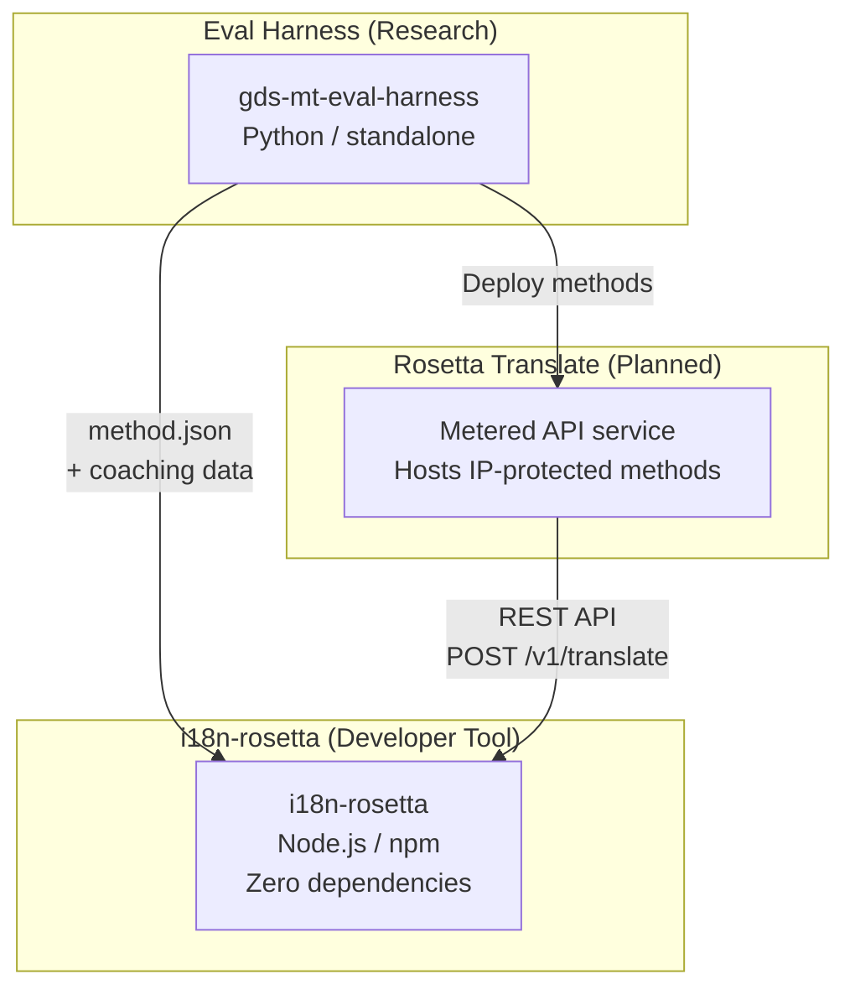
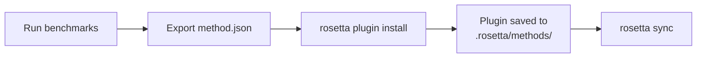
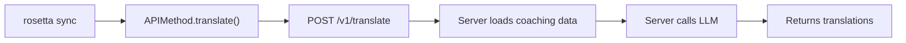

# Architectuur

Het Rosetta-vertaalecosysteem bestaat uit drie onafhankelijke tools die samenwerken via goed gedefinieerde contracten. Geen van deze tools is afhankelijk van de andere tijdens de build-fase. Ze communiceren via een gedeeld **method plugin format** en een **REST API-contract**.

## De drie onderdelen



### i18n-rosetta (dit project)

De open-source ontwikkelaarstool. Vertaalt locale-bestanden met behulp van inplugbare methoden. Geen afhankelijkheden, configuratie is optioneel, direct klaar voor gebruik.

**Ingebouwde methoden:**
- `llm` → OpenRouter / elke LLM (200+ modellen)
- `llm-coached` → LLM + grammatica-/woordenboekcoaching
- `openai` → Directe OpenAI API (GPT-4o, GPT-4o-mini)
- `anthropic` → Directe Anthropic API (Claude Sonnet, Haiku, Opus)
- `gemini` → Directe Google Gemini API (Flash, Pro — gratis niveau beschikbaar)
- `google-translate` → Google Cloud Translation API v2
- `deepl` → DeepL API met ondersteuning voor woordenlijsten
- `microsoft-translator` → Azure Cognitive Services Translator
- `libretranslate` → Zelf-gehoste LibreTranslate (AGPL, gratis)
- `api` → Eenvoudig doorgeefluik naar elk extern REST-eindpunt

### Eval Harness (begeleidend project)

Een onderzoekstool voor het ontwikkelen, testen en benchmarken van vertaalmethoden. Wanneer een methode een acceptabele kwaliteit bereikt, exporteert de harness een **method plugin** — een `method.json`-manifest en optionele coaching-databestanden.

De harness draait nooit binnen rosetta. Het is een afzonderlijke tool die statische uitvoer (JSON-bestanden) produceert. Rosetta leest deze bestanden simpelweg in.

[→ Eval Harness op GitHub](https://github.com/gamedaysuits/gds-mt-eval-harness)

### Rosetta Translate (gepland)

Een API-service op basis van verbruik die propriëtaire vertaalmethoden aan de serverzijde host — de prompts, coaching-gegevens en linguïstische pijplijnen verlaten de server nooit.

## Hoe ze verbonden zijn

### Eval Harness → i18n-rosetta (eenrichtingsexport)



**Contract**: [Plugin-specificatie](/docs/reference/plugin-spec)

### Rosetta Translate → i18n-rosetta (API tijdens runtime)



De `APIMethod` van Rosetta is een **dom doorgeefluik**. Het verstuurt sleutels en ontvangt vertalingen terug. Het bevat geen enkele vertaallogica en geen propriëtaire inhoud.

## Wat elk onderdeel van de andere weet

| Tool | Weet van rosetta? | Weet van Rosetta Translate? | Weet van harness? |
|------|---------------------|-------------------------------|---------------------|
| **i18n-rosetta** | *(is rosetta)* | Ja — de `api`-methode roept deze aan | Nee — leest alleen plugin-exports |
| **Rosetta Translate** | Ja — verwerkt de verzoeken hiervan | *(is Rosetta Translate)* | Nee — ontvangt geïmplementeerde methoden |
| **Eval Harness** | Ja — exporteert het plugin-formaat | Nee — methoden worden afzonderlijk geïmplementeerd | *(is de harness)* |

## Gebruikersscenario's

### Scenario 1: Gratis, geen configuratie (de meeste gebruikers)

```bash
export OPENROUTER_API_KEY=sk-...
npx i18n-rosetta sync
```

Gebruikt de ingebouwde `llm`-methode. Geen plugins, geen Rosetta Translate, geen harness.

### Scenario 2: Google Translate-basislijn

```bash
export GOOGLE_TRANSLATE_API_KEY=AIza...
npx i18n-rosetta sync
```

Gebruikt de ingebouwde `google-translate`-methode. Geen plugins nodig.

### Scenario 3: Open plugin met gebundelde coaching

```bash
rosetta plugin install ./french-formal-v1/
rosetta sync
```

Plugin heeft `type: "llm-coached"` → rosetta gebruikt de eigen OpenRouter-sleutel van de gebruiker. Coaching-gegevens zijn lokaal (geen serveraanroep).

### Scenario 4: Doe-het-zelf coaching (geen plugin, geen harness)

```json title="i18n-rosetta.config.json"
{
  "pairs": {
    "en:fr": { "method": "llm-coached" }
  }
}
```

De gebruiker beheert zijn eigen grammaticaregels en woordenboek in `.rosetta/coaching/fr.json`.

## Ontwerpprincipes

1. **Geen circulaire afhankelijkheden.** De verbindingen zijn eenrichtingsverkeer.
2. **Rosetta is de lichtgewicht kern.** Geen afhankelijkheden, configuratie is optioneel. Plugins en API zijn aanvullend.
3. **IP-bescherming is architecturaal.** Propriëtaire technieken blijven aan de serverzijde. Het npm-pakket bevat geen propriëtaire onderdelen.
4. **Het plugin-formaat is het contract.** Alles stroomt via `method.json`.
5. **Elke tool heeft één taak.** Harness → methoden ontwikkelen. Rosetta Translate → methoden hosten. Rosetta → bestanden vertalen.

---

## Zie ook

- [Vertaalmethoden](/docs/guides/translation-methods) — hoe elke ingebouwde methode werkt
- [Plugin-specificatie](/docs/reference/plugin-spec) — het method.json-manifestformaat
- [Eval Harness](/docs/eval/harness) — de begeleidende onderzoekstool
- [Een methode aanbieden via API](/docs/guides/serving-a-method) — het hosten van aangepaste vertaalpijplijnen
- [Een taal met weinig bronnen ondersteunen](/docs/guides/low-resource-languages) — de use case die de drijfveer was voor deze architectuur