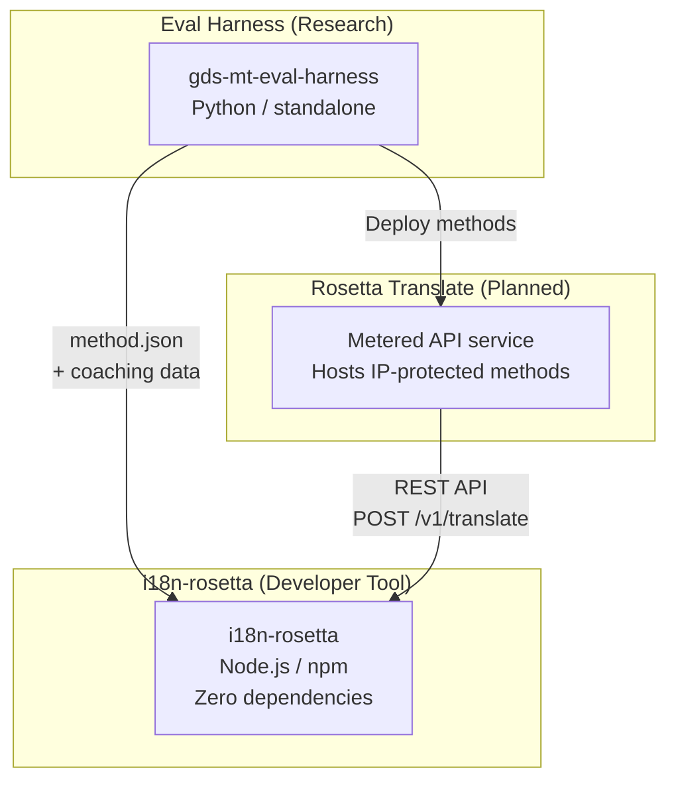
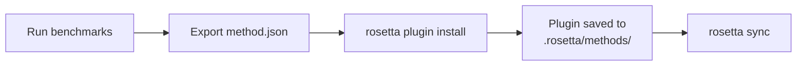
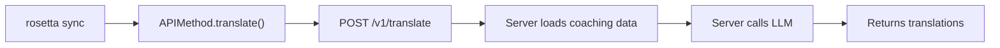
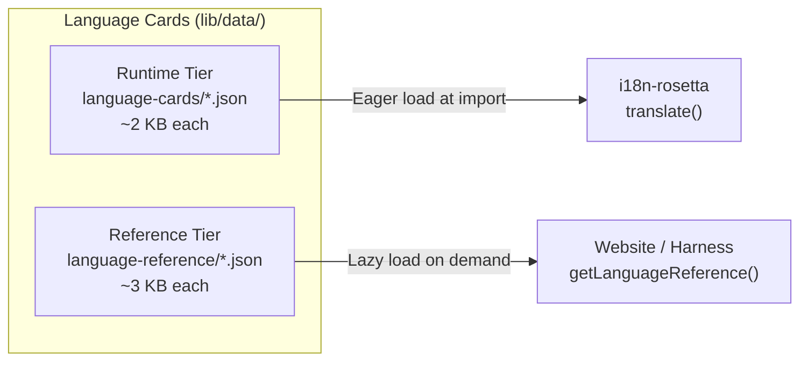

# Architectuur

Het Rosetta-vertaalecosysteem bestaat uit drie onafhankelijke tools die samenwerken via goed gedefinieerde contracten. Geen van deze tools is afhankelijk van de andere tijdens de build-fase. Ze communiceren via een gedeeld **method plugin format** en een **REST API contract**.

## De drie onderdelen



### i18n-rosetta (dit project)

De open-source ontwikkelaarstool. Vertaalt locale-bestanden met behulp van inplugbare methoden. Geen afhankelijkheden, optionele configuratie, direct klaar voor gebruik.

**Ingebouwde methoden:**
- `llm` → OpenRouter / elk LLM (200+ modellen)
- `llm-coached` → LLM + grammatica-/woordenboekcoaching
- `openai` → Directe OpenAI API (GPT-4o, GPT-4o-mini)
- `anthropic` → Directe Anthropic API (Claude Sonnet, Haiku, Opus)
- `gemini` → Directe Google Gemini API (Flash, Pro — gratis tier beschikbaar)
- `google-translate` → Google Cloud Translation API v2
- `deepl` → DeepL API met glossary-ondersteuning
- `microsoft-translator` → Azure Cognitive Services Translator
- `libretranslate` → Self-hosted LibreTranslate (AGPL, gratis)
- `api` → Thin pipe naar elk extern REST-eindpunt

### Eval Harness (begeleidend project)

Een onderzoekstool voor het ontwikkelen, testen en benchmarken van vertaalmethoden. Wanneer een methode een acceptabele kwaliteit bereikt, exporteert de harness een **method plugin** — een `method.json`-manifest en optionele coaching-databestanden.

De harness draait nooit binnen rosetta. Het is een afzonderlijke tool die statische uitvoer (JSON-bestanden) produceert. Rosetta leest deze bestanden simpelweg in.

[→ Eval Harness op GitHub](https://github.com/gamedaysuits/gds-mt-eval-harness)

### Rosetta Translate (gepland)

Een metered API-service die propriëtaire vertaalmethoden aan de serverzijde host — de prompts, coaching-data en linguïstische pipelines verlaten de server nooit.

## Hoe ze verbonden zijn

### Eval Harness → i18n-rosetta (eenrichtingsexport)



**Contract**: [Plugin-specificatie](/docs/reference/plugin-spec)

### Rosetta Translate → i18n-rosetta (API tijdens runtime)



De `APIMethod` van Rosetta is een **dumb pipe**. Het verstuurt sleutels en ontvangt vertalingen retour. Het bevat geen enkele vertaallogica en geen propriëtaire inhoud.

## Wat elk onderdeel van de andere weet

| Tool | Weet van rosetta? | Weet van Rosetta Translate? | Weet van harness? |
|------|---------------------|-------------------------------|---------------------|
| **i18n-rosetta** | *(is rosetta)* | Ja — `api`-methode roept het aan | Nee — leest alleen plugin-exports |
| **Rosetta Translate** | Ja — bedient de verzoeken ervan | *(is Rosetta Translate)* | Nee — ontvangt gedeployde methoden |
| **Eval Harness** | Ja — exporteert plugin-formaat | Nee — methoden worden afzonderlijk gedeployd | *(is de harness)* |

## Gebruikersscenario's

### Scenario 1: Gratis, zero-config (de meeste gebruikers)

```bash
export OPENROUTER_API_KEY=sk-...
npx i18n-rosetta sync
```

Maakt gebruik van de ingebouwde `llm`-methode. Geen plugins, geen Rosetta Translate, geen harness.

### Scenario 2: Google Translate-baseline

```bash
export GOOGLE_TRANSLATE_API_KEY=AIza...
npx i18n-rosetta sync
```

Maakt gebruik van de ingebouwde `google-translate`-methode. Geen plugins nodig.

### Scenario 3: Open plugin met gebundelde coaching

```bash
rosetta plugin install ./french-formal-v1/
rosetta sync
```

Plugin heeft `type: "llm-coached"` → rosetta gebruikt de eigen OpenRouter-sleutel van de gebruiker. Coaching-data is lokaal (geen serveraanroep).

### Scenario 4: DIY-coaching (geen plugin, geen harness)

```json title="i18n-rosetta.config.json"
{
  "pairs": {
    "en:fr": { "method": "llm-coached" }
  }
}
```

De gebruiker beheert de eigen grammaticaregels en het woordenboek in `.rosetta/coaching/fr.json`.

## Language Cards

Elke taal in rosetta wordt geconfigureerd via een **Language Card** — een JSON-bestand met register-presets, formaliteitsregels, method support flags en typografische conventies. Language Cards vormen de configuratie per taal die de registergestuurde vertaling aanstuurt.



Cards zijn opgesplitst in twee niveaus (tiers) voor prestaties op schaal (gericht op 700+ talen):

- **Runtime tier** (`language-cards/`): Wordt direct geladen (eagerly loaded) — de velden die de vertaal-engine nodig heeft (registers, formaliteit, methode-ondersteuning, typografische regels).
- **Reference tier** (`language-reference/`): Wordt vertraagd geladen (lazily loaded) — documentatie voor ontwikkelaars (linguïstische uitdagingen, taalfamilie, NLP-bronnen).

Beide tiers worden gegenereerd uit gezaghebbende bronnen (IANA, CLDR, Glottolog) met behulp van `scripts/generate-language-card.mjs`, en vervolgens door mensen gecureerd voor linguïstische nauwkeurigheid.

## Ontwerpprincipes

1. **Geen circulaire afhankelijkheden.** De bruggen zijn eenrichtingsverkeer.
2. **Rosetta is de lichtgewicht kern.** Geen afhankelijkheden, optionele configuratie. Plugins en API zijn aanvullend.
3. **IP-bescherming is architecturaal.** Propriëtaire technieken blijven aan de serverzijde. Het npm-pakket levert geen propriëtaire zaken mee.
4. **Het plugin-formaat is het contract.** Alles stroomt via `method.json`.
5. **Elke tool heeft één taak.** Harness → methoden ontwikkelen. Rosetta Translate → methoden hosten. Rosetta → bestanden vertalen.

---

## Zie ook

- [Vertaalmethoden](/docs/guides/translation-methods) — hoe elke ingebouwde methode werkt
- [Plugin-specificatie](/docs/reference/plugin-spec) — het method.json manifest-formaat
- [Eval Harness](https://mtevalarena.org/docs/specifications/harness) — de begeleidende onderzoekstool
- [Een methode serveren via API](/docs/guides/serving-a-method) — het hosten van aangepaste vertaal-pipelines
- [Een low-resource taal ondersteunen](https://mtevalarena.org/docs/community/low-resource-languages) — de use case die de drijfveer was voor deze architectuur