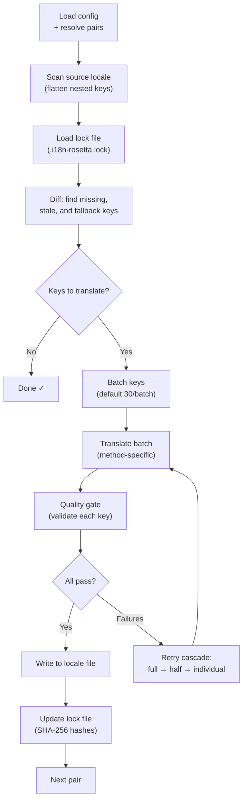

# Hoe Sync werkt

De opdracht `sync` is de kernbewerking van rosetta. Dit is wat er gebeurt wanneer u `npx i18n-rosetta sync` uitvoert.

## Overzicht van de pijplijn



## Stap voor stap

### 1. Configuratie-resolutie

Rosetta laadt `i18n-rosetta.config.json` (of detecteert instellingen automatisch). Het bepaalt:
- Bron-locale en doel-locales
- De pair graph (welke bron→doel-combinaties verwerkt moeten worden)
- Methode-, model- en kwaliteitsinstellingen per paar

### 2. Bron scannen

Het bron-locale-bestand wordt geladen en afgevlakt tot een key→value map:

```json
// Input (nested)
{ "hero": { "title": "Welcome", "subtitle": "Build" } }

// Flattened
{ "hero.title": "Welcome", "hero.subtitle": "Build" }
```

### 3. Wijzigingsdetectie

Rosetta leest `.i18n-rosetta.lock`, waarin SHA-256-hashes van eerder vertaalde bronwaarden zijn opgeslagen. Voor elke key wordt het volgende gecontroleerd:

| Voorwaarde | Actie |
|-----------|--------|
| Key ontbreekt in doel | **Vertalen** |
| Bron-hash is gewijzigd sinds de laatste sync | **Opnieuw vertalen** (verouderd) |
| Doelwaarde begint met `[EN]` | **Opnieuw vertalen** (fallback-placeholder) |
| Bron-hash is ongewijzigd, key bestaat | **Overslaan** |

Dit is de reden waarom rosetta alleen vertaalt wat er is gewijzigd — uw volledige bestand wordt niet bij elke sync opnieuw vertaald.

### 4. Batching

Keys worden gegroepeerd in batches (standaard: 30 keys/batch voor LLM, 128 voor Google Translate). Batching vermindert het aantal API-roundtrips en houdt prompts beheersbaar.

### 5. Vertaling

Elke batch wordt naar de geconfigureerde vertaalmethode verzonden:

- **`llm`**: Gestructureerde prompt naar OpenRouter met instructies voor register en genderrichtlijnen
- **`llm-coached`**: Hetzelfde, maar met geïnjecteerde grammaticaregels, dictionary en stijlopmerkingen
- **`google-translate`**: Google Cloud Translation API v2 batch-verzoek
- **`api`**: HTTP POST naar een extern endpoint

Het systeembericht (register, genderrichtlijnen, regels) is identiek voor alle batches van een bepaalde locale, wat **prompt caching** mogelijk maakt — providers zoals Anthropic en Google cachen herhaalde systeemberichten, wat de tokenkosten verlaagt.

### 6. Quality Gate

Elke vertaling wordt gevalideerd voordat deze naar de schijf wordt geschreven. Er worden vijf controles uitgevoerd:

| Controle | Wat het detecteert | Voorbeeld |
|-------|----------------|---------|
| **Leeg/blanco** | Model heeft niets geretourneerd | `""` |
| **Bron-echo** | Model heeft de Engelse invoer geretourneerd | `"Welcome"` voor Japans |
| **Hallucinatie-loop** | Herhaalde trigrams | `"Qo' Qo' Qo' Qo'"` |
| **Lengte-inflatie** | Uitvoer is 4×+ langer dan de bron | 10-char bron → 50-char uitvoer |
| **Script-naleving** | Verkeerd script voor de locale | Latijnse tekst voor Arabische locale |

Fouten worden gelogd met een `[GATE]`-voorvoegsel. Geen stille fallbacks.

Zie [Quality Gate](/docs/concepts/quality-gate) voor meer informatie.

### 7. Retry Cascade

Bij een JSON-parseerfout of fouten op batchniveau, probeert rosetta het opnieuw met steeds kleinere batches:

```
Full batch (30 keys) → Failed
Half batch (15 keys) → Failed
Individual keys (1 each) → Isolates the problem key
```

Het retry-budget is gemaximeerd door `maxRetries` (standaard: 3) om uit de hand lopende tokenkosten te voorkomen.

### 8. Schrijven & Vergrendelen

Goedgekeurde vertalingen worden naar het doel-locale-bestand geschreven, waarbij de oorspronkelijke nestingsstructuur behouden blijft. Het lock-bestand wordt bijgewerkt met nieuwe SHA-256-hashes.

## Gedeeltelijk succes

Eén mislukte batch blokkeert de rest niet. Als 9 van de 10 batches slagen, worden die 9 geschreven. De mislukte batch wordt gelogd en u kunt `sync` opnieuw uitvoeren om het nogmaals te proberen.

## Dry Run

Bekijk een voorbeeld van wat er zou veranderen zonder bestanden te schrijven:

```bash
npx i18n-rosetta sync --dry
```

## Geforceerd opnieuw vertalen

Forceer dat specifieke keys opnieuw worden vertaald, zelfs als ze ongewijzigd zijn:

```bash
npx i18n-rosetta sync --force-keys "hero.title,nav.about"
```

## Kostenraming

Voordat het vertalen begint, genereert rosetta een **pre-sync kostenrapport** dat de geschatte kosten per paar toont. Dit wordt automatisch uitgevoerd tijdens elke `sync` — u ziet dit voordat er API-aanroepen worden gedaan.

```
╔══════════════════════════════════════════════════════════╗
║  Cost Estimate                                          ║
╠════════════╦═══════╦════════════╦════════════════════════╣
║ Pair       ║ Keys  ║ Est. Cost  ║ Method                 ║
╠════════════╬═══════╬════════════╬════════════════════════╣
║ en → fr    ║   142 ║ $0.07      ║ google-translate       ║
║ en → ja    ║    38 ║   —        ║ llm (model-dependent)  ║
║ en → crk   ║    38 ║   —        ║ llm-coached            ║
╚════════════╩═══════╩════════════╩════════════════════════╝
```

### Wat er wordt geschat

Elke vertaalmethode biedt een eigen kostenraming:

| Methode | Kostenbasis | Precisie |
|--------|-----------|-----------|
| `google-translate` | Gepubliceerde tarief van Google ($20/miljoen tekens) | Accuraat |
| `llm` | Varieert per OpenRouter-model | Modelafhankelijk — bekijk [OpenRouter-prijzen](https://openrouter.ai/models) |
| `llm-coached` | Zelfde als `llm` plus tokens voor coaching-context | Modelafhankelijk |
| `api` | Bepaald door de server | Onbekend — kan niet worden geschat zonder het endpoint te bevragen |

Wanneer een methode de kosten niet kan bepalen (LLM-methoden, externe API's), rapporteert rosetta `—` in plaats van te gissen. Gebruik `--dry` om kostenramingen te bekijken zonder daadwerkelijk te vertalen.

---

## Zie ook

- [CLI-referentie — sync](/docs/reference/cli#sync) — opdracht-flags en opties
- [Quality Gate](/docs/concepts/quality-gate) — hoe vertalingen worden gevalideerd
- [Vertaalmethoden](/docs/guides/translation-methods) — hoe elke methode werkt
- [Configuratie](/docs/getting-started/configuration) — configuratiereferentie
- [CI/CD-gids](/docs/guides/ci-cd) — syncs automatiseren in uw pijplijn