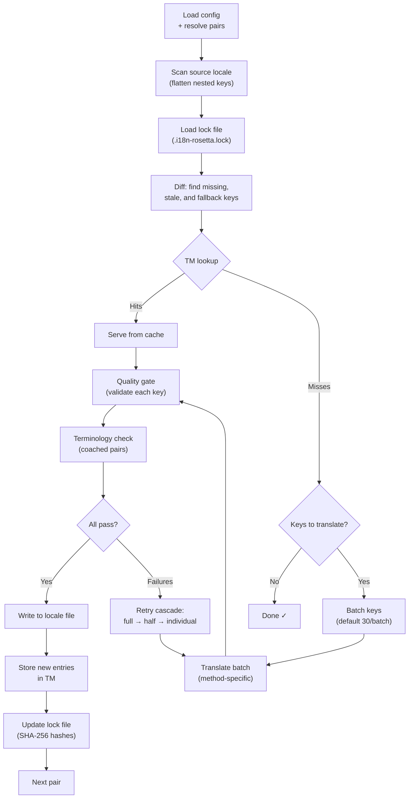

# Hoe Sync werkt

De opdracht `sync` is de kernbewerking van rosetta. Dit is wat er gebeurt wanneer u `npx i18n-rosetta sync` uitvoert.

## Overzicht van de pipeline



## Stap voor stap

### 1. Configuratie bepalen

Rosetta laadt `i18n-rosetta.config.json` (of detecteert instellingen automatisch). Het bepaalt:
- Bron-locale en doel-locales
- De pair graph (welke bron→doel combinaties verwerkt moeten worden)
- Methode-, model- en kwaliteitsinstellingen per paar

### 2. Bron scannen

Het bron-locale bestand wordt geladen en afgevlakt tot een key→value map:

```json
// Input (nested)
{ "hero": { "title": "Welcome", "subtitle": "Build" } }

// Flattened
{ "hero.title": "Welcome", "hero.subtitle": "Build" }
```

### 3. Wijzigingen detecteren

Rosetta leest `.i18n-rosetta.lock`, waarin SHA-256 hashes van eerder vertaalde bronwaarden zijn opgeslagen. Voor elke key wordt het volgende gecontroleerd:

| Voorwaarde | Actie |
|-----------|--------|
| Key ontbreekt in doel | **Vertalen** |
| Bron-hash is gewijzigd sinds de laatste sync | **Opnieuw vertalen** (verouderd) |
| Doelwaarde begint met `[EN]` | **Opnieuw vertalen** (fallback-tijdelijke aanduiding) |
| Bron-hash ongewijzigd, key bestaat | **Overslaan** |

Dit is de reden waarom rosetta alleen vertaalt wat er is gewijzigd — uw volledige bestand wordt niet bij elke sync opnieuw vertaald.

### 4. Batching

Keys worden gegroepeerd in batches (standaard: 30 keys/batch voor LLM, 128 voor Google Translate). Batching vermindert het aantal API-roundtrips en houdt prompts beheersbaar.

### 4b. Translation Memory

Voorafgaand aan batching controleert rosetta de Translation Memory-cache (`.rosetta/tm.json`). Keys waarvan de brontekst + locale + methode overeenkomen met een eerdere vertaling, worden direct vanuit de cache geleverd — er is geen API-aanroep nodig.

```
  [TM] 142 key(s) served from cache
  Translating 3 key(s) to French (llm)... [OK]
```

TM is het belangrijkste kostenbesparende mechanisme. Wanneer u sync opnieuw uitvoert na een wijziging van één key, wordt alleen die specifieke key vertaald en niet het hele bestand. Zie [Translation Memory](/docs/concepts/translation-memory) voor meer informatie.

Om de cache voor een enkele uitvoering te omzeilen: `i18n-rosetta sync --no-tm`

### 5. Vertaling

Elke batch wordt naar de geconfigureerde vertaalmethode verzonden:

- **`llm`**: Gestructureerde prompt naar OpenRouter met instructies voor register en genderrichtlijnen
- **`llm-coached`**: Hetzelfde, maar met geïnjecteerde grammaticaregels, woordenboek en stijlaantekeningen
- **`google-translate`**: Google Cloud Translation API v2 batch-verzoek
- **`api`**: HTTP POST naar een extern endpoint

Het systeembericht (register, genderrichtlijnen, regels) is identiek voor alle batches binnen een bepaalde locale, wat **prompt caching** mogelijk maakt — providers zoals Anthropic en Google cachen herhaalde systeemberichten, wat de tokenkosten verlaagt.

### 6. Quality Gate

Elke vertaling wordt gevalideerd voordat deze naar de schijf wordt geschreven. Er worden vijf controles uitgevoerd:

| Controle | Wat het detecteert | Voorbeeld |
|-------|----------------|---------|
| **Leeg/blanco** | Model heeft niets geretourneerd | `""` |
| **Bron-echo** | Model heeft de Engelse invoer geretourneerd | `"Welcome"` voor Japans |
| **Hallucinatie-loop** | Herhaalde trigrammen | `"Qo' Qo' Qo' Qo'"` |
| **Lengte-inflatie** | Uitvoer is 4×+ langer dan de bron | 10-teken bron → 50-teken uitvoer |
| **Script-naleving** | Verkeerd script voor de locale | Latijnse tekst voor Arabische locale |

Fouten worden gelogd met een `[GATE]` voorvoegsel. Er zijn geen stille fallbacks.

Zie [Quality Gate](/docs/concepts/quality-gate) voor meer informatie.

### 6b. Terminologieverificatie

Voor gecoachte paren met een woordenboek controleert rosetta na de vertaling of de LLM daadwerkelijk de vereiste terminologie heeft gebruikt. Overtredingen worden gelogd als `[TERM]` waarschuwingen:

```
[TERM] en→fr: 2 term violation(s)
  • "dashboard" → expected "tableau de bord" but got "panneau"
```

Dit zijn waarschuwingen, geen blokkerende fouten — de vertaling wordt alsnog weggeschreven.

### 7. Retry Cascade

Bij een JSON-parsefout of fouten op batchniveau, probeert rosetta het opnieuw met steeds kleinere batches:

```
Full batch (30 keys) → Failed
Half batch (15 keys) → Failed
Individual keys (1 each) → Isolates the problem key
```

Het budget voor nieuwe pogingen wordt beperkt door `maxRetries` (standaard: 3) om uit de hand lopende tokenkosten te voorkomen.

### 8. Schrijven & Vergrendelen

Goedgekeurde vertalingen worden naar het doel-locale bestand geschreven, waarbij de oorspronkelijke nestingsstructuur behouden blijft. Het lock-bestand wordt bijgewerkt met nieuwe SHA-256 hashes.

## Contentvertaling (Fase 2)

Voor Docusaurus- en Hugo-projecten voert `sync` een tweede fase uit na de vertaling van de JSON-keys. In deze fase worden Markdown- en MDX-bestanden (documentatie, blogposts, tutorials) vertaald met behulp van dezelfde methoden en Quality Gate.

### Hoe het werkt

1. Rosetta ontdekt alle broncontentbestanden (`.md`, `.mdx`) door de content/docs-directory te doorlopen
2. Voor elk bestand × locale-paar controleert het een afzonderlijk content-lockbestand (`.i18n-rosetta-content.lock`) op wijzigingen in de SHA-256 hash
3. Gewijzigde of ontbrekende bestanden worden verzameld in een platte work-item pool
4. De pool wordt verwerkt met **parallelle gelijktijdigheid** (standaard: 12 gelijktijdige API-aanroepen)

```
Phase 2: content (79 translations to process, 341 skipped, concurrency: 12)

    [1/79] (1%)  docs/concepts/security.md → ja [RE-TRANSLATE] (~3328s left)
    [2/79] (3%)  docs/concepts/security.md → th [RE-TRANSLATE] (~1821s left)
    ...
    [79/79] (100%) blog/v3-2-quality.md → de [OK]

  [OK] Created 79 content file(s), 341 unchanged
```

### Flat-pool parallellisme

In tegenstelling tot Fase 1 (JSON-keys, sequentieel per locale), verwerkt Fase 2 alle bestand×locale-combinaties als een platte lijst. Dit betekent dat verschillende bestanden en verschillende locales tegelijkertijd worden vertaald:

- `docs/configuration.md → fr` en `docs/cli.md → ja` worden tegelijkertijd uitgevoerd
- Een corpus van 420 vertalingen wordt in ~11 minuten voltooid bij een gelijktijdigheid van 12
- Incrementele manifest-schrijfacties na elke 10 voltooiingen voorkomen dat voortgang verloren gaat als het proces wordt afgebroken

Beheer het parallellisme met `--concurrency` of het configuratieveld `concurrency`:

```bash
# Faster (more parallel calls, higher API load)
npx i18n-rosetta sync --concurrency 20

# Slower (gentler on rate limits)
npx i18n-rosetta sync --concurrency 4
```

### Contentbescherming

Tijdens de vertaling schermt rosetta niet-vertaalbare content af:

- **Code blocks** (omkaderd en ingesprongen) worden vervangen door placeholders
- **Frontmatter**-velden die niet in de `translatableFields`-lijst staan, blijven ongewijzigd behouden
- **Links**, afbeeldingspaden en HTML-tags worden beschermd
- **Shortcodes** en interpolatievariabelen (bijv. `{count}`, `{{.Params.title}}`) worden afgeschermd

Na de vertaling worden alle placeholders hersteld en gevalideerd. Als er placeholders ontbreken of beschadigd zijn, wordt de vertaling afgewezen en opnieuw geprobeerd.

## Gedeeltelijk succes

Eén mislukte batch blokkeert de rest niet. Als 9 van de 10 batches slagen, worden die 9 weggeschreven. De mislukte batch wordt gelogd en u kunt `sync` opnieuw uitvoeren om het nogmaals te proberen.

## Dry Run

Bekijk een voorbeeld van wat er zou veranderen zonder bestanden weg te schrijven:

```bash
npx i18n-rosetta sync --dry-run
```

## Geforceerd opnieuw vertalen

Forceer dat specifieke keys opnieuw worden vertaald, zelfs als ze ongewijzigd zijn:

```bash
npx i18n-rosetta sync --force-keys "hero.title,nav.about"
```

## Kostenraming

Voordat de vertaling begint, genereert rosetta een **pre-sync kostenrapport** dat de geschatte kosten per paar toont. Dit wordt automatisch uitgevoerd tijdens elke `sync` — u ziet dit voordat er API-aanroepen worden gedaan.

```
╔══════════════════════════════════════════════════════════╗
║  Cost Estimate                                          ║
╠════════════╦═══════╦════════════╦════════════════════════╣
║ Pair       ║ Keys  ║ Est. Cost  ║ Method                 ║
╠════════════╬═══════╬════════════╬════════════════════════╣
║ en → fr    ║   142 ║ $0.07      ║ google-translate       ║
║ en → ja    ║    38 ║   —        ║ llm (model-dependent)  ║
║ en → crk   ║    38 ║   —        ║ llm-coached            ║
╚════════════╩═══════╩════════════╩════════════════════════╝
```

### Wat wordt er geschat

Elke vertaalmethode biedt een eigen kostenraming:

| Methode | Kostenbasis | Precisie |
|--------|-----------|-----------|
| `google-translate` | Het gepubliceerde tarief van Google ($20/miljoen tekens) | Accuraat |
| `llm` | Varieert per OpenRouter-model | Modelafhankelijk — bekijk [OpenRouter-prijzen](https://openrouter.ai/models) |
| `llm-coached` | Hetzelfde als `llm` plus coaching-contexttokens | Modelafhankelijk |
| `api` | Bepaald door de server | Onbekend — kan niet worden geschat zonder het endpoint te bevragen |

Wanneer een methode de kosten niet kan bepalen (LLM-methoden, externe API's), rapporteert rosetta `—` in plaats van te raden. Gebruik `--dry` om kostenramingen te bekijken zonder daadwerkelijk te vertalen.

---

## Zie ook

- [CLI-referentie — sync](/docs/reference/cli#sync) — opdrachtvlaggen en opties
- [Translation Memory](/docs/concepts/translation-memory) — caching en kostenbesparingen
- [Quality Gate](/docs/concepts/quality-gate) — hoe vertalingen worden gevalideerd
- [Vertaalmethoden](/docs/guides/translation-methods) — hoe elke methode werkt
- [Werken met professionele vertalers](/docs/guides/professional-translators) — XLIFF-workflow
- [Configuratie](/docs/getting-started/configuration) — configuratiereferentie
- [CI/CD-gids](/docs/guides/ci-cd) — syncs automatiseren in uw pipeline