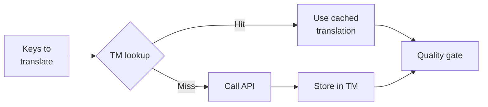

# Translation Memory

Translation Memory (TM) is de ingebouwde caching layer van rosetta. Het slaat elke vertaling op, gekoppeld aan brontekst + locale + methode, zodat het opnieuw uitvoeren van `sync` de API alleen aanroept voor keys die daadwerkelijk zijn gewijzigd.

## Waarom TM bestaat

Zonder TM vertaalt elke `sync` elke gewijzigde key opnieuw — zelfs als u exact dezelfde Engelse tekst voor dezelfde locale al tijdens een eerdere run hebt vertaald. Veelvoorkomende scenario's waarin dit geld verspilt:

| Scenario | Zonder TM | Met TM |
|----------|-----------|---------|
| Sync opnieuw uitvoeren na 1 key-wijziging (500 keys × 10 locales) | 5.000 API calls | 10 API calls |
| Een key terugzetten naar een eerdere Engelse waarde | Volledige API call | Directe cache hit |
| Dezelfde zin komt voor in 3 locale-bestanden | 3 × API calls | 1 API call + 2 cache hits |
| Dry-run → echte sync | Volledige API calls bij beide | Eerste run cacht, tweede hergebruikt |

TM is **standaard ingeschakeld** en vereist geen configuratie. Vertalingen worden automatisch gecacht tijdens elke `sync` en aangeboden bij volgende runs.

## Hoe het werkt

### Cache Key

Elke TM-entry is gekoppeld aan een SHA-256 hash van drie waarden:

```
SHA-256( sourceValue + '\x00' + locale + '\x00' + method )
```

| Component | Waarom het in de key zit |
|-----------|-------------------|
| `sourceValue` | Andere Engelse tekst → andere vertaling |
| `locale` | "Hello" wordt anders vertaald naar het Frans dan naar het Japans |
| `method` | Google Translate-output ≠ GPT-4o-output |

De null byte separator (`\x00`) voorkomt een collisie tussen `"ab" + "c"` en `"a" + "bc"`.

### Tijdens Sync



1. Voordat de translation API wordt aangeroepen, verdeelt rosetta de keys in **TM hits** en **TM misses**
2. Hits worden direct vanuit de cache geserveerd — geen API call, geen latency, geen kosten
3. Misses gaan door de normale translation pipeline
4. Nieuwe vertalingen van de API worden opgeslagen in TM voor toekomstige runs
5. Alle vertalingen (gecacht + nieuw) gaan door de quality gate

### Opslag

TM wordt opgeslagen in `.rosetta/tm.json` in uw project root. Het bestand gebruikt compacte JSON (geen pretty-printing) om de bestandsgrootte beheersbaar te houden. Elke entry slaat het volgende op:

| Veld | Beschrijving |
|-------|-------------|
| `t` | De vertaalde tekst |
| `ts` | ISO-8601 timestamp van wanneer het is gecacht |
| `l` | Target locale code (voor statistieken/filtering) |
| `m` | Naam van de translation method (voor statistieken/filtering) |

Bij 50 talen × 500 keys = 25.000 entries, zou het bestand ~2-3 MB groot moeten zijn.

## De Cache beheren

### Statistieken bekijken

```bash
i18n-rosetta tm stats
```

Toont het aantal entries, de bestandsgrootte en een uitsplitsing per locale:

```
  Translation Memory — .rosetta/tm.json

  Entries:      2,847
  File size:    1.2 MB
  Created:      2026-05-20
  Last entry:   2026-05-24

  By locale:
    fr       482 entries  (llm: 380, llm-coached: 102)
    de       471 entries  (llm: 471)
    ja       465 entries  (llm: 465)
```

### De Cache wissen

```bash
# Clear everything (with confirmation prompt)
i18n-rosetta tm clear

# Clear without prompt (CI environments)
i18n-rosetta tm clear --yes

# Clear only one locale
i18n-rosetta tm clear --locale fr
```

### TM overslaan voor één run

```bash
# Force fresh API calls for all keys (useful when switching providers)
i18n-rosetta sync --no-tm
```

Dit verwijdert de cache niet — het negeert deze alleen voor deze run en slaat geen nieuwe resultaten op.

## Wanneer TM niet helpt

TM levert geen cache hit op wanneer:

- **Brontekst is gewijzigd** — de hash verandert, dus het is een miss
- **Methode is gewijzigd** — overschakelen van `llm` naar `google-translate` betekent andere cache keys
- **Eerste run** — cold start, nog geen entries
- **`--no-tm` flag** — omzeilt de cache expliciet

## Moet u `.rosetta/tm.json` committen?

**Over het algemeen niet.** TM is een lokale optimalisatie voor developers. Het wordt automatisch gevuld tijdens de sync en helpt alleen bij het opnieuw uitvoeren van de sync op dezelfde machine. U kunt echter overwegen om het te committen als:

- Uw team een enkele CI runner deelt die vertalingen synchroniseert
- U reproduceerbare builds wilt zonder API calls
- U vertalingen archiveert voor compliance

Voeg `.rosetta/tm.json` toe aan `.gitignore` voor standaardgebruik.

---

## Zie ook

- [Hoe Sync werkt](/docs/concepts/how-sync-works) — waar TM in de pipeline past
- [CLI-referentie — tm](/docs/reference/cli#tm) — commando-referentie
- [CLI-referentie — sync --no-tm](/docs/reference/cli#sync) — TM omzeilen