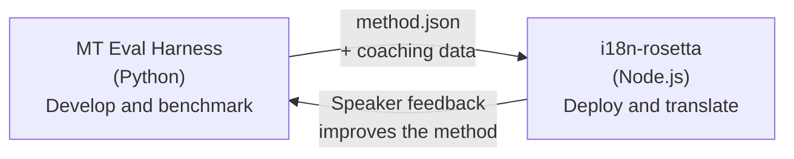

# De Eval Harness Bridge

i18n-rosetta en de MT Eval Harness zijn twee afzonderlijke tools die één ecosysteem vormen. De harness is waar vertaalmethoden worden **bewezen**. Rosetta is waar bewezen methoden worden **ingezet**. Ze zijn met elkaar verbonden via een gedeeld plugin-formaat.



## De workflow: Onderzoek → Productie

### 1. Een methode bouwen in de harness

Elke Python-class die `async translate(entries, config) → [{id, predicted}]` implementeert, kan aan de harness worden gekoppeld. Het maakt voor de harness niet uit wat er intern gebeurt — een geprompte LLM, een op maat getraind model, deterministische regels, wat dan ook.

### 2. De methode benchmarken

De harness scoort uw methode tegen een gestandaardiseerd corpus met reproduceerbare metrieken: chrF++, FST-acceptatie (voor morfologisch rijke talen), morfologische nauwkeurigheid en semantische scoring.

### 3. Exporteren als een plugin

Wanneer uw methode een acceptabele kwaliteit bereikt, verpakt u deze als een rosetta-plugin — een `method.json`-manifest met optionele coaching data.

:::info Export CLI staat op de planning
Momenteel maakt u het method.json-manifest handmatig aan. Het commando `mt-eval export` zal dit automatiseren. Bekijk de [Method Interface](https://mtevalarena.org/docs/specifications/methods) voor het volledige plugin-formaat.
:::

### 4. Installeren in rosetta

```bash
i18n-rosetta plugin install ./my-method-plugin/
```

### 5. Echte content vertalen

```bash
i18n-rosetta sync
```

Uw gebenchmarkte methode produceert nu echte vertalingen in productie.

## De workflow: Productie → Onderzoek

Ingezette vertalingen worden beoordeeld door tweetalige sprekers. Hun feedback identificeert systematische fouten (verkeerde tijdspatronen, ontbrekende woordenschat, onnatuurlijke formuleringen). De onderzoeker werkt de methode bij in de harness, voert opnieuw een benchmark uit, exporteert opnieuw en zet deze opnieuw in. Het systeem leert van het gebruik.

## Het plugin-formaat

Het `method.json`-manifest is het contract tussen de twee tools:

```json
{
  "name": "crk-coached-v3",
  "type": "llm-coached",
  "version": "3.0.0",
  "description": "Coached LLM translation for Plains Cree",
  "locales": ["crk"],
  "config": {
    "model": "google/gemini-3.5-flash",
    "temperature": 0.3
  },
  "benchmarks": {
    "crk": {
      "composite_score": 0.67,
      "fst_acceptance": 0.82,
      "corpus_size": 150
    }
  }
}
```

Bekijk de [Plugin Specification](/docs/reference/plugin-spec) voor het volledige formaat.

## Wat is gebouwd vs. gepland

| Component | Status |
|-----------|--------|
| TranslationProcess-protocol | ✅ Gebouwd |
| Harness benchmark runner | ✅ Gebouwd |
| method.json plugin-formaat | ✅ Gebouwd |
| `rosetta plugin install/remove/list` | ✅ Gebouwd |
| Coaching data laden | ✅ Gebouwd |
| `mt-eval export` CLI | 🔲 Gepland |
| Community review-interface | 🔲 Gepland |
| Cryptografische testset-evaluatie | 🔲 Gepland |

## Verder lezen

- [Translation Methods](/docs/guides/translation-methods) — alle beschikbare methoden en hoe ze werken
- [Plugin Specification](/docs/reference/plugin-spec) — het method.json-formaat
- [Serving a Method via API](/docs/guides/serving-a-method) — een methode server-side hosten
- [Data Sovereignty](https://mtevalarena.org/docs/sovereignty/data-sovereignty) — OCAP, CARE en cryptografische bescherming
- [For MT Researchers](https://mtevalarena.org/docs/leaderboard/rules) — de eval harness-documentatie