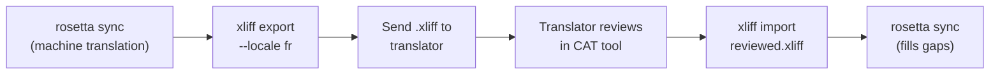

# Werken met professionele vertalers

Rosetta genereert automatische vertalingen, maar sommige projecten vereisen menselijke controle — regelgevende inhoud, merkgevoelige teksten of cruciale UI. De XLIFF-workflow stelt u in staat om vertalingen te exporteren voor professionele beoordeling en deze naadloos weer te importeren.

## Wat is XLIFF?

XLIFF (XML Localization Interchange File Format) is het industriestandaard uitwisselingsformaat voor vertaaltools. Elke professionele CAT-tool (Computer-Assisted Translation) ondersteunt het:

- **memoQ** — XLIFF importeren, in-context beoordelen, beoordeeld bestand exporteren
- **SDL Trados Studio** — native XLIFF-ondersteuning
- **Phrase (Memsource)** — XLIFF-taken uploaden voor vertaalteams
- **Smartling** — XLIFF-ingestion pipeline
- **OmegaT** — gratis/open-source CAT-tool met XLIFF-ondersteuning

Rosetta genereert XLIFF 1.2 (de universeel ondersteunde versie) in plaats van 2.0+ voor maximale compatibiliteit met tools.

## De workflow



### Stap 1: Automatische vertalingen genereren

Voer eerst `sync` uit om een basis voor de automatische vertaling te verkrijgen:

```bash
i18n-rosetta sync
```

### Stap 2: XLIFF exporteren

Exporteer het bron- en doelpaar als XLIFF:

```bash
i18n-rosetta xliff export --locale fr
```

Dit schrijft `.rosetta/xliff/fr.xliff` met daarin:
- Elke bronsleutel met zijn Engelse waarde
- De huidige automatische vertaling (indien aanwezig) als de `<target>`
- Sleutels zonder vertalingen gemarkeerd als `state="new"`

```xml
<trans-unit id="hero.title" xml:space="preserve">
  <source>Welcome to our platform</source>
  <target state="translated">Bienvenue sur notre plateforme</target>
</trans-unit>
```

### Stap 3: Naar de vertaler sturen

Stuur het `.xliff`-bestand naar uw vertaler of upload het naar uw CAT-platform. De vertaler ziet de bron en het doel naast elkaar, en kan:

- Automatische vertalingen bewerken
- Ontbrekende vertalingen invullen
- Kwaliteitsproblemen markeren
- Hun eigen translation memory en termbases toepassen

### Stap 4: Beoordeeld bestand importeren

Wanneer de vertaler het beoordeelde `.xliff` retourneert, importeert u het:

```bash
# Preview what will change
i18n-rosetta xliff import .rosetta/xliff/fr.xliff --dry

# Apply changes
i18n-rosetta xliff import .rosetta/xliff/fr.xliff
```

Uitvoer:
```
  ✓ Imported 142 translations for fr
    Updated:    23 (changed from existing)
    Added:      0 (new keys)
    Unchanged:  119
    Written to: locales/fr.json
```

### Stap 5: Hiaten opvullen

Als er nieuwe sleutels zijn toegevoegd nadat de XLIFF is geëxporteerd, voert u `sync` uit om deze te vertalen:

```bash
i18n-rosetta sync
```

Rosetta vertaalt alleen sleutels die nog ontbreken — beoordeelde vertalingen van de XLIFF-import blijven behouden.

## Tips

### Aangepaste paden exporteren

```bash
# Export to a specific directory
i18n-rosetta xliff export --locale ja --out ./for-review/

# Export with a specific filename
i18n-rosetta xliff export --locale de --out ./review/german.xliff
```

### Meerdere locales

Exporteer elke locale afzonderlijk:

```bash
for locale in fr de ja ko; do
  i18n-rosetta xliff export --locale $locale
done
```

### Versiebeheer

Voeg `.rosetta/xliff/` toe aan `.gitignore` — XLIFF-bestanden zijn tijdelijke artefacten, geen projectbron:

```gitignore
.rosetta/xliff/
```

### Wanneer XLIFF gebruiken vs. alleen `sync`

| Scenario | Aanbeveling |
|----------|---------------|
| Interne app, 90%+ kwaliteit acceptabel | Alleen `sync` — automatische vertaling is voldoende |
| Gebruikersgerichte marketingteksten | XLIFF exporteren voor menselijke beoordeling |
| Juridische/regelgevende inhoud | XLIFF exporteren — menselijke beoordeling vereist |
| 50+ locales, strakke deadline | Eerst `sync`, XLIFF-export alleen voor de top 5 locales |
| Vertaler gebruikt al een CAT-tool | XLIFF is het natuurlijke overdrachtsformaat |

---

## Zie ook

- [CLI-referentie — xliff](/docs/reference/cli#xliff) — commando-referentie
- [Translation Memory](/docs/concepts/translation-memory) — beoordeelde vertalingen cachen
- [Translation Methods](/docs/guides/translation-methods) — opties voor automatische vertaling