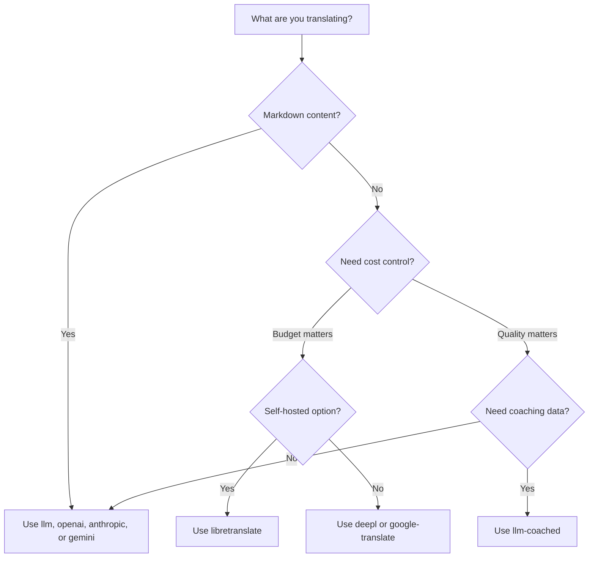

# Vertaalmethoden

Rosetta ondersteunt tien vertaalmethoden. Elk talenpaar kan een andere methode gebruiken — u bent niet gebonden aan één aanpak voor uw hele project.

## Vergelijking van methoden

### LLM-providers

Kwaliteitsgericht, Markdown-bewust, compatibel met coaching. Het beste voor projecten met veel content.

| Methode | Sleutel | Wat het doet |
|--------|-----|-------------|
| `llm` (standaard) | `OPENROUTER_API_KEY` | LLM via OpenRouter — 200+ modellen, auto-routing |
| `llm-coached` | `OPENROUTER_API_KEY` | LLM + grammaticaregels, woordenboeken, stijlnotities |
| `openai` | `OPENAI_API_KEY` | Directe OpenAI API (gpt-4o, gpt-4o-mini) |
| `anthropic` | `ANTHROPIC_API_KEY` | Directe Anthropic API (Claude Sonnet, Haiku, Opus) |
| `gemini` | `GEMINI_API_KEY` | Directe Google Gemini API (Flash, Pro) — gratis niveau |

### Traditionele MT

Gericht op snelheid en kosten. Het beste voor grote volumes aan key-value paren.

| Methode | Sleutel | Wat het doet |
|--------|-----|-------------|
| `google-translate` | `GOOGLE_TRANSLATE_API_KEY` | Google Cloud Translation API v2 (130+ talen) |
| `deepl` | `DEEPL_API_KEY` | DeepL API met glossary-ondersteuning (30+ talen) |
| `microsoft-translator` | `MICROSOFT_TRANSLATOR_API_KEY` | Azure Cognitive Services Translator (100+ talen) |
| `libretranslate` | *(zelf-gehost)* | Zelf-gehoste LibreTranslate (AGPL, gratis) |

### Infrastructuur

| Methode | Sleutel | Wat het doet |
|--------|-----|-------------|
| `api` | *(per provider)* | Thin HTTP-client voor elk REST-vertaaleindpunt |

## Beslissingsboom



---

## `llm` — LLM-vertaling (Standaard)

Vertaalt via elke LLM op [OpenRouter](https://openrouter.ai). Dit is de standaardmethode en de meest veelzijdige.

**Hoe het werkt:**
1. Bundelt sleutels in batches (standaard 30/batch) met register- en contextinstructies
2. Verzendt naar OpenRouter als een gestructureerde prompt
3. Ontleedt de JSON-respons
4. Valideert elke vertaling via de [quality gate](/docs/concepts/quality-gate)
5. Schrijft goedgekeurde vertalingen weg, probeert mislukte vertalingen opnieuw of wijst deze af

**Wanneer te gebruiken:** De meeste projecten. Vooral sites met veel content en Markdown, waar codeblokken en shortcodes afgeschermd moeten worden.

**Configuratie:**

```json
{
  "defaultMethod": "llm",
  "model": "google/gemini-3.5-flash"
}
```

## `llm-coached` — Gecoachte LLM-vertaling

Hetzelfde als `llm`, maar met grammaticaregels, terminologiewoordenboeken en stijlnotities geïnjecteerd in elke prompt.

**Hoe het werkt:**
1. Laadt coachinggegevens uit `.rosetta/coaching/<locale>.json` of de `coaching/`-directory van een plug-in
2. Injecteert grammaticaregels, woordenboektermen en stijlnotities in de systeemprompt
3. Woordenboektermen die overeenkomen met bronsleutels worden opgenomen als vereiste terminologie
4. De vertaling verloopt zoals bij `llm`, waarbij coachinggegevens precisie toevoegen

**Wanneer te gebruiken:** Talen met weinig bronnen (low-resource), domeinspecifieke terminologie (juridisch, medisch), formele registers, of elk geval waarin de generieke LLM-uitvoer niet precies genoeg is.

**Formaat van coachinggegevens:**

```json title=".rosetta/coaching/fr.json"
{
  "grammar_rules": [
    "French adjectives agree in gender and number with the noun they modify",
    "Use 'vous' for formal contexts, 'tu' for informal"
  ],
  "dictionary": {
    "dashboard": "tableau de bord",
    "deployment": "déploiement",
    "settings": "paramètres"
  },
  "style_notes": "Prefer active voice. Avoid anglicisms where a native French term exists."
}
```

Zie ook: [Gids voor talen met weinig bronnen](/docs/guides/low-resource-languages)

---

## `openai` — Directe OpenAI API

Vertaalt direct via de OpenAI Chat Completions API. Geen OpenRouter-tussenpersoon — uw sleutel, uw account, uw gebruiksdashboard.

**Modellen:** `gpt-4o` (standaard), `gpt-4o-mini`

**Functies:**
- ✅ Markdown-bewust (contentvertaling)
- ✅ Ondersteuning voor coaching (grammaticaregels, woordenboek-overrides, stijlnotities)
- ✅ JSON-modus voor gestructureerde key-value uitvoer
- ✅ Exponentiële backoff met nieuwe pogingen (retry)

**Configuratie:**

```json
{
  "pairs": {
    "en:fr": { "method": "openai", "model": "gpt-4o-mini" }
  }
}
```

```bash
export OPENAI_API_KEY=sk-proj-...
```

Haal uw sleutel op via [platform.openai.com/api-keys](https://platform.openai.com/api-keys).

## `anthropic` — Directe Anthropic API

Vertaalt direct via de Anthropic Messages API. Gebruikt de `system` parameter voor coachinggegevens, wat Anthropic's prompt caching mogelijk maakt.

**Modellen:** `claude-sonnet-4-6` (standaard), `claude-haiku-4-5`, `claude-opus-4-7`

**Functies:**
- ✅ Markdown-bewust (contentvertaling)
- ✅ Ondersteuning voor coaching (grammaticaregels, woordenboek-overrides, stijlnotities)
- ✅ System prompt caching (spreidt de kosten van coaching over batches)
- ✅ Exponentiële backoff met nieuwe pogingen (retry)

**Configuratie:**

```json
{
  "pairs": {
    "en:ja": { "method": "anthropic", "model": "claude-haiku-4-5" }
  }
}
```

```bash
export ANTHROPIC_API_KEY=sk-ant-...
```

Haal uw sleutel op via [console.anthropic.com](https://console.anthropic.com/settings/keys).

## `gemini` — Directe Google Gemini API

Vertaalt direct via de Google Gemini `generateContent` API. **Gratis niveau beschikbaar** — het beste startpunt zonder kosten.

**Modellen:** `gemini-2.5-flash` (standaard), `gemini-2.5-pro`

**Functies:**
- ✅ Markdown-bewust (contentvertaling)
- ✅ Ondersteuning voor coaching (grammaticaregels, woordenboek-overrides, stijlnotities)
- ✅ JSON-responsmodus via `responseMimeType`
- ✅ Gratis niveau (royaal dagelijks quotum)
- ✅ Exponentiële backoff met nieuwe pogingen (retry)

**Configuratie:**

```json
{
  "pairs": {
    "en:ko": { "method": "gemini", "model": "gemini-2.5-pro" }
  }
}
```

```bash
export GEMINI_API_KEY=AI...
```

Haal uw sleutel op via [aistudio.google.com/apikey](https://aistudio.google.com/apikey).

### Modelvalidatie

De directe LLM-providers (`openai`, `anthropic`, `gemini`) valideren uw modelstring bij het eerste gebruik. Dit ondervangt drie categorieën van fouten:

**Verkeerd methodeformaat** — Het gebruik van een modelpad in OpenRouter-stijl bij een directe provider:

```
[WARN] OpenAI: model "google/gemini-3.5-flash" looks like an OpenRouter path.
       Direct providers use bare model names (e.g., "gpt-4o").
       To use OpenRouter models, set method to 'llm' instead.
```

**Verkeerde provider** — Het gebruik van een model van een compleet andere provider:

```
[WARN] Gemini: model "claude-sonnet-4-6" is an Anthropic model.
       This provider (gemini) cannot serve Anthropic models.
       Use --method anthropic or set "method": "anthropic" in config.
```

**Verouderd of verkeerd gespeld model** — Bij de eerste API-aanroep haalt rosetta de actuele modellenlijst van de provider op en controleert uw model hiertegen:

```
[WARN] Gemini: model "gemini-1.5-flash" not found in available models.
       Similar models: gemini-2.0-flash, gemini-2.5-flash, gemini-2.5-pro
       The API call will proceed — the provider will give the final verdict.
```

:::note Dit zijn waarschuwingen, geen fouten
Modelvalidatie registreert waarschuwingen, maar blokkeert de API-aanroep niet. De provider-API geeft het definitieve oordeel — een toekomstige modelnaam zou aan een ander patroon kunnen voldoen, en we willen dit niet blokkeren op basis van heuristiek.
:::

---

## `google-translate` — Google Cloud Translation API

Directe integratie met Google Cloud Translation API v2. Gebruikt de REST API — geen SDK, geen serviceaccount. Alleen de API-sleutel.

**Wanneer te gebruiken:** Grote volumes aan key-value stringparen waarbij snelheid en kosten belangrijker zijn dan nuance. Ondersteunt standaard meer dan 130 talen.

**Beperkingen:**
- ⚠️ **Niet Markdown-bewust.** Zal codeblokken, shortcodes en interpolatievariabelen beschadigen.
- Geen controle over register/toon
- Geen coaching of handhaving van terminologie

```bash
npx i18n-rosetta sync --method google-translate
```

:::tip Automatische detectie
Als alleen `GOOGLE_TRANSLATE_API_KEY` is ingesteld (geen OpenRouter-sleutel), schakelt rosetta automatisch over naar Google Translate. Er is geen configuratiewijziging nodig.
:::

## `deepl` — DeepL API

Directe integratie met de DeepL-vertaal-API. Ondersteunt glossaries (woordenlijsten) voor consistente terminologie.

**Wanneer te gebruiken:** Europese talen waarin DeepL uitblinkt (Duits, Frans, Spaans, Nederlands, Pools, enz.). Glossary-ondersteuning handhaaft consistente terminologie zonder coachinggegevens.

**Functies:**
- ✅ Automatische detectie van free/pro-eindpunten (`:fx` achtervoegsel bij gratis sleutels)
- ✅ Aanmaken en beheren van glossaries
- ✅ Controle over het formaliteitsniveau
- ⚠️ **Niet Markdown-bewust** — alleen key-value paren

**Configuratie:**

```json
{
  "pairs": {
    "en:de": { "method": "deepl" }
  }
}
```

```bash
export DEEPL_API_KEY=your-key-here
```

Haal uw sleutel op via [deepl.com/pro-api](https://www.deepl.com/pro-api).

## `microsoft-translator` — Azure Cognitive Services

Directe integratie met Microsoft Translator Text API v3.

**Wanneer te gebruiken:** Enterprise-omgevingen met bestaande Azure-infrastructuur. Ondersteunt meer dan 100 talen, waaronder vele die niet door Google Translate worden gedekt.

**Functies:**
- ✅ Tot 100 segmenten per verzoek (hoge doorvoer)
- ✅ Optionele regioparameter voor optimalisatie van latentie
- ⚠️ **Niet Markdown-bewust** — alleen key-value paren
- ⚠️ **Geen contentvertaling** — alleen key-value paren

**Configuratie:**

```json
{
  "pairs": {
    "en:ar": { "method": "microsoft-translator" }
  }
}
```

```bash
export MICROSOFT_TRANSLATOR_API_KEY=your-key
export MICROSOFT_TRANSLATOR_REGION=global  # optional
```

Haal uw sleutel op via de [Azure Portal](https://portal.azure.com) → Cognitive Services → Translator.

## `libretranslate` — Zelf-gehoste vertaling

Zelf-gehoste open-source vertaling met behulp van LibreTranslate. Draait lokaal of op uw eigen infrastructuur — geen API-kosten, volledige datasoevereiniteit.

**Wanneer te gebruiken:** Projecten die offline vertaling, naleving van dataprivacy (AVG/GDPR) of kosteloze werking vereisen. Vooral nuttig voor CI-pijplijnen die niet afhankelijk mogen zijn van externe API's.

**Functies:**
- ✅ Zelf-gehost — geen externe API-aanroepen
- ✅ Gratis en open source (AGPL-3.0)
- ✅ Docker-implementatie beschikbaar
- ⚠️ **Niet Markdown-bewust** — alleen key-value paren
- ⚠️ **Geen contentvertaling** — alleen key-value paren
- ⚠️ Kwaliteit varieert per talenpaar

**Installatie:**

```bash
# Run LibreTranslate locally with Docker
docker run -d -p 5000:5000 libretranslate/libretranslate

# Configure (optional — defaults to localhost:5000)
export LIBRETRANSLATE_API_URL=http://localhost:5000/translate
```

```json
{
  "pairs": {
    "en:es": { "method": "libretranslate" }
  }
}
```

---

## `api` — Remote Translation API

Een thin HTTP-client voor door de community gehoste of IP-beschermde vertaaleindpunten. Rosetta verzendt sleutels en ontvangt vertalingen terug — het bevat zelf geen vertaallogica.

**Wanneer te gebruiken:** Wanneer vertaalmethoden server-side worden gehost (bijv. bedrijfseigen coachinggegevens, gefinetunede modellen, FST-pijplijnen die niet gedistribueerd kunnen worden).

```json
{
  "pairs": {
    "en:crk": {
      "method": "api",
      "endpoint": "https://api.example.com/v1/translate",
      "apiKey": "your-key"
    }
  }
}
```

:::note OCAP-compatibele community-vertaling
De `api`-methode vormt de brug naar **OCAP-compatibele, door de community gehoste vertaling**. Inheemse en minderheidstaalgemeenschappen kunnen hun eigen vertaaleindpunten hosten — waardoor coachinggegevens, gefinetunede modellen en taalkundig IP onder controle van de community blijven — terwijl Rosetta hiermee verbinding maakt als een thin client.

Zie [Een taal met weinig bronnen ondersteunen](/docs/guides/low-resource-languages) voor de volledige handleiding over community-hosting, en [Een methode aanbieden via API](/docs/guides/serving-a-method) voor de vereisten van eindpunten.
:::

---

## Configuratie per talenpaar

De echte kracht is het combineren van methoden per talenpaar:

```json title="i18n-rosetta.config.json"
{
  "version": 3,
  "pairs": {
    "en:fr": { "method": "deepl" },
    "en:ja": { "method": "openai", "model": "gpt-4o" },
    "en:ko": { "method": "gemini" },
    "en:ar": { "method": "microsoft-translator" },
    "en:crk": { "methodPlugin": "crk-coached-v1" }
  }
}
```

Dit vertaalt Frans via DeepL (glossary-ondersteuning), Japans via OpenAI (kwaliteit), Koreaans via Gemini (gratis niveau), Arabisch via Microsoft Translator (dekking), en Plains Cree via een gecoachte plug-in (gespecialiseerd).

## Plug-ins

Plug-ins zijn vooraf verpakte vertaalrecepten voor specifieke talenparen. Het zijn JSON-manifesten — geen code — die rosetta vertellen welke methode moet worden gebruikt, met welke instellingen, en welke kwaliteit is gebenchmarkt.

:::tip Van eval harness naar productie in één commando
Plug-ins die zijn ontwikkeld en bewezen in de [eval harness](/docs/eval/harness) kunnen direct worden geïnstalleerd — de methode die u daar valideert, wordt hier geïmplementeerd met een enkel `plugin install`-commando. Zie [MT-evaluatie](/docs/eval/) voor de volledige evaluatieworkflow.
:::

```bash
i18n-rosetta plugin install ./french-formal-v1/
i18n-rosetta plugin list
i18n-rosetta plugin remove french-formal-v1
```

Zie de [Plug-in specificatie](/docs/reference/plugin-spec) voor het volledige manifestformaat.

---

## Wisselen van provider

Wisselt u tussen methoden? Het modelformaat en de omgevingsvariabele (env var) veranderen — hier is het overzicht:

### OpenRouter → Directe provider

```diff title="i18n-rosetta.config.json"
 {
   "pairs": {
     "en:fr": {
-      "method": "llm",
-      "model": "openai/gpt-4o"
+      "method": "openai",
+      "model": "gpt-4o"
     }
   }
 }
```

```diff title="Environment variables"
- export OPENROUTER_API_KEY=sk-or-v1-...
+ export OPENAI_API_KEY=sk-proj-...
```

**Belangrijkste verschillen:**
- OpenRouter gebruikt het `provider/model`-formaat (bijv. `openai/gpt-4o`). Directe providers gebruiken kale modelnamen (bijv. `gpt-4o`).
- Elke directe provider heeft zijn eigen omgevingsvariabele (`OPENAI_API_KEY`, `ANTHROPIC_API_KEY`, `GEMINI_API_KEY`).
- Als u het verkeerde modelformaat gebruikt, zal rosetta u waarschuwen — zie [Modelvalidatie](#model-validation).

### Directe provider → OpenRouter

```diff title="i18n-rosetta.config.json"
 {
   "pairs": {
     "en:ja": {
-      "method": "anthropic",
-      "model": "claude-sonnet-4-6"
+      "method": "llm",
+      "model": "anthropic/claude-sonnet-4-6"
     }
   }
 }
```

:::tip Wanneer OpenRouter vs Direct te gebruiken
**Gebruik OpenRouter** wanneer u tussen modellen wilt wisselen zonder omgevingsvariabelen te wijzigen, of wanneer u toegang wilt tot meer dan 200 modellen via één enkele sleutel. **Gebruik directe providers** wanneer u eenvoudigere facturering, lagere latentie (geen tussenpersoon) of toegang tot provider-specifieke functies zoals Anthropic's prompt caching wilt.
:::

---

## Kostenvergelijking

Geschatte kosten per 1.000 vertaalde sleutels (gaat uit van ~10 tokens per sleutel, 30 sleutels per batch):

| Methode | Kosten / 1K sleutels | Snelheid | Kwaliteit | Het beste voor |
|--------|----------------|-------|---------|----------|
| `gemini` (Flash) | **Gratis** (binnen niveau) | Snel | Goed | Aan de slag gaan, persoonlijke projecten |
| `google-translate` | ~$0.02 | Snelst | Voldoende | Grote volumes, Europese talen |
| `deepl` | ~$0.02 | Snel | Goed | Europese talen, terminologie |
| `microsoft-translator` | ~$0.01 | Snel | Voldoende | Azure-omgevingen, brede taaldekking |
| `libretranslate` | **Gratis** (zelf-gehost) | Varieert | Redelijk | Air-gapped, AVG/GDPR, CI-pijplijnen |
| `gemini` (Pro) | ~$0.07 | Gemiddeld | Zeer goed | Kwaliteitsgevoelig, gratis quotum |
| `openai` (GPT-4o-mini) | ~$0.01 | Snel | Goed | Budget LLM |
| `openai` (GPT-4o) | ~$0.10 | Gemiddeld | Zeer goed | Kwaliteitsgevoelig |
| `anthropic` (Haiku) | ~$0.01 | Snel | Goed | Budget LLM |
| `anthropic` (Sonnet) | ~$0.10 | Gemiddeld | Zeer goed | Kwaliteitsgevoelig |
| `anthropic` (Opus) | ~$0.50 | Traag | Uitstekend | Maximale kwaliteit |
| `llm` (OpenRouter) | Varieert per model | Varieert | Varieert | Modelvergelijking, experimenteren |

:::note Dit zijn schattingen
De werkelijke kosten zijn afhankelijk van de lengte van uw brontekst, de batchgrootte en prijswijzigingen van de provider. Controleer de actuele prijspagina van elke provider voor de exacte tarieven.
:::

---

## Zie ook

- [Ondersteunde talen](/docs/reference/supported-languages)
- [Coachinggegevens](/docs/concepts/coaching-data)
- [Een taal met weinig bronnen ondersteunen](/docs/guides/low-resource-languages)
- [Plug-in specificatie](/docs/reference/plugin-spec)
- [Een methode aanbieden via API](/docs/guides/serving-a-method)
- [Quality gate](/docs/concepts/quality-gate)
- [Architectuur](/docs/concepts/architecture)
- [Problemen oplossen](/docs/guides/troubleshooting) — modelfouten, API-problemen