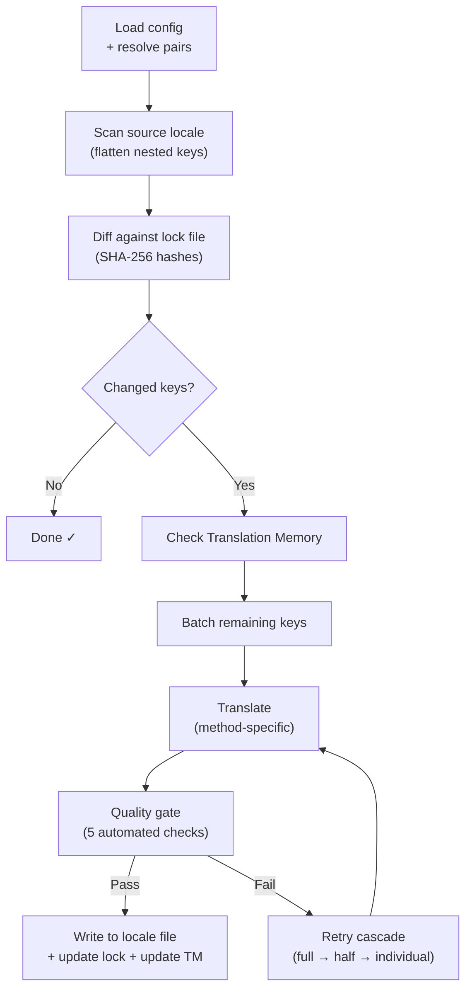

# Hoe i18n-rosetta werkt

i18n-rosetta vertaalt de locale-bestanden van uw applicatie met één commando. Hier leest u wat er onder de motorkap gebeurt.

## De pipeline

Wanneer u `npx i18n-rosetta sync` uitvoert, voert rosetta een pipeline van zes fasen uit:



**Belangrijkste ontwerpbeslissingen:**

- **Wijzigingsdetectie via SHA-256 hashes.** Rosetta volgt elke bronwaarde met een hash in `.i18n-rosetta.lock`. Wanneer u een Engelse string bijwerkt, wordt alleen die key opnieuw vertaald. Dit is de reden waarom `sync` snel is bij herhaalde uitvoeringen — het verricht minimaal werk.

- **Translation Memory caching.** Voordat er een API-aanroep wordt gedaan, controleert rosetta `.rosetta/tm.json` op in de cache opgeslagen vertalingen (gekoppeld aan brontekst + locale + methode). Bij een typische re-sync na het wijzigen van één key, komen 142 keys uit de cache en doet 1 key een beroep op de API.

- **Quality gate voor het wegschrijven.** Elke vertaling doorloopt vijf geautomatiseerde controles (leeg, bron-echo, hallucinatie-loop, lengte-inflatie, script-naleving) voordat deze uw bestanden raakt. Fouten worden gelogd en nooit stilzwijgend geaccepteerd.

- **Retry cascade bij fouten.** Als een batch mislukt (JSON parse-fout, API-timeout), probeert rosetta het opnieuw met steeds kleinere batches: volledig → helft → individueel. Dit isoleert de probleem-key zonder de rest te blokkeren.

## Vertaalmethoden

Rosetta ondersteunt vier vertaalmethoden, elk geschikt voor verschillende scenario's:

| Methode | Hoe het werkt | Het beste voor |
|--------|-------------|----------|
| **`llm`** | Gestructureerde prompt naar een willekeurig OpenRouter-model | Talen met veel beschikbare data |
| **`llm-coached`** | Zelfde prompt + grammaticaregels, woordenboek en stijlaanwijzingen | Talen waarbij LLM's voorspelbare fouten maken |
| **`google-translate`** | Google Cloud Translation API batchverzoek | Talen met veel beschikbare data en goede GT-ondersteuning |
| **`api`** | HTTP POST naar uw eigen endpoint | Aangepaste pipelines, door de community beheerde modellen |

Methoden worden per talenpaar geconfigureerd. U kunt `google-translate` gebruiken voor Frans, maar `llm-coached` voor Plains Cree — elk paar krijgt de methode die daarvoor het beste werkt.

## Coaching Data

Voor `llm-coached`-paren geeft coaching data het LLM expliciete taalkundige kennis: grammaticaregels, verplichte terminologie en stijlvoorkeuren. Dit wordt in elke prompt geïnjecteerd als gestructureerde context.

```json title="coaching/crk.json"
{
  "grammar_rules": ["Animate nouns take different plural forms than inanimate nouns"],
  "dictionary": {"welcome": "ᑕᓂᓯ", "settings": "ᐃᑕᐢᑌᐘᐃᓇ"},
  "style_notes": "Use Standard Roman Orthography (SRO) unless explicitly configured otherwise."
}
```

Coaching data is het primaire mechanisme om de vertaalkwaliteit te verbeteren zonder een model te fine-tunen. Wijzig de regels → voer sync opnieuw uit → kijk of het helpt. Iteratie is onmiddellijk.

## Plugins

Plugins zijn vooraf verpakte vertaalrecepten voor specifieke talenparen. Het zijn JSON-manifesten — geen code — die rosetta vertellen welke methode moet worden gebruikt, met welke instellingen en welke kwaliteit is gebenchmarkt.

```bash
i18n-rosetta plugin install ./crk-coached-v3/
i18n-rosetta sync   # uses the installed plugin for en→crk
```

Plugins overbruggen de kloof tussen onderzoek en productie: een methode die goed scoort in de [MT Eval Arena](https://mtevalarena.org) kan worden verpakt als een plugin en hier worden geïmplementeerd.

## Het grotere geheel

i18n-rosetta is de ene helft van een tweedelig ecosysteem:

- **[MT Eval Arena](https://mtevalarena.org)** — waar vertaalmethoden worden **ontwikkeld en bewezen** met reproduceerbare benchmarking
- **i18n-rosetta** — waar bewezen methoden worden **geïmplementeerd** om echte content te vertalen

De [Eval Harness Bridge](/docs/guides/bridge) verbindt de twee. Een methode die zichzelf bewijst in de Arena, wordt hier geïmplementeerd. Feedback van sprekers uit de productieomgeving verbetert de volgende versie.

---

## Verdieping

- [Hoe Sync werkt](/docs/concepts/how-sync-works) — gedetailleerde stapsgewijze doorloop van de pipeline
- [Quality Gate](/docs/concepts/quality-gate) — de vijf geautomatiseerde controles
- [Translation Memory](/docs/concepts/translation-memory) — caching en kostenbesparingen
- [Vertaalmethoden](/docs/guides/translation-methods) — gedetailleerde vergelijking van methoden
- [Architectuur](/docs/concepts/architecture) — overzicht van het systeemontwerp