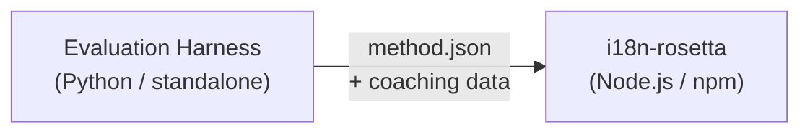

# Specificatie van de methode-plug-in

> **Versie**: 1.1  
> **Doelgroep**: Plug-in ontwikkelaars  
> **Kanoniek schema**: [`schemas/rosetta-plugin.schema.json`](https://github.com/gamedaysuits/i18n-rosetta/blob/main/schemas/rosetta-plugin.schema.json)

## Overzicht

i18n-rosetta maakt gebruik van een **inplugbaar methodesysteem**. Elk talenpaar kan een andere vertaalmethode gebruiken (LLM, gecoacht, script-converter, enz.). Methoden worden geregistreerd in `lib/translate.js` en per paar opgelost via `lib/pairs.js`.

De taak van de eval harness is om vertaalmethoden te **ontwikkelen, testen en exporteren**. De taak van i18n-rosetta is om deze te **consumeren en uit te voeren**. De harness draait nooit binnen rosetta.

### Gegevensstroom



---

## Formaat van de methode-plug-in

Een methode-plug-in is een enkel JSON-bestand (`method.json`) met optionele bestanden voor coachinggegevens.

### `method.json` — Vereist

```json
{
  "name": "french-formal-v1",
  "type": "llm-coached",
  "version": "1.0.0",
  "description": "Formally-tuned French with terminology enforcement and grammar coaching",
  "author": "Plugin Author",

  "config": {
    "model": "google/gemini-3.5-flash",
    "register": "formal",
    "batchSize": 80,
    "temperature": 0.2
  },

  "locales": ["fr"],

  "benchmarks": {
    "fr": {
      "date": "2026-05-11T00:00:00Z",
      "corpus_size": 500,
      "exact_match_rate": 0.42,
      "corpus_chrf": 72.3,
      "corpus_bleu": 45.1,
      "model": "google/gemini-3.5-flash",
      "harness_version": "1.0.0"
    }
  },

  "provenance": {
    "resources": [],
    "commercialReady": false,
    "flags": ["license-unclear"]
  },

  "coaching": {
    "dir": "coaching"
  }
}
```

### Veldreferentie

| Veld | Type | Vereist | Beschrijving |
|-------|------|----------|-------------|
| `name` | string | ✅ | Unieke methode-identificatie (kebab-case) |
| `type` | string | ✅ | Rosetta-methodetype: `llm`, `llm-coached`, `api`, `google-translate`, `deepl`, `microsoft-translator`, `libretranslate`, `openai`, `anthropic`, `gemini` |
| `version` | string | ✅ | Semver-versie (bijv. `1.0.0`) |
| `locales` | string[] | ✅ | Op welke locale-codes deze methode is gericht (minimaal 1) |
| `description` | string | — | Voor mensen leesbare beschrijving |
| `author` | string | — | Wie deze methode heeft ontwikkeld/getest |
| `config.model` | string | — | OpenRouter model-identificatie |
| `config.register` | string | — | Register/toon van de doeltaal |
| `config.batchSize` | number | — | Sleutels per API-batch (1–200, standaard: 80) |
| `config.temperature` | number | — | LLM-temperatuur (0.0–2.0, standaard: 0.3) |
| `benchmarks` | object | — | Benchmarkresultaten per locale |
| `provenance` | object | — | Licenties en bronafhankelijkheden |
| `coaching.dir` | string | — | Relatief pad naar de map met coachinggegevens |

### Benchmark-object (per locale)

| Veld | Type | Vereist | Beschrijving |
|-------|------|----------|-------------|
| `date` | string | ✅ | ISO 8601-tijdstempel van de benchmarkuitvoering |
| `corpus_size` | number | ✅ | Aantal geëvalueerde invoeren |
| `exact_match_rate` | number | ✅ | 0.0–1.0, verhouding van exacte overeenkomsten |
| `corpus_chrf` | number | — | chrF++ score (0–100) |
| `corpus_bleu` | number | — | BLEU score (0–100) |
| `model` | string | ✅ | Model gebruikt tijdens de evaluatie |
| `harness_version` | string | ✅ | Versie van de gebruikte evaluatie-harness |

:::info Welke metrieken worden weergegeven?
De opdracht `rosetta status` geeft **chrF++** en de **exacte overeenkomstverhouding** (exact match rate) uit het benchmarkblok weer. `corpus_bleu` wordt geaccepteerd in het manifest, maar wordt momenteel niet weergegeven of gebruikt door enige rosetta-opdracht. Het [Methode-klassement](/leaderboard) houdt chrF++, exacte overeenkomsten en de FST-acceptatiegraad bij.
:::

---

### Herkomst-object

Het herkomstblok communiceert de licentiestatus van de gebundelde bronnen van de plug-in.

| Veld | Type | Standaard | Beschrijving |
|-------|------|---------|-------------|
| `resources` | object[] | `[]` | Lijst van gebundelde bronnen met `name`, `license` en `type` |
| `commercialReady` | boolean | `false` | Of de plug-in is vrijgegeven voor commerciële distributie |
| `flags` | string[] | `["license-unclear"]` | Machineleesbare statusvlaggen |

**Standaardstatus** — geëxporteerde plug-ins worden geleverd met `commercialReady: false` en `flags: ["license-unclear"]`.

**Vrijgegeven status** — wanneer de licentieverlening is geverifieerd: stel `commercialReady: true` in en wis de vlaggen.

---

## Formaat van coachinggegevens

Als `type` `llm-coached` is, dient de plug-in bestanden met coachinggegevens in de submap `coaching/` op te nemen.

### `coaching/<locale>.json`

```json
{
  "grammar_rules": [
    "French adjectives agree in gender and number with the noun they modify",
    "Use 'vous' for formal contexts, 'tu' for informal"
  ],
  "dictionary": {
    "dashboard": "tableau de bord",
    "deployment": "déploiement",
    "settings": "paramètres"
  },
  "style_notes": "Prefer active voice. Avoid anglicisms where a native French term exists."
}
```

| Veld | Type | Vereist | Beschrijving |
|-------|------|----------|-------------|
| `grammar_rules` | string[] | — | Regels die in elke LLM-prompt voor deze locale worden geïnjecteerd |
| `dictionary` | object | — | Term → vertaling-mapping. Overeenkomende termen worden geïnjecteerd als vereiste terminologie. |
| `style_notes` | string | — | Vrije stijlinstructies die aan de prompt worden toegevoegd |

---

## Mapstructuur

```
french-formal-v1/
  method.json                 # Method manifest with benchmarks
  coaching/
    fr.json                   # Coaching data for French
```

Voor multi-locale methoden:

```
european-formal-v2/
  method.json                 # locales: ["fr", "de", "es", "it"]
  coaching/
    fr.json
    de.json
    es.json
    it.json
```

---

## Hoe Rosetta plug-ins consumeert

### Installatie

```bash
i18n-rosetta plugin install ./french-formal-v1/
```

Slaat op in `.rosetta/methods/french-formal-v1/`.

### Configuratie

```json title="i18n-rosetta.config.json"
{
  "pairs": {
    "en:fr": {
      "methodPlugin": "french-formal-v1"
    }
  }
}
```

:::info Samenvoegsemantiek
De plug-in definieert *welke* methode moet worden gebruikt (`type`). De paarconfiguratie stemt af *hoe* deze moet worden uitgevoerd (`model`, `register`, `batchSize`). Als het paar `model` instelt, overschrijft dit de standaardwaarde van de plug-in.
:::

### Runtime

1. Rosetta leest `method.json` uit `.rosetta/methods/french-formal-v1/`
2. Het veld `type` van de plug-in stelt de vertaalmethode in (bijv. `llm-coached`)
3. Laadt coachinggegevens uit de map `coaching/` van de plug-in
4. Gebruikt het blok `config` om hiaten in model/register/temperatuur op te vullen
5. Het blok `benchmarks` wordt weergegeven in de uitvoer van `rosetta status`
6. Het blok `provenance` wordt door `rosetta provenance` gecontroleerd op licentievlaggen

---

## Schemavalidatie

Plug-in manifesten worden tijdens de installatie gevalideerd tegen [`schemas/rosetta-plugin.schema.json`](https://github.com/gamedaysuits/i18n-rosetta/blob/main/schemas/rosetta-plugin.schema.json).

Verwijs naar het schema in uw `method.json` voor IDE-autocompletie:

```json
{
  "$schema": "./node_modules/i18n-rosetta/schemas/rosetta-plugin.schema.json",
  "name": "my-method-v1"
}
```

---

## Wat NIET op te nemen

- ❌ Geen Python-code of harness-afhankelijkheden
- ❌ Geen ruwe corpusgegevens of uitvoeringslogboeken
- ❌ Geen API-sleutels of inloggegevens
- ❌ Geen harness-configuratie
- ❌ Geen interne prompt-sjablonen (deze bevinden zich in de methode-implementaties van rosetta)

De plug-in bevat **alleen gegevens**: configuratie, coachinginhoud en benchmarkresultaten.

---

## Zie ook

- [Vertaalmethoden](/docs/guides/translation-methods) — hoe elke ingebouwde methode werkt
- [Configuratie](/docs/getting-started/configuration) — configuratie per paar en per taal
- [Een methode serveren via API](/docs/guides/serving-a-method) — methoden hosten als HTTP-services
- [Kookboek: FST-Gated Pipeline](https://mtevalarena.org/docs/tutorials/fst-gated-pipeline) — een pijplijn bouwen en verpakken
- [MT-evaluatie](https://mtevalarena.org/docs/leaderboard/rules) — methoden benchmarken voor indiening bij het klassement
- [Een taal met weinig middelen ondersteunen](https://mtevalarena.org/docs/community/low-resource-languages) — de use case voor community-plug-ins