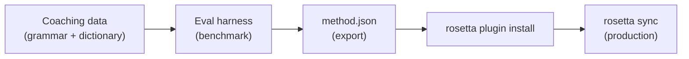

# Tutorial: Een Translation Plugin bouwen

Bouw een aangepaste vertaalmethode vanaf nul op, benchmark deze en implementeer deze als een rosetta-plugin. Dit is de volledige workflow voor het toevoegen van een nieuw talenpaar dat door geen enkele standaard API wordt ondersteund.

**Wat u gaat bouwen:** Een coached translation plugin voor formeel Frans met afgedwongen terminologie, grammaticaregels en benchmarkscores.

**Tijd:** 30–45 minuten

**Vereisten:**
- i18n-rosetta geïnstalleerd (`npm install --save-dev i18n-rosetta`)
- Een OpenRouter API-sleutel (`OPENROUTER_API_KEY`)
- Python 3.10+ (voor de eval harness)

---

## Stap 1: Het probleem identificeren

U vertaalt een SaaS-dashboard naar het Frans. De standaard `llm` methode produceert correcte, maar inconsistente vertalingen:

- Soms wordt "dashboard" vertaald als "tableau de bord", andere keren als "panneau de contrôle"
- De toon wisselt tussen de `tu` en `vous` vormen
- Technische termen worden op inconsistente wijze verengelst

U heeft **afgedwongen terminologie** en **registercontrole** nodig die de generieke LLM-prompt niet biedt.

## Stap 2: Coaching Data aanmaken

Maak een coaching-bestand aan dat uw taalkundige vereisten codeert:

```bash
mkdir -p .rosetta/coaching
```

```json title=".rosetta/coaching/fr.json"
{
  "grammar_rules": [
    "Always use the 'vous' form for formal register",
    "French adjectives agree in gender and number with their noun",
    "Use the present tense for UI instructions, not the imperative",
    "Preserve sentence-final punctuation style from the source"
  ],
  "dictionary": {
    "dashboard": "tableau de bord",
    "deployment": "déploiement",
    "settings": "paramètres",
    "environment variable": "variable d'environnement",
    "webhook": "webhook",
    "API key": "clé API",
    "sign in": "se connecter",
    "sign out": "se déconnecter",
    "repository": "dépôt",
    "pull request": "demande de tirage"
  },
  "style_notes": "Formal technical French. Prefer native French terms over anglicisms where established equivalents exist. Keep UI labels concise — 3 words maximum where possible."
}
```

**Wat elk veld doet:**
- **`grammar_rules`** — Wordt in de LLM-systeemprompt geïnjecteerd als expliciete beperkingen
- **`dictionary`** — Wordt vergeleken met bronsleutels; wanneer een woordenboekterm verschijnt, wordt deze als "vereiste terminologie" in de prompt geïnjecteerd
- **`style_notes`** — Wordt aan de systeemprompt toegevoegd als algemene stijlgids

## Stap 3: Het paar configureren

Geef rosetta de opdracht om `llm-coached` te gebruiken voor het Frans:

```json title="i18n-rosetta.config.json"
{
  "version": 3,
  "inputLocale": "en",
  "localesDir": "./locales",
  "pairs": {
    "en:fr": {
      "method": "llm-coached",
      "model": "google/gemini-3.5-flash"
    }
  },
  "languages": {
    "fr": {
      "register": "Formal technical French (vous-form)",
      "name": "French"
    }
  }
}
```

## Stap 4: Testen

```bash
npx i18n-rosetta sync --dry
```

Controleer de uitvoer van de dry-run. Ga na of:
- ✅ Woordenboektermen consistent worden gebruikt ("tableau de bord", niet "panneau de contrôle")
- ✅ De `vous` vorm overal wordt gebruikt
- ✅ Technische termen overeenkomen met uw woordenboek

Voer vervolgens de daadwerkelijke synchronisatie uit:

```bash
npx i18n-rosetta sync
```

## Stap 5: Benchmarken met de Eval Harness (Optioneel)

Als u kwaliteitsscores wilt — en dat wilt u, want plugins worden geleverd met benchmarkgegevens — gebruik dan de bijbehorende eval harness.

### De Harness installeren

```bash
git clone https://github.com/gamedaysuits/gds-mt-eval-harness.git
cd gds-mt-eval-harness
pip install -r requirements.txt
```

### Een referentiecorpus aanmaken

Maak een bestand aan met bronstrings en bewezen goede vertalingen:

```json title="corpus/french-formal.json"
[
  {
    "source": "Dashboard",
    "reference": "Tableau de bord"
  },
  {
    "source": "Sign in to your account",
    "reference": "Connectez-vous à votre compte"
  },
  {
    "source": "Your deployment is ready",
    "reference": "Votre déploiement est prêt"
  },
  {
    "source": "Environment variables",
    "reference": "Variables d'environnement"
  }
]
```

### De benchmark uitvoeren

```bash
python harness.py eval \
  --corpus corpus/french-formal.json \
  --source en \
  --target fr \
  --method llm-coached \
  --model google/gemini-3.5-flash
```

De harness levert de volgende uitvoer:
- **chrF++** — F-score op karakterniveau (0–100). Boven de 70 is sterk.
- **BLEU** — N-gram overlap (0–100). Boven de 40 is solide voor coached translation.
- **Exact match rate** — Het percentage vertalingen dat exact overeenkomt met de referentie.

### De plugin exporteren

Zodra u tevreden bent met de scores:

```bash
python harness.py export \
  --name french-formal-v1 \
  --output ./french-formal-v1/
```

Dit creëert:

```
french-formal-v1/
├── method.json          # Manifest with config + benchmarks
└── coaching/
    └── fr.json          # Your coaching data
```

## Stap 6: De plugin installeren in Rosetta

```bash
npx i18n-rosetta plugin install ./french-formal-v1/
```

Dit kopieert de plugin naar `.rosetta/methods/french-formal-v1/`.

Werk uw configuratie bij om deze te gebruiken:

```json title="i18n-rosetta.config.json"
{
  "pairs": {
    "en:fr": {
      "methodPlugin": "french-formal-v1"
    }
  }
}
```

## Stap 7: Verifiëren

```bash
# Check plugin is installed and shows benchmark scores
npx i18n-rosetta status

# Run a sync with the plugin
npx i18n-rosetta sync

# Audit licensing status
npx i18n-rosetta provenance
```

De `status` uitvoer zal het volgende tonen:

```
en → fr
  Method:    french-formal-v1 (llm-coached)
  Model:     google/gemini-3.5-flash
  Quality:   high
  chrF++:    74.2
  BLEU:      46.8
  Exact:     42%
```

## Wat u heeft gebouwd



U heeft nu:
1. **Coaching data** — Grammaticaregels en terminologie die consistentie afdwingen
2. **Benchmarkscores** — Gekwantificeerde kwaliteit die met de plugin wordt meegeleverd
3. **Een draagbare plugin** — `method.json` + coaching data, installeerbaar op elke machine
4. **Productie-implementatie** — Geïntegreerd in uw synchronisatie-pipeline

## Volgende stappen

- **[Plugin-specificatie](/docs/reference/plugin-spec)** — Volledige referentie van het manifestformaat
- **[Vertaalmethoden](/docs/guides/translation-methods)** — Vergelijk alle vier de methoden
- **[Low-Resource Talen](/docs/guides/low-resource-languages)** — Pas dit patroon toe op talen zonder API-dekking
- **[30 Talen Vertalen](/docs/tutorials/translate-30-languages)** — Schaal uw project voor een wereldwijd publiek