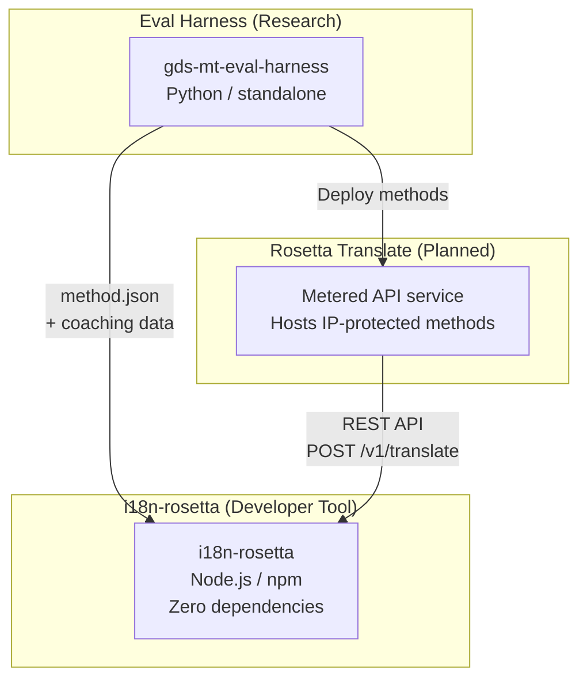
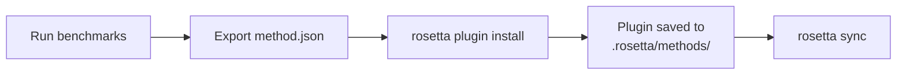
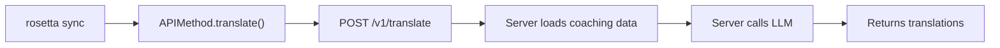

# Arquitetura

O ecossistema de tradução Rosetta consiste em três ferramentas independentes que trabalham juntas por meio de contratos bem definidos. Nenhuma delas depende das outras em tempo de compilação. Elas se comunicam por meio de um **formato de plugin de método** compartilhado e um **contrato de API REST**.

## Os Três Componentes



### i18n-rosetta (este projeto)

A ferramenta de desenvolvimento de código aberto. Traduz arquivos de localidade usando métodos conectáveis. Zero dependências, configuração opcional, funciona pronto para uso.

**Métodos integrados:**
- `llm` → OpenRouter / qualquer LLM
- `llm-coached` → LLM + orientação (coaching) de gramática/dicionário
- `google-translate` → Google Cloud Translation API
- `api` → Conexão leve (thin pipe) para qualquer API remota

### Eval Harness (projeto complementar)

Uma ferramenta de pesquisa para desenvolver, testar e avaliar (benchmarking) métodos de tradução. Quando um método atinge uma qualidade aceitável, o harness exporta um **plugin de método** — um manifesto `method.json` e arquivos opcionais de dados de orientação.

O harness nunca é executado dentro do rosetta. É uma ferramenta separada que produz saídas estáticas (arquivos JSON). O Rosetta apenas lê esses arquivos.

[→ Eval Harness no GitHub](https://github.com/gamedaysuits/gds-mt-eval-harness)

### Rosetta Translate (planejado)

Um serviço de API tarifado por uso que hospeda métodos de tradução proprietários no lado do servidor — os prompts, os dados de orientação e os pipelines linguísticos nunca saem do servidor.

## Como Eles se Conectam

### Eval Harness → i18n-rosetta (exportação unidirecional)



**Contrato**: [Especificação do Plugin](/docs/reference/plugin-spec)

### Rosetta Translate → i18n-rosetta (API em tempo de execução)



O `APIMethod` do Rosetta é um **canal passivo** (dumb pipe). Ele envia chaves e recebe traduções de volta. Não contém nenhuma lógica de tradução e nenhum conteúdo proprietário.

## O Que Cada Componente Sabe Sobre os Outros

| Ferramenta | Sabe sobre o rosetta? | Sabe sobre o Rosetta Translate? | Sabe sobre o harness? |
|------|---------------------|-------------------------------|---------------------|
| **i18n-rosetta** | *(é o rosetta)* | Sim — o método `api` o chama | Não — apenas lê as exportações de plugins |
| **Rosetta Translate** | Sim — atende às suas requisições | *(é o Rosetta Translate)* | Não — recebe métodos implantados |
| **Eval Harness** | Sim — exporta o formato de plugin | Não — métodos implantados separadamente | *(é o harness)* |

## Cenários de Uso

### Cenário 1: Gratuito, zero configuração (maioria das pessoas usuárias)

```bash
export OPENROUTER_API_KEY=sk-...
npx i18n-rosetta sync
```

Usa o método integrado `llm`. Sem plugins, sem Rosetta Translate, sem harness.

### Cenário 2: Linha de base do Google Translate

```bash
export GOOGLE_TRANSLATE_API_KEY=AIza...
npx i18n-rosetta sync
```

Usa o método integrado `google-translate`. Não são necessários plugins.

### Cenário 3: Plugin aberto com orientação incluída

```bash
rosetta plugin install ./french-formal-v1/
rosetta sync
```

O plugin possui `type: "llm-coached"` → o rosetta usa a própria chave do OpenRouter da pessoa usuária. Os dados de orientação são locais (sem chamada ao servidor).

### Cenário 4: Orientação DIY (sem plugin, sem harness)

```json title="i18n-rosetta.config.json"
{
  "pairs": {
    "en:fr": { "method": "llm-coached" }
  }
}
```

A pessoa usuária mantém suas próprias regras gramaticais e dicionário em `.rosetta/coaching/fr.json`.

## Princípios de Design

1. **Sem dependências circulares.** As pontes são unidirecionais.
2. **O Rosetta é o núcleo leve.** Zero dependências, configuração opcional. Plugins e API são aditivos.
3. **A proteção de Propriedade Intelectual é arquitetural.** As técnicas proprietárias permanecem no lado do servidor. O pacote npm não envia nada proprietário.
4. **O formato do plugin é o contrato.** Tudo flui através de `method.json`.
5. **Cada ferramenta tem uma função.** Harness → desenvolver métodos. Rosetta Translate → hospedar métodos. Rosetta → traduzir arquivos.