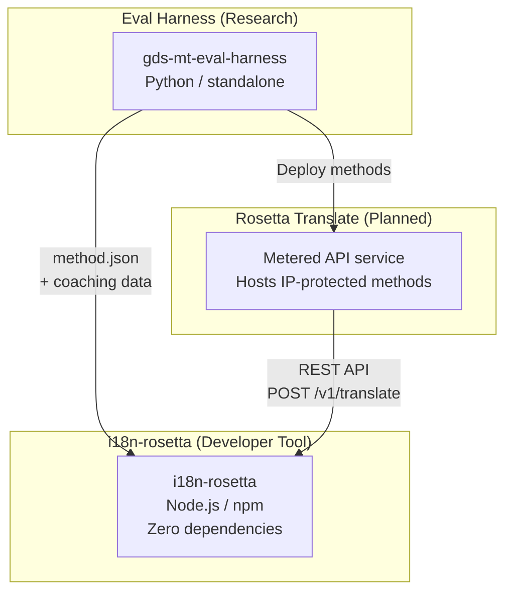
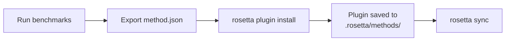
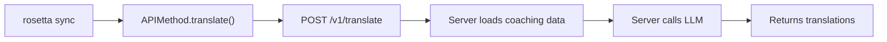

# Arquitetura

O ecossistema de tradução Rosetta é composto por três ferramentas independentes que trabalham juntas por meio de contratos bem definidos. Nenhuma delas depende das outras em tempo de compilação. Elas se comunicam através de um **formato de plugin de método** compartilhado e um **contrato de API REST**.

## Os Três Componentes



### i18n-rosetta (este projeto)

A ferramenta open-source para desenvolvedores. Traduz arquivos de localização usando métodos conectáveis. Zero dependências, configuração opcional, pronta para uso.

**Métodos nativos:**
- `llm` → OpenRouter / qualquer LLM (mais de 200 modelos)
- `llm-coached` → LLM + dados de orientação de gramática/dicionário
- `openai` → OpenAI API direta (GPT-4o, GPT-4o-mini)
- `anthropic` → Anthropic API direta (Claude Sonnet, Haiku, Opus)
- `gemini` → Google Gemini API direta (Flash, Pro — nível gratuito disponível)
- `google-translate` → Google Cloud Translation API v2
- `deepl` → DeepL API com suporte a glossário
- `microsoft-translator` → Azure Cognitive Services Translator
- `libretranslate` → LibreTranslate auto-hospedado (AGPL, gratuito)
- `api` → Conexão simples para qualquer endpoint REST remoto

### Eval Harness (projeto complementar)

Uma ferramenta de pesquisa para desenvolver, testar e realizar benchmarking de métodos de tradução. Quando um método atinge uma qualidade aceitável, o harness exporta um **plugin de método** — um manifesto `method.json` e arquivos opcionais de dados de orientação.

O harness nunca é executado dentro do rosetta. É uma ferramenta separada que produz saídas estáticas (arquivos JSON). O Rosetta apenas lê esses arquivos.

[→ Eval Harness no GitHub](https://github.com/gamedaysuits/gds-mt-eval-harness)

### Rosetta Translate (planejado)

Um serviço de API tarifado por uso que hospeda métodos de tradução proprietários no lado do servidor — os prompts, dados de orientação e pipelines linguísticos nunca saem do servidor.

## Como Eles se Conectam

### Eval Harness → i18n-rosetta (exportação unidirecional)



**Contrato**: [Especificação do Plugin](/docs/reference/plugin-spec)

### Rosetta Translate → i18n-rosetta (API em tempo de execução)



O `APIMethod` do Rosetta é um **canal simples** (dumb pipe). Ele envia chaves e recebe traduções de volta. Não contém nenhuma lógica de tradução e nenhum conteúdo proprietário.

## O Que Cada Componente Sabe Sobre os Outros

| Ferramenta | Sabe sobre o rosetta? | Sabe sobre o Rosetta Translate? | Sabe sobre o harness? |
|------|---------------------|-------------------------------|---------------------|
| **i18n-rosetta** | *(é o rosetta)* | Sim — o método `api` o chama | Não — apenas lê as exportações de plugins |
| **Rosetta Translate** | Sim — atende às suas requisições | *(é o Rosetta Translate)* | Não — recebe métodos implantados |
| **Eval Harness** | Sim — exporta o formato de plugin | Não — os métodos são implantados separadamente | *(é o harness)* |

## Cenários de Uso

### Cenário 1: Gratuito, sem configuração (maioria dos usuários)

```bash
export OPENROUTER_API_KEY=sk-...
npx i18n-rosetta sync
```

Usa o método nativo `llm`. Sem plugins, sem Rosetta Translate, sem harness.

### Cenário 2: Linha de base do Google Translate

```bash
export GOOGLE_TRANSLATE_API_KEY=AIza...
npx i18n-rosetta sync
```

Usa o método nativo `google-translate`. Não precisa de plugins.

### Cenário 3: Plugin aberto com orientação embutida

```bash
rosetta plugin install ./french-formal-v1/
rosetta sync
```

O plugin possui `type: "llm-coached"` → o rosetta usa a própria chave do OpenRouter do usuário. Os dados de orientação são locais (sem chamada ao servidor).

### Cenário 4: Orientação DIY (faça você mesmo) (sem plugin, sem harness)

```json title="i18n-rosetta.config.json"
{
  "pairs": {
    "en:fr": { "method": "llm-coached" }
  }
}
```

O usuário mantém suas próprias regras gramaticais e dicionário em `.rosetta/coaching/fr.json`.

## Princípios de Design

1. **Sem dependências circulares.** As pontes são unidirecionais.
2. **O Rosetta é o núcleo leve.** Zero dependências, configuração opcional. Plugins e API são aditivos.
3. **A proteção de IP é arquitetural.** Técnicas proprietárias permanecem no lado do servidor. O pacote npm não envia nada proprietário.
4. **O formato do plugin é o contrato.** Tudo flui através de `method.json`.
5. **Cada ferramenta tem uma função.** Harness → desenvolver métodos. Rosetta Translate → hospedar métodos. Rosetta → traduzir arquivos.

---

## Veja Também

- [Métodos de Tradução](/docs/guides/translation-methods) — como cada método nativo funciona
- [Especificação do Plugin](/docs/reference/plugin-spec) — o formato do manifesto method.json
- [Eval Harness](/docs/eval/harness) — a ferramenta de pesquisa complementar
- [Servindo um Método via API](/docs/guides/serving-a-method) — hospedando pipelines de tradução personalizados
- [Suporte a um Idioma com Poucos Recursos](/docs/guides/low-resource-languages) — o caso de uso que impulsionou esta arquitetura