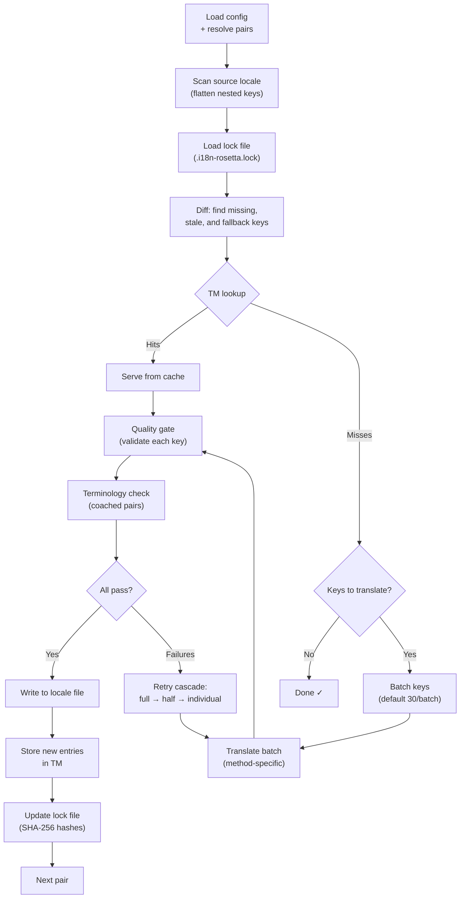

# Como o Sync Funciona

O comando `sync` é a operação principal do rosetta. Aqui está o que acontece quando você executa `npx i18n-rosetta sync`.

## Visão Geral do Pipeline



## Passo a Passo

### 1. Resolução de Configuração

O rosetta carrega `i18n-rosetta.config.json` (ou detecta as configurações automaticamente). Ele resolve:
- Locale de origem e locales de destino
- O grafo de pares (quais combinações origem→destino processar)
- Configurações de método, modelo e qualidade por par

### 2. Varredura da Origem

O arquivo de locale de origem é carregado e planificado (flattened) em um mapa chave→valor:

```json
// Input (nested)
{ "hero": { "title": "Welcome", "subtitle": "Build" } }

// Flattened
{ "hero.title": "Welcome", "hero.subtitle": "Build" }
```

### 3. Detecção de Alterações

O rosetta lê `.i18n-rosetta.lock`, que armazena hashes SHA-256 dos valores de origem traduzidos anteriormente. Para cada chave, ele verifica:

| Condição | Ação |
|-----------|--------|
| Chave ausente no destino | **Traduzir** |
| Hash de origem alterado desde o último sync | **Retraduzir** (desatualizado) |
| Valor de destino começa com `[EN]` | **Retraduzir** (placeholder de fallback) |
| Hash de origem inalterado, chave existe | **Ignorar** |

É por isso que o rosetta traduz apenas o que mudou — ele não retraduz seu arquivo inteiro a cada sync.

### 4. Agrupamento em Lotes (Batching)

As chaves são agrupadas em lotes (padrão: 30 chaves/lote para LLM, 128 para Google Translate). O agrupamento em lotes reduz as idas e vindas da API enquanto mantém os prompts gerenciáveis.

### 4b. Memória de Tradução

Antes do agrupamento em lotes, o rosetta verifica o cache da Memória de Tradução (`.rosetta/tm.json`). Chaves cujo texto de origem + locale + método correspondem a uma tradução anterior são servidas instantaneamente do cache — nenhuma chamada de API é necessária.

```
  [TM] 142 key(s) served from cache
  Translating 3 key(s) to French (llm)... [OK]
```

A Memória de Tradução (TM) é o principal mecanismo de economia de custos. Executar o sync novamente após a alteração de uma única chave traduz apenas essa chave, não o arquivo inteiro. Veja [Translation Memory](/docs/concepts/translation-memory) para mais detalhes.

Para ignorar o cache em uma única execução: `i18n-rosetta sync --no-tm`

### 5. Tradução

Cada lote é enviado para o método de tradução configurado:

- **`llm`**: Prompt estruturado para o OpenRouter com instruções de registro e orientação de gênero
- **`llm-coached`**: O mesmo, mas com regras gramaticais, dicionário e notas de estilo injetados
- **`google-translate`**: Requisição em lote para a Google Cloud Translation API v2
- **`api`**: HTTP POST para um endpoint remoto

A mensagem do sistema (registro, orientação de gênero, regras) é idêntica em todos os lotes para um determinado locale, permitindo o **prompt caching** — provedores como Anthropic e Google fazem cache de mensagens de sistema repetidas, reduzindo os custos de tokens.

### 6. Quality Gate

Toda tradução é validada antes de ser gravada no disco. Cinco verificações são executadas:

| Verificação | O que ela detecta | Exemplo |
|-------|----------------|---------|
| **Vazio/em branco** | O modelo não retornou nada | `""` |
| **Eco da origem** | O modelo retornou a entrada em inglês | `"Welcome"` para japonês |
| **Loop de alucinação** | Trigramas repetidos | `"Qo' Qo' Qo' Qo'"` |
| **Inflação de tamanho** | A saída é 4×+ maior que a origem | Origem de 10 caracteres → saída de 50 caracteres |
| **Conformidade de sistema de escrita** | Script (alfabeto) errado para o locale | Texto latino para locale em árabe |

As falhas são registradas com um prefixo `[GATE]`. Não há fallbacks silenciosos.

Veja [Quality Gate](/docs/concepts/quality-gate) para mais detalhes.

### 6b. Verificação de Terminologia

Para pares com coaching (coached) que possuem um dicionário, o rosetta verifica se o LLM realmente usou a terminologia exigida após a tradução. As violações são registradas como avisos `[TERM]`:

```
[TERM] en→fr: 2 term violation(s)
  • "dashboard" → expected "tableau de bord" but got "panneau"
```

Estes são avisos, não erros de bloqueio — a tradução ainda é gravada.

### 7. Cascata de Novas Tentativas (Retry)

Em caso de falha no parse do JSON ou erros no nível do lote, o rosetta tenta novamente com lotes progressivamente menores:

```
Full batch (30 keys) → Failed
Half batch (15 keys) → Failed
Individual keys (1 each) → Isolates the problem key
```

O orçamento de novas tentativas é limitado por `maxRetries` (padrão: 3) para evitar gastos descontrolados com tokens.

### 8. Gravação e Lock

As traduções aprovadas são gravadas no arquivo de locale de destino, preservando a estrutura de aninhamento original. O arquivo de lock é atualizado com os novos hashes SHA-256.

## Tradução de Conteúdo (Fase 2)

Para projetos Docusaurus e Hugo, `sync` executa uma segunda fase após a tradução das chaves JSON. Esta fase traduz arquivos Markdown e MDX (documentações, posts de blog, tutoriais) usando os mesmos métodos e quality gate.

### Como funciona

1. O rosetta descobre todos os arquivos de conteúdo de origem (`.md`, `.mdx`) percorrendo o diretório content/docs
2. Para cada par arquivo × locale, ele verifica um arquivo de lock de conteúdo separado (`.i18n-rosetta-content.lock`) em busca de alterações no hash SHA-256
3. Arquivos alterados ou ausentes são coletados em um pool plano de itens de trabalho
4. O pool é processado com **simultaneidade paralela** (padrão: 12 chamadas de API simultâneas)

```
Phase 2: content (79 translations to process, 341 skipped, concurrency: 12)

    [1/79] (1%)  docs/concepts/security.md → ja [RE-TRANSLATE] (~3328s left)
    [2/79] (3%)  docs/concepts/security.md → th [RE-TRANSLATE] (~1821s left)
    ...
    [79/79] (100%) blog/v3-2-quality.md → de [OK]

  [OK] Created 79 content file(s), 341 unchanged
```

### Paralelismo de pool plano

Diferente da Fase 1 (chaves JSON, sequencial por locale), a Fase 2 processa todas as combinações arquivo×locale como uma lista plana. Isso significa que arquivos diferentes e locales diferentes são traduzidos simultaneamente:

- `docs/configuration.md → fr` e `docs/cli.md → ja` são executados ao mesmo tempo
- Um corpus de 420 traduções é concluído em ~11 minutos com simultaneidade 12
- Gravações incrementais no manifesto a cada 10 conclusões evitam a perda de progresso se o processo for interrompido

Controle o paralelismo com `--concurrency` ou o campo de configuração `concurrency`:

```bash
# Faster (more parallel calls, higher API load)
npx i18n-rosetta sync --concurrency 20

# Slower (gentler on rate limits)
npx i18n-rosetta sync --concurrency 4
```

### Proteção de conteúdo

Durante a tradução, o rosetta protege o conteúdo não traduzível:

- **Blocos de código** (code blocks cercados e recuados) são substituídos por placeholders
- Campos de **frontmatter** que não estão na lista `translatableFields` são preservados como estão
- **Links**, caminhos de imagens e tags HTML são protegidos
- **Shortcodes** e variáveis de interpolação (ex., `{count}`, `{{.Params.title}}`) são protegidos

Após a tradução, todos os placeholders são restaurados e validados. Se algum estiver ausente ou corrompido, a tradução é rejeitada e tentada novamente.

## Sucesso Parcial

Um lote que falhou não bloqueia o restante. Se 9 de 10 lotes forem bem-sucedidos, esses 9 serão gravados. O lote que falhou é registrado no log, e você pode executar `sync` novamente para tentar de novo.

## Dry Run

Visualize o que mudaria sem gravar nenhum arquivo:

```bash
npx i18n-rosetta sync --dry-run
```

## Forçar Retradução

Force a retradução de chaves específicas mesmo que não tenham sido alteradas:

```bash
npx i18n-rosetta sync --force-keys "hero.title,nav.about"
```

## Estimativa de Custos

Antes de traduzir, o rosetta gera um **relatório de custos pré-sync** mostrando os custos estimados por par. Isso é executado automaticamente durante cada `sync` — você o vê antes que qualquer chamada de API seja feita.

```
╔══════════════════════════════════════════════════════════╗
║  Cost Estimate                                          ║
╠════════════╦═══════╦════════════╦════════════════════════╣
║ Pair       ║ Keys  ║ Est. Cost  ║ Method                 ║
╠════════════╬═══════╬════════════╬════════════════════════╣
║ en → fr    ║   142 ║ $0.07      ║ google-translate       ║
║ en → ja    ║    38 ║   —        ║ llm (model-dependent)  ║
║ en → crk   ║    38 ║   —        ║ llm-coached            ║
╚════════════╩═══════╩════════════╩════════════════════════╝
```

### O Que é Estimado

Cada método de tradução fornece sua própria estimativa de custo:

| Método | Base de Custo | Precisão |
|--------|-----------|-----------|
| `google-translate` | Taxa publicada pelo Google (US$ 20/milhão de caracteres) | Precisa |
| `llm` | Varia de acordo com o modelo do OpenRouter | Depende do modelo — verifique os [preços do OpenRouter](https://openrouter.ai/models) |
| `llm-coached` | O mesmo que `llm` mais tokens de contexto de coaching | Depende do modelo |
| `api` | Determinado pelo servidor | Desconhecida — não é possível estimar sem consultar o endpoint |

Quando um método não consegue determinar o custo (métodos LLM, APIs remotas), o rosetta relata `—` em vez de adivinhar. Use `--dry` para ver as estimativas de custo sem realmente traduzir.

---

## Veja Também

- [Referência da CLI — sync](/docs/reference/cli#sync) — flags e opções de comando
- [Translation Memory](/docs/concepts/translation-memory) — cache e economia de custos
- [Quality Gate](/docs/concepts/quality-gate) — como as traduções são validadas
- [Métodos de Tradução](/docs/guides/translation-methods) — como cada método funciona
- [Trabalhando com Tradutores Profissionais](/docs/guides/professional-translators) — fluxo de trabalho XLIFF
- [Configuração](/docs/getting-started/configuration) — referência de configuração
- [Guia de CI/CD](/docs/guides/ci-cd) — automatizando syncs no seu pipeline