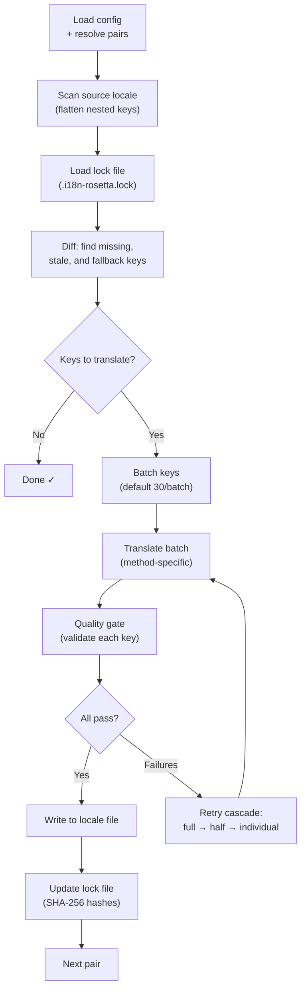

# Como a Sincronização Funciona

O comando `sync` é a operação principal do rosetta. Aqui está o que acontece quando você executa `npx i18n-rosetta sync`.

## Visão Geral do Pipeline



## Passo a Passo

### 1. Resolução de Configuração

O rosetta carrega o `i18n-rosetta.config.json` (ou detecta as configurações automaticamente). Ele resolve:
- Localidade de origem e localidades de destino
- O grafo de pares (quais combinações origem→destino processar)
- Configurações de método, modelo e qualidade por par

### 2. Varredura da Origem

O arquivo de localidade de origem é carregado e planificado em um mapa chave→valor:

```json
// Input (nested)
{ "hero": { "title": "Welcome", "subtitle": "Build" } }

// Flattened
{ "hero.title": "Welcome", "hero.subtitle": "Build" }
```

### 3. Detecção de Alterações

O rosetta lê o `.i18n-rosetta.lock`, que armazena os hashes SHA-256 dos valores de origem traduzidos anteriormente. Para cada chave, ele verifica:

| Condição | Ação |
|-----------|--------|
| Chave ausente no destino | **Traduzir** |
| Hash de origem alterado desde a última sincronização | **Retraduzir** (desatualizado) |
| Valor de destino começa com `[EN]` | **Retraduzir** (placeholder de fallback) |
| Hash de origem inalterado, chave existe | **Ignorar** |

É por isso que o rosetta traduz apenas o que foi alterado — ele não retraduz o arquivo inteiro a cada sincronização.

### 4. Agrupamento em Lotes

As chaves são agrupadas em lotes (padrão: 30 chaves/lote para LLM, 128 para o Google Translate). O agrupamento em lotes reduz as idas e vindas da API, mantendo os prompts gerenciáveis.

### 5. Tradução

Cada lote é enviado para o método de tradução configurado:

- **`llm`**: Prompt estruturado para o OpenRouter com instruções de registro
- **`llm-coached`**: O mesmo, mas com regras gramaticais, dicionário e notas de estilo injetados
- **`google-translate`**: Requisição em lote para a Google Cloud Translation API v2
- **`api`**: HTTP POST para um endpoint remoto

A mensagem do sistema (registro, regras) é idêntica em todos os lotes para uma determinada localidade, permitindo o **cache de prompt** (prompt caching) — provedores como Anthropic e Google armazenam em cache mensagens de sistema repetidas, reduzindo os custos de tokens.

### 6. Quality Gate

Cada tradução é validada antes de ser gravada no disco. Cinco verificações são executadas:

| Verificação | O que ela detecta | Exemplo |
|-------|----------------|---------|
| **Vazio/em branco** | O modelo não retornou nada | `""` |
| **Eco da origem** | O modelo retornou a entrada em inglês | `"Welcome"` para japonês |
| **Loop de alucinação** | Trigramas repetidos | `"Qo' Qo' Qo' Qo'"` |
| **Inflação de tamanho** | A saída é 4x+ maior que a origem | Origem de 10 caracteres → Saída de 50 caracteres |
| **Conformidade de script** | Script incorreto para a localidade | Texto latino para localidade árabe |

As falhas são registradas com um prefixo `[GATE]`. Não há fallbacks silenciosos.

Consulte [Quality Gate](/docs/concepts/quality-gate) para obter detalhes.

### 7. Cascata de Retentativas

Em caso de falha na análise (parse) do JSON ou erros no nível do lote, o rosetta tenta novamente com lotes progressivamente menores:

```
Full batch (30 keys) → Failed
Half batch (15 keys) → Failed
Individual keys (1 each) → Isolates the problem key
```

O orçamento de retentativas é limitado por `maxRetries` (padrão: 3) para evitar gastos descontrolados com tokens.

### 8. Gravação e Lock

As traduções aprovadas são gravadas no arquivo de localidade de destino, preservando a estrutura de aninhamento original. O arquivo de lock é atualizado com os novos hashes SHA-256.

## Sucesso Parcial

Um lote com falha não bloqueia o restante. Se 9 de 10 lotes forem bem-sucedidos, esses 9 serão gravados. O lote com falha é registrado, e você pode executar `sync` novamente para retentar.

## Dry Run

Visualize o que mudaria sem gravar nenhum arquivo:

```bash
npx i18n-rosetta sync --dry
```

## Forçar Retradução

Force a retradução de chaves específicas, mesmo que não tenham sido alteradas:

```bash
npx i18n-rosetta sync --force-keys "hero.title,nav.about"
```

## Estimativa de Custos

Antes de traduzir, o rosetta gera um **relatório de custos pré-sincronização** mostrando os custos estimados por par. Isso é executado automaticamente durante cada `sync` — você o vê antes que qualquer chamada de API seja feita.

```
╔══════════════════════════════════════════════════════════╗
║  Cost Estimate                                          ║
╠════════════╦═══════╦════════════╦════════════════════════╣
║ Pair       ║ Keys  ║ Est. Cost  ║ Method                 ║
╠════════════╬═══════╬════════════╬════════════════════════╣
║ en → fr    ║   142 ║ $0.07      ║ google-translate       ║
║ en → ja    ║    38 ║   —        ║ llm (model-dependent)  ║
║ en → crk   ║    38 ║   —        ║ llm-coached            ║
╚════════════╩═══════╩════════════╩════════════════════════╝
```

### O Que é Estimado

Cada método de tradução fornece sua própria estimativa de custo:

| Método | Base de Custo | Precisão |
|--------|-----------|-----------|
| `google-translate` | Taxa publicada pelo Google (US$ 20/milhão de caracteres) | Precisa |
| `llm` | Varia de acordo com o modelo do OpenRouter | Depende do modelo — consulte os [preços do OpenRouter](https://openrouter.ai/models) |
| `llm-coached` | O mesmo que `llm` mais os tokens de contexto de coaching | Depende do modelo |
| `api` | Determinado pelo servidor | Desconhecida — não é possível estimar sem consultar o endpoint |

Quando um método não consegue determinar o custo (métodos LLM, APIs remotas), o rosetta relata `—` em vez de adivinhar. Use `--dry` para ver as estimativas de custo sem realmente traduzir.