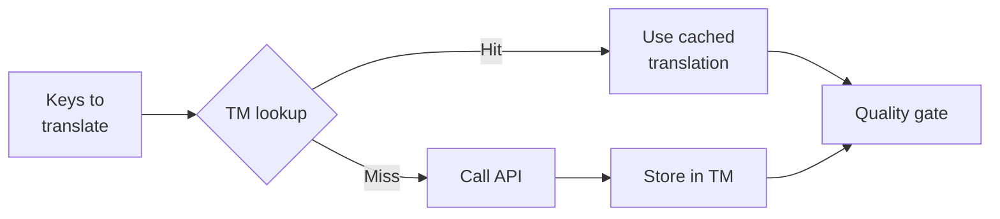

# Translation Memory

A Translation Memory (TM) é a camada de cache integrada do rosetta. Ela armazena cada tradução indexada por texto de origem + localidade + método, para que a reexecução do `sync` chame a API apenas para chaves que realmente mudaram.

## Por que a TM Existe

Sem a TM, cada `sync` retraduz todas as chaves modificadas — mesmo que você já tenha traduzido exatamente o mesmo texto em inglês para a mesma localidade em uma execução anterior. Cenários comuns onde isso desperdiça dinheiro:

| Cenário | Sem a TM | Com a TM |
|----------|-----------|---------|
| Reexecutar o sync após a alteração de 1 chave (500 chaves × 10 localidades) | 5.000 chamadas de API | 10 chamadas de API |
| Reverter uma chave para um valor anterior em inglês | Chamada completa de API | Cache hit instantâneo |
| A mesma frase aparece em 3 arquivos de localidade | 3 × chamadas de API | 1 chamada de API + 2 cache hits |
| Dry-run → sync real | Chamadas completas de API em ambos | A primeira execução faz o cache, a segunda reutiliza |

A TM está **ativada por padrão** e não requer configuração. As traduções são armazenadas em cache automaticamente durante cada `sync` e servidas nas execuções subsequentes.

## Como Funciona

### Chave de Cache

Cada entrada da TM é indexada por um hash SHA-256 de três valores:

```
SHA-256( sourceValue + '\x00' + locale + '\x00' + method )
```

| Componente | Por que está na chave |
|-----------|-------------------|
| `sourceValue` | Texto diferente em inglês → tradução diferente |
| `locale` | "Hello" é traduzido de forma diferente para francês vs. japonês |
| `method` | Saída do Google Translate ≠ saída do GPT-4o |

O separador de byte nulo (`\x00`) evita colisão entre `"ab" + "c"` e `"a" + "bc"`.

### Durante o Sync



1. Antes de chamar a API de tradução, o rosetta particiona as chaves em **TM hits** e **TM misses**
2. Os hits são servidos instantaneamente do cache — sem chamada de API, sem latência, sem custo
3. Os misses passam pelo pipeline normal de tradução
4. Novas traduções da API são armazenadas na TM para execuções futuras
5. Todas as traduções (em cache + novas) passam pelo quality gate

### Armazenamento

A TM é armazenada em `.rosetta/tm.json` na raiz do seu projeto. O arquivo usa JSON compacto (sem pretty-printing) para manter o tamanho gerenciável. Cada entrada armazena:

| Campo | Descrição |
|-------|-------------|
| `t` | O texto traduzido |
| `ts` | Timestamp ISO-8601 de quando foi armazenado em cache |
| `l` | Código da localidade de destino (para estatísticas/filtragem) |
| `m` | Nome do método de tradução (para estatísticas/filtragem) |

Com 50 idiomas × 500 chaves = 25.000 entradas, o arquivo deve ter ~2-3 MB.

## Gerenciando o Cache

### Visualizar Estatísticas

```bash
i18n-rosetta tm stats
```

Mostra a contagem de entradas, o tamanho do arquivo e um detalhamento por localidade:

```
  Translation Memory — .rosetta/tm.json

  Entries:      2,847
  File size:    1.2 MB
  Created:      2026-05-20
  Last entry:   2026-05-24

  By locale:
    fr       482 entries  (llm: 380, llm-coached: 102)
    de       471 entries  (llm: 471)
    ja       465 entries  (llm: 465)
```

### Limpar o Cache

```bash
# Clear everything (with confirmation prompt)
i18n-rosetta tm clear

# Clear without prompt (CI environments)
i18n-rosetta tm clear --yes

# Clear only one locale
i18n-rosetta tm clear --locale fr
```

### Ignorar a TM em uma Execução

```bash
# Force fresh API calls for all keys (useful when switching providers)
i18n-rosetta sync --no-tm
```

Isso não exclui o cache — apenas o ignora para esta execução e não armazena novos resultados.

## Quando a TM Não Ajuda

A TM não produzirá um cache hit quando:

- **O texto de origem mudou** — o hash muda, então é um miss
- **O método mudou** — mudar de `llm` para `google-translate` significa chaves de cache diferentes
- **Primeira execução** — cold start, ainda sem entradas
- **Flag `--no-tm`** — ignora explicitamente o cache

## Você Deve Fazer o Commit de `.rosetta/tm.json`?

**Geralmente não.** A TM é uma otimização local para o desenvolvedor. Ela é preenchida automaticamente durante o sync e só ajuda ao reexecutar o sync na mesma máquina. No entanto, você pode considerar fazer o commit se:

- Sua equipe compartilha um único CI runner que sincroniza as traduções
- Você deseja builds reproduzíveis sem chamadas de API
- Você está arquivando traduções para conformidade

Adicione `.rosetta/tm.json` ao `.gitignore` para o uso típico.

---

## Veja Também

- [Como o Sync Funciona](/docs/concepts/how-sync-works) — onde a TM se encaixa no pipeline
- [Referência da CLI — tm](/docs/reference/cli#tm) — referência do comando
- [Referência da CLI — sync --no-tm](/docs/reference/cli#sync) — ignorando a TM