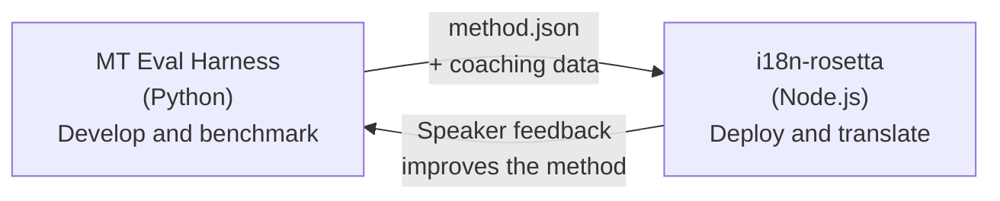

# A Ponte do Eval Harness

O i18n-rosetta e o MT Eval Harness são duas ferramentas separadas que formam um único ecossistema. O harness é onde os métodos de tradução são **comprovados**. O Rosetta é onde os métodos comprovados são **implantados**. Eles se conectam por meio de um formato de plugin compartilhado.



## O Fluxo: Pesquisa → Produção

### 1. Crie um método no harness

Qualquer classe Python que implemente `async translate(entries, config) → [{id, predicted}]` pode se conectar ao harness. O harness não se importa com o que acontece internamente — LLM com prompts, modelo treinado de forma personalizada, regras determinísticas, qualquer coisa.

### 2. Faça o benchmark

O harness pontua o seu método em relação a um corpus padronizado com métricas reprodutíveis: chrF++, aceitação FST (para idiomas morfologicamente ricos), precisão morfológica e pontuação semântica.

### 3. Exporte como um plugin

Quando o seu método atingir uma qualidade aceitável, empacote-o como um plugin do rosetta — um manifesto `method.json` com dados de coaching opcionais.

:::info A CLI de exportação está planejada
Atualmente, você cria o manifesto method.json manualmente. O comando `mt-eval export` automatizará isso. Consulte a [Interface do Método](https://mtevalarena.org/docs/specifications/methods) para ver o formato completo do plugin.
:::

### 4. Instale no rosetta

```bash
i18n-rosetta plugin install ./my-method-plugin/
```

### 5. Traduza conteúdo real

```bash
i18n-rosetta sync
```

Seu método avaliado por benchmark agora está produzindo traduções reais em produção.

## O Fluxo: Produção → Pesquisa

As traduções implantadas são revisadas por falantes bilíngues. O feedback deles identifica erros sistemáticos (padrões de tempo verbal incorretos, vocabulário ausente, frases não naturais). O pesquisador atualiza o método no harness, refaz o benchmark, exporta novamente e reimplanta. O sistema aprende com o uso.

## O Formato do Plugin

O manifesto `method.json` é o contrato entre as duas ferramentas:

```json
{
  "name": "crk-coached-v3",
  "type": "llm-coached",
  "version": "3.0.0",
  "description": "Coached LLM translation for Plains Cree",
  "locales": ["crk"],
  "config": {
    "model": "google/gemini-3.5-flash",
    "temperature": 0.3
  },
  "benchmarks": {
    "crk": {
      "composite_score": 0.67,
      "fst_acceptance": 0.82,
      "corpus_size": 150
    }
  }
}
```

Consulte a [Especificação do Plugin](/docs/reference/plugin-spec) para ver o formato completo.

## O que está Construído vs. Planejado

| Componente | Status |
|-----------|--------|
| Protocolo TranslationProcess | ✅ Construído |
| Executor de benchmark do harness | ✅ Construído |
| Formato de plugin method.json | ✅ Construído |
| `rosetta plugin install/remove/list` | ✅ Construído |
| Carregamento de dados de coaching | ✅ Construído |
| CLI `mt-eval export` | 🔲 Planejado |
| Interface de revisão da comunidade | 🔲 Planejado |
| Avaliação de conjunto de testes criptográficos | 🔲 Planejado |

## Leitura Adicional

- [Métodos de Tradução](/docs/guides/translation-methods) — todos os métodos disponíveis e como eles funcionam
- [Especificação do Plugin](/docs/reference/plugin-spec) — o formato method.json
- [Servindo um Método via API](/docs/guides/serving-a-method) — hospedagem de um método no lado do servidor
- [Soberania de Dados](https://mtevalarena.org/docs/sovereignty/data-sovereignty) — OCAP, CARE e proteção criptográfica
- [Para Pesquisadores de MT](https://mtevalarena.org/docs/leaderboard/rules) — a documentação do eval harness