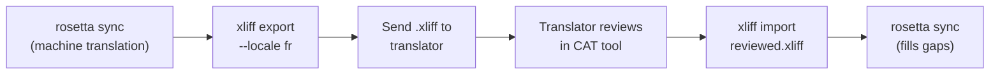

# Trabalhando com Tradutores Profissionais

O Rosetta gera traduções automáticas, mas alguns projetos precisam de revisão humana — conteúdo regulatório, textos sensíveis à marca ou UI de alto impacto. O fluxo de trabalho XLIFF permite que você exporte traduções para revisão profissional e as importe de volta sem complicações.

## O que é XLIFF?

O XLIFF (XML Localization Interchange File Format) é o formato de troca padrão da indústria para ferramentas de tradução. Toda ferramenta CAT (Computer-Assisted Translation) profissional oferece suporte a ele:

- **memoQ** — importe XLIFF, revise no contexto, exporte o arquivo revisado
- **SDL Trados Studio** — suporte nativo a XLIFF
- **Phrase (Memsource)** — faça o upload de trabalhos em XLIFF para equipes de tradutores
- **Smartling** — pipeline de ingestão de XLIFF
- **OmegaT** — ferramenta CAT gratuita/de código aberto com suporte a XLIFF

O Rosetta gera o XLIFF 1.2 (a versão universalmente suportada) em vez da 2.0+ para máxima compatibilidade com as ferramentas.

## O Fluxo de Trabalho



### Passo 1: Gerar Traduções Automáticas

Execute `sync` primeiro para obter uma tradução automática de base:

```bash
i18n-rosetta sync
```

### Passo 2: Exportar XLIFF

Exporte o par de origem + destino como XLIFF:

```bash
i18n-rosetta xliff export --locale fr
```

Isso grava o `.rosetta/xliff/fr.xliff` contendo:
- Cada chave de origem com seu valor em inglês
- A tradução automática atual (se houver) como o `<target>`
- Chaves sem traduções marcadas como `state="new"`

```xml
<trans-unit id="hero.title" xml:space="preserve">
  <source>Welcome to our platform</source>
  <target state="translated">Bienvenue sur notre plateforme</target>
</trans-unit>
```

### Passo 3: Enviar para o Tradutor

Envie o arquivo `.xliff` para o seu tradutor ou faça o upload dele na sua plataforma CAT. O tradutor vê a origem e o destino lado a lado, e pode:

- Editar traduções automáticas
- Preencher traduções ausentes
- Sinalizar problemas de qualidade
- Aplicar sua própria memória de tradução e bases terminológicas

### Passo 4: Importar o Arquivo Revisado

Quando o tradutor devolver o `.xliff` revisado, importe-o:

```bash
# Preview what will change
i18n-rosetta xliff import .rosetta/xliff/fr.xliff --dry

# Apply changes
i18n-rosetta xliff import .rosetta/xliff/fr.xliff
```

Saída:
```
  ✓ Imported 142 translations for fr
    Updated:    23 (changed from existing)
    Added:      0 (new keys)
    Unchanged:  119
    Written to: locales/fr.json
```

### Passo 5: Preencher Lacunas

Se novas chaves foram adicionadas após a exportação do XLIFF, execute `sync` para traduzi-las:

```bash
i18n-rosetta sync
```

O Rosetta traduz apenas as chaves que ainda estão ausentes — as traduções revisadas da importação do XLIFF são preservadas.

## Dicas

### Exportar Caminhos Personalizados

```bash
# Export to a specific directory
i18n-rosetta xliff export --locale ja --out ./for-review/

# Export with a specific filename
i18n-rosetta xliff export --locale de --out ./review/german.xliff
```

### Múltiplos Locales

Exporte cada locale separadamente:

```bash
for locale in fr de ja ko; do
  i18n-rosetta xliff export --locale $locale
done
```

### Controle de Versão

Adicione `.rosetta/xliff/` ao `.gitignore` — arquivos XLIFF são artefatos transitórios, não o código-fonte do projeto:

```gitignore
.rosetta/xliff/
```

### Quando Usar XLIFF vs. Apenas `sync`

| Cenário | Recomendação |
|----------|---------------|
| App interno, qualidade de 90%+ aceitável | Apenas `sync` — a tradução automática é suficiente |
| Textos de marketing voltados para o usuário | Exportar XLIFF para revisão humana |
| Conteúdo legal/regulatório | Exportar XLIFF — revisão humana obrigatória |
| Mais de 50 locales, prazo apertado | `sync` primeiro, exportação de XLIFF apenas para os 5 principais locales |
| O tradutor já usa uma ferramenta CAT | O XLIFF é o formato natural de entrega |

---

## Veja Também

- [Referência da CLI — xliff](/docs/reference/cli#xliff) — referência de comandos
- [Memória de Tradução](/docs/concepts/translation-memory) — cache de traduções revisadas
- [Métodos de Tradução](/docs/guides/translation-methods) — opções de tradução automática