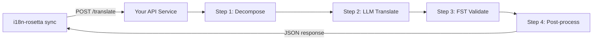

# Servindo um Método Personalizado como uma API

O **método `api`** do i18n-rosetta permite que você aponte qualquer par de tradução para um endpoint HTTP externo. É assim que você integra pipelines que são complexos demais para um único prompt de LLM — analisadores morfológicos, transdutores de estado finito (FSTs), cadeias de LLM de múltiplas etapas ou qualquer método de pesquisa personalizado que você tenha construído.

## Por que um Serviço de API?

Alguns pipelines de tradução não podem ser executados dentro de um simples ciclo de prompt-resposta:

| Etapa do pipeline | Exemplo |
|---|---|
| **Decomposição morfológica** | Dividir palavras polissintéticas em morfemas antes da tradução |
| **Validação FST** | Rejeitar saídas que violam regras fonológicas ou morfológicas |
| **Cadeias de LLM de múltiplas etapas** | Ciclos de gerar → verificar → corrigir com diferentes modelos |
| **Consulta de dicionário** | Fazer referência cruzada com um dicionário bilíngue curado no meio do pipeline |
| **Human-in-the-loop** | Colocar traduções incertas em fila para revisão de especialistas |

O método `api` trata o seu pipeline como uma caixa preta — o i18n-rosetta envia as strings de origem, o seu serviço retorna as traduções. O que acontece lá dentro depende inteiramente de você.

## Arquitetura



## Configurando o Seu Serviço

O seu serviço de API deve implementar um único endpoint que aceita e retorna JSON:

### Formato da Requisição

O rosetta envia exatamente este corpo JSON (veja [api.js](https://github.com/gamedaysuits/i18n-rosetta/blob/main/lib/methods/api.js)):

```json
POST /translate
Content-Type: application/json
Authorization: Bearer <ROSETTA_API_KEY>

{
  "source_locale": "en",
  "target_locale": "crk",
  "method": "crk-coached-v1",
  "keys": {
    "greeting": "Hello, welcome to our app",
    "farewell": "Goodbye and thanks"
  }
}
```

| Campo | Tipo | Descrição |
|-------|------|-------------|
| `source_locale` | string | Código BCP 47 do idioma de origem |
| `target_locale` | string | Código BCP 47 do idioma de destino |
| `method` | string | Nome do plugin ou `"default"` |
| `keys` | object | Mapa de chave → string de origem para traduzir |
```

### Response Format

Your service must return a `translations` object. An optional `meta` object can include cost and diagnostic info:

```json
{
  "translations": {
    "greeting": "tânisi, pê-kîwêw ôta",
    "farewell": "ekosi mâka, kinanâskomitin"
  },
  "meta": {
    "model": "my-custom-pipeline/v1",
    "cost_usd": 0.0042,
    "method": "decompose-translate-validate"
  }
}
```

| Field | Type | Required | Description |
|-------|------|----------|-------------|
| `translations` | object | ✅ | Map of key → translated string |
| `meta` | object | — | Optional metadata |
| `meta.cost_usd` | number | — | If present, displayed in rosetta's output |
| `errors` | object | — | For partial success (HTTP 207): map of key → `{ message }` |

### Minimal Express Server

```javascript
import express from 'express';

const app = express();
app.use(express.json());

/**
 * Contrato da API do rosetta:
 *
 * Requisição: { source_locale, target_locale, method, keys: { "key": "source" } }
 * Resposta:   { translations: { "key": "translated" }, meta: { ... } }
 */
app.post('/translate', async (req, res) => {
  const { source_locale, target_locale, method, keys } = req.body;

  const translations = {};

  for (const [key, source] of Object.entries(keys)) {
    // --- O seu pipeline entra aqui ---
    // Etapa 1: Decomposição morfológica
    const morphemes = await decompose(source, source_locale);

    // Etapa 2: Tradução por LLM com contexto
    const draft = await llmTranslate(morphemes, target_locale);

    // Etapa 3: Validação FST
    const validated = await fstValidate(draft, target_locale);

    // Etapa 4: Pós-processamento (normalização ortográfica, etc.)
    translations[key] = await postProcess(validated);
  }

  res.json({
    translations,
    meta: {
      model: 'my-custom-pipeline/v1',
      method: 'decompose-translate-validate',
    },
  });
});

app.listen(3001, () => {
  console.log('API de tradução rodando em http://localhost:3001');
});
```

## Configuring i18n-rosetta

Point a translation pair at your running service in `i18n-rosetta.config.json`:

```json
{
  "inputLocale": "en",
  "pairs": {
    "en:crk": {
      "method": "api",
      "endpoint": "http://localhost:3001/translate",
      "register": "Cree das Planícies Formal. Use a ortografia SRO."
    }
  }
}
```

Then run sync as usual:

```bash
npx i18n-rosetta sync
```

i18n-rosetta will POST your source strings to the endpoint and write the returned translations to `crk.json`.

## Case Study: Plains Cree Pipeline

:::info Under Development
The Plains Cree pipeline described below is **under active development** and is not yet running in production. Details here reflect the current design direction and may change as the project evolves.
:::

The **gds-mt-eval-harness** project demonstrates this pattern. Its Plains Cree pipeline uses:

1. **Morphological decomposition** — Break polysynthetic Cree words into translatable morpheme chains
2. **LLM translation** — Context-enriched GPT-4o translation with coaching data (SRO orthography rules, register instructions)
3. **FST validation** — Finite-state transducer checks that outputs conform to Cree phonological rules
4. **Confidence scoring** — Each translation gets a confidence score based on FST pass rate and dictionary coverage

The entire pipeline runs as a single HTTP endpoint that i18n-rosetta calls via the `api` method.

### Running Evaluations

After translating, you can evaluate output quality using the harness directly:

```bash
# Clonar o harness
git clone https://github.com/gamedaysuits/gds-mt-eval-harness.git
cd gds-mt-eval-harness
pip install -e .

# Executar a avaliação com a saída do seu método
python eval/baseline_experiment.py --dataset data/edtekla-dev-v1.json --submit
```

This produces structured evaluation records with chrF++, BLEU, and exact match scores that can be used as regression baselines.

## Authentication

If your API requires authentication, set the `apiKey` field or use an environment variable:

```json
{
  "pairs": {
    "en:crk": {
      "method": "api",
      "endpoint": "https://my-mt-service.example.com/translate",
      "apiKey": "${CRK_API_KEY}"
    }
  }
}
```

## Data Sovereignty & OCAP Principles

The `api` method is particularly important for **Indigenous language communities**. By self-hosting the translation pipeline, a community keeps full control over:

- **Proprietary coaching data** — register instructions, orthography rules, and domain glossaries never leave community infrastructure.
- **Linguistic resources** — curated dictionaries, FST grammars, and elder-verified translations remain under community ownership.
- **Access policies** — the community decides who can call the endpoint and under what terms.

This aligns with [OCAP® principles](https://mtevalarena.org/docs/community/low-resource-languages#ocap-principles) (Ownership, Control, Access, Possession), ensuring that sensitive language data is governed by the community rather than a third-party platform.

:::tip
Combine the `api` method with a private deployment (e.g., a community-hosted VM or on-prem server) for the strongest data-sovereignty posture. See [Support a Low-Resource Language](https://mtevalarena.org/docs/community/low-resource-languages) for a full walkthrough.
:::

## Cost Estimation

The `api` method returns `null` for cost estimation by default — your service controls pricing. If you want to provide cost transparency, have your API return a `cost` field in the metadata:

```json
{
  "translations": { "...": "..." },
  "metadata": {
    "cost": {
      "estimatedCost": 0.0042,
      "currency": "USD",
      "source": "my-service-pricing"
    }
  }
}
```

## Boas Práticas

1. **Retorne strings vazias em caso de falhas** — Não retorne a string de origem como uma "tradução". Retorne `""` e deixe o mecanismo de prefixo de fallback do i18n-rosetta lidar com isso.
2. **Inclua pontuações de confiança** — Se o seu pipeline puder estimar a qualidade, retorne-a nos metadados. Isso ajuda na auditoria de qualidade.
3. **Implemente health checks** — Adicione um endpoint `GET /health` para que o i18n-rosetta possa verificar a conectividade antes de iniciar uma grande sincronização.
4. **Limite a taxa de forma elegante** — Se o seu pipeline tiver limites de taxa de transferência, retorne códigos de status `429`. O sistema de batch do i18n-rosetta fará o backoff.
5. **Registre tudo (log)** — Pipelines de múltiplas etapas podem falhar silenciosamente. Registre a entrada/saída de cada etapa para depuração.

## Licenciamento

O padrão do método `api` é totalmente aberto — não há restrições de licenciamento para encapsular o seu próprio pipeline de tradução como um serviço HTTP. O `gds-mt-eval-harness` está disponível sob a licença MIT para implementações de referência.

## Veja Também

- [Métodos de Tradução](/docs/guides/translation-methods) — visão geral de todos os métodos integrados (`openai`, `google`, `api`, etc.)
- [Especificação de Plugin](/docs/reference/plugin-spec) — esquema completo para `i18n-rosetta.config.json`, incluindo os campos do método `api`
- [Apoie um Idioma com Poucos Recursos](https://mtevalarena.org/docs/community/low-resource-languages) — guia de ponta a ponta para idiomas com poucos recursos, incluindo os princípios OCAP
- [Arquitetura](/docs/concepts/architecture) — como funcionam o loop de sincronização, o processamento em lote (batching) e o despacho de métodos do i18n-rosetta
- [Avaliação de MT](https://mtevalarena.org/docs/leaderboard/rules) — metodologia de avaliação, métricas e o processo de envio para o placar de líderes (leaderboard)
- [Placar de Líderes de Métodos](/leaderboard) — classificações de qualidade ao vivo entre métodos e pares de idiomas