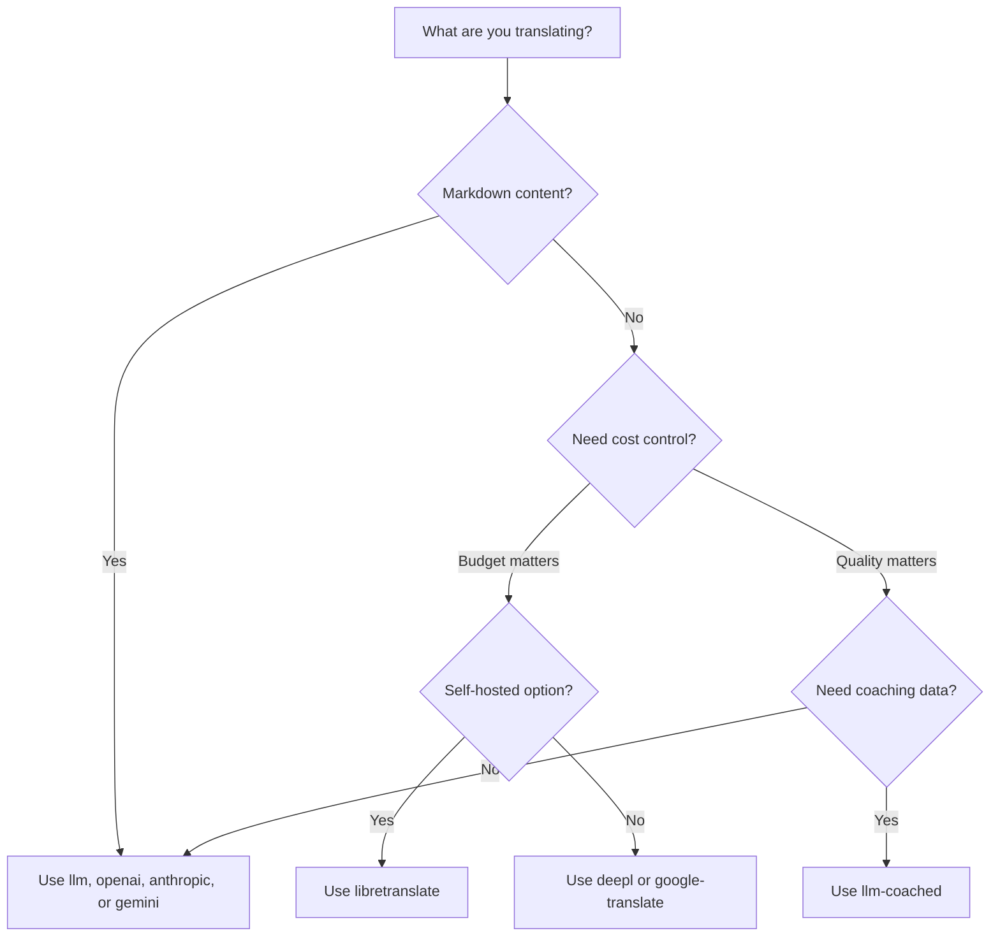

# Métodos de Tradução

O Rosetta suporta dez métodos de tradução. Cada par de idiomas pode usar um método diferente — você não fica preso a uma única abordagem para todo o seu projeto.

## Comparação de Métodos

### Provedores de LLM

Focados em qualidade, compatíveis com Markdown e com suporte a coaching. Ideais para projetos com muito conteúdo.

| Método | Chave | O que faz |
|--------|-----|-------------|
| `llm` (padrão) | `OPENROUTER_API_KEY` | LLM via OpenRouter — mais de 200 modelos, roteamento automático |
| `llm-coached` | `OPENROUTER_API_KEY` | LLM + regras gramaticais, dicionários, notas de estilo |
| `openai` | `OPENAI_API_KEY` | API direta da OpenAI (gpt-4o, gpt-4o-mini) |
| `anthropic` | `ANTHROPIC_API_KEY` | API direta da Anthropic (Claude Sonnet, Haiku, Opus) |
| `gemini` | `GEMINI_API_KEY` | API direta do Google Gemini (Flash, Pro) — nível gratuito |

### MT Tradicional

Focados em velocidade e custo. Ideais para grandes volumes de pares chave-valor.

| Método | Chave | O que faz |
|--------|-----|-------------|
| `google-translate` | `GOOGLE_TRANSLATE_API_KEY` | Google Cloud Translation API v2 (mais de 130 idiomas) |
| `deepl` | `DEEPL_API_KEY` | API do DeepL com suporte a glossário (mais de 30 idiomas) |
| `microsoft-translator` | `MICROSOFT_TRANSLATOR_API_KEY` | Azure Cognitive Services Translator (mais de 100 idiomas) |
| `libretranslate` | *(auto-hospedado)* | LibreTranslate auto-hospedado (AGPL, gratuito) |

### Infraestrutura

| Método | Chave | O que faz |
|--------|-----|-------------|
| `api` | *(por provedor)* | Cliente HTTP leve para qualquer endpoint REST de tradução |

## Árvore de Decisão



---

## `llm` — Tradução por LLM (Padrão)

Traduz através de qualquer LLM no [OpenRouter](https://openrouter.ai). Este é o método padrão e o mais versátil.

**Como funciona:**
1. Agrupa chaves em lotes (padrão de 30/lote) com instruções de registro e contexto
2. Envia para o OpenRouter como um prompt estruturado
3. Analisa a resposta em JSON
4. Valida cada tradução através do [quality gate](/docs/concepts/quality-gate)
5. Grava as traduções aprovadas, tenta novamente ou rejeita as falhas

**Quando usar:** Na maioria dos projetos. Especialmente em sites com muito conteúdo em Markdown, onde blocos de código e shortcodes precisam ser protegidos.

**Configuração:**

```json
{
  "defaultMethod": "llm",
  "model": "google/gemini-3.5-flash"
}
```

## `llm-coached` — Tradução por LLM com Coaching

Igual ao `llm`, mas com regras gramaticais, dicionários de termos e notas de estilo injetados em cada prompt.

**Como funciona:**
1. Carrega os dados de coaching de `.rosetta/coaching/<locale>.json` ou do diretório `coaching/` de um plugin
2. Injeta regras gramaticais, termos de dicionário e notas de estilo no prompt do sistema
3. Termos do dicionário que correspondem às chaves de origem são incluídos como terminologia obrigatória
4. A tradução prossegue como no `llm`, com os dados de coaching adicionando precisão

**Quando usar:** Idiomas com poucos recursos, terminologia de domínio específico (jurídico, médico), registros formais ou qualquer caso em que a saída genérica do LLM não seja precisa o suficiente.

**Formato dos dados de coaching:**

```json title=".rosetta/coaching/fr.json"
{
  "grammar_rules": [
    "French adjectives agree in gender and number with the noun they modify",
    "Use 'vous' for formal contexts, 'tu' for informal"
  ],
  "dictionary": {
    "dashboard": "tableau de bord",
    "deployment": "déploiement",
    "settings": "paramètres"
  },
  "style_notes": "Prefer active voice. Avoid anglicisms where a native French term exists."
}
```

Veja também: [Guia de Idiomas com Poucos Recursos](https://mtevalarena.org/docs/community/low-resource-languages)

---

## `openai` — API Direta da OpenAI

Traduz diretamente através da API Chat Completions da OpenAI. Sem o OpenRouter como intermediário — sua chave, sua conta, seu painel de uso.

**Modelos:** `gpt-4o` (padrão), `gpt-4o-mini`

**Recursos:**
- ✅ Compatível com Markdown (tradução de conteúdo)
- ✅ Suporte a coaching (regras gramaticais, substituições de dicionário, notas de estilo)
- ✅ Modo JSON para saída estruturada de chave-valor
- ✅ Backoff exponencial com novas tentativas (retry)

**Configuração:**

```json
{
  "pairs": {
    "en:fr": { "method": "openai", "model": "gpt-4o-mini" }
  }
}
```

```bash
export OPENAI_API_KEY=sk-proj-...
```

Obtenha sua chave em [platform.openai.com/api-keys](https://platform.openai.com/api-keys).

## `anthropic` — API Direta da Anthropic

Traduz diretamente através da API Messages da Anthropic. Usa o parâmetro `system` para dados de coaching, ativando o cache de prompt da Anthropic.

**Modelos:** `claude-sonnet-4-6` (padrão), `claude-haiku-4-5`, `claude-opus-4-7`

**Recursos:**
- ✅ Compatível com Markdown (tradução de conteúdo)
- ✅ Suporte a coaching (regras gramaticais, substituições de dicionário, notas de estilo)
- ✅ Cache de prompt do sistema (amortiza o custo de coaching entre os lotes)
- ✅ Backoff exponencial com novas tentativas (retry)

**Configuração:**

```json
{
  "pairs": {
    "en:ja": { "method": "anthropic", "model": "claude-haiku-4-5" }
  }
}
```

```bash
export ANTHROPIC_API_KEY=sk-ant-...
```

Obtenha sua chave em [console.anthropic.com](https://console.anthropic.com/settings/keys).

## `gemini` — API Direta do Google Gemini

Traduz diretamente através da API `generateContent` do Google Gemini. **Nível gratuito disponível** — o melhor ponto de partida sem custos.

**Modelos:** `gemini-2.5-flash` (padrão), `gemini-2.5-pro`

**Recursos:**
- ✅ Compatível com Markdown (tradução de conteúdo)
- ✅ Suporte a coaching (regras gramaticais, substituições de dicionário, notas de estilo)
- ✅ Modo de resposta em JSON via `responseMimeType`
- ✅ Nível gratuito (cota diária generosa)
- ✅ Backoff exponencial com novas tentativas (retry)

**Configuração:**

```json
{
  "pairs": {
    "en:ko": { "method": "gemini", "model": "gemini-2.5-pro" }
  }
}
```

```bash
export GEMINI_API_KEY=AI...
```

Obtenha sua chave em [aistudio.google.com/apikey](https://aistudio.google.com/apikey).

### Validação de Modelo

Os provedores diretos de LLM (`openai`, `anthropic`, `gemini`) validam a string do seu modelo no primeiro uso. Isso captura três categorias de erros:

**Formato de método incorreto** — Usar um caminho de modelo no estilo OpenRouter com um provedor direto:

```
[WARN] OpenAI: model "google/gemini-3.5-flash" looks like an OpenRouter path.
       Direct providers use bare model names (e.g., "gpt-4o").
       To use OpenRouter models, set method to 'llm' instead.
```

**Provedor incorreto** — Usar um modelo de um provedor totalmente diferente:

```
[WARN] Gemini: model "claude-sonnet-4-6" is an Anthropic model.
       This provider (gemini) cannot serve Anthropic models.
       Use --method anthropic or set "method": "anthropic" in config.
```

**Modelo obsoleto ou com erro de digitação** — Na primeira chamada à API, o rosetta busca a lista de modelos ativos do provedor e verifica o seu modelo em relação a ela:

```
[WARN] Gemini: model "gemini-1.5-flash" not found in available models.
       Similar models: gemini-2.0-flash, gemini-2.5-flash, gemini-2.5-pro
       The API call will proceed — the provider will give the final verdict.
```

:::note Estes são avisos, não erros
A validação de modelo registra avisos, mas não bloqueia a chamada à API. A API do provedor dá o veredito final — um nome de modelo futuro pode corresponder a um padrão diferente, e não queremos restringir com base em heurísticas.
:::

---

## `google-translate` — Google Cloud Translation API

Integração direta com a Google Cloud Translation API v2. Usa a API REST — sem SDK, sem conta de serviço. Apenas a chave da API.

**Quando usar:** Grandes volumes de pares de strings chave-valor onde velocidade e custo importam mais do que nuances. Suporta mais de 130 idiomas nativamente.

**Limitações:**
- ⚠️ **Não é compatível com Markdown.** Irá corromper blocos de código, shortcodes e variáveis de interpolação.
- Sem controle de registro/tom
- Sem coaching ou aplicação de terminologia

```bash
npx i18n-rosetta sync --method google-translate
```

:::tip Detecção automática
Se apenas `GOOGLE_TRANSLATE_API_KEY` estiver configurado (sem chave do OpenRouter), o rosetta muda automaticamente para o Google Translate. Nenhuma alteração de configuração é necessária.
:::

## `deepl` — API do DeepL

Integração direta com a API de tradução do DeepL. Suporta glossários para uma terminologia consistente.

**Quando usar:** Idiomas europeus onde o DeepL se destaca (alemão, francês, espanhol, holandês, polonês, etc.). O suporte a glossário impõe uma terminologia consistente sem dados de coaching.

**Recursos:**
- ✅ Detecção automática de endpoint free/pro (sufixo `:fx` em chaves gratuitas)
- ✅ Criação e gerenciamento de glossários
- ✅ Controle de nível de formalidade
- ⚠️ **Não é compatível com Markdown** — apenas pares chave-valor

**Configuração:**

```json
{
  "pairs": {
    "en:de": { "method": "deepl" }
  }
}
```

```bash
export DEEPL_API_KEY=your-key-here
```

Obtenha sua chave em [deepl.com/pro-api](https://www.deepl.com/pro-api).

## `microsoft-translator` — Azure Cognitive Services

Integração direta com a Microsoft Translator Text API v3.

**Quando usar:** Ambientes corporativos com infraestrutura existente do Azure. Suporta mais de 100 idiomas, incluindo muitos que o Google Translate não cobre.

**Recursos:**
- ✅ Até 100 segmentos por solicitação (alto rendimento)
- ✅ Parâmetro opcional de região para otimização de latência
- ⚠️ **Não é compatível com Markdown** — apenas pares chave-valor
- ⚠️ **Sem tradução de conteúdo** — apenas pares chave-valor

**Configuração:**

```json
{
  "pairs": {
    "en:ar": { "method": "microsoft-translator" }
  }
}
```

```bash
export MICROSOFT_TRANSLATOR_API_KEY=your-key
export MICROSOFT_TRANSLATOR_REGION=global  # optional
```

Obtenha sua chave no [Portal do Azure](https://portal.azure.com) → Cognitive Services → Translator.

## `libretranslate` — Tradução Auto-hospedada

Tradução de código aberto auto-hospedada usando o LibreTranslate. Roda localmente ou na sua própria infraestrutura — zero custos de API, total soberania de dados.

**Quando usar:** Projetos que exigem tradução offline, conformidade com privacidade de dados (GDPR) ou operação com custo zero. Especialmente útil para pipelines de CI que não devem depender de APIs externas.

**Recursos:**
- ✅ Auto-hospedado — sem chamadas de API externas
- ✅ Gratuito e de código aberto (AGPL-3.0)
- ✅ Implantação via Docker disponível
- ⚠️ **Não é compatível com Markdown** — apenas pares chave-valor
- ⚠️ **Sem tradução de conteúdo** — apenas pares chave-valor
- ⚠️ A qualidade varia de acordo com o par de idiomas

**Configuração:**

```bash
# Run LibreTranslate locally with Docker
docker run -d -p 5000:5000 libretranslate/libretranslate

# Configure (optional — defaults to localhost:5000)
export LIBRETRANSLATE_API_URL=http://localhost:5000/translate
```

```json
{
  "pairs": {
    "en:es": { "method": "libretranslate" }
  }
}
```

---

## `api` — API de Tradução Remota

Um cliente HTTP leve para endpoints de tradução hospedados pela comunidade ou protegidos por IP. O Rosetta envia as chaves e recebe as traduções de volta — ele não contém nenhuma lógica de tradução.

**Quando usar:** Quando os métodos de tradução são hospedados no lado do servidor (por exemplo, dados de coaching proprietários, modelos ajustados, pipelines FST que não podem ser distribuídos).

```json
{
  "pairs": {
    "en:crk": {
      "method": "api",
      "endpoint": "https://api.example.com/v1/translate",
      "apiKey": "your-key"
    }
  }
}
```

:::note Tradução Comunitária Compatível com OCAP
O método `api` é a ponte para a **tradução hospedada pela comunidade compatível com OCAP**. Comunidades indígenas e de idiomas minoritários podem hospedar seus próprios endpoints de tradução — mantendo dados de coaching, modelos ajustados e propriedade intelectual linguística sob controle da comunidade — enquanto o Rosetta se conecta a eles como um cliente leve.

Veja [Apoiar um Idioma com Poucos Recursos](https://mtevalarena.org/docs/community/low-resource-languages) para o passo a passo completo de hospedagem comunitária, e [Servindo um Método via API](/docs/guides/serving-a-method) para os requisitos do endpoint.
:::

---

## Configuração por Par de Idiomas

O verdadeiro poder está em misturar métodos por par de idiomas:

```json title="i18n-rosetta.config.json"
{
  "version": 3,
  "pairs": {
    "en:fr": { "method": "deepl" },
    "en:ja": { "method": "openai", "model": "gpt-4o" },
    "en:ko": { "method": "gemini" },
    "en:ar": { "method": "microsoft-translator" },
    "en:crk": { "methodPlugin": "crk-coached-v1" }
  }
}
```

Isso traduz o francês via DeepL (suporte a glossário), japonês via OpenAI (qualidade), coreano via Gemini (nível gratuito), árabe via Microsoft Translator (cobertura) e Plains Cree via um plugin com coaching (especializado).

## Plugins

Plugins são receitas de tradução pré-empacotadas para pares de idiomas específicos. Eles são manifestos em JSON — não código — que dizem ao rosetta qual método usar, com quais configurações e qual qualidade foi avaliada.

:::tip Do ambiente de avaliação (eval harness) para produção em um comando
Plugins desenvolvidos e comprovados no [ambiente de avaliação](https://mtevalarena.org/docs/specifications/harness) podem ser instalados diretamente — o método que você valida lá é implantado aqui com um único comando `plugin install`. Veja [Avaliação de MT](https://mtevalarena.org/docs/leaderboard/rules) para o fluxo de trabalho completo de avaliação.
:::

```bash
i18n-rosetta plugin install ./french-formal-v1/
i18n-rosetta plugin list
i18n-rosetta plugin remove french-formal-v1
```

Veja a [Especificação de Plugin](/docs/reference/plugin-spec) para o formato completo do manifesto.

---

## Trocando de Provedor

Mudando de método? O formato do modelo e a variável de ambiente mudam — aqui está o mapa:

### OpenRouter → Provedor Direto

```diff title="i18n-rosetta.config.json"
 {
   "pairs": {
     "en:fr": {
-      "method": "llm",
-      "model": "openai/gpt-4o"
+      "method": "openai",
+      "model": "gpt-4o"
     }
   }
 }
```

```diff title="Environment variables"
- export OPENROUTER_API_KEY=sk-or-v1-...
+ export OPENAI_API_KEY=sk-proj-...
```

**Principais diferenças:**
- O OpenRouter usa o formato `provider/model` (ex: `openai/gpt-4o`). Provedores diretos usam apenas os nomes dos modelos (ex: `gpt-4o`).
- Cada provedor direto tem sua própria variável de ambiente (`OPENAI_API_KEY`, `ANTHROPIC_API_KEY`, `GEMINI_API_KEY`).
- Se você usar o formato de modelo incorreto, o rosetta irá avisá-lo — veja [Validação de Modelo](#validação-de-modelo).

### Provedor Direto → OpenRouter

```diff title="i18n-rosetta.config.json"
 {
   "pairs": {
     "en:ja": {
-      "method": "anthropic",
-      "model": "claude-sonnet-4-6"
+      "method": "llm",
+      "model": "anthropic/claude-sonnet-4-6"
     }
   }
 }
```

:::tip Quando usar OpenRouter vs Direto
**Use o OpenRouter** quando quiser alternar entre modelos sem alterar variáveis de ambiente, ou quando quiser acesso a mais de 200 modelos com uma única chave. **Use provedores diretos** quando quiser um faturamento mais simples, menor latência (sem intermediários) ou acesso a recursos específicos do provedor, como o cache de prompt da Anthropic.
:::

---

## Comparação de Custos

Custo aproximado por 1.000 chaves traduzidas (presume ~10 tokens por chave, 30 chaves por lote):

| Método | Custo / 1K Chaves | Velocidade | Qualidade | Ideal Para |
|--------|----------------|-------|---------|----------|
| `gemini` (Flash) | **Gratuito** (dentro do nível) | Rápida | Boa | Iniciantes, projetos pessoais |
| `google-translate` | ~$0,02 | Mais rápida | Adequada | Alto volume, idiomas europeus |
| `deepl` | ~$0,02 | Rápida | Boa | Idiomas europeus, terminologia |
| `microsoft-translator` | ~$0,01 | Rápida | Adequada | Ambientes Azure, ampla cobertura de idiomas |
| `libretranslate` | **Gratuito** (auto-hospedado) | Variável | Razoável | Ambientes isolados (air-gapped), GDPR, pipelines de CI |
| `gemini` (Pro) | ~$0,07 | Média | Muito boa | Foco em qualidade, cota gratuita |
| `openai` (GPT-4o-mini) | ~$0,01 | Rápida | Boa | LLM econômico |
| `openai` (GPT-4o) | ~$0,10 | Média | Muito boa | Foco em qualidade |
| `anthropic` (Haiku) | ~$0,01 | Rápida | Boa | LLM econômico |
| `anthropic` (Sonnet) | ~$0,10 | Média | Muito boa | Foco em qualidade |
| `anthropic` (Opus) | ~$0,50 | Lenta | Excelente | Qualidade máxima |
| `llm` (OpenRouter) | Varia por modelo | Variável | Variável | Comparação de modelos, experimentação |

:::note Estas são estimativas
Os custos reais dependem do tamanho do texto de origem, do tamanho do lote e das mudanças de preços do provedor. Verifique a página de preços atual de cada provedor para obter as taxas exatas.
:::

---

## Veja Também

- [Idiomas Suportados](/docs/reference/supported-languages)
- [Dados de Coaching](/docs/concepts/coaching-data)
- [Apoiar um Idioma com Poucos Recursos](https://mtevalarena.org/docs/community/low-resource-languages)
- [Especificação de Plugin](/docs/reference/plugin-spec)
- [Servindo um Método via API](/docs/guides/serving-a-method)
- [Quality Gate](/docs/concepts/quality-gate)
- [Arquitetura](/docs/concepts/architecture)
- [Solução de Problemas](/docs/guides/troubleshooting) — erros de modelo, problemas de API