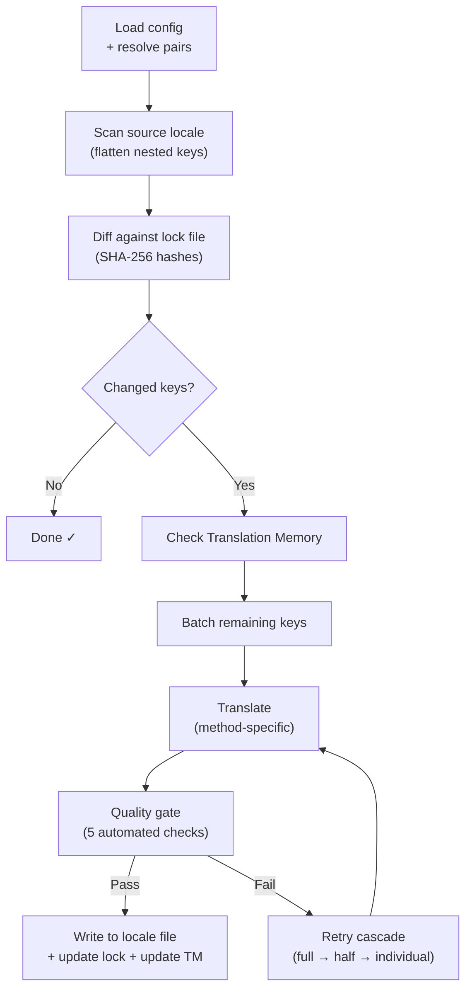

# Como o i18n-rosetta funciona

O i18n-rosetta traduz os arquivos de localização do seu aplicativo com um único comando. Veja o que acontece nos bastidores.

## O Pipeline

Quando você executa `npx i18n-rosetta sync`, o rosetta executa um pipeline de seis estágios:



**Principais decisões de design:**

- **Detecção de alterações via hashes SHA-256.** O Rosetta rastreia cada valor de origem com um hash em `.i18n-rosetta.lock`. Quando você atualiza uma string em inglês, apenas essa chave é retraduzida. É por isso que `sync` é rápido em execuções repetidas — ele faz o mínimo de trabalho possível.

- **Cache de Memória de Tradução.** Antes de fazer qualquer chamada de API, o rosetta verifica `.rosetta/tm.json` em busca de traduções em cache (indexadas por texto de origem + localidade + método). Em uma ressincronização típica após alterar uma chave, 142 chaves vêm do cache e 1 chave acessa a API.

- **Quality gate antes da gravação.** Cada tradução passa por cinco verificações automatizadas (vazio, eco da origem, loop de alucinação, inflação de tamanho, conformidade de script) antes de tocar nos seus arquivos. As falhas são registradas, nunca aceitas silenciosamente.

- **Cascata de novas tentativas em caso de falha.** Se um lote falhar (erro de análise JSON, tempo limite da API), o rosetta tenta novamente com lotes progressivamente menores: completo → metade → individual. Isso isola a chave problemática sem bloquear o restante.

## Métodos de Tradução

O Rosetta suporta quatro métodos de tradução, cada um adequado para diferentes cenários:

| Método | Como funciona | Melhor para |
|--------|-------------|----------|
| **`llm`** | Prompt estruturado para qualquer modelo do OpenRouter | Idiomas com muitos recursos |
| **`llm-coached`** | Mesmo prompt + regras gramaticais, dicionário e notas de estilo | Idiomas onde os LLMs cometem erros previsíveis |
| **`google-translate`** | Solicitação em lote da Google Cloud Translation API | Idiomas com muitos recursos e bom suporte do GT |
| **`api`** | HTTP POST para o seu próprio endpoint | Pipelines personalizados, modelos controlados pela comunidade |

Os métodos são configurados por par de idiomas. Você pode usar `google-translate` para francês, mas `llm-coached` para Plains Cree — cada par recebe o método que funciona melhor para ele.

## Dados de Coaching

Para pares `llm-coached`, os dados de coaching fornecem ao LLM conhecimento linguístico explícito: regras gramaticais, terminologia forçada e preferências de estilo. Isso é injetado em cada prompt como um contexto estruturado.

```json title="coaching/crk.json"
{
  "grammar_rules": ["Animate nouns take different plural forms than inanimate nouns"],
  "dictionary": {"welcome": "ᑕᓂᓯ", "settings": "ᐃᑕᐢᑌᐘᐃᓇ"},
  "style_notes": "Use Standard Roman Orthography (SRO) unless explicitly configured otherwise."
}
```

Os dados de coaching são o principal mecanismo para melhorar a qualidade da tradução sem fazer o fine-tuning de um modelo. Altere as regras → execute a sincronização novamente → veja se ajuda. A iteração é instantânea.

## Plugins

Os plugins são receitas de tradução pré-empacotadas para pares de idiomas específicos. Eles são manifestos JSON — não código — que dizem ao rosetta qual método usar, com quais configurações e qual qualidade foi avaliada em benchmark.

```bash
i18n-rosetta plugin install ./crk-coached-v3/
i18n-rosetta sync   # uses the installed plugin for en→crk
```

Os plugins preenchem a lacuna entre a pesquisa e a produção: um método que tem uma boa pontuação no [MT Eval Arena](https://mtevalarena.org) pode ser empacotado como um plugin e implantado aqui.

## O Panorama Geral

O i18n-rosetta é uma metade de um ecossistema de duas partes:

- **[MT Eval Arena](https://mtevalarena.org)** — onde os métodos de tradução são **desenvolvidos e comprovados** com benchmarking reprodutível
- **i18n-rosetta** — onde os métodos comprovados são **implantados** para traduzir conteúdo real

O [Eval Harness Bridge](/docs/guides/bridge) conecta os dois. Um método que se prova na Arena é implantado aqui. O feedback dos falantes na produção melhora a próxima versão.

---

## Aprofunde-se

- [Como a Sincronização Funciona](/docs/concepts/how-sync-works) — explicação detalhada passo a passo do pipeline
- [Quality Gate](/docs/concepts/quality-gate) — as cinco verificações automatizadas
- [Memória de Tradução](/docs/concepts/translation-memory) — cache e economia de custos
- [Métodos de Tradução](/docs/guides/translation-methods) — comparação detalhada dos métodos
- [Arquitetura](/docs/concepts/architecture) — visão geral do design do sistema