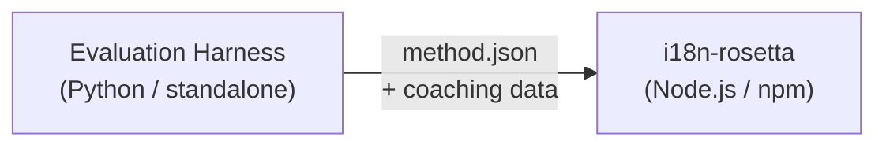

# Especificação do Plugin de Método

> **Versão**: 1.1  
> **Público-alvo**: Desenvolvedores de plugins  
> **Schema Canônico**: [`schemas/rosetta-plugin.schema.json`](https://github.com/gamedaysuits/i18n-rosetta/blob/main/schemas/rosetta-plugin.schema.json)

## Visão Geral

O i18n-rosetta usa um **sistema de métodos plugáveis**. Cada par de idiomas pode usar um método de tradução diferente (LLM, coached, script-converter, etc.). Os métodos são registrados em `lib/translate.js` e resolvidos por par através de `lib/pairs.js`.

O trabalho do eval harness é **desenvolver, testar e exportar** métodos de tradução. O trabalho do i18n-rosetta é **consumi-los e executá-los**. O harness nunca é executado dentro do rosetta.

### Fluxo de Dados



---

## Formato do Plugin de Método

Um plugin de método é um único arquivo JSON (`method.json`) com arquivos opcionais de dados de coaching.

### `method.json` — Obrigatório

```json
{
  "name": "french-formal-v1",
  "type": "llm-coached",
  "version": "1.0.0",
  "description": "Formally-tuned French with terminology enforcement and grammar coaching",
  "author": "Plugin Author",

  "config": {
    "model": "google/gemini-3.5-flash",
    "register": "formal",
    "batchSize": 30,
    "temperature": 0.2
  },

  "locales": ["fr"],

  "benchmarks": {
    "fr": {
      "date": "2026-05-11T00:00:00Z",
      "corpus_size": 500,
      "exact_match_rate": 0.42,
      "corpus_chrf": 72.3,
      "corpus_bleu": 45.1,
      "model": "google/gemini-3.5-flash",
      "harness_version": "1.0.0"
    }
  },

  "provenance": {
    "resources": [],
    "commercialReady": false,
    "flags": ["license-unclear"]
  },

  "coaching": {
    "dir": "coaching"
  }
}
```

### Referência de Campos

| Campo | Tipo | Obrigatório | Descrição |
|-------|------|----------|-------------|
| `name` | string | ✅ | Identificador único do método (kebab-case) |
| `type` | string | ✅ | Tipo de método do Rosetta: `llm`, `llm-coached`, `api`, `google-translate`, `deepl`, `microsoft-translator`, `libretranslate`, `openai`, `anthropic`, `gemini` |
| `version` | string | ✅ | Versão Semver (ex: `1.0.0`) |
| `locales` | string[] | ✅ | Quais códigos de localidade (locale) este método atende (mínimo 1) |
| `description` | string | — | Descrição legível para humanos |
| `author` | string | — | Quem desenvolveu/testou este método |
| `config.model` | string | — | Identificador do modelo no OpenRouter |
| `config.register` | string | — | Registro/tom do idioma de destino |
| `config.batchSize` | number | — | Chaves por lote da API (1–200, padrão: 30) |
| `config.temperature` | number | — | Temperatura do LLM (0.0–2.0, padrão: 0.3) |
| `benchmarks` | object | — | Resultados de benchmark por localidade |
| `provenance` | object | — | Licenciamento e dependências de recursos |
| `coaching.dir` | string | — | Caminho relativo para o diretório de dados de coaching |

### Objeto de Benchmark (por localidade)

| Campo | Tipo | Obrigatório | Descrição |
|-------|------|----------|-------------|
| `date` | string | ✅ | Timestamp ISO 8601 da execução do benchmark |
| `corpus_size` | number | ✅ | Número de entradas avaliadas |
| `exact_match_rate` | number | ✅ | 0.0–1.0, proporção de correspondências exatas (exact matches) |
| `corpus_chrf` | number | — | Pontuação chrF++ (0–100) |
| `corpus_bleu` | number | — | Pontuação BLEU (0–100) |
| `model` | string | ✅ | Modelo usado durante a avaliação (eval) |
| `harness_version` | string | ✅ | Versão do evaluation harness utilizada |

:::info Quais métricas são exibidas?
O comando `rosetta status` exibe o **chrF++** e a **taxa de correspondência exata** do bloco de benchmark. O `corpus_bleu` é aceito no manifesto, mas atualmente não é exibido ou usado por nenhum comando do rosetta. O [Method Leaderboard](/leaderboard) rastreia o chrF++, a correspondência exata e a taxa de aceitação FST.
:::

---

### Objeto de Proveniência (Provenance)

O bloco de proveniência comunica o status de licenciamento dos recursos empacotados no plugin.

| Campo | Tipo | Padrão | Descrição |
|-------|------|---------|-------------|
| `resources` | object[] | `[]` | Lista de recursos empacotados com `name`, `license` e `type` |
| `commercialReady` | boolean | `false` | Se o plugin está liberado para distribuição comercial |
| `flags` | string[] | `["license-unclear"]` | Flags de status legíveis por máquina |

**Estado padrão** — plugins exportados são enviados com `commercialReady: false` e `flags: ["license-unclear"]`.

**Estado liberado** — quando o licenciamento for verificado: defina `commercialReady: true` e limpe as flags.

---

## Formato dos Dados de Coaching

Se `type` for `llm-coached`, o plugin deve incluir arquivos de dados de coaching no subdiretório `coaching/`.

### `coaching/<locale>.json`

```json
{
  "grammar_rules": [
    "French adjectives agree in gender and number with the noun they modify",
    "Use 'vous' for formal contexts, 'tu' for informal"
  ],
  "dictionary": {
    "dashboard": "tableau de bord",
    "deployment": "déploiement",
    "settings": "paramètres"
  },
  "style_notes": "Prefer active voice. Avoid anglicisms where a native French term exists."
}
```

| Campo | Tipo | Obrigatório | Descrição |
|-------|------|----------|-------------|
| `grammar_rules` | string[] | — | Regras injetadas em cada prompt do LLM para esta localidade |
| `dictionary` | object | — | Mapa de termo → tradução. Termos correspondentes são injetados como terminologia obrigatória. |
| `style_notes` | string | — | Instruções de estilo em formato livre anexadas ao prompt |

---

## Estrutura de Diretórios

```
french-formal-v1/
  method.json                 # Method manifest with benchmarks
  coaching/
    fr.json                   # Coaching data for French
```

Para métodos com múltiplas localidades:

```
european-formal-v2/
  method.json                 # locales: ["fr", "de", "es", "it"]
  coaching/
    fr.json
    de.json
    es.json
    it.json
```

---

## Como o Rosetta Consome Plugins

### Instalação

```bash
i18n-rosetta plugin install ./french-formal-v1/
```

Salva em `.rosetta/methods/french-formal-v1/`.

### Configuração

```json title="i18n-rosetta.config.json"
{
  "pairs": {
    "en:fr": {
      "methodPlugin": "french-formal-v1"
    }
  }
}
```

:::info Semântica de mesclagem (Merge)
O plugin define *qual* método usar (`type`). A configuração do par ajusta *como* executá-lo (`model`, `register`, `batchSize`). Se o par definir `model`, ele substituirá o padrão do plugin.
:::

### Tempo de Execução (Runtime)

1. O Rosetta lê `method.json` de `.rosetta/methods/french-formal-v1/`
2. O campo `type` do plugin define o método de tradução (ex: `llm-coached`)
3. Carrega os dados de coaching do diretório `coaching/` do plugin
4. Usa o bloco `config` para preencher lacunas no modelo/registro/temperatura
5. O bloco `benchmarks` é exibido na saída de `rosetta status`
6. O bloco `provenance` é verificado por `rosetta provenance` em busca de flags de licenciamento

---

## Validação de Schema

Os manifestos de plugins são validados no momento da instalação contra o [`schemas/rosetta-plugin.schema.json`](https://github.com/gamedaysuits/i18n-rosetta/blob/main/schemas/rosetta-plugin.schema.json).

Referencie o schema no seu `method.json` para preenchimento automático (autocompletion) na IDE:

```json
{
  "$schema": "./node_modules/i18n-rosetta/schemas/rosetta-plugin.schema.json",
  "name": "my-method-v1"
}
```

---

## O que NÃO Incluir

- ❌ Nenhum código Python ou dependências do harness
- ❌ Nenhum dado bruto de corpus ou logs de execução
- ❌ Nenhuma chave de API ou credenciais
- ❌ Nenhuma configuração do harness
- ❌ Nenhum template interno de prompt (eles residem nas implementações de método do rosetta)

O plugin é **apenas dados**: configuração, conteúdo de coaching e resultados de benchmark.

---

## Veja Também

- [Métodos de Tradução](/docs/guides/translation-methods) — como cada método integrado funciona
- [Configuração](/docs/getting-started/configuration) — configuração por par e por idioma
- [Servindo um Método via API](/docs/guides/serving-a-method) — hospedando métodos como serviços HTTP
- [Cookbook: Pipeline com FST-Gated](https://mtevalarena.org/docs/tutorials/fst-gated-pipeline) — construindo e empacotando um pipeline
- [Avaliação de MT](https://mtevalarena.org/docs/leaderboard/rules) — benchmarking de métodos para submissão no leaderboard
- [Suporte a um Idioma de Baixo Recurso](https://mtevalarena.org/docs/community/low-resource-languages) — o caso de uso para plugins da comunidade