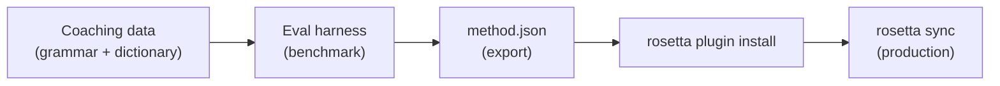

# Tutorial: Criar um Plugin de Tradução

Crie um método de tradução personalizado do zero, faça o benchmark e faça o deploy como um plugin do rosetta. Este é o fluxo de trabalho completo para adicionar um novo par de idiomas que nenhuma API pronta suporta.

**O que você vai criar:** Um plugin de tradução guiada para francês formal com terminologia aplicada, regras gramaticais e pontuações de benchmark.

**Tempo:** 30–45 minutos

**Pré-requisitos:**
- i18n-rosetta instalado (`npm install --save-dev i18n-rosetta`)
- Uma chave de API do OpenRouter (`OPENROUTER_API_KEY`)
- Python 3.10+ (para o eval harness)

---

## Passo 1: Identificar o Problema

Você está traduzindo um dashboard SaaS para o francês. O método `llm` padrão produz traduções corretas, mas inconsistentes:

- Às vezes, "dashboard" vira "tableau de bord", outras vezes "panneau de contrôle"
- O tom alterna entre as formas `tu` e `vous`
- Termos técnicos são anglicizados de forma inconsistente

Você precisa de **aplicação de terminologia** e **controle de registro** que o prompt genérico do LLM não oferece.

## Passo 2: Criar Dados de Coaching

Crie um arquivo de coaching que codifique seus requisitos linguísticos:

```bash
mkdir -p .rosetta/coaching
```

```json title=".rosetta/coaching/fr.json"
{
  "grammar_rules": [
    "Always use the 'vous' form for formal register",
    "French adjectives agree in gender and number with their noun",
    "Use the present tense for UI instructions, not the imperative",
    "Preserve sentence-final punctuation style from the source"
  ],
  "dictionary": {
    "dashboard": "tableau de bord",
    "deployment": "déploiement",
    "settings": "paramètres",
    "environment variable": "variable d'environnement",
    "webhook": "webhook",
    "API key": "clé API",
    "sign in": "se connecter",
    "sign out": "se déconnecter",
    "repository": "dépôt",
    "pull request": "demande de tirage"
  },
  "style_notes": "Formal technical French. Prefer native French terms over anglicisms where established equivalents exist. Keep UI labels concise — 3 words maximum where possible."
}
```

**O que cada campo faz:**
- **`grammar_rules`** — Injetado no prompt de sistema do LLM como restrições explícitas
- **`dictionary`** — Comparado com as chaves de origem; quando um termo do dicionário aparece, ele é injetado como "terminologia obrigatória" no prompt
- **`style_notes`** — Anexado ao prompt de sistema como orientação geral de estilo

## Passo 3: Configurar o Par

Diga ao rosetta para usar `llm-coached` para o francês:

```json title="i18n-rosetta.config.json"
{
  "version": 3,
  "inputLocale": "en",
  "localesDir": "./locales",
  "pairs": {
    "en:fr": {
      "method": "llm-coached",
      "model": "google/gemini-3.5-flash"
    }
  },
  "languages": {
    "fr": {
      "register": "Formal technical French (vous-form)",
      "name": "French"
    }
  }
}
```

## Passo 4: Testar

```bash
npx i18n-rosetta sync --dry
```

Revise a saída do dry-run. Verifique se:
- ✅ Os termos do dicionário são usados de forma consistente ("tableau de bord", não "panneau de contrôle")
- ✅ A forma `vous` é usada em todo o texto
- ✅ Os termos técnicos correspondem ao seu dicionário

Em seguida, execute o sync real:

```bash
npx i18n-rosetta sync
```

## Passo 5: Fazer o Benchmark com o Eval Harness (Opcional)

Se você quiser pontuações de qualidade — e você quer, porque os plugins vêm com dados de benchmark — use o eval harness complementar.

### Instalar o Harness

```bash
git clone https://github.com/gamedaysuits/gds-mt-eval-harness.git
cd gds-mt-eval-harness
pip install -r requirements.txt
```

### Criar um Corpus de Referência

Crie um arquivo com as strings de origem e traduções sabidamente boas:

```json title="corpus/french-formal.json"
[
  {
    "source": "Dashboard",
    "reference": "Tableau de bord"
  },
  {
    "source": "Sign in to your account",
    "reference": "Connectez-vous à votre compte"
  },
  {
    "source": "Your deployment is ready",
    "reference": "Votre déploiement est prêt"
  },
  {
    "source": "Environment variables",
    "reference": "Variables d'environnement"
  }
]
```

### Executar o Benchmark

```bash
python harness.py eval \
  --corpus corpus/french-formal.json \
  --source en \
  --target fr \
  --method llm-coached \
  --model google/gemini-3.5-flash
```

O harness gera como saída:
- **chrF++** — F-score em nível de caractere (0–100). Acima de 70 é um resultado forte.
- **BLEU** — Sobreposição de N-gramas (0–100). Acima de 40 é sólido para tradução guiada.
- **Taxa de correspondência exata** — Proporção de traduções que correspondem exatamente à referência.

### Exportar o Plugin

Quando você estiver satisfeito com as pontuações:

```bash
python harness.py export \
  --name french-formal-v1 \
  --output ./french-formal-v1/
```

Isso cria:

```
french-formal-v1/
├── method.json          # Manifest with config + benchmarks
└── coaching/
    └── fr.json          # Your coaching data
```

## Passo 6: Instalar o Plugin no Rosetta

```bash
npx i18n-rosetta plugin install ./french-formal-v1/
```

Isso copia o plugin para `.rosetta/methods/french-formal-v1/`.

Atualize sua configuração para usá-lo:

```json title="i18n-rosetta.config.json"
{
  "pairs": {
    "en:fr": {
      "methodPlugin": "french-formal-v1"
    }
  }
}
```

## Passo 7: Verificar

```bash
# Check plugin is installed and shows benchmark scores
npx i18n-rosetta status

# Run a sync with the plugin
npx i18n-rosetta sync

# Audit licensing status
npx i18n-rosetta provenance
```

A saída do `status` mostrará:

```
en → fr
  Method:    french-formal-v1 (llm-coached)
  Model:     google/gemini-3.5-flash
  Quality:   high
  chrF++:    74.2
  BLEU:      46.8
  Exact:     42%
```

## O Que Você Criou



Agora você tem:
1. **Dados de coaching** — Regras gramaticais e terminologia que garantem a consistência
2. **Pontuações de benchmark** — Qualidade quantificada que acompanha o plugin
3. **Um plugin portátil** — `method.json` + dados de coaching, instalável em qualquer máquina
4. **Deploy em produção** — Integrado ao seu pipeline de sync

## Próximos Passos

- **[Especificação do Plugin](/docs/reference/plugin-spec)** — Referência completa do formato do manifesto
- **[Métodos de Tradução](/docs/guides/translation-methods)** — Compare todos os quatro métodos
- **[Idiomas com Poucos Recursos](https://mtevalarena.org/docs/community/low-resource-languages)** — Aplique este padrão a idiomas sem cobertura de API
- **[Traduzir 30 Idiomas](/docs/tutorials/translate-30-languages)** — Escale seu projeto para um público global