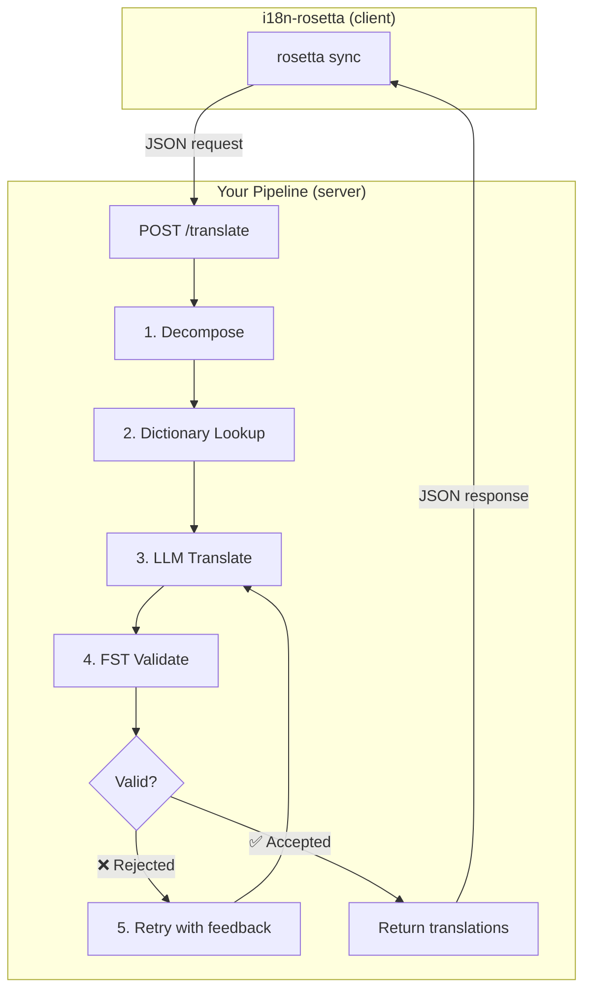
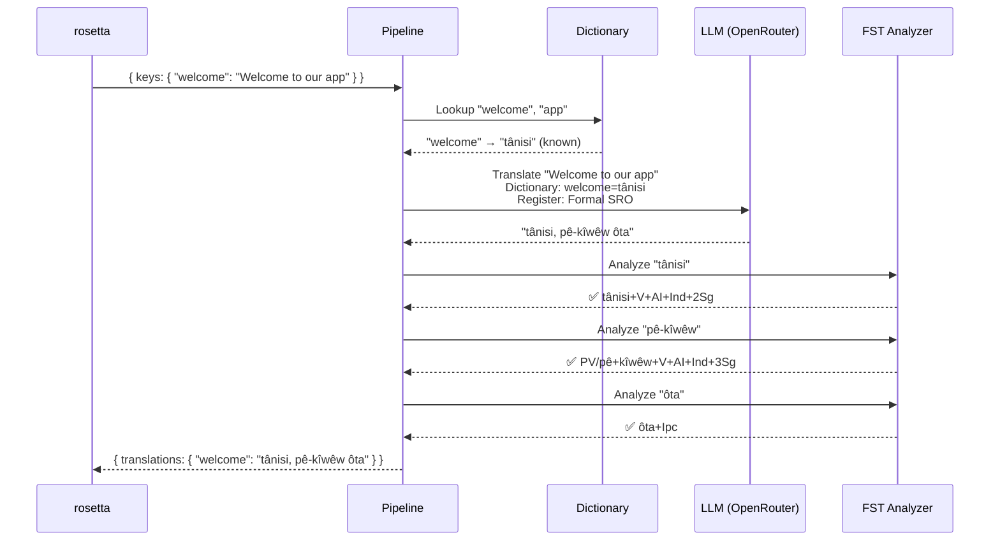
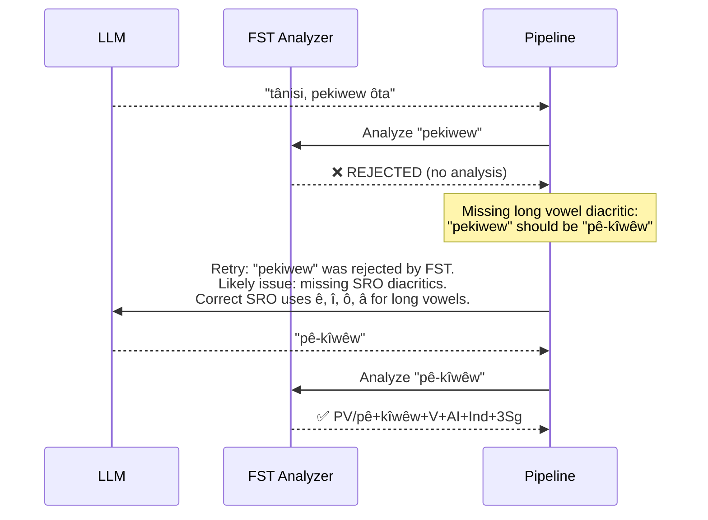
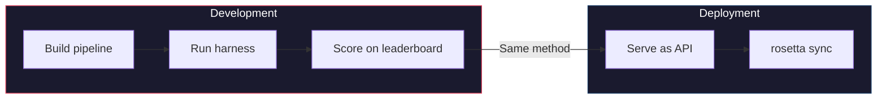

# Cookbook: Pipeline de Tradução FST-Gated

Crie um pipeline de tradução em várias etapas que decompõe o texto de origem, traduz via LLM, valida as saídas com um transdutor de estados finitos (FST) e serve tudo isso como um endpoint HTTP que o rosetta chama através do método `api`.

**O que você vai construir:** Uma API de tradução para Plains Cree que captura traduções morfologicamente inválidas *antes* que elas cheguem aos seus arquivos de localidade.

:::info Pré-requisitos
- Um binário FST em execução (por exemplo, do [analisador Plains Cree do ALTLab](https://github.com/UAlbertaALTLab/lang-crk))
- Node.js 20+ ou Python 3.10+
- Uma chave de API do OpenRouter para a etapa do LLM
:::

---

## Arquitetura

O pipeline é executado como um serviço HTTP independente. O rosetta não sabe nem se importa com o que acontece lá dentro — ele envia chaves e recebe traduções de volta.



### Por que esta arquitetura

Cada etapa tem um trabalho específico:

| Etapa | O que faz | Por que é importante |
|-------|-------------|---------------|
| **Decomposição** | Divide strings compostas de UI em segmentos traduzíveis | Línguas polissintéticas codificam frases inteiras em palavras únicas — o LLM precisa de unidades menores |
| **Consulta ao Dicionário** | Verifica um dicionário bilíngue em busca de traduções conhecidas | Força a terminologia correta para termos conhecidos em vez de depender de adivinhações do LLM |
| **Tradução via LLM** | Envia o segmento para um LLM com contexto de registro e gramática | Lida com frases novas e gera uma saída fluente |
| **Validação FST** | Passa a saída por um analisador morfológico | Captura formas de palavras inválidas — se o FST rejeitar uma palavra, ela não é válida no idioma |
| **Repetição (Retry)** | Reenvia palavras rejeitadas com o feedback de erro do FST | Dá ao LLM informações específicas sobre *por que* a palavra estava errada |

---

## O Fluxo de Dados

Aqui está o que acontece com uma única chave (`"welcome": "Welcome to our app"`) à medida que ela flui pelo pipeline:



### Quando o FST Rejeita



---

## Implementação

### Passo 1: O Esqueleto do Servidor

O servidor implementa o [contrato de método de API](/docs/guides/serving-a-method) do rosetta — um único endpoint `POST /translate`.

```javascript title="server.js"
import express from 'express';
import { translateBatch } from './pipeline.js';

const app = express();
app.use(express.json());

/**
 * rosetta API contract:
 *
 * Request:  { source_locale, target_locale, method, keys: { "key": "source" } }
 * Response: { translations: { "key": "translated" }, meta: { ... } }
 */
app.post('/translate', async (req, res) => {
  const { source_locale, target_locale, method, keys } = req.body;

  // Validate request
  if (!keys || typeof keys !== 'object') {
    return res.status(400).json({ error: { message: 'Missing keys object' } });
  }

  try {
    const startTime = Date.now();
    const { translations, stats } = await translateBatch(keys, {
      sourceLang: source_locale,
      targetLang: target_locale,
    });

    res.json({
      translations,
      meta: {
        model: 'custom-pipeline/fst-gated-v1',
        method: 'decompose-lookup-translate-validate',
        elapsed_ms: Date.now() - startTime,
        fst_acceptance_rate: stats.fstAccepted / stats.total,
        retries: stats.retries,
      },
    });
  } catch (err) {
    console.error('[ERR] Pipeline failed:', err.message);
    res.status(500).json({ error: { message: err.message } });
  }
});

// Health check for rosetta connectivity verification
app.get('/health', (req, res) => res.json({ status: 'ok' }));

app.listen(3001, () => {
  console.log('FST-gated pipeline running on http://localhost:3001');
});
```

### Passo 2: O Pipeline

Cada etapa é uma função. O pipeline as encadeia.

```javascript title="pipeline.js"
import { lookupDictionary } from './dictionary.js';
import { callLLM } from './llm.js';
import { analyzeWithFST } from './fst.js';

const MAX_RETRIES = 3;

/**
 * Translate a batch of keys through the full pipeline.
 *
 * @param {object} keys - Map of key → source string
 * @param {object} options - { sourceLang, targetLang }
 * @returns {{ translations: object, stats: object }}
 */
export async function translateBatch(keys, options) {
  const translations = {};
  const stats = { total: 0, fstAccepted: 0, retries: 0, dictionaryHits: 0 };

  for (const [key, sourceText] of Object.entries(keys)) {
    stats.total++;
    translations[key] = await translateSingle(sourceText, options, stats);
  }

  return { translations, stats };
}

/**
 * Translate a single string through all pipeline stages.
 */
async function translateSingle(sourceText, options, stats) {

  // ── Stage 1: Decompose ──────────────────────────────────
  // Split compound strings into segments the LLM can handle.
  // For UI strings this is often a no-op, but for longer content
  // it prevents the LLM from losing context in long prompts.
  const segments = decompose(sourceText);

  // ── Stage 2: Dictionary Lookup ──────────────────────────
  // Check each segment against the bilingual dictionary.
  // Known terms are forced — the LLM won't override them.
  const knownTerms = {};
  for (const segment of segments) {
    const entry = lookupDictionary(segment.toLowerCase());
    if (entry) {
      knownTerms[segment] = entry;
      stats.dictionaryHits++;
    }
  }

  // ── Stage 3: LLM Translate ──────────────────────────────
  let translation = await callLLM(sourceText, {
    ...options,
    knownTerms,
    register: 'nêhiyawêwin (Plains Cree). Use SRO orthography. '
            + 'Professional register for educational contexts.',
  });

  // ── Stage 4: FST Validate ──────────────────────────────
  // Split the translation into words and check each one.
  let { accepted, rejected } = await validateWords(translation);

  // ── Stage 5: Retry Loop ─────────────────────────────────
  // If any words were rejected, retry with FST feedback.
  let attempt = 0;
  while (rejected.length > 0 && attempt < MAX_RETRIES) {
    attempt++;
    stats.retries++;

    const feedback = rejected
      .map(w => `"${w}" was rejected by the morphological analyzer`)
      .join('; ');

    translation = await callLLM(sourceText, {
      ...options,
      knownTerms,
      register: 'nêhiyawêwin (Plains Cree). Use SRO orthography.',
      feedback: `Previous attempt had invalid words. ${feedback}. `
              + 'Use correct SRO diacritics (ê, î, ô, â for long vowels). '
              + 'Ensure verb forms match expected conjugation patterns.',
    });

    ({ accepted, rejected } = await validateWords(translation));
  }

  if (rejected.length === 0) stats.fstAccepted++;

  return translation;
}

/**
 * Decompose source text into translatable segments.
 *
 * For simple key-value UI strings, this usually returns the
 * original string as a single segment. For longer content,
 * it splits on sentence boundaries.
 */
function decompose(text) {
  // Simple sentence-boundary split. Replace with your own
  // morphological decomposition for more complex needs.
  return text
    .split(/(?<=[.!?])\s+/)
    .filter(s => s.trim().length > 0);
}

/**
 * Validate each word in a translation against the FST.
 *
 * @returns {{ accepted: string[], rejected: string[] }}
 */
async function validateWords(translation) {
  // Split on whitespace and punctuation, keeping only words
  const words = translation
    .split(/[\s,;:.!?'"()[\]{}]+/)
    .filter(w => w.length > 0);

  const accepted = [];
  const rejected = [];

  for (const word of words) {
    const analyses = await analyzeWithFST(word);
    if (analyses.length > 0) {
      accepted.push(word);
    } else {
      rejected.push(word);
    }
  }

  return { accepted, rejected };
}
```

### Passo 3: O Wrapper do FST

Envolva seu binário FST como uma função assíncrona. Este exemplo usa o analisador Plains Cree baseado em HFST do ALTLab.

```javascript title="fst.js"
import { execFile } from 'node:child_process';
import { promisify } from 'node:util';

const execFileAsync = promisify(execFile);

// Path to your FST analyzer binary
const FST_PATH = process.env.FST_ANALYZER_PATH || './bin/crk-analyzer';

/**
 * Run a word through the FST morphological analyzer.
 *
 * Returns an array of analyses. Empty array = rejected.
 *
 * Example:
 *   analyzeWithFST("tânisi")
 *   → ["tânisi+V+AI+Ind+2Sg", "tânisi+V+AI+Cnj+2Sg"]
 *
 *   analyzeWithFST("pekiwew")
 *   → []  // rejected — missing diacritics
 *
 * @param {string} word - A single word in SRO orthography
 * @returns {string[]} Array of FST analyses (empty = rejected)
 */
export async function analyzeWithFST(word) {
  try {
    // HFST lookup: pipe the word to stdin, read analyses from stdout
    const { stdout } = await execFileAsync(
      FST_PATH,
      ['--quiet'],
      { input: word + '\n', timeout: 5000 }
    );

    // Parse HFST output: each line is "input\tanalysis\tweight"
    // Lines with "+?" indicate unrecognized forms
    return stdout
      .split('\n')
      .filter(line => line.includes('\t') && !line.includes('+?'))
      .map(line => line.split('\t')[1]);

  } catch (err) {
    // If the FST binary isn't available, log and reject
    console.error(`[WARN] FST analysis failed for "${word}": ${err.message}`);
    return [];
  }
}
```

### Passo 4: Módulos de Dicionário e LLM

```javascript title="dictionary.js"
/**
 * Simple bilingual dictionary backed by a JSON file.
 *
 * In production, you'd load from the coaching data directory
 * or query itwêwina (https://itwewina.altlab.app/) via API.
 */
const DICTIONARY = {
  'hello': 'tânisi',
  'welcome': 'tânisi',
  'thank you': 'kinanâskomitin',
  'home': 'kīwēwin',
  'search': 'nānātawāpahtam',
  'settings': 'isi-nākatohkēwin',
  'help': 'nīsōhkamākēwin',
  'back': 'kīwē',
};

/**
 * @param {string} term - Lowercase English term
 * @returns {string|null} Cree translation or null
 */
export function lookupDictionary(term) {
  return DICTIONARY[term] || null;
}
```

```javascript title="llm.js"
/**
 * Call an LLM via OpenRouter for translation.
 */
const OPENROUTER_API = 'https://openrouter.ai/api/v1/chat/completions';

export async function callLLM(sourceText, options) {
  const { knownTerms = {}, register, feedback } = options;

  // Build the system prompt with register and known terms
  let systemPrompt = `You are translating English to Plains Cree.\n\n`;
  systemPrompt += `Register: ${register}\n\n`;

  if (Object.keys(knownTerms).length > 0) {
    systemPrompt += `Required terminology (use these exact translations):\n`;
    for (const [en, crk] of Object.entries(knownTerms)) {
      systemPrompt += `  "${en}" → "${crk}"\n`;
    }
    systemPrompt += '\n';
  }

  if (feedback) {
    systemPrompt += `IMPORTANT correction from previous attempt:\n${feedback}\n\n`;
  }

  systemPrompt += `Rules:\n`;
  systemPrompt += `- Use Standard Roman Orthography (SRO)\n`;
  systemPrompt += `- Use macron/circumflex for long vowels: ê, î, ô, â\n`;
  systemPrompt += `- Return ONLY the Cree translation, nothing else\n`;

  const response = await fetch(OPENROUTER_API, {
    method: 'POST',
    headers: {
      'Authorization': `Bearer ${process.env.OPENROUTER_API_KEY}`,
      'Content-Type': 'application/json',
    },
    body: JSON.stringify({
      model: 'google/gemini-2.5-pro',
      messages: [
        { role: 'system', content: systemPrompt },
        { role: 'user', content: sourceText },
      ],
      temperature: 0.2,
    }),
  });

  const json = await response.json();
  return json.choices[0].message.content.trim();
}
```

---

## Conectando ao rosetta

### Configure o par

Aponte seu par de idiomas para o serviço em execução:

```json title="i18n-rosetta.config.json"
{
  "version": 3,
  "inputLocale": "en",
  "pairs": {
    "en:crk": {
      "method": "api",
      "endpoint": "http://localhost:3001/translate"
    }
  },
  "languages": {
    "crk": {
      "name": "Plains Cree",
      "register": "SRO syllabics with grammatical precision."
    }
  }
}
```

### Defina a chave da API

```bash
export ROSETTA_API_KEY="your-service-auth-token"
export OPENROUTER_API_KEY="sk-or-v1-..."  # for the LLM step inside the pipeline
```

### Execute

```bash
# Start the pipeline
node server.js

# In another terminal, run rosetta
npx i18n-rosetta sync
```

O rosetta faz um POST das suas chaves em inglês para o pipeline. O pipeline decompõe, consulta, traduz, valida, tenta novamente e retorna as traduções em Cree. O rosetta as escreve em `crk.json`.

---

## Avaliando Seu Pipeline

O mesmo pipeline pode ser avaliado com o [eval harness](/docs/eval/harness). O harness usa o mesmo padrão JSON-in/JSON-out:

```bash
# Clone the harness
git clone https://github.com/gamedaysuits/gds-mt-eval-harness.git
cd gds-mt-eval-harness

# Run against the EDTeKLA dataset
python eval/baseline_experiment.py \
  --dataset data/edtekla-dev-v1.json \
  --model google/gemini-2.5-pro \
  --fst-analyzer ./bin/crk-analyzer \
  --condition fst-gated-v1 \
  --submit
```

A flag `--fst-analyzer` diz ao harness para executar a validação FST em cada saída — a mesma validação que o seu pipeline faz. Isso permite que você compare a pontuação do seu pipeline com a linha de base (baseline).



**Prove, depois use.** O método que você avalia no harness é o mesmo método que o rosetta chama em produção.

---

## Empacotando como um Plugin

Assim que o seu pipeline tiver pontuações no leaderboard, empacote-o como um plugin do rosetta para que outros possam usá-lo:

```json title="crk-fst-gated-v1/method.json"
{
  "name": "crk-fst-gated-v1",
  "type": "api",
  "version": "1.0.0",
  "description": "FST-gated Plains Cree translation with morphological validation",
  "author": "Your Name",

  "config": {
    "endpoint": "https://your-server.example.com/translate"
  },

  "locales": ["crk"],

  "benchmarks": {
    "crk": {
      "date": "2026-06-01T00:00:00Z",
      "corpus_size": 124,
      "exact_match_rate": 0.12,
      "corpus_chrf": 48.7,
      "model": "google/gemini-2.5-pro",
      "harness_version": "2.0"
    }
  },

  "provenance": {
    "resources": [
      { "name": "ALTLab CRK Analyzer", "license": "LGPL-3.0", "type": "fst" },
      { "name": "Wolvengrey Dictionary", "license": "CC-BY-NC-SA-4.0", "type": "dictionary" }
    ],
    "commercialReady": false,
    "flags": ["nc-resource"]
  }
}
```

Instale-o:

```bash
i18n-rosetta plugin install ./crk-fst-gated-v1/
```

Agora qualquer pessoa com acesso ao seu servidor pode usar o plugin:

```json title="i18n-rosetta.config.json"
{
  "pairs": {
    "en:crk": { "methodPlugin": "crk-fst-gated-v1" }
  }
}
```

---

## Estendendo Este Padrão

Este cookbook demonstra uma arquitetura de pipeline. Você pode adaptá-la para qualquer idioma ou método:

| Variação | O que muda |
|-----------|-------------|
| **FST Diferente** | Troque o caminho do binário. Você pode baixar FSTs pré-compilados (como binários `.hfstol` ou `lttoolbox`) para mais de 100 idiomas no [GitHub do GiellaLT](https://github.com/giellalt) ou [GitHub do Apertium](https://github.com/apertium). |
| **Nenhum FST disponível** | Remova a etapa de execução do FST e use os [arquivos de paradigma plano do UniMorph](https://huggingface.co/datasets/unimorph/universal_morphologies) do Hugging Face para realizar a validação de formas flexionadas por meio de consulta estática em banco de dados. |
| **Múltiplos LLMs** | Encadeie modelos: um modelo rápido para o rascunho inicial, um modelo de raciocínio para correções. |
| **Human-in-the-loop** | Adicione uma etapa de fila que retém traduções incertas para revisão de um especialista antes de retornar. |
| **Modelo Fine-tuned** | Substitua a chamada do OpenRouter por um modelo local (Ollama, vLLM, etc.). |
| **Idioma diferente** | Altere o dicionário, o FST e o registro. A arquitetura permanece idêntica. |

O pipeline é um padrão. As etapas são intercambiáveis. Construa o que funciona para o seu idioma, prove no [leaderboard](/leaderboard) e faça o deploy.

---

## Veja Também

- **[Servindo um Método via API](/docs/guides/serving-a-method)** — a especificação do contrato da API
- **[Especificação de Plugin](/docs/reference/plugin-spec)** — o formato do manifesto method.json
- **[Suporte a um Idioma de Baixo Recurso](/docs/guides/low-resource-languages)** — o contexto mais amplo e os princípios OCAP
- **[Avaliação de MT](/docs/eval/)** — métodos bons vs. ruins, o que é desqualificado
- **[Eval Harness](/docs/eval/harness)** — como fazer o benchmark do seu pipeline
- **[Leaderboard de Métodos](/leaderboard)** — envie suas pontuações
- **[ALTLab](https://altlab.artsrn.ualberta.ca/)** — o Alberta Language Technology Lab (FST para Plains Cree)
- **[Métodos de Tradução](/docs/guides/translation-methods)** — como cada método integrado funciona