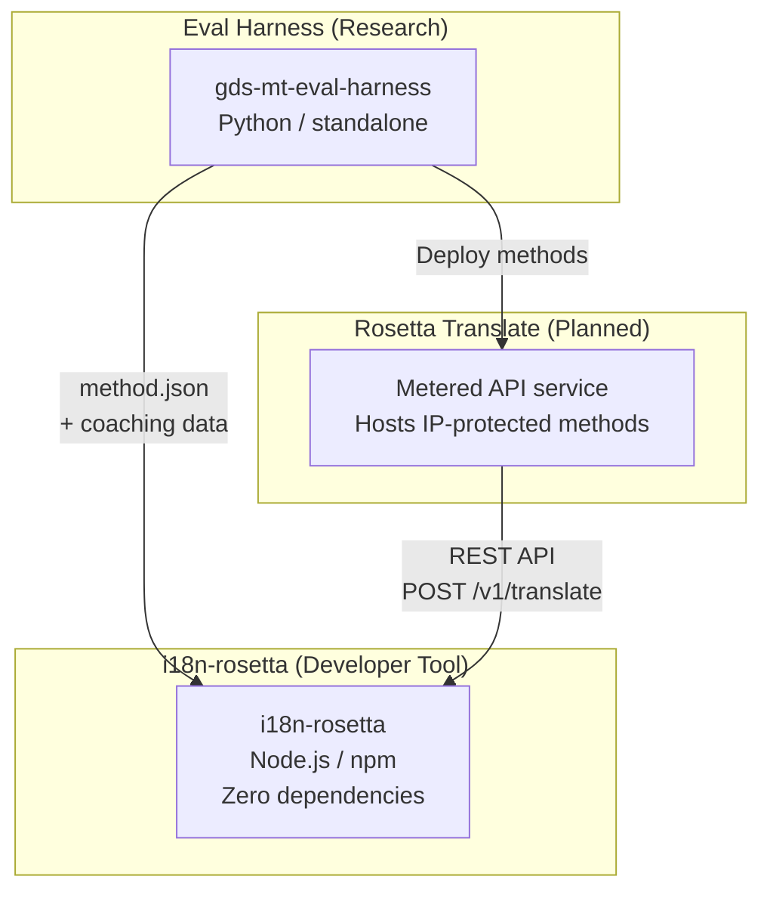
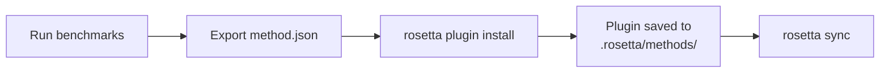
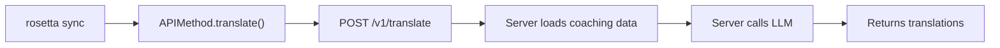

# สถาปัตยกรรม

ระบบนิเวศการแปลของ Rosetta ประกอบด้วยเครื่องมืออิสระ 3 ตัวที่ทำงานร่วมกันผ่านข้อตกลง (contracts) ที่กำหนดไว้อย่างชัดเจน เครื่องมือเหล่านี้ไม่มีการพึ่งพากันในขั้นตอนการบิลด์ (build time) โดยจะสื่อสารกันผ่าน **รูปแบบปลั๊กอินของเมธอด (method plugin format)** และ **ข้อตกลง REST API** ที่ใช้ร่วมกัน

## องค์ประกอบทั้งสาม



### i18n-rosetta (โปรเจกต์นี้)

เครื่องมือสำหรับนักพัฒนาแบบโอเพนซอร์ส ใช้แปลไฟล์ภาษา (locale files) ด้วยเมธอดแบบปลั๊กอิน ไม่มี dependency เพิ่มเติม ไม่บังคับตั้งค่า (config-optional) และพร้อมใช้งานได้ทันที

**เมธอดที่มีในตัว:**
- `llm` → OpenRouter / LLM ใดๆ (มากกว่า 200 โมเดล)
- `llm-coached` → LLM + การสอนไวยากรณ์/พจนานุกรม (grammar/dictionary coaching)
- `openai` → OpenAI API โดยตรง (GPT-4o, GPT-4o-mini)
- `anthropic` → Anthropic API โดยตรง (Claude Sonnet, Haiku, Opus)
- `gemini` → Google Gemini API โดยตรง (Flash, Pro — มีระดับการใช้งานฟรี)
- `google-translate` → Google Cloud Translation API v2
- `deepl` → DeepL API พร้อมรองรับอภิธานศัพท์ (glossary)
- `microsoft-translator` → Azure Cognitive Services Translator
- `libretranslate` → LibreTranslate แบบโฮสต์เอง (AGPL, ฟรี)
- `api` → การเชื่อมต่อแบบบาง (Thin pipe) ไปยัง REST endpoint ระยะไกลใดๆ

### Eval Harness (โปรเจกต์คู่ขนาน)

เครื่องมือวิจัยสำหรับการพัฒนา ทดสอบ และวัดประสิทธิภาพ (benchmarking) เมธอดการแปล เมื่อเมธอดมีคุณภาพถึงระดับที่ยอมรับได้ harness จะส่งออก **ปลั๊กอินของเมธอด** ซึ่งประกอบด้วยไฟล์ manifest `method.json` และไฟล์ข้อมูลการสอน (coaching data) ที่เป็นทางเลือก

harness จะไม่ทำงานอยู่ภายใน rosetta โดยเป็นเครื่องมือแยกต่างหากที่สร้างผลลัพธ์แบบคงที่ (ไฟล์ JSON) และ Rosetta จะทำหน้าที่เพียงแค่อ่านไฟล์เหล่านั้น

[→ Eval Harness บน GitHub](https://github.com/gamedaysuits/gds-mt-eval-harness)

### Rosetta Translate (ตามแผนงาน)

บริการ API แบบคิดค่าใช้จ่ายตามการใช้งาน (metered) ซึ่งโฮสต์เมธอดการแปลที่เป็นกรรมสิทธิ์ไว้ฝั่งเซิร์ฟเวอร์ — พรอมต์ (prompts) ข้อมูลการสอน และไปป์ไลน์ทางภาษาศาสตร์จะไม่มีการส่งออกจากเซิร์ฟเวอร์

## วิธีการเชื่อมต่อ

### Eval Harness → i18n-rosetta (การส่งออกแบบทางเดียว)



**ข้อตกลง**: [ข้อกำหนดของปลั๊กอิน (Plugin Specification)](/docs/reference/plugin-spec)

### Rosetta Translate → i18n-rosetta (API ขณะรันไทม์)



`APIMethod` ของ Rosetta เป็นเพียง **ท่อส่งผ่านข้อมูล (dumb pipe)** โดยจะส่งคีย์ออกไปและรับคำแปลกลับมา ซึ่งไม่มีตรรกะการแปลและไม่มีเนื้อหาที่เป็นกรรมสิทธิ์ใดๆ อยู่เลย

## สิ่งที่แต่ละส่วนประกอบรับรู้เกี่ยวกับส่วนอื่นๆ

| เครื่องมือ | รู้จัก rosetta หรือไม่? | รู้จัก Rosetta Translate หรือไม่? | รู้จัก harness หรือไม่? |
|------|---------------------|-------------------------------|---------------------|
| **i18n-rosetta** | *(คือ rosetta)* | รู้จัก — เมธอด `api` จะเรียกใช้งาน | ไม่รู้จัก — เพียงแค่อ่านข้อมูลที่ปลั๊กอินส่งออก |
| **Rosetta Translate** | รู้จัก — ให้บริการตามคำขอ | *(คือ Rosetta Translate)* | ไม่รู้จัก — รับเมธอดที่ถูกดีพลอย (deployed) มา |
| **Eval Harness** | รู้จัก — ส่งออกรูปแบบปลั๊กอิน | ไม่รู้จัก — เมธอดถูกดีพลอยแยกต่างหาก | *(คือ harness)* |

## สถานการณ์การใช้งานของผู้ใช้

### สถานการณ์ที่ 1: ฟรี ไม่ต้องตั้งค่า (ผู้ใช้ส่วนใหญ่)

```bash
export OPENROUTER_API_KEY=sk-...
npx i18n-rosetta sync
```

ใช้เมธอด `llm` ที่มีในตัว ไม่มีปลั๊กอิน ไม่มี Rosetta Translate ไม่มี harness

### สถานการณ์ที่ 2: พื้นฐานด้วย Google Translate

```bash
export GOOGLE_TRANSLATE_API_KEY=AIza...
npx i18n-rosetta sync
```

ใช้เมธอด `google-translate` ที่มีในตัว ไม่จำเป็นต้องใช้ปลั๊กอิน

### สถานการณ์ที่ 3: ปลั๊กอินแบบเปิดพร้อมการสอนที่รวมมาด้วย

```bash
rosetta plugin install ./french-formal-v1/
rosetta sync
```

ปลั๊กอินมี `type: "llm-coached"` → rosetta จะใช้คีย์ OpenRouter ของผู้ใช้เอง ข้อมูลการสอนจะอยู่ภายในเครื่อง (ไม่มีการเรียกไปยังเซิร์ฟเวอร์)

### สถานการณ์ที่ 4: การสอนแบบทำเอง (ไม่มีปลั๊กอิน ไม่มี harness)

```json title="i18n-rosetta.config.json"
{
  "pairs": {
    "en:fr": { "method": "llm-coached" }
  }
}
```

ผู้ใช้ดูแลรักษากฎไวยากรณ์และพจนานุกรมของตนเองใน `.rosetta/coaching/fr.json`

## หลักการออกแบบ

1. **ไม่มีการพึ่งพาแบบวงกลม (No circular dependencies)** การเชื่อมต่อเป็นแบบทางเดียว
2. **Rosetta คือแกนหลักที่มีน้ำหนักเบา** ไม่มี dependency เพิ่มเติม ไม่บังคับตั้งค่า ปลั๊กอินและ API เป็นส่วนเสริม
3. **การปกป้องทรัพย์สินทางปัญญา (IP) อยู่ในระดับสถาปัตยกรรม** เทคนิคที่เป็นกรรมสิทธิ์จะอยู่ฝั่งเซิร์ฟเวอร์ แพ็กเกจ npm จะไม่มีการจัดส่งสิ่งที่เป็นกรรมสิทธิ์ใดๆ
4. **รูปแบบปลั๊กอินคือข้อตกลง** ทุกอย่างจะไหลผ่าน `method.json`
5. **เครื่องมือแต่ละตัวมีหน้าที่เดียว** Harness → พัฒนาเมธอด Rosetta Translate → โฮสต์เมธอด Rosetta → แปลไฟล์

---

## ดูเพิ่มเติม

- [เมธอดการแปล (Translation Methods)](/docs/guides/translation-methods) — วิธีการทำงานของแต่ละเมธอดที่มีในตัว
- [ข้อกำหนดของปลั๊กอิน (Plugin Specification)](/docs/reference/plugin-spec) — รูปแบบ manifest ของ method.json
- [Eval Harness](/docs/eval/harness) — เครื่องมือวิจัยคู่ขนาน
- [การให้บริการเมธอดผ่าน API (Serving a Method via API)](/docs/guides/serving-a-method) — การโฮสต์ไปป์ไลน์การแปลแบบกำหนดเอง
- [การรองรับภาษาที่มีทรัพยากรน้อย (Support a Low-Resource Language)](/docs/guides/low-resource-languages) — กรณีการใช้งานที่เป็นตัวผลักดันสถาปัตยกรรมนี้