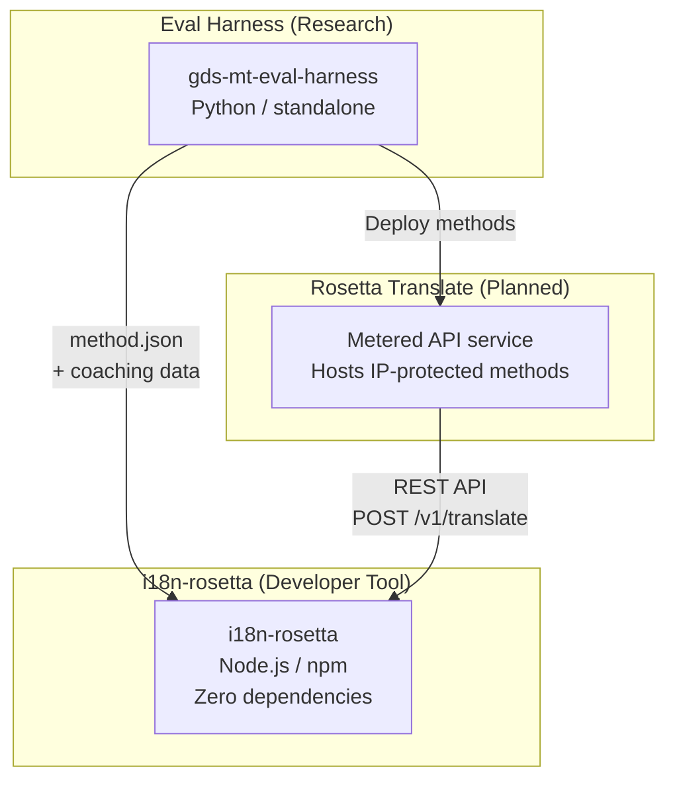
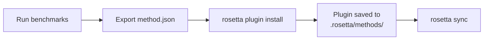
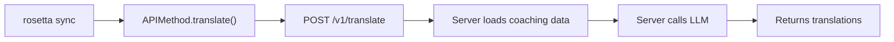
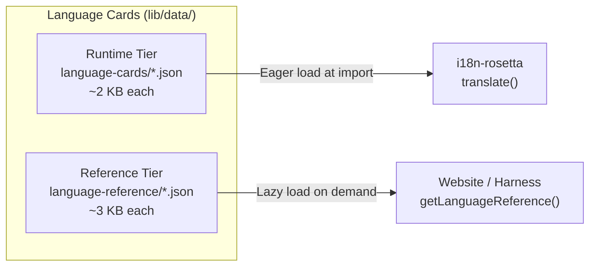

# สถาปัตยกรรม

ระบบนิเวศการแปลของ Rosetta ประกอบด้วยเครื่องมืออิสระสามตัวที่ทำงานร่วมกันผ่านข้อตกลง (contracts) ที่กำหนดไว้อย่างชัดเจน ไม่มีเครื่องมือใดที่พึ่งพากันในขั้นตอนการสร้าง (build time) เครื่องมือเหล่านี้สื่อสารกันผ่าน **รูปแบบปลั๊กอินของวิธีการ (method plugin format)** และ **ข้อตกลง REST API (REST API contract)** ที่ใช้ร่วมกัน

## องค์ประกอบทั้งสามส่วน



### i18n-rosetta (โปรเจกต์นี้)

เครื่องมือสำหรับนักพัฒนาแบบโอเพนซอร์ส ใช้แปลไฟล์ภาษา (locale files) โดยใช้วิธีการแบบเสียบปลั๊กได้ (pluggable methods) ไม่มี dependencies ไม่บังคับตั้งค่า (config-optional) และพร้อมใช้งานได้ทันที

**วิธีการที่มีมาให้ในตัว:**
- `llm` → OpenRouter / LLM ใดๆ (มากกว่า 200 โมเดล)
- `llm-coached` → LLM + การสอนไวยากรณ์/พจนานุกรม (grammar/dictionary coaching)
- `openai` → OpenAI API โดยตรง (GPT-4o, GPT-4o-mini)
- `anthropic` → Anthropic API โดยตรง (Claude Sonnet, Haiku, Opus)
- `gemini` → Google Gemini API โดยตรง (Flash, Pro — มีระดับการใช้งานฟรี)
- `google-translate` → Google Cloud Translation API v2
- `deepl` → DeepL API พร้อมรองรับอภิธานศัพท์ (glossary)
- `microsoft-translator` → Azure Cognitive Services Translator
- `libretranslate` → LibreTranslate แบบโฮสต์เอง (AGPL, ฟรี)
- `api` → การเชื่อมต่อแบบบาง (Thin pipe) ไปยังปลายทาง REST ระยะไกลใดๆ

### Eval Harness (โปรเจกต์คู่ขนาน)

เครื่องมือวิจัยสำหรับการพัฒนา การทดสอบ และการวัดประสิทธิภาพวิธีการแปล เมื่อวิธีการแปลมีคุณภาพถึงระดับที่ยอมรับได้ harness จะส่งออก **ปลั๊กอินของวิธีการ (method plugin)** — ซึ่งประกอบด้วยไฟล์ manifest `method.json` และไฟล์ข้อมูลการสอน (coaching data) ที่เป็นทางเลือก

harness จะไม่ทำงานอยู่ภายใน rosetta โดยเป็นเครื่องมือแยกต่างหากที่สร้างผลลัพธ์แบบคงที่ (ไฟล์ JSON) Rosetta มีหน้าที่เพียงแค่อ่านไฟล์เหล่านั้น

[→ Eval Harness บน GitHub](https://github.com/gamedaysuits/gds-mt-eval-harness)

### Rosetta Translate (แผนในอนาคต)

บริการ API แบบคิดค่าใช้จ่ายตามการใช้งาน (metered API) ที่โฮสต์วิธีการแปลที่เป็นกรรมสิทธิ์ไว้ทางฝั่งเซิร์ฟเวอร์ — โดยที่พรอมต์ (prompts) ข้อมูลการสอน และไปป์ไลน์ทางภาษาศาสตร์จะไม่ออกจากเซิร์ฟเวอร์เลย

## วิธีการเชื่อมต่อ

### Eval Harness → i18n-rosetta (การส่งออกแบบทางเดียว)



**ข้อตกลง**: [ข้อกำหนดของปลั๊กอิน (Plugin Specification)](/docs/reference/plugin-spec)

### Rosetta Translate → i18n-rosetta (API ขณะรันไทม์)



`APIMethod` ของ Rosetta เป็นเพียง **ท่อส่งข้อมูลธรรมดา (dumb pipe)** มีหน้าที่ส่งคีย์ออกไปและรับคำแปลกลับมา โดยไม่มีตรรกะการแปลและไม่มีเนื้อหาที่เป็นกรรมสิทธิ์ใดๆ อยู่เลย

## สิ่งที่แต่ละส่วนประกอบรับรู้เกี่ยวกับส่วนอื่นๆ

| เครื่องมือ | รู้จัก rosetta หรือไม่? | รู้จัก Rosetta Translate หรือไม่? | รู้จัก harness หรือไม่? |
|------|---------------------|-------------------------------|---------------------|
| **i18n-rosetta** | *(คือ rosetta)* | รู้จัก — วิธีการ `api` จะเรียกใช้งาน | ไม่รู้จัก — แค่อ่านข้อมูลที่ปลั๊กอินส่งออก |
| **Rosetta Translate** | รู้จัก — ให้บริการตามคำขอของ rosetta | *(คือ Rosetta Translate)* | ไม่รู้จัก — รับวิธีการที่ถูกปรับใช้ (deployed) มาแล้ว |
| **Eval Harness** | รู้จัก — ส่งออกรูปแบบปลั๊กอิน | ไม่รู้จัก — วิธีการต่างๆ ถูกปรับใช้แยกต่างหาก | *(คือ harness)* |

## สถานการณ์การใช้งานของผู้ใช้

### สถานการณ์ที่ 1: ฟรี, ไม่ต้องตั้งค่า (ผู้ใช้ส่วนใหญ่)

```bash
export OPENROUTER_API_KEY=sk-...
npx i18n-rosetta sync
```

ใช้วิธีการ `llm` ที่มีมาให้ในตัว ไม่มีปลั๊กอิน ไม่มี Rosetta Translate ไม่มี harness

### สถานการณ์ที่ 2: พื้นฐานด้วย Google Translate

```bash
export GOOGLE_TRANSLATE_API_KEY=AIza...
npx i18n-rosetta sync
```

ใช้วิธีการ `google-translate` ที่มีมาให้ในตัว ไม่จำเป็นต้องใช้ปลั๊กอิน

### สถานการณ์ที่ 3: ปลั๊กอินแบบเปิดพร้อมการสอนที่แนบมาด้วย

```bash
rosetta plugin install ./french-formal-v1/
rosetta sync
```

ปลั๊กอินมี `type: "llm-coached"` → rosetta ใช้คีย์ OpenRouter ของคุณเอง ข้อมูลการสอนอยู่ภายในเครื่อง (ไม่มีการเรียกไปยังเซิร์ฟเวอร์)

### สถานการณ์ที่ 4: การสอนแบบ DIY (ไม่มีปลั๊กอิน, ไม่มี harness)

```json title="i18n-rosetta.config.json"
{
  "pairs": {
    "en:fr": { "method": "llm-coached" }
  }
}
```

คุณสามารถดูแลรักษากฎไวยากรณ์และพจนานุกรมของคุณเองใน `.rosetta/coaching/fr.json`

## การ์ดภาษา (Language Cards)

แต่ละภาษาใน rosetta จะถูกกำหนดค่าผ่าน **การ์ดภาษา (Language Card)** — ซึ่งเป็นไฟล์ JSON ที่ประกอบด้วยค่าที่ตั้งไว้ล่วงหน้าของระดับภาษา (register presets) กฎความสุภาพ (formality rules) แฟล็กการรองรับวิธีการ (method support flags) และธรรมเนียมการจัดรูปแบบตัวอักษร (typography conventions) การ์ดภาษาคือการกำหนดค่ารายภาษาที่ขับเคลื่อนการแปลแบบควบคุมระดับภาษา (register-steered translation)



การ์ดจะถูกแบ่งออกเป็นสองระดับเพื่อประสิทธิภาพในการรองรับขนาดที่ใหญ่ขึ้น (ตั้งเป้าหมายไว้ที่มากกว่า 700 ภาษา):

- **ระดับรันไทม์ (Runtime tier)** (`language-cards/`): โหลดทันที (Loaded eagerly) — ฟิลด์ที่เอนจินการแปลต้องการ (ระดับภาษา, ความสุภาพ, การรองรับวิธีการ, กฎการจัดรูปแบบตัวอักษร)
- **ระดับอ้างอิง (Reference tier)** (`language-reference/`): โหลดเมื่อจำเป็น (Loaded lazily) — เอกสารประกอบสำหรับนักพัฒนา (ความท้าทายทางภาษาศาสตร์, ตระกูลภาษา, ทรัพยากร NLP)

ทั้งสองระดับสร้างขึ้นจากแหล่งข้อมูลที่เชื่อถือได้ (IANA, CLDR, Glottolog) โดยใช้ `scripts/generate-language-card.mjs` จากนั้นจึงได้รับการคัดสรรโดยมนุษย์เพื่อความถูกต้องทางภาษาศาสตร์

## หลักการออกแบบ

1. **ไม่มีการพึ่งพากันแบบวงกลม (No circular dependencies)** การเชื่อมต่อเป็นแบบทางเดียว
2. **Rosetta คือแกนหลักที่มีน้ำหนักเบา** ไม่มี dependencies ไม่บังคับตั้งค่า ปลั๊กอินและ API เป็นส่วนเสริม
3. **การปกป้องทรัพย์สินทางปัญญา (IP) อยู่ในระดับสถาปัตยกรรม** เทคนิคที่เป็นกรรมสิทธิ์จะอยู่ฝั่งเซิร์ฟเวอร์ แพ็กเกจ npm จะไม่มีการส่งมอบสิ่งที่เป็นกรรมสิทธิ์ใดๆ
4. **รูปแบบปลั๊กอินคือข้อตกลง** ทุกอย่างจะไหลผ่าน `method.json`
5. **แต่ละเครื่องมือมีหน้าที่เดียว** Harness → พัฒนาวิธีการ, Rosetta Translate → โฮสต์วิธีการ, Rosetta → แปลไฟล์

---

## ดูเพิ่มเติม

- [วิธีการแปล (Translation Methods)](/docs/guides/translation-methods) — วิธีการทำงานของแต่ละวิธีการที่มีมาให้ในตัว
- [ข้อกำหนดของปลั๊กอิน (Plugin Specification)](/docs/reference/plugin-spec) — รูปแบบ manifest ของ method.json
- [Eval Harness](https://mtevalarena.org/docs/specifications/harness) — เครื่องมือวิจัยคู่ขนาน
- [การให้บริการวิธีการผ่าน API (Serving a Method via API)](/docs/guides/serving-a-method) — การโฮสต์ไปป์ไลน์การแปลแบบกำหนดเอง
- [การสนับสนุนภาษาที่มีทรัพยากรน้อย (Support a Low-Resource Language)](https://mtevalarena.org/docs/community/low-resource-languages) — กรณีการใช้งานที่เป็นแรงผลักดันให้เกิดสถาปัตยกรรมนี้