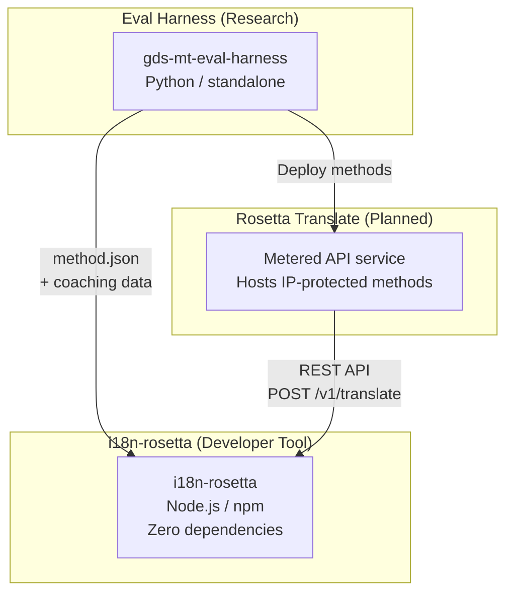
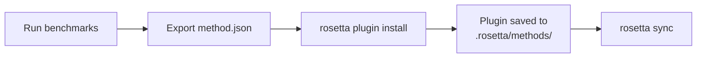
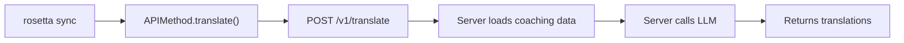

# สถาปัตยกรรม

ระบบนิเวศการแปลของ Rosetta ประกอบด้วยเครื่องมืออิสระสามชิ้นที่ทำงานร่วมกันผ่านข้อตกลง (contracts) ที่กำหนดไว้อย่างชัดเจนครับ เครื่องมือเหล่านี้ไม่มีการพึ่งพากันในขั้นตอนการบิลด์ (build time) โดยจะสื่อสารกันผ่าน **method plugin format** และ **REST API contract** ที่ใช้ร่วมกันครับ

## องค์ประกอบทั้งสามส่วน



### i18n-rosetta (โปรเจกต์นี้)

เครื่องมือสำหรับนักพัฒนาแบบโอเพนซอร์ส (open-source) ทำหน้าที่แปลไฟล์ locale โดยใช้วิธีการแบบปลั๊กอิน (pluggable methods) ไม่มี dependencies ไม่จำเป็นต้องตั้งค่า (config-optional) และพร้อมใช้งานได้ทันทีครับ

**วิธีการที่มีมาให้ในตัว (Built-in methods):**
- `llm` → OpenRouter / LLM ใดๆ ก็ได้
- `llm-coached` → LLM + การโค้ชไวยากรณ์/พจนานุกรม (grammar/dictionary coaching)
- `google-translate` → Google Cloud Translation API
- `api` → ช่องทางเชื่อมต่อขนาดเล็ก (Thin pipe) ไปยัง remote API ใดๆ

### Eval Harness (โปรเจกต์คู่ขนาน)

เครื่องมือวิจัยสำหรับการพัฒนา การทดสอบ และการวัดประสิทธิภาพ (benchmarking) วิธีการแปลต่างๆ ครับ เมื่อวิธีการใดมีคุณภาพถึงเกณฑ์ที่ยอมรับได้ harness จะส่งออก (export) เป็น **method plugin** ซึ่งประกอบด้วย `method.json` manifest และไฟล์ข้อมูลการโค้ช (coaching data) ที่สามารถเลือกใช้ได้ครับ

harness จะไม่ทำงานอยู่ภายใน rosetta ครับ แต่เป็นเครื่องมือแยกต่างหากที่สร้างผลลัพธ์แบบคงที่ (ไฟล์ JSON) โดย Rosetta จะทำหน้าที่เพียงแค่อ่านไฟล์เหล่านั้นครับ

[→ Eval Harness บน GitHub](https://github.com/gamedaysuits/gds-mt-eval-harness)

### Rosetta Translate (แผนในอนาคต)

บริการ API แบบคิดค่าใช้จ่ายตามการใช้งาน (metered API) ซึ่งโฮสต์วิธีการแปลที่เป็นกรรมสิทธิ์ (proprietary) ไว้ที่ฝั่งเซิร์ฟเวอร์ โดยที่ prompts, ข้อมูลการโค้ช และกระบวนการทางภาษา (linguistic pipelines) จะไม่ถูกส่งออกจากเซิร์ฟเวอร์เลยครับ

## วิธีการเชื่อมต่อ

### Eval Harness → i18n-rosetta (การส่งออกแบบทางเดียว)



**ข้อตกลง (Contract)**: [Plugin Specification](/docs/reference/plugin-spec)

### Rosetta Translate → i18n-rosetta (API ขณะรันไทม์)



`APIMethod` ของ Rosetta ทำหน้าที่เป็นเพียง **ช่องทางผ่านข้อมูล (dumb pipe)** ครับ โดยจะส่งคีย์ออกไปและรับคำแปลกลับมา ซึ่งจะไม่มีตรรกะการแปลและไม่มีเนื้อหาที่เป็นกรรมสิทธิ์ใดๆ อยู่ในส่วนนี้เลยครับ

## สิ่งที่แต่ละส่วนประกอบรับรู้เกี่ยวกับส่วนอื่นๆ

| เครื่องมือ (Tool) | รู้จัก rosetta หรือไม่? | รู้จัก Rosetta Translate หรือไม่? | รู้จัก harness หรือไม่? |
|------|---------------------|-------------------------------|---------------------|
| **i18n-rosetta** | *(คือ rosetta)* | รู้จัก — `api` method จะเรียกใช้งาน | ไม่รู้จัก — เพียงแค่อ่าน plugin ที่ส่งออกมาเท่านั้น |
| **Rosetta Translate** | รู้จัก — ให้บริการตามคำขอ | *(คือ Rosetta Translate)* | ไม่รู้จัก — รับ methods ที่ถูก deploy มา |
| **Eval Harness** | รู้จัก — ส่งออก plugin format | ไม่รู้จัก — methods ถูก deploy แยกต่างหาก | *(คือ harness)* |

## สถานการณ์การใช้งานของผู้ใช้ (User Scenarios)

### สถานการณ์ที่ 1: ใช้งานฟรี ไม่ต้องตั้งค่า (ผู้ใช้ส่วนใหญ่)

```bash
export OPENROUTER_API_KEY=sk-...
npx i18n-rosetta sync
```

ใช้วิธีการ `llm` ที่มีมาให้ในตัว ไม่ต้องใช้ปลั๊กอิน ไม่ต้องใช้ Rosetta Translate และไม่ต้องใช้ harness ครับ

### สถานการณ์ที่ 2: ใช้ Google Translate เป็นพื้นฐาน

```bash
export GOOGLE_TRANSLATE_API_KEY=AIza...
npx i18n-rosetta sync
```

ใช้วิธีการ `google-translate` ที่มีมาให้ในตัว โดยไม่จำเป็นต้องใช้ปลั๊กอินครับ

### สถานการณ์ที่ 3: Open plugin พร้อมข้อมูลการโค้ชที่แนบมาด้วย

```bash
rosetta plugin install ./french-formal-v1/
rosetta sync
```

ปลั๊กอินมี `type: "llm-coached"` → rosetta จะใช้คีย์ OpenRouter ของผู้ใช้เอง ข้อมูลการโค้ชจะอยู่ภายในเครื่อง (local) (ไม่มีการเรียกไปยังเซิร์ฟเวอร์) ครับ

### สถานการณ์ที่ 4: การโค้ชแบบ DIY (ไม่มีปลั๊กอิน, ไม่มี harness)

```json title="i18n-rosetta.config.json"
{
  "pairs": {
    "en:fr": { "method": "llm-coached" }
  }
}
```

ผู้ใช้ดูแลจัดการกฎไวยากรณ์และพจนานุกรมของตนเองใน `.rosetta/coaching/fr.json` ครับ

## หลักการออกแบบ (Design Principles)

1. **ไม่มีการพึ่งพากันแบบวงกลม (No circular dependencies)** การเชื่อมต่อจะเป็นแบบทางเดียวครับ
2. **Rosetta คือแกนหลักที่มีน้ำหนักเบา** ไม่มี dependencies ไม่จำเป็นต้องตั้งค่า (config-optional) ส่วนปลั๊กอินและ API เป็นเพียงส่วนเสริมครับ
3. **การปกป้องทรัพย์สินทางปัญญา (IP protection) อยู่ในระดับสถาปัตยกรรม** เทคนิคที่เป็นกรรมสิทธิ์จะอยู่ฝั่งเซิร์ฟเวอร์เท่านั้น แพ็กเกจ npm จะไม่มีการรวมสิ่งที่เป็นกรรมสิทธิ์ใดๆ มาด้วยครับ
4. **รูปแบบปลั๊กอิน (plugin format) คือข้อตกลง** ทุกอย่างจะไหลผ่าน `method.json` ครับ
5. **เครื่องมือแต่ละชิ้นมีหน้าที่เดียว** Harness → พัฒนา methods, Rosetta Translate → โฮสต์ methods, Rosetta → แปลไฟล์ครับ