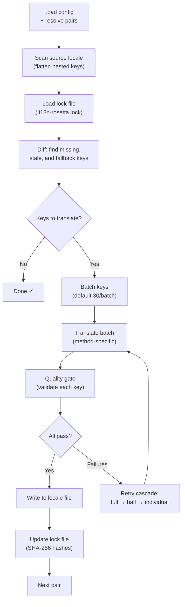

# วิธีการทำงานของ Sync

คำสั่ง `sync` คือการทำงานหลักของ rosetta ครับ และนี่คือสิ่งที่จะเกิดขึ้นเมื่อคุณรัน `npx i18n-rosetta sync`

## ภาพรวมของ Pipeline



## ขั้นตอนการทำงาน

### 1. การจัดการ Config

Rosetta จะโหลด `i18n-rosetta.config.json` (หรือตรวจจับการตั้งค่าโดยอัตโนมัติ) โดยจะจัดการสิ่งต่อไปนี้ครับ:
- Source locale (ภาษาต้นทาง) และ target locales (ภาษาปลายทาง)
- Pair graph (การจับคู่ source→target ที่ต้องการประมวลผล)
- การตั้งค่า method, model และ quality สำหรับแต่ละคู่ภาษา

### 2. การสแกน Source

ไฟล์ source locale จะถูกโหลดและแปลงให้อยู่ในรูปแบบ key→value map ครับ:

```json
// Input (nested)
{ "hero": { "title": "Welcome", "subtitle": "Build" } }

// Flattened
{ "hero.title": "Welcome", "hero.subtitle": "Build" }
```

### 3. การตรวจจับการเปลี่ยนแปลง (Change Detection)

Rosetta จะอ่าน `.i18n-rosetta.lock` ซึ่งจัดเก็บ SHA-256 hashes ของ source values ที่เคยแปลไปแล้ว สำหรับแต่ละ key ระบบจะตรวจสอบดังนี้ครับ:

| เงื่อนไข (Condition) | การดำเนินการ (Action) |
|-----------|--------|
| ไม่มี Key ใน target | **Translate** (แปลใหม่) |
| Source hash มีการเปลี่ยนแปลงตั้งแต่การ sync ครั้งล่าสุด | **Re-translate** (แปลซ้ำเนื่องจากข้อมูลเก่า) |
| Target value ขึ้นต้นด้วย `[EN]` | **Re-translate** (แปลซ้ำสำหรับ fallback placeholder) |
| Source hash ไม่เปลี่ยนแปลง และมี key อยู่แล้ว | **Skip** (ข้าม) |

นี่คือเหตุผลที่ rosetta จะแปลเฉพาะสิ่งที่มีการเปลี่ยนแปลงเท่านั้นครับ — ระบบจะไม่ทำการ re-translate ไฟล์ทั้งหมดของคุณใหม่ในทุกๆ การ sync

### 4. การทำ Batching

Keys จะถูกจัดกลุ่มเป็น batches (ค่าเริ่มต้น: 30 keys/batch สำหรับ LLM, 128 สำหรับ Google Translate) การทำ Batching จะช่วยลดจำนวนรอบการเรียก API ในขณะที่ยังคงรักษาขนาดของ prompts ให้สามารถจัดการได้ครับ

### 5. การแปล (Translation)

แต่ละ batch จะถูกส่งไปยัง translation method ที่ตั้งค่าไว้:

- **`llm`**: Structured prompt ไปยัง OpenRouter พร้อมคำแนะนำเกี่ยวกับ register (ระดับภาษา)
- **`llm-coached`**: เหมือนข้อบน แต่มีการแทรก grammar rules, dictionary และ style notes เข้าไปด้วย
- **`google-translate`**: Batch request ของ Google Cloud Translation API v2
- **`api`**: HTTP POST ไปยัง remote endpoint

System message (register, rules) จะเหมือนกันในทุกๆ batches สำหรับ locale นั้นๆ ซึ่งช่วยให้สามารถทำ **prompt caching** ได้ — ผู้ให้บริการอย่าง Anthropic และ Google จะทำการ cache ตัว system messages ที่ซ้ำกัน เพื่อช่วยลดค่าใช้จ่ายของ token ครับ

### 6. Quality Gate

ทุกๆ การแปลจะถูกตรวจสอบความถูกต้อง (validated) ก่อนที่จะถูกเขียนลงดิสก์ โดยจะมีการตรวจสอบ 5 ขั้นตอนดังนี้ครับ:

| การตรวจสอบ (Check) | สิ่งที่ตรวจจับได้ | ตัวอย่าง |
|-------|----------------|---------|
| **Empty/blank** | Model ไม่ส่งค่าใดๆ กลับมา | `""` |
| **Source echo** | Model ส่งคืนค่า input ภาษาอังกฤษกลับมา | `"Welcome"` สำหรับภาษาญี่ปุ่น |
| **Hallucination loop** | มีการทำซ้ำของ trigrams | `"Qo' Qo' Qo' Qo'"` |
| **Length inflation** | Output มีความยาวมากกว่า source ถึง 4 เท่าขึ้นไป | source 10 ตัวอักษร → output 50 ตัวอักษร |
| **Script compliance** | ใช้ตัวอักษร (script) ผิดสำหรับ locale นั้นๆ | ข้อความอักษรละตินสำหรับ locale ภาษาอาหรับ |

ข้อผิดพลาดจะถูกบันทึก (logged) โดยมีคำนำหน้าเป็น `[GATE]` และจะไม่มีการทำ silent fallbacks ครับ

ดูรายละเอียดเพิ่มเติมได้ที่ [Quality Gate](/docs/concepts/quality-gate) ครับ

### 7. การทำ Retry Cascade

เมื่อเกิดข้อผิดพลาดในการ parse JSON หรือเกิด error ในระดับ batch ตัว rosetta จะทำการ retry โดยลดขนาดของ batches ลงเรื่อยๆ ครับ:

```
Full batch (30 keys) → Failed
Half batch (15 keys) → Failed
Individual keys (1 each) → Isolates the problem key
```

จำนวนครั้งสูงสุดในการ retry จะถูกจำกัดโดย `maxRetries` (ค่าเริ่มต้น: 3) เพื่อป้องกันการใช้ token ที่มากเกินควบคุมครับ

### 8. การ Write & Lock

คำแปลที่ผ่านการตรวจสอบจะถูกเขียนลงในไฟล์ target locale โดยยังคงโครงสร้าง nesting แบบเดิมไว้ และ lock file จะถูกอัปเดตด้วย SHA-256 hashes ใหม่ครับ

## ความสำเร็จบางส่วน (Partial Success)

batch ที่ล้มเหลวเพียงหนึ่ง batch จะไม่บล็อกการทำงานของส่วนที่เหลือครับ หากสำเร็จ 9 จาก 10 batches ทั้ง 9 batches นั้นจะถูกเขียนลงไฟล์ ส่วน batch ที่ล้มเหลวจะถูกบันทึกไว้ใน log และคุณสามารถรัน `sync` อีกครั้งเพื่อทำการ retry ได้ครับ

## Dry Run

ดูตัวอย่างสิ่งที่จะเปลี่ยนแปลงโดยไม่มีการเขียนไฟล์ใดๆ ครับ:

```bash
npx i18n-rosetta sync --dry
```

## การบังคับแปลใหม่ (Force Re-translate)

บังคับให้แปลเฉพาะ keys ที่กำหนดใหม่ แม้ว่าจะไม่มีการเปลี่ยนแปลงก็ตามครับ:

```bash
npx i18n-rosetta sync --force-keys "hero.title,nav.about"
```

## การประเมินค่าใช้จ่าย (Cost Estimation)

ก่อนทำการแปล rosetta จะสร้าง **pre-sync cost report** เพื่อแสดงการประเมินค่าใช้จ่ายต่อคู่ภาษา ขั้นตอนนี้จะทำงานโดยอัตโนมัติในทุกๆ `sync` — คุณจะเห็นรายงานนี้ก่อนที่จะมีการเรียกใช้งาน API ใดๆ ครับ

```
╔══════════════════════════════════════════════════════════╗
║  Cost Estimate                                          ║
╠════════════╦═══════╦════════════╦════════════════════════╣
║ Pair       ║ Keys  ║ Est. Cost  ║ Method                 ║
╠════════════╬═══════╬════════════╬════════════════════════╣
║ en → fr    ║   142 ║ $0.07      ║ google-translate       ║
║ en → ja    ║    38 ║   —        ║ llm (model-dependent)  ║
║ en → crk   ║    38 ║   —        ║ llm-coached            ║
╚════════════╩═══════╩════════════╩════════════════════════╝
```

### สิ่งที่ได้รับการประเมิน

แต่ละ translation method จะมีการประเมินค่าใช้จ่ายในรูปแบบของตัวเองครับ:

| Method | เกณฑ์ค่าใช้จ่าย (Cost Basis) | ความแม่นยำ (Precision) |
|--------|-----------|-----------|
| `google-translate` | อัตราที่ประกาศโดย Google ($20/ล้านตัวอักษร) | แม่นยำ (Accurate) |
| `llm` | แตกต่างกันไปตาม OpenRouter model | ขึ้นอยู่กับ Model — ตรวจสอบ [ราคาของ OpenRouter](https://openrouter.ai/models) |
| `llm-coached` | เหมือนกับ `llm` บวกด้วย coaching context tokens | ขึ้นอยู่กับ Model |
| `api` | กำหนดโดย Server | ไม่ทราบ (Unknown) — ไม่สามารถประเมินได้หากไม่ query ไปยัง endpoint |

เมื่อ method ไม่สามารถระบุค่าใช้จ่ายได้ (LLM methods, remote APIs) rosetta จะรายงานเป็น `—` แทนการคาดเดาครับ คุณสามารถใช้ `--dry` เพื่อดูการประเมินค่าใช้จ่ายโดยไม่ต้องทำการแปลจริงได้ครับ