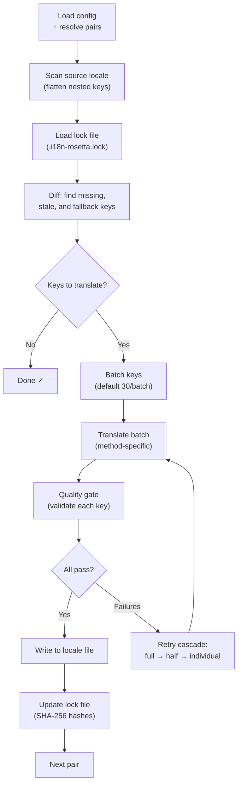

# วิธีการทำงานของ Sync

คำสั่ง `sync` คือการทำงานหลักของ rosetta และนี่คือสิ่งที่จะเกิดขึ้นเมื่อคุณรัน `npx i18n-rosetta sync`

## ภาพรวมของ Pipeline



## ขั้นตอนการทำงาน

### 1. การอ่านค่า Config

Rosetta จะโหลด `i18n-rosetta.config.json` (หรือตรวจจับการตั้งค่าโดยอัตโนมัติ) โดยจะทำการตรวจสอบ:
- Locale ต้นทางและ Locale ปลายทาง
- กราฟการจับคู่ (การจับคู่ต้นทาง→ปลายทางใดบ้างที่ต้องประมวลผล)
- การตั้งค่า method, model และคุณภาพสำหรับการจับคู่แต่ละคู่

### 2. การสแกนข้อมูลต้นทาง

ไฟล์ Locale ต้นทางจะถูกโหลดและแปลงให้อยู่ในรูปแบบ key→value map:

```json
// Input (nested)
{ "hero": { "title": "Welcome", "subtitle": "Build" } }

// Flattened
{ "hero.title": "Welcome", "hero.subtitle": "Build" }
```

### 3. การตรวจจับการเปลี่ยนแปลง

Rosetta จะอ่าน `.i18n-rosetta.lock` ซึ่งเก็บค่า SHA-256 hashes ของข้อมูลต้นทางที่เคยแปลไปแล้ว สำหรับแต่ละ key ระบบจะตรวจสอบดังนี้:

| เงื่อนไข | การดำเนินการ |
|-----------|--------|
| ไม่มี Key ในไฟล์ปลายทาง | **แปล** |
| Hash ต้นทางเปลี่ยนไปจาก sync ครั้งล่าสุด | **แปลใหม่** (ข้อมูลเก่า) |
| ค่าปลายทางขึ้นต้นด้วย `[EN]` | **แปลใหม่** (fallback placeholder) |
| Hash ต้นทางไม่เปลี่ยนแปลง และมี key อยู่แล้ว | **ข้าม** |

นี่คือเหตุผลที่ rosetta แปลเฉพาะส่วนที่มีการเปลี่ยนแปลงเท่านั้น — ระบบจะไม่แปลไฟล์ของคุณใหม่ทั้งหมดในทุกๆ การ sync

### 4. การจัดกลุ่ม (Batching)

Key ต่างๆ จะถูกจัดกลุ่มเป็น batch (ค่าเริ่มต้น: 30 keys/batch สำหรับ LLM, 128 สำหรับ Google Translate) การจัดกลุ่มช่วยลดจำนวนครั้งในการเรียก API ในขณะที่ยังคงรักษาขนาดของ prompt ให้จัดการได้ง่าย

### 5. การแปล

แต่ละ batch จะถูกส่งไปยัง translation method ที่ตั้งค่าไว้:

- **`llm`**: ส่ง Structured prompt ไปยัง OpenRouter พร้อมคำแนะนำเกี่ยวกับระดับภาษา (register) และเพศ
- **`llm-coached`**: เหมือนข้อบน แต่มีการแทรกกฎไวยากรณ์ พจนานุกรม และบันทึกรูปแบบ (style notes) เข้าไปด้วย
- **`google-translate`**: ส่ง batch request ไปยัง Google Cloud Translation API v2
- **`api`**: ส่ง HTTP POST ไปยัง remote endpoint

System message (ระดับภาษา, คำแนะนำเรื่องเพศ, กฎต่างๆ) จะเหมือนกันในทุกๆ batch สำหรับ locale นั้นๆ ซึ่งช่วยให้สามารถทำ **prompt caching** ได้ — ผู้ให้บริการอย่าง Anthropic และ Google จะแคช system message ที่ซ้ำกันไว้ ช่วยลดค่าใช้จ่ายของ token

### 6. การตรวจสอบคุณภาพ (Quality Gate)

ทุกการแปลจะถูกตรวจสอบความถูกต้องก่อนที่จะถูกเขียนลงดิสก์ โดยจะมีการตรวจสอบ 5 ขั้นตอนดังนี้:

| การตรวจสอบ | สิ่งที่ตรวจพบ | ตัวอย่าง |
|-------|----------------|---------|
| **ว่างเปล่า (Empty/blank)** | Model ไม่ส่งค่าใดๆ กลับมา | `""` |
| **ข้อมูลซ้ำกับต้นทาง (Source echo)** | Model ส่งข้อความภาษาอังกฤษที่เป็น input กลับมา | `"Welcome"` สำหรับภาษาญี่ปุ่น |
| **การสร้างข้อมูลผิดปกติ (Hallucination loop)** | มีการทำซ้ำ trigrams | `"Qo' Qo' Qo' Qo'"` |
| **ความยาวเกินจริง (Length inflation)** | Output ยาวกว่าต้นทาง 4 เท่าขึ้นไป | ต้นทาง 10 ตัวอักษร → Output 50 ตัวอักษร |
| **ความถูกต้องของตัวอักษร (Script compliance)** | ใช้ตัวอักษรผิดประเภทสำหรับ locale นั้น | ข้อความอักษรละตินสำหรับ locale ภาษาอาหรับ |

ข้อผิดพลาดจะถูกบันทึก (log) โดยมีคำนำหน้า `[GATE]` จะไม่มีการทำ silent fallback (การใช้ค่าสำรองโดยไม่แจ้งเตือน)

ดูรายละเอียดเพิ่มเติมได้ที่ [Quality Gate](/docs/concepts/quality-gate)

### 7. การลองใหม่แบบลดหลั่น (Retry Cascade)

หากเกิดข้อผิดพลาดในการ parse JSON หรือข้อผิดพลาดระดับ batch ระบบ rosetta จะลองใหม่โดยลดขนาดของ batch ลงเรื่อยๆ:

```
Full batch (30 keys) → Failed
Half batch (15 keys) → Failed
Individual keys (1 each) → Isolates the problem key
```

จำนวนครั้งในการลองใหม่จะถูกจำกัดโดย `maxRetries` (ค่าเริ่มต้น: 3) เพื่อป้องกันการใช้ token มากเกินไป

### 8. การเขียนและล็อก (Write & Lock)

คำแปลที่ผ่านการตรวจสอบจะถูกเขียนลงในไฟล์ locale ปลายทาง โดยยังคงโครงสร้าง nesting เดิมไว้ และไฟล์ lock จะถูกอัปเดตด้วยค่า SHA-256 hashes ใหม่

## ความสำเร็จบางส่วน (Partial Success)

หากมี batch ใดล้มเหลว จะไม่ส่งผลกระทบต่อ batch อื่นๆ หาก 9 ใน 10 batch สำเร็จ ทั้ง 9 batch นั้นจะถูกเขียนลงไฟล์ ส่วน batch ที่ล้มเหลวจะถูกบันทึกไว้ใน log และคุณสามารถรัน `sync` อีกครั้งเพื่อลองใหม่ได้

## การทดสอบรัน (Dry Run)

ดูตัวอย่างสิ่งที่จะเปลี่ยนแปลงโดยไม่มีการเขียนไฟล์ใดๆ:

```bash
npx i18n-rosetta sync --dry
```

## บังคับแปลใหม่ (Force Re-translate)

บังคับให้แปล key ที่ระบุใหม่ แม้ว่าจะไม่มีการเปลี่ยนแปลงก็ตาม:

```bash
npx i18n-rosetta sync --force-keys "hero.title,nav.about"
```

## การประเมินค่าใช้จ่าย (Cost Estimation)

ก่อนทำการแปล rosetta จะสร้าง **รายงานค่าใช้จ่ายก่อนการ sync (pre-sync cost report)** ซึ่งแสดงการประเมินค่าใช้จ่ายต่อคู่ภาษา กระบวนการนี้จะทำงานโดยอัตโนมัติในทุกๆ `sync` — คุณจะเห็นรายงานนี้ก่อนที่จะมีการเรียก API ใดๆ

```
╔══════════════════════════════════════════════════════════╗
║  Cost Estimate                                          ║
╠════════════╦═══════╦════════════╦════════════════════════╣
║ Pair       ║ Keys  ║ Est. Cost  ║ Method                 ║
╠════════════╬═══════╬════════════╬════════════════════════╣
║ en → fr    ║   142 ║ $0.07      ║ google-translate       ║
║ en → ja    ║    38 ║   —        ║ llm (model-dependent)  ║
║ en → crk   ║    38 ║   —        ║ llm-coached            ║
╚════════════╩═══════╩════════════╩════════════════════════╝
```

### สิ่งที่ถูกประเมิน

แต่ละ translation method จะมีการประเมินค่าใช้จ่ายของตัวเอง:

| Method | เกณฑ์ค่าใช้จ่าย | ความแม่นยำ |
|--------|-----------|-----------|
| `google-translate` | อัตราที่ Google ประกาศ ($20/ล้านตัวอักษร) | แม่นยำ |
| `llm` | แตกต่างกันไปตาม model ของ OpenRouter | ขึ้นอยู่กับ Model — ตรวจสอบ [ราคา OpenRouter](https://openrouter.ai/models) |
| `llm-coached` | เหมือนกับ `llm` บวกกับ token ของ coaching context | ขึ้นอยู่กับ Model |
| `api` | กำหนดโดยเซิร์ฟเวอร์ | ไม่ทราบ — ไม่สามารถประเมินได้หากไม่ query ไปยัง endpoint |

เมื่อ method ไม่สามารถระบุค่าใช้จ่ายได้ (LLM methods, remote APIs) rosetta จะรายงานเป็น `—` แทนที่จะคาดเดา คุณสามารถใช้ `--dry` เพื่อดูการประเมินค่าใช้จ่ายโดยไม่ต้องทำการแปลจริง

---

## ดูเพิ่มเติม

- [CLI Reference — sync](/docs/reference/cli#sync) — flag และ option ของคำสั่ง
- [Quality Gate](/docs/concepts/quality-gate) — วิธีการตรวจสอบความถูกต้องของคำแปล
- [Translation Methods](/docs/guides/translation-methods) — วิธีการทำงานของแต่ละ method
- [Configuration](/docs/getting-started/configuration) — ข้อมูลอ้างอิงเกี่ยวกับ config
- [CI/CD Guide](/docs/guides/ci-cd) — การทำ sync อัตโนมัติใน pipeline ของคุณ