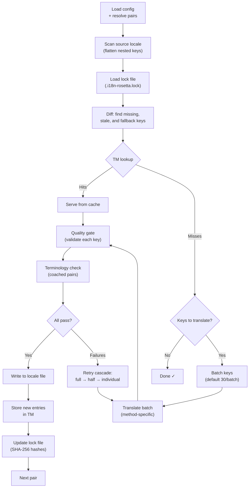

# วิธีการทำงานของ Sync

คำสั่ง `sync` คือการทำงานหลักของ rosetta และนี่คือสิ่งที่จะเกิดขึ้นเมื่อคุณรัน `npx i18n-rosetta sync`

## ภาพรวมของไปป์ไลน์



## ขั้นตอนการทำงาน

### 1. การจัดการการตั้งค่า (Config Resolution)

Rosetta จะโหลด `i18n-rosetta.config.json` (หรือตรวจหาการตั้งค่าโดยอัตโนมัติ) โดยจะจัดการสิ่งต่อไปนี้:
- ภาษาต้นทางและภาษาปลายทาง
- กราฟการจับคู่ (กำหนดว่าต้องประมวลผลคู่ภาษาต้นทาง→ปลายทางใดบ้าง)
- วิธีการ โมเดล และการตั้งค่าคุณภาพสำหรับแต่ละคู่ภาษา

### 2. การสแกนไฟล์ต้นทาง

ไฟล์ภาษาต้นทางจะถูกโหลดและแปลงให้อยู่ในรูปแบบ key→value map:

```json
// Input (nested)
{ "hero": { "title": "Welcome", "subtitle": "Build" } }

// Flattened
{ "hero.title": "Welcome", "hero.subtitle": "Build" }
```

### 3. การตรวจจับการเปลี่ยนแปลง

Rosetta จะอ่าน `.i18n-rosetta.lock` ซึ่งเก็บค่าแฮช SHA-256 ของข้อความต้นทางที่เคยแปลไปแล้ว สำหรับแต่ละคีย์ ระบบจะตรวจสอบดังนี้:

| เงื่อนไข | การดำเนินการ |
|-----------|--------|
| ไม่มีคีย์นี้ในไฟล์ปลายทาง | **แปล (Translate)** |
| แฮชต้นทางเปลี่ยนไปตั้งแต่การซิงค์ครั้งล่าสุด | **แปลใหม่ (Re-translate)** (ข้อมูลเก่า) |
| ค่าปลายทางขึ้นต้นด้วย `[EN]` | **แปลใหม่ (Re-translate)** (ข้อความแทนที่ชั่วคราว) |
| แฮชต้นทางไม่เปลี่ยนแปลง และมีคีย์อยู่แล้ว | **ข้าม (Skip)** |

นี่คือเหตุผลที่ rosetta แปลเฉพาะส่วนที่มีการเปลี่ยนแปลงเท่านั้น — ระบบไม่ได้แปลไฟล์ของคุณใหม่ทั้งหมดในทุกๆ การซิงค์

### 4. การจัดกลุ่ม (Batching)

คีย์ต่างๆ จะถูกจัดกลุ่มเป็นชุด (ค่าเริ่มต้น: 30 คีย์/ชุด สำหรับ LLM, 128 สำหรับ Google Translate) การจัดกลุ่มช่วยลดจำนวนครั้งในการเรียก API ในขณะที่ยังคงทำให้จัดการ prompt ได้ง่าย

### 4b. หน่วยความจำการแปล (Translation Memory)

ก่อนทำการจัดกลุ่ม rosetta จะตรวจสอบแคชของ Translation Memory (`.rosetta/tm.json`) คีย์ที่มีข้อความต้นทาง + ภาษา + วิธีการ ตรงกับที่เคยแปลไปแล้ว จะถูกดึงมาจากแคชทันที — โดยไม่ต้องเรียก API

```
  [TM] 142 key(s) served from cache
  Translating 3 key(s) to French (llm)... [OK]
```

TM คือกลไกหลักในการประหยัดค่าใช้จ่าย การรัน sync ใหม่หลังจากมีการเปลี่ยนคีย์เพียงคีย์เดียว จะแปลแค่คีย์นั้นคีย์เดียว ไม่ใช่ทั้งไฟล์ ดูรายละเอียดเพิ่มเติมที่ [Translation Memory](/docs/concepts/translation-memory)

หากต้องการข้ามการใช้แคชสำหรับการรันเพียงครั้งเดียว: `i18n-rosetta sync --no-tm`

### 5. การแปล

แต่ละชุดจะถูกส่งไปยังวิธีการแปลที่ตั้งค่าไว้:

- **`llm`**: ส่ง prompt แบบมีโครงสร้างไปยัง OpenRouter พร้อมคำแนะนำเรื่องระดับภาษา (register) และเพศ
- **`llm-coached`**: เหมือนข้อบน แต่มีการแทรกกฎไวยากรณ์ พจนานุกรม และหมายเหตุเกี่ยวกับสไตล์การเขียน
- **`google-translate`**: การส่งคำขอแบบกลุ่มไปยัง Google Cloud Translation API v2
- **`api`**: ส่ง HTTP POST ไปยัง endpoint ปลายทาง

ข้อความระบบ (ระดับภาษา, คำแนะนำเรื่องเพศ, กฎต่างๆ) จะเหมือนกันในทุกชุดสำหรับแต่ละภาษา ซึ่งช่วยให้สามารถทำ **prompt caching** ได้ — ผู้ให้บริการอย่าง Anthropic และ Google จะแคชข้อความระบบที่ซ้ำกันไว้ ช่วยลดค่าใช้จ่ายของ token

### 6. การตรวจสอบคุณภาพ (Quality Gate)

ทุกการแปลจะถูกตรวจสอบความถูกต้องก่อนที่จะเขียนลงดิสก์ โดยมีการตรวจสอบ 5 ขั้นตอน:

| การตรวจสอบ | สิ่งที่ตรวจพบ | ตัวอย่าง |
|-------|----------------|---------|
| **ว่างเปล่า (Empty/blank)** | โมเดลไม่ส่งค่าใดๆ กลับมา | `""` |
| **ข้อความซ้ำต้นทาง (Source echo)** | โมเดลส่งข้อความภาษาอังกฤษต้นทางกลับมา | `"Welcome"` สำหรับภาษาญี่ปุ่น |
| **การวนลูปแบบหลอน (Hallucination loop)** | มีการทำซ้ำ trigram | `"Qo' Qo' Qo' Qo'"` |
| **ความยาวเกินจริง (Length inflation)** | ผลลัพธ์ยาวกว่าต้นทาง 4 เท่าขึ้นไป | ต้นทาง 10 ตัวอักษร → ผลลัพธ์ 50 ตัวอักษร |
| **ความถูกต้องของตัวอักษร (Script compliance)** | ใช้ตัวอักษรผิดสำหรับภาษานั้นๆ | ข้อความอักษรละตินสำหรับภาษาอาหรับ |

ข้อผิดพลาดจะถูกบันทึกไว้โดยมีคำนำหน้า `[GATE]` จะไม่มีการใช้ข้อความแทนที่โดยไม่แจ้งให้ทราบ (No silent fallbacks)

ดูรายละเอียดเพิ่มเติมที่ [Quality Gate](/docs/concepts/quality-gate)

### 6b. การตรวจสอบคำศัพท์ (Terminology Verification)

สำหรับคู่ภาษาแบบ coached ที่มีพจนานุกรม rosetta จะตรวจสอบว่า LLM ได้ใช้คำศัพท์ที่กำหนดไว้จริงหรือไม่หลังจากการแปล หากมีการละเมิดจะถูกบันทึกเป็นคำเตือน `[TERM]`:

```
[TERM] en→fr: 2 term violation(s)
  • "dashboard" → expected "tableau de bord" but got "panneau"
```

สิ่งเหล่านี้เป็นเพียงคำเตือน ไม่ใช่ข้อผิดพลาดที่บล็อกการทำงาน — การแปลจะยังคงถูกเขียนลงไฟล์

### 7. การลองใหม่แบบลดหลั่น (Retry Cascade)

เมื่อเกิดข้อผิดพลาดในการแยกวิเคราะห์ JSON หรือข้อผิดพลาดระดับกลุ่ม rosetta จะลองใหม่โดยลดขนาดกลุ่มลงเรื่อยๆ:

```
Full batch (30 keys) → Failed
Half batch (15 keys) → Failed
Individual keys (1 each) → Isolates the problem key
```

จำนวนครั้งในการลองใหม่จะถูกจำกัดโดย `maxRetries` (ค่าเริ่มต้น: 3) เพื่อป้องกันการใช้ token มากเกินไป

### 8. การเขียนและล็อกไฟล์ (Write & Lock)

คำแปลที่ผ่านการตรวจสอบจะถูกเขียนลงในไฟล์ภาษาปลายทาง โดยยังคงโครงสร้างการซ้อนทับ (nesting structure) แบบเดิมไว้ ไฟล์ล็อกจะถูกอัปเดตด้วยค่าแฮช SHA-256 ใหม่

## การแปลเนื้อหา (เฟส 2)

สำหรับโปรเจกต์ Docusaurus และ Hugo `sync` จะรันเฟสที่สองหลังจากการแปลคีย์ JSON เฟสนี้จะแปลไฟล์ Markdown และ MDX (เอกสาร, โพสต์บล็อก, บทช่วยสอน) โดยใช้วิธีการและ Quality Gate เดียวกัน

### วิธีการทำงาน

1. Rosetta จะค้นหาไฟล์เนื้อหาต้นทางทั้งหมด (`.md`, `.mdx`) โดยการไล่ดูในไดเรกทอรี content/docs
2. สำหรับแต่ละคู่ของไฟล์ × ภาษา ระบบจะตรวจสอบไฟล์ล็อกเนื้อหาที่แยกต่างหาก (`.i18n-rosetta-content.lock`) เพื่อหาการเปลี่ยนแปลงของแฮช SHA-256
3. ไฟล์ที่มีการเปลี่ยนแปลงหรือสูญหายจะถูกรวบรวมไว้ในพูลรายการงานแบบแบน (flat work-item pool)
4. พูลนี้จะถูกประมวลผลด้วย **การทำงานพร้อมกันแบบขนาน (parallel concurrency)** (ค่าเริ่มต้น: เรียก API พร้อมกัน 12 รายการ)

```
Phase 2: content (79 translations to process, 341 skipped, concurrency: 12)

    [1/79] (1%)  docs/concepts/security.md → ja [RE-TRANSLATE] (~3328s left)
    [2/79] (3%)  docs/concepts/security.md → th [RE-TRANSLATE] (~1821s left)
    ...
    [79/79] (100%) blog/v3-2-quality.md → de [OK]

  [OK] Created 79 content file(s), 341 unchanged
```

### การทำงานแบบขนานด้วย Flat-pool

ต่างจากเฟส 1 (คีย์ JSON, ทำตามลำดับทีละภาษา) เฟส 2 จะประมวลผลการรวมกันของไฟล์×ภาษาทั้งหมดเป็นรายการแบบแบน ซึ่งหมายความว่าไฟล์ที่ต่างกันและภาษาที่ต่างกันจะถูกแปลไปพร้อมๆ กัน:

- `docs/configuration.md → fr` และ `docs/cli.md → ja` จะรันในเวลาเดียวกัน
- คลังข้อมูลการแปล 420 รายการ จะเสร็จสมบูรณ์ในเวลาประมาณ 11 นาทีที่ระดับการทำงานพร้อมกัน 12 รายการ
- การเขียน manifest แบบเพิ่มทีละส่วน (incremental) ทุกๆ 10 รายการที่เสร็จสมบูรณ์ จะช่วยป้องกันไม่ให้สูญเสียความคืบหน้าหากกระบวนการถูกยกเลิก

คุณสามารถควบคุมการทำงานแบบขนานได้ด้วย `--concurrency` หรือฟิลด์การตั้งค่า `concurrency`:

```bash
# Faster (more parallel calls, higher API load)
npx i18n-rosetta sync --concurrency 20

# Slower (gentler on rate limits)
npx i18n-rosetta sync --concurrency 4
```

### การปกป้องเนื้อหา

ในระหว่างการแปล rosetta จะปกป้องเนื้อหาที่ไม่สามารถแปลได้:

- **บล็อกโค้ด (Code blocks)** (แบบมีกรอบและย่อหน้า) จะถูกแทนที่ด้วยข้อความแทนที่ชั่วคราว (placeholders)
- ฟิลด์ **Frontmatter** ที่ไม่อยู่ในรายการ `translatableFields` จะถูกคงไว้ตามเดิม
- **ลิงก์ (Links)**, พาธของรูปภาพ และแท็ก HTML จะได้รับการปกป้อง
- **Shortcodes** และตัวแปรแทรก (เช่น `{count}`, `{{.Params.title}}`) จะได้รับการปกป้อง

หลังจากการแปล ข้อความแทนที่ชั่วคราวทั้งหมดจะถูกกู้คืนและตรวจสอบความถูกต้อง หากมีส่วนใดขาดหายหรือเสียหาย การแปลนั้นจะถูกปฏิเสธและทำการลองใหม่

## ความสำเร็จบางส่วน (Partial Success)

กลุ่มที่ล้มเหลวเพียงกลุ่มเดียวจะไม่บล็อกกลุ่มที่เหลือ หากสำเร็จ 9 จาก 10 กลุ่ม ทั้ง 9 กลุ่มนั้นจะถูกเขียนลงไฟล์ กลุ่มที่ล้มเหลวจะถูกบันทึกไว้ และคุณสามารถรัน `sync` อีกครั้งเพื่อลองใหม่ได้

## การทดสอบรัน (Dry Run)

ดูตัวอย่างสิ่งที่จะเปลี่ยนแปลงโดยไม่มีการเขียนลงไฟล์ใดๆ:

```bash
npx i18n-rosetta sync --dry-run
```

## บังคับแปลใหม่ (Force Re-translate)

บังคับให้แปลคีย์ที่ระบุใหม่แม้ว่าจะไม่มีการเปลี่ยนแปลงก็ตาม:

```bash
npx i18n-rosetta sync --force-keys "hero.title,nav.about"
```

## การประเมินค่าใช้จ่าย

ก่อนทำการแปล rosetta จะสร้าง **รายงานค่าใช้จ่ายก่อนการซิงค์ (pre-sync cost report)** ซึ่งแสดงค่าใช้จ่ายโดยประมาณสำหรับแต่ละคู่ภาษา การทำงานนี้จะเกิดขึ้นโดยอัตโนมัติในทุกๆ `sync` — คุณจะเห็นรายงานนี้ก่อนที่จะมีการเรียก API ใดๆ

```
╔══════════════════════════════════════════════════════════╗
║  Cost Estimate                                          ║
╠════════════╦═══════╦════════════╦════════════════════════╣
║ Pair       ║ Keys  ║ Est. Cost  ║ Method                 ║
╠════════════╬═══════╬════════════╬════════════════════════╣
║ en → fr    ║   142 ║ $0.07      ║ google-translate       ║
║ en → ja    ║    38 ║   —        ║ llm (model-dependent)  ║
║ en → crk   ║    38 ║   —        ║ llm-coached            ║
╚════════════╩═══════╩════════════╩════════════════════════╝
```

### สิ่งที่ได้รับการประเมิน

วิธีการแปลแต่ละวิธีจะให้การประเมินค่าใช้จ่ายของตนเอง:

| วิธีการ | เกณฑ์ค่าใช้จ่าย | ความแม่นยำ |
|--------|-----------|-----------|
| `google-translate` | อัตราที่ Google ประกาศ ($20/ล้านตัวอักษร) | แม่นยำ |
| `llm` | แตกต่างกันไปตามโมเดล OpenRouter | ขึ้นอยู่กับโมเดล — ตรวจสอบ [ราคาของ OpenRouter](https://openrouter.ai/models) |
| `llm-coached` | เหมือนกับ `llm` บวกกับ token บริบทการโค้ช | ขึ้นอยู่กับโมเดล |
| `api` | กำหนดโดยเซิร์ฟเวอร์ | ไม่ทราบ — ไม่สามารถประเมินได้หากไม่สอบถามไปยัง endpoint |

เมื่อวิธีการใดไม่สามารถกำหนดค่าใช้จ่ายได้ (วิธีการ LLM, API ระยะไกล) rosetta จะรายงานเป็น `—` แทนที่จะคาดเดา คุณสามารถใช้ `--dry` เพื่อดูการประเมินค่าใช้จ่ายโดยไม่ต้องทำการแปลจริง

---

## ดูเพิ่มเติม

- [CLI Reference — sync](/docs/reference/cli#sync) — แฟล็กคำสั่งและตัวเลือกต่างๆ
- [Translation Memory](/docs/concepts/translation-memory) — การแคชและการประหยัดค่าใช้จ่าย
- [Quality Gate](/docs/concepts/quality-gate) — วิธีการตรวจสอบความถูกต้องของการแปล
- [Translation Methods](/docs/guides/translation-methods) — วิธีการทำงานของแต่ละวิธี
- [Working with Professional Translators](/docs/guides/professional-translators) — เวิร์กโฟลว์ XLIFF
- [Configuration](/docs/getting-started/configuration) — ข้อมูลอ้างอิงการตั้งค่า
- [CI/CD Guide](/docs/guides/ci-cd) — การทำ sync อัตโนมัติในไปป์ไลน์ของคุณ