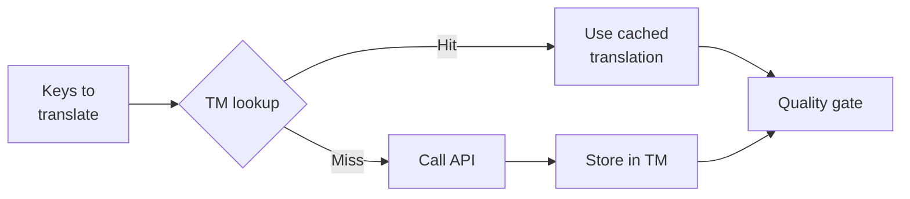

# Translation Memory

Translation Memory (TM) คือเลเยอร์การแคช (caching layer) ที่มีมาให้ในตัวของ rosetta ซึ่งจะจัดเก็บทุกคำแปลโดยใช้คีย์ที่ประกอบด้วย ข้อความต้นฉบับ + โลแคล (locale) + วิธีการ (method) ดังนั้นการรัน `sync` ซ้ำ จะเรียกใช้งาน API เฉพาะคีย์ที่มีการเปลี่ยนแปลงจริงๆ เท่านั้น

## ทำไมถึงต้องมี TM

หากไม่มี TM ทุกๆ `sync` จะทำการแปลใหม่ในทุกคีย์ที่มีการแก้ไข — แม้ว่าคุณจะเคยแปลข้อความภาษาอังกฤษที่เหมือนกันเป๊ะสำหรับโลแคลเดียวกันไปแล้วในการรันครั้งก่อนหน้าก็ตาม สถานการณ์ทั่วไปที่ทำให้สิ้นเปลืองค่าใช้จ่ายมีดังนี้:

| สถานการณ์ | ไม่มี TM | มี TM |
|----------|-----------|---------|
| รันการซิงค์ซ้ำหลังจากเปลี่ยนคีย์ 1 คีย์ (500 คีย์ × 10 โลแคล) | เรียก API 5,000 ครั้ง | เรียก API 10 ครั้ง |
| ย้อนกลับคีย์ไปเป็นค่าภาษาอังกฤษก่อนหน้า | เรียก API เต็มรูปแบบ | พบข้อมูลในแคชทันที (Instant cache hit) |
| วลีเดียวกันปรากฏในไฟล์โลแคล 3 ไฟล์ | เรียก API 3 ครั้ง | เรียก API 1 ครั้ง + พบข้อมูลในแคช 2 ครั้ง |
| Dry-run → ซิงค์จริง | เรียก API เต็มรูปแบบทั้งสองครั้ง | รันครั้งแรกแคชไว้, ครั้งที่สองนำมาใช้ซ้ำ |

TM **เปิดใช้งานเป็นค่าเริ่มต้น** และไม่ต้องตั้งค่าใดๆ คำแปลจะถูกแคชโดยอัตโนมัติในระหว่างทุกๆ `sync` และจะถูกนำมาใช้ในการรันครั้งถัดไป

## วิธีการทำงาน

### คีย์แคช (Cache Key)

แต่ละรายการใน TM จะถูกกำหนดคีย์ด้วยแฮช SHA-256 ของค่าสามค่า:

```
SHA-256( sourceValue + '\x00' + locale + '\x00' + method )
```

| องค์ประกอบ | เหตุผลที่อยู่ในคีย์ |
|-----------|-------------------|
| `sourceValue` | ข้อความภาษาอังกฤษต่างกัน → คำแปลต่างกัน |
| `locale` | "Hello" แปลเป็นภาษาฝรั่งเศสและภาษาญี่ปุ่นต่างกัน |
| `method` | ผลลัพธ์จาก Google Translate ≠ ผลลัพธ์จาก GPT-4o |

ตัวคั่น null byte (`\x00`) ช่วยป้องกันการชนกัน (collision) ระหว่าง `"ab" + "c"` และ `"a" + "bc"`

### ระหว่างการซิงค์ (During Sync)



1. ก่อนที่จะเรียกใช้งาน API การแปล rosetta จะแบ่งคีย์ออกเป็น **TM hits** (พบในแคช) และ **TM misses** (ไม่พบในแคช)
2. Hits จะถูกดึงมาจากแคชทันที — ไม่มีการเรียก API, ไม่มีเวลาแฝง (latency), ไม่มีค่าใช้จ่าย
3. Misses จะเข้าสู่กระบวนการแปลตามปกติ (translation pipeline)
4. คำแปลใหม่จาก API จะถูกจัดเก็บไว้ใน TM สำหรับการรันในอนาคต
5. คำแปลทั้งหมด (ที่แคชไว้ + ที่แปลใหม่) จะผ่านการตรวจสอบคุณภาพ (quality gate)

### การจัดเก็บข้อมูล (Storage)

TM จะถูกจัดเก็บไว้ที่ `.rosetta/tm.json` ใน root ของโปรเจกต์คุณ ไฟล์นี้ใช้รูปแบบ compact JSON (ไม่มีการจัดรูปแบบให้อ่านง่าย หรือ pretty-printing) เพื่อให้ขนาดไฟล์จัดการได้ง่าย แต่ละรายการจะจัดเก็บ:

| ฟิลด์ | คำอธิบาย |
|-------|-------------|
| `t` | ข้อความที่แปลแล้ว |
| `ts` | การประทับเวลา (timestamp) แบบ ISO-8601 ของเวลาที่แคชไว้ |
| `l` | รหัสโลแคลเป้าหมาย (สำหรับสถิติ/การกรอง) |
| `m` | ชื่อวิธีการแปล (สำหรับสถิติ/การกรอง) |

ที่ 50 ภาษา × 500 คีย์ = 25,000 รายการ ไฟล์ควรมีขนาดประมาณ 2-3 MB

## การจัดการแคช

### ดูสถิติ

```bash
i18n-rosetta tm stats
```

แสดงจำนวนรายการ, ขนาดไฟล์, และรายละเอียดแยกตามโลแคล:

```
  Translation Memory — .rosetta/tm.json

  Entries:      2,847
  File size:    1.2 MB
  Created:      2026-05-20
  Last entry:   2026-05-24

  By locale:
    fr       482 entries  (llm: 380, llm-coached: 102)
    de       471 entries  (llm: 471)
    ja       465 entries  (llm: 465)
```

### ล้างแคช

```bash
# Clear everything (with confirmation prompt)
i18n-rosetta tm clear

# Clear without prompt (CI environments)
i18n-rosetta tm clear --yes

# Clear only one locale
i18n-rosetta tm clear --locale fr
```

### ข้าม TM สำหรับการรันหนึ่งครั้ง

```bash
# Force fresh API calls for all keys (useful when switching providers)
i18n-rosetta sync --no-tm
```

การทำเช่นนี้ไม่ได้ลบแคช — เพียงแต่ละเว้นการใช้แคชสำหรับการรันครั้งนี้ และจะไม่จัดเก็บผลลัพธ์ใหม่

## เมื่อใดที่ TM ไม่ช่วยอะไร

TM จะไม่เกิด cache hit เมื่อ:

- **ข้อความต้นฉบับเปลี่ยนแปลง** — ค่าแฮชเปลี่ยนไป จึงถือเป็น miss
- **วิธีการเปลี่ยนแปลง** — การเปลี่ยนจาก `llm` เป็น `google-translate` หมายถึงคีย์แคชที่แตกต่างกัน
- **รันครั้งแรก** — เป็นการเริ่มต้นใหม่ (cold start) ยังไม่มีรายการใดๆ
- **แฟล็ก `--no-tm`** — ข้ามการใช้แคชอย่างชัดเจน

## คุณควร Commit `.rosetta/tm.json` หรือไม่?

**โดยทั่วไปคือไม่ควร** TM เป็นการเพิ่มประสิทธิภาพสำหรับนักพัฒนาในเครื่อง (local) ข้อมูลจะถูกสร้างขึ้นอัตโนมัติระหว่างการซิงค์ และจะช่วยได้ก็ต่อเมื่อรันการซิงค์ซ้ำบนเครื่องเดียวกันเท่านั้น อย่างไรก็ตาม คุณอาจพิจารณา commit ไฟล์นี้หาก:

- ทีมของคุณใช้ CI runner เดียวกันในการซิงค์คำแปล
- คุณต้องการบิลด์ที่ทำซ้ำได้ (reproducible builds) โดยไม่ต้องเรียก API
- คุณกำลังเก็บถาวรคำแปลเพื่อการปฏิบัติตามข้อกำหนด (compliance)

เพิ่ม `.rosetta/tm.json` ลงใน `.gitignore` สำหรับการใช้งานทั่วไป

---

## ดูเพิ่มเติม

- [วิธีการทำงานของการซิงค์](/docs/concepts/how-sync-works) — ตำแหน่งของ TM ในกระบวนการทำงาน
- [ข้อมูลอ้างอิง CLI — tm](/docs/reference/cli#tm) — ข้อมูลอ้างอิงคำสั่ง
- [ข้อมูลอ้างอิง CLI — sync --no-tm](/docs/reference/cli#sync) — การข้าม TM