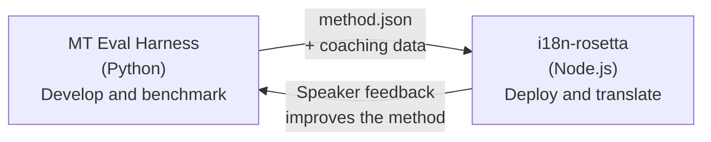

# สะพานเชื่อม Eval Harness

i18n-rosetta และ MT Eval Harness เป็นเครื่องมือสองตัวที่แยกจากกันแต่ประกอบกันเป็นระบบนิเวศเดียว harness คือที่ที่วิธีการแปลได้รับการ **พิสูจน์** ส่วน Rosetta คือที่ที่วิธีการที่ได้รับการพิสูจน์แล้วถูกนำไป **ใช้งานจริง** ทั้งสองเชื่อมต่อกันผ่านรูปแบบปลั๊กอินที่ใช้ร่วมกัน



## ขั้นตอนการทำงาน: การวิจัย → การใช้งานจริง

### 1. สร้างวิธีการใน harness

คลาส Python ใดๆ ที่ใช้งาน `async translate(entries, config) → [{id, predicted}]` สามารถเชื่อมต่อเข้ากับ harness ได้ harness จะไม่สนใจว่ามีอะไรเกิดขึ้นภายใน — ไม่ว่าจะเป็น prompted LLM, โมเดลที่ฝึกสอนมาโดยเฉพาะ, กฎเกณฑ์ที่กำหนดไว้ตายตัว หรืออื่นๆ

### 2. วัดประสิทธิภาพ (Benchmark)

harness จะให้คะแนนวิธีการของคุณโดยเทียบกับคลังข้อมูลมาตรฐานด้วยตัวชี้วัดที่สามารถทำซ้ำได้: chrF++, การยอมรับ FST (สำหรับภาษาที่มีความซับซ้อนทางหน่วยคำ), ความถูกต้องทางหน่วยคำ และการให้คะแนนความหมาย

### 3. ส่งออกเป็นปลั๊กอิน

เมื่อวิธีการของคุณมีคุณภาพถึงระดับที่ยอมรับได้ ให้แพ็กเกจเป็นปลั๊กอินของ rosetta — ซึ่งก็คือ `method.json` manifest พร้อมด้วยข้อมูลการสอน (coaching data) ที่สามารถเลือกใส่ได้

:::info มีแผนพัฒนา Export CLI
ในปัจจุบัน คุณต้องสร้าง method.json manifest ด้วยตนเอง คำสั่ง `mt-eval export` จะช่วยให้ขั้นตอนนี้เป็นไปโดยอัตโนมัติ ดู [Method Interface](https://mtevalarena.org/docs/specifications/methods) สำหรับรูปแบบปลั๊กอินฉบับเต็ม
:::

### 4. ติดตั้งใน rosetta

```bash
i18n-rosetta plugin install ./my-method-plugin/
```

### 5. แปลเนื้อหาจริง

```bash
i18n-rosetta sync
```

วิธีการที่ผ่านการวัดประสิทธิภาพของคุณกำลังสร้างคำแปลจริงในระบบการใช้งานจริงแล้ว

## ขั้นตอนการทำงาน: การใช้งานจริง → การวิจัย

คำแปลที่ถูกนำไปใช้งานจริงจะได้รับการตรวจสอบโดยผู้ที่พูดได้สองภาษา ข้อเสนอแนะของพวกเขาจะช่วยระบุข้อผิดพลาดที่เป็นระบบ (รูปแบบกาลเวลาผิด, คำศัพท์ตกหล่น, การใช้คำที่ไม่เป็นธรรมชาติ) นักวิจัยจะอัปเดตวิธีการใน harness, วัดประสิทธิภาพใหม่, ส่งออกใหม่ และนำไปใช้งานจริงอีกครั้ง ระบบจะเรียนรู้จากการใช้งาน

## รูปแบบปลั๊กอิน

`method.json` manifest คือข้อตกลงระหว่างเครื่องมือทั้งสองตัว:

```json
{
  "name": "crk-coached-v3",
  "type": "llm-coached",
  "version": "3.0.0",
  "description": "Coached LLM translation for Plains Cree",
  "locales": ["crk"],
  "config": {
    "model": "google/gemini-3.5-flash",
    "temperature": 0.3
  },
  "benchmarks": {
    "crk": {
      "composite_score": 0.67,
      "fst_acceptance": 0.82,
      "corpus_size": 150
    }
  }
}
```

ดู [Plugin Specification](/docs/reference/plugin-spec) สำหรับรูปแบบฉบับเต็ม

## สิ่งที่สร้างแล้ว vs สิ่งที่มีแผนพัฒนา

| องค์ประกอบ | สถานะ |
|-----------|--------|
| โปรโตคอล TranslationProcess | ✅ สร้างแล้ว |
| Harness benchmark runner | ✅ สร้างแล้ว |
| รูปแบบปลั๊กอิน method.json | ✅ สร้างแล้ว |
| `rosetta plugin install/remove/list` | ✅ สร้างแล้ว |
| การโหลดข้อมูล Coaching data | ✅ สร้างแล้ว |
| `mt-eval export` CLI | 🔲 มีแผนพัฒนา |
| อินเทอร์เฟซการตรวจสอบโดยชุมชน | 🔲 มีแผนพัฒนา |
| การประเมินชุดทดสอบด้วยการเข้ารหัส | 🔲 มีแผนพัฒนา |

## อ่านเพิ่มเติม

- [Translation Methods](/docs/guides/translation-methods) — วิธีการทั้งหมดที่มีให้ใช้งานและวิธีการทำงาน
- [Plugin Specification](/docs/reference/plugin-spec) — รูปแบบ method.json
- [Serving a Method via API](/docs/guides/serving-a-method) — การโฮสต์วิธีการบนฝั่งเซิร์ฟเวอร์
- [Data Sovereignty](https://mtevalarena.org/docs/sovereignty/data-sovereignty) — OCAP, CARE และการปกป้องด้วยการเข้ารหัส
- [For MT Researchers](https://mtevalarena.org/docs/leaderboard/rules) — เอกสารประกอบของ eval harness