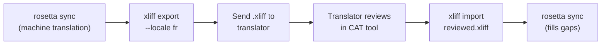

# การทำงานร่วมกับนักแปลมืออาชีพ

Rosetta สร้างคำแปลด้วยเครื่อง (machine translations) แต่บางโปรเจกต์อาจต้องการการตรวจสอบโดยมนุษย์ — เช่น เนื้อหาด้านกฎระเบียบ ข้อความที่ส่งผลต่อภาพลักษณ์ของแบรนด์ หรือ UI ที่มีความสำคัญสูง เวิร์กโฟลว์ XLIFF ช่วยให้คุณสามารถส่งออกคำแปลเพื่อให้ผู้เชี่ยวชาญตรวจสอบ และนำเข้ากลับมาได้อย่างราบรื่น

## XLIFF คืออะไร?

XLIFF (XML Localization Interchange File Format) เป็นรูปแบบไฟล์มาตรฐานอุตสาหกรรมสำหรับการแลกเปลี่ยนข้อมูลในเครื่องมือแปลภาษา เครื่องมือ CAT (Computer-Assisted Translation) ระดับมืออาชีพทุกตัวรองรับรูปแบบนี้:

- **memoQ** — นำเข้า XLIFF, ตรวจสอบตามบริบท, ส่งออกไฟล์ที่ตรวจสอบแล้ว
- **SDL Trados Studio** — รองรับ XLIFF ในตัว
- **Phrase (Memsource)** — อัปโหลดงาน XLIFF สำหรับทีมนักแปล
- **Smartling** — ไปป์ไลน์สำหรับการนำเข้า XLIFF
- **OmegaT** — เครื่องมือ CAT ฟรี/โอเพนซอร์สที่รองรับ XLIFF

Rosetta สร้างไฟล์ XLIFF 1.2 (เวอร์ชันที่รองรับในระดับสากล) แทนที่จะเป็น 2.0+ เพื่อให้เข้ากันได้กับเครื่องมือต่างๆ อย่างสูงสุด

## เวิร์กโฟลว์



### ขั้นตอนที่ 1: สร้างคำแปลด้วยเครื่อง

รัน `sync` ก่อนเพื่อให้ได้คำแปลพื้นฐานจากเครื่อง:

```bash
i18n-rosetta sync
```

### ขั้นตอนที่ 2: ส่งออก XLIFF

ส่งออกคู่ภาษาต้นทาง + ปลายทางเป็น XLIFF:

```bash
i18n-rosetta xliff export --locale fr
```

คำสั่งนี้จะเขียนไฟล์ `.rosetta/xliff/fr.xliff` ซึ่งประกอบด้วย:
- คีย์ต้นทางทุกตัวพร้อมค่าภาษาอังกฤษ
- คำแปลจากเครื่องในปัจจุบัน (ถ้ามี) ในฐานะ `<target>`
- คีย์ที่ยังไม่มีคำแปลจะถูกทำเครื่องหมายเป็น `state="new"`

```xml
<trans-unit id="hero.title" xml:space="preserve">
  <source>Welcome to our platform</source>
  <target state="translated">Bienvenue sur notre plateforme</target>
</trans-unit>
```

### ขั้นตอนที่ 3: ส่งให้นักแปล

ส่งไฟล์ `.xliff` ให้กับนักแปลของคุณ หรืออัปโหลดไปยังแพลตฟอร์ม CAT ของคุณ นักแปลจะเห็นภาษาต้นทางและปลายทางเทียบกันแบบเคียงข้าง และสามารถ:

- แก้ไขคำแปลจากเครื่อง
- เติมคำแปลที่ขาดหายไป
- ตั้งข้อสังเกตปัญหาด้านคุณภาพ
- ใช้ translation memory และ termbases ของตนเอง

### ขั้นตอนที่ 4: นำเข้าไฟล์ที่ตรวจสอบแล้ว

เมื่อนักแปลส่งคืนไฟล์ `.xliff` ที่ตรวจสอบแล้ว ให้คุณนำเข้าไฟล์ดังกล่าว:

```bash
# Preview what will change
i18n-rosetta xliff import .rosetta/xliff/fr.xliff --dry

# Apply changes
i18n-rosetta xliff import .rosetta/xliff/fr.xliff
```

ผลลัพธ์:
```
  ✓ Imported 142 translations for fr
    Updated:    23 (changed from existing)
    Added:      0 (new keys)
    Unchanged:  119
    Written to: locales/fr.json
```

### ขั้นตอนที่ 5: เติมเต็มส่วนที่ขาดหาย

หากมีการเพิ่มคีย์ใหม่หลังจากส่งออก XLIFF ไปแล้ว ให้รัน `sync` เพื่อแปลคีย์เหล่านั้น:

```bash
i18n-rosetta sync
```

Rosetta จะแปลเฉพาะคีย์ที่ยังขาดหายไปเท่านั้น — คำแปลที่ผ่านการตรวจสอบจากการนำเข้า XLIFF จะยังคงถูกเก็บรักษาไว้

## เคล็ดลับ

### ส่งออกแบบกำหนด Path เอง

```bash
# Export to a specific directory
i18n-rosetta xliff export --locale ja --out ./for-review/

# Export with a specific filename
i18n-rosetta xliff export --locale de --out ./review/german.xliff
```

### หลายภาษา (Multiple Locales)

ส่งออกแต่ละภาษาแยกกัน:

```bash
for locale in fr de ja ko; do
  i18n-rosetta xliff export --locale $locale
done
```

### การควบคุมเวอร์ชัน (Version Control)

เพิ่ม `.rosetta/xliff/` ลงใน `.gitignore` — ไฟล์ XLIFF เป็นเพียงอาร์ติแฟกต์ชั่วคราว ไม่ใช่ซอร์สโค้ดของโปรเจกต์:

```gitignore
.rosetta/xliff/
```

### เมื่อใดควรใช้ XLIFF เทียบกับการใช้แค่ `sync`

| สถานการณ์ | คำแนะนำ |
|----------|---------------|
| แอปภายในองค์กร ยอมรับคุณภาพที่ 90%+ ได้ | ใช้แค่ `sync` — คำแปลจากเครื่องก็เพียงพอแล้ว |
| ข้อความการตลาดที่สื่อสารกับผู้ใช้ | ส่งออก XLIFF เพื่อให้มนุษย์ตรวจสอบ |
| เนื้อหาด้านกฎหมาย/กฎระเบียบ | ส่งออก XLIFF — จำเป็นต้องให้มนุษย์ตรวจสอบ |
| มีมากกว่า 50 ภาษา และมีเวลาจำกัด | `sync` ก่อน แล้วส่งออก XLIFF เฉพาะ 5 ภาษาหลักเท่านั้น |
| นักแปลใช้เครื่องมือ CAT อยู่แล้ว | XLIFF เป็นรูปแบบการส่งมอบงานที่เป็นธรรมชาติที่สุด |

---

## ดูเพิ่มเติม

- [CLI Reference — xliff](/docs/reference/cli#xliff) — ข้อมูลอ้างอิงคำสั่ง
- [Translation Memory](/docs/concepts/translation-memory) — การแคชคำแปลที่ตรวจสอบแล้ว
- [Translation Methods](/docs/guides/translation-methods) — ตัวเลือกการแปลด้วยเครื่อง