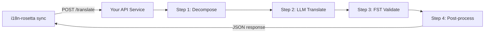

# การให้บริการ Custom Method ในรูปแบบ API

**`api` method** ของ i18n-rosetta ช่วยให้คุณสามารถชี้คู่ภาษาการแปลใดๆ ไปยัง HTTP endpoint ภายนอกได้ นี่คือวิธีที่คุณสามารถผสานรวม pipeline ที่ซับซ้อนเกินกว่าจะใช้ LLM prompt เพียงอย่างเดียว — เช่น morphological analyzers, finite-state transducers (FSTs), multi-step LLM chains หรือ custom research method ใดๆ ที่คุณสร้างขึ้น

## ทำไมต้องเป็น API Service?

translation pipeline บางประเภทไม่สามารถทำงานภายในวงจร prompt-response แบบธรรมดาได้:

| ขั้นตอนของ Pipeline | ตัวอย่าง |
|---|---|
| **Morphological decomposition** | แยกคำประเภท polysynthetic ออกเป็น morpheme ก่อนทำการแปล |
| **FST validation** | ปฏิเสธผลลัพธ์ที่ละเมิดกฎทางสัทวิทยา (phonological) หรือสัณฐานวิทยา (morphological) |
| **Multi-step LLM chains** | วงจรการสร้าง (Generate) → ตรวจสอบ (verify) → แก้ไข (correct) ด้วยโมเดลที่แตกต่างกัน |
| **Dictionary lookup** | ตรวจสอบข้อมูลข้ามกับพจนานุกรมสองภาษาที่จัดเตรียมไว้ในระหว่างกระบวนการของ pipeline |
| **Human-in-the-loop** | จัดคิวการแปลที่ไม่แน่ใจเพื่อให้ผู้เชี่ยวชาญตรวจสอบ |

`api` method จะปฏิบัติต่อ pipeline ของคุณเสมือนเป็น black box — i18n-rosetta จะส่ง source string ไป และ service ของคุณจะส่งคืนคำแปลกลับมา สิ่งที่เกิดขึ้นภายในนั้นขึ้นอยู่กับคุณทั้งหมด

## สถาปัตยกรรม (Architecture)



## การตั้งค่า Service ของคุณ

API service ของคุณต้องมีการใช้งาน endpoint เดียวที่สามารถรับและส่งคืนข้อมูลเป็น JSON ได้:

### รูปแบบ Request

rosetta จะส่ง JSON body ในรูปแบบนี้ (ดู [api.js](https://github.com/gamedaysuits/i18n-rosetta/blob/main/lib/methods/api.js)):

```json
POST /translate
Content-Type: application/json
Authorization: Bearer <ROSETTA_API_KEY>

{
  "source_locale": "en",
  "target_locale": "crk",
  "method": "crk-coached-v1",
  "keys": {
    "greeting": "Hello, welcome to our app",
    "farewell": "Goodbye and thanks"
  }
}
```

| ฟิลด์ | ประเภท | คำอธิบาย |
|-------|------|-------------|
| `source_locale` | string | รหัสภาษาต้นทางตามมาตรฐาน BCP 47 |
| `target_locale` | string | รหัสภาษาปลายทางตามมาตรฐาน BCP 47 |
| `method` | string | ชื่อ Plugin หรือ `"default"` |
| `keys` | object | Map ของ key → source string ที่ต้องการแปล |
```

### Response Format

Your service must return a `translations` object. An optional `meta` object can include cost and diagnostic info:

```json
{
  "translations": {
    "greeting": "tânisi, pê-kîwêw ôta",
    "farewell": "ekosi mâka, kinanâskomitin"
  },
  "meta": {
    "model": "my-custom-pipeline/v1",
    "cost_usd": 0.0042,
    "method": "decompose-translate-validate"
  }
}
```

| Field | Type | Required | Description |
|-------|------|----------|-------------|
| `translations` | object | ✅ | Map of key → translated string |
| `meta` | object | — | Optional metadata |
| `meta.cost_usd` | number | — | If present, displayed in rosetta's output |
| `errors` | object | — | For partial success (HTTP 207): map of key → `{ message }` |

### Minimal Express Server

```javascript
import express from 'express';

const app = express();
app.use(express.json());

/**
 * rosetta API contract:
 *
 * Request:  { source_locale, target_locale, method, keys: { "key": "source" } }
 * Response: { translations: { "key": "translated" }, meta: { ... } }
 */
app.post('/translate', async (req, res) => {
  const { source_locale, target_locale, method, keys } = req.body;

  const translations = {};

  for (const [key, source] of Object.entries(keys)) {
    // --- Your pipeline goes here ---
    // Step 1: Morphological decomposition
    const morphemes = await decompose(source, source_locale);

    // Step 2: LLM translation with context
    const draft = await llmTranslate(morphemes, target_locale);

    // Step 3: FST validation
    const validated = await fstValidate(draft, target_locale);

    // Step 4: Post-processing (orthography normalization, etc.)
    translations[key] = await postProcess(validated);
  }

  res.json({
    translations,
    meta: {
      model: 'my-custom-pipeline/v1',
      method: 'decompose-translate-validate',
    },
  });
});

app.listen(3001, () => {
  console.log('Translation API running on http://localhost:3001');
});
```

## Configuring i18n-rosetta

Point a translation pair at your running service in `i18n-rosetta.config.json`:

```json
{
  "inputLocale": "en",
  "pairs": {
    "en:crk": {
      "method": "api",
      "endpoint": "http://localhost:3001/translate",
      "register": "Formal Plains Cree. Use SRO orthography."
    }
  }
}
```

Then run sync as usual:

```bash
npx i18n-rosetta sync
```

i18n-rosetta will POST your source strings to the endpoint and write the returned translations to `crk.json`.

## Case Study: Plains Cree Pipeline

:::info Under Development
The Plains Cree pipeline described below is **under active development** and is not yet running in production. Details here reflect the current design direction and may change as the project evolves.
:::

The **gds-mt-eval-harness** project demonstrates this pattern. Its Plains Cree pipeline uses:

1. **Morphological decomposition** — Break polysynthetic Cree words into translatable morpheme chains
2. **LLM translation** — Context-enriched GPT-4o translation with coaching data (SRO orthography rules, register instructions)
3. **FST validation** — Finite-state transducer checks that outputs conform to Cree phonological rules
4. **Confidence scoring** — Each translation gets a confidence score based on FST pass rate and dictionary coverage

The entire pipeline runs as a single HTTP endpoint that i18n-rosetta calls via the `api` method.

### Running Evaluations

After translating, you can evaluate output quality using the harness directly:

```bash
# Clone the harness
git clone https://github.com/gamedaysuits/gds-mt-eval-harness.git
cd gds-mt-eval-harness
pip install -e .

# Run the evaluation against your method's output
python eval/baseline_experiment.py --dataset data/edtekla-dev-v1.json --submit
```

This produces structured evaluation records with chrF++, BLEU, and exact match scores that can be used as regression baselines.

## Authentication

If your API requires authentication, set the `apiKey` field or use an environment variable:

```json
{
  "pairs": {
    "en:crk": {
      "method": "api",
      "endpoint": "https://my-mt-service.example.com/translate",
      "apiKey": "${CRK_API_KEY}"
    }
  }
}
```

## Data Sovereignty & OCAP Principles

The `api` method is particularly important for **Indigenous language communities**. By self-hosting the translation pipeline, a community keeps full control over:

- **Proprietary coaching data** — register instructions, orthography rules, and domain glossaries never leave community infrastructure.
- **Linguistic resources** — curated dictionaries, FST grammars, and elder-verified translations remain under community ownership.
- **Access policies** — the community decides who can call the endpoint and under what terms.

This aligns with [OCAP® principles](https://mtevalarena.org/docs/community/low-resource-languages#ocap-principles) (Ownership, Control, Access, Possession), ensuring that sensitive language data is governed by the community rather than a third-party platform.

:::tip
Combine the `api` method with a private deployment (e.g., a community-hosted VM or on-prem server) for the strongest data-sovereignty posture. See [Support a Low-Resource Language](https://mtevalarena.org/docs/community/low-resource-languages) for a full walkthrough.
:::

## Cost Estimation

The `api` method returns `null` for cost estimation by default — your service controls pricing. If you want to provide cost transparency, have your API return a `cost` field in the metadata:

```json
{
  "translations": { "...": "..." },
  "metadata": {
    "cost": {
      "estimatedCost": 0.0042,
      "currency": "USD",
      "source": "my-service-pricing"
    }
  }
}
```

## แนวทางปฏิบัติที่ดีที่สุด (Best Practices)

1. **ส่งคืนค่าสตริงว่าง (empty string) เมื่อเกิดข้อผิดพลาด** — อย่าส่งคืน source string กลับมาเป็น "คำแปล" ให้ส่งคืน `""` แล้ว quality gate ของ i18n-rosetta จะตรวจจับได้เอง key ดังกล่าวจะถูกข้ามไปและจะลองใหม่อีกครั้งในการซิงค์ครั้งถัดไป
2. **รวมคะแนนความมั่นใจ (confidence scores)** — หาก pipeline ของคุณสามารถประเมินคุณภาพได้ ให้ส่งคืนค่าดังกล่าวใน metadata ซึ่งจะช่วยในการตรวจสอบคุณภาพ
3. **ใช้งาน health checks** — เพิ่ม endpoint `GET /health` เพื่อให้ i18n-rosetta สามารถตรวจสอบการเชื่อมต่อได้ก่อนที่จะเริ่มการซิงค์ขนาดใหญ่
4. **จัดการ Rate limit อย่างเหมาะสม** — หาก pipeline ของคุณมีข้อจำกัดด้านปริมาณงาน (throughput limits) ให้ส่งคืน status code `429` ระบบ batch ของ i18n-rosetta จะทำการชะลอการส่งคำขอ (back off) เอง
5. **บันทึก Log ทุกอย่าง** — Multi-step pipeline อาจเกิดข้อผิดพลาดโดยไม่แจ้งเตือน (fail silently) ให้บันทึก input/output ของแต่ละขั้นตอนเพื่อใช้ในการแก้ไขปัญหา (debugging)

## การอนุญาตให้ใช้สิทธิ์ (Licensing)

รูปแบบของ `api` method นั้นเปิดกว้างอย่างสมบูรณ์ — ไม่มีข้อจำกัดด้านลิขสิทธิ์ในการนำ translation pipeline ของคุณเองมาครอบเป็น HTTP service ส่วน `gds-mt-eval-harness` นั้นมีให้ใช้งานภายใต้ MIT license สำหรับเป็น reference implementation

## ดูเพิ่มเติม

- [Translation Methods](/docs/guides/translation-methods) — ภาพรวมของ built-in method ทั้งหมด (`openai`, `google`, `api` ฯลฯ)
- [Plugin Specification](/docs/reference/plugin-spec) — schema ฉบับเต็มสำหรับ `i18n-rosetta.config.json` รวมถึงฟิลด์ของ `api` method
- [Support a Low-Resource Language](https://mtevalarena.org/docs/community/low-resource-languages) — คู่มือแบบ end-to-end สำหรับภาษาที่มีทรัพยากรน้อย รวมถึงหลักการ OCAP
- [Architecture](/docs/concepts/architecture) — วิธีการทำงานของ sync loop, batching และ method dispatch ของ i18n-rosetta
- [MT Evaluation](https://mtevalarena.org/docs/leaderboard/rules) — ระเบียบวิธีในการประเมิน, metrics และขั้นตอนการส่งผลไปยัง leaderboard
- [Method Leaderboard](/leaderboard) — การจัดอันดับคุณภาพแบบเรียลไทม์ของ method และคู่ภาษาต่างๆ