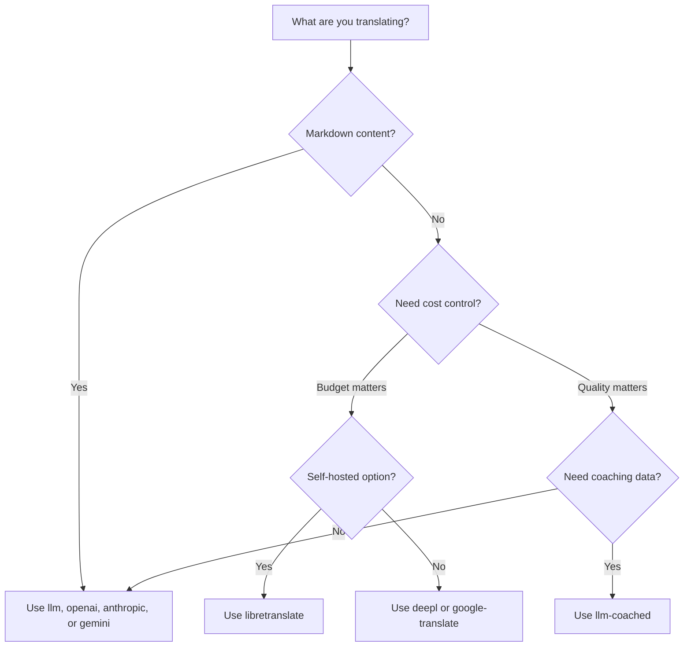

# วิธีการแปลภาษา

Rosetta รองรับวิธีการแปลภาษา 10 วิธี แต่ละคู่ภาษาสามารถใช้วิธีที่แตกต่างกันได้ — คุณไม่จำเป็นต้องยึดติดกับวิธีเดียวสำหรับทั้งโปรเจกต์ของคุณ

## การเปรียบเทียบวิธีการ

### ผู้ให้บริการ LLM

เน้นคุณภาพ, รองรับ Markdown, เข้ากันได้กับ coaching เหมาะที่สุดสำหรับโปรเจกต์ที่มีเนื้อหาเยอะ

| วิธีการ | คีย์ | หน้าที่การทำงาน |
|--------|-----|-------------|
| `llm` (ค่าเริ่มต้น) | `OPENROUTER_API_KEY` | LLM ผ่าน OpenRouter — มีโมเดลมากกว่า 200 แบบ, การกำหนดเส้นทางอัตโนมัติ (auto-routing) |
| `llm-coached` | `OPENROUTER_API_KEY` | LLM + กฎไวยากรณ์, พจนานุกรม, บันทึกรูปแบบ (style notes) |
| `openai` | `OPENAI_API_KEY` | OpenAI API โดยตรง (gpt-4o, gpt-4o-mini) |
| `anthropic` | `ANTHROPIC_API_KEY` | Anthropic API โดยตรง (Claude Sonnet, Haiku, Opus) |
| `gemini` | `GEMINI_API_KEY` | Google Gemini API โดยตรง (Flash, Pro) — มีระดับใช้งานฟรี (free tier) |

### Traditional MT (การแปลด้วยเครื่องแบบดั้งเดิม)

เน้นความเร็วและต้นทุน เหมาะที่สุดสำหรับคู่คีย์-ค่า (key-value pairs) ที่มีปริมาณมาก

| วิธีการ | คีย์ | หน้าที่การทำงาน |
|--------|-----|-------------|
| `google-translate` | `GOOGLE_TRANSLATE_API_KEY` | Google Cloud Translation API v2 (รองรับ 130+ ภาษา) |
| `deepl` | `DEEPL_API_KEY` | DeepL API พร้อมรองรับอภิธานศัพท์ (glossary) (รองรับ 30+ ภาษา) |
| `microsoft-translator` | `MICROSOFT_TRANSLATOR_API_KEY` | Azure Cognitive Services Translator (รองรับ 100+ ภาษา) |
| `libretranslate` | *(self-hosted)* | LibreTranslate แบบโฮสต์เอง (AGPL, ฟรี) |

### โครงสร้างพื้นฐาน (Infrastructure)

| วิธีการ | คีย์ | หน้าที่การทำงาน |
|--------|-----|-------------|
| `api` | *(ตามผู้ให้บริการ)* | Thin HTTP client สำหรับ REST translation endpoint ใดๆ |

## แผนผังการตัดสินใจ (Decision Tree)



---

## `llm` — การแปลด้วย LLM (ค่าเริ่มต้น)

แปลภาษาผ่าน LLM ใดๆ บน [OpenRouter](https://openrouter.ai) นี่คือวิธีการเริ่มต้นและมีความอเนกประสงค์มากที่สุด

**วิธีการทำงาน:**
1. จัดกลุ่มคีย์ (ค่าเริ่มต้น 30 คีย์/กลุ่ม) พร้อมคำแนะนำเกี่ยวกับระดับภาษา (register) และบริบท
2. ส่งไปยัง OpenRouter ในรูปแบบ structured prompt
3. แปลง (Parse) ข้อมูล JSON ที่ตอบกลับมา
4. ตรวจสอบความถูกต้องของคำแปลแต่ละรายการผ่าน [quality gate](/docs/concepts/quality-gate)
5. บันทึกคำแปลที่ผ่านเกณฑ์, ลองใหม่ (retry) หรือปฏิเสธคำแปลที่ไม่ผ่านเกณฑ์

**เมื่อใดควรใช้:** โปรเจกต์ส่วนใหญ่ โดยเฉพาะเว็บไซต์ที่มีเนื้อหาเยอะและใช้ Markdown ซึ่งจำเป็นต้องปกป้อง code blocks และ shortcodes

**การตั้งค่า:**

```json
{
  "defaultMethod": "llm",
  "model": "google/gemini-3.5-flash"
}
```

## `llm-coached` — การแปลด้วย LLM แบบ Coached

เหมือนกับ `llm` แต่มีการแทรกกฎไวยากรณ์, พจนานุกรมคำศัพท์, และบันทึกรูปแบบ (style notes) เข้าไปในทุกๆ prompt

**วิธีการทำงาน:**
1. โหลดข้อมูล coaching จาก `.rosetta/coaching/<locale>.json` หรือจากไดเรกทอรี `coaching/` ของปลั๊กอิน
2. แทรกกฎไวยากรณ์, คำศัพท์ในพจนานุกรม, และบันทึกรูปแบบเข้าไปใน system prompt
3. คำศัพท์ในพจนานุกรมที่ตรงกับคีย์ต้นทางจะถูกรวมไว้เป็นคำศัพท์บังคับ (required terminology)
4. ดำเนินการแปลเช่นเดียวกับ `llm` โดยใช้ข้อมูล coaching เพื่อเพิ่มความแม่นยำ

**เมื่อใดควรใช้:** ภาษาที่มีทรัพยากรน้อย (low-resource languages), คำศัพท์เฉพาะทาง (กฎหมาย, การแพทย์), ระดับภาษาที่เป็นทางการ, หรือกรณีใดๆ ที่ผลลัพธ์จาก LLM ทั่วไปไม่มีความแม่นยำเพียงพอ

**รูปแบบข้อมูล Coaching:**

```json title=".rosetta/coaching/fr.json"
{
  "grammar_rules": [
    "French adjectives agree in gender and number with the noun they modify",
    "Use 'vous' for formal contexts, 'tu' for informal"
  ],
  "dictionary": {
    "dashboard": "tableau de bord",
    "deployment": "déploiement",
    "settings": "paramètres"
  },
  "style_notes": "Prefer active voice. Avoid anglicisms where a native French term exists."
}
```

ดูเพิ่มเติม: [คู่มือสำหรับภาษาที่มีทรัพยากรน้อย (Low-Resource Languages Guide)](https://mtevalarena.org/docs/community/low-resource-languages)

---

## `openai` — OpenAI API โดยตรง

แปลภาษาโดยตรงผ่าน OpenAI Chat Completions API ไม่มีตัวกลางอย่าง OpenRouter — ใช้คีย์ของคุณ, บัญชีของคุณ, และแดชบอร์ดการใช้งานของคุณเอง

**โมเดล:** `gpt-4o` (ค่าเริ่มต้น), `gpt-4o-mini`

**ฟีเจอร์:**
- ✅ รองรับ Markdown (การแปลเนื้อหา)
- ✅ รองรับ Coaching (กฎไวยากรณ์, การแทนที่ด้วยพจนานุกรม, บันทึกรูปแบบ)
- ✅ โหมด JSON สำหรับผลลัพธ์คีย์-ค่าที่มีโครงสร้าง
- ✅ Exponential backoff พร้อมการลองใหม่ (retry)

**การตั้งค่า:**

```json
{
  "pairs": {
    "en:fr": { "method": "openai", "model": "gpt-4o-mini" }
  }
}
```

```bash
export OPENAI_API_KEY=sk-proj-...
```

รับคีย์ของคุณได้ที่ [platform.openai.com/api-keys](https://platform.openai.com/api-keys)

## `anthropic` — Anthropic API โดยตรง

แปลภาษาโดยตรงผ่าน Anthropic Messages API ใช้พารามิเตอร์ `system` สำหรับข้อมูล coaching ซึ่งช่วยให้สามารถใช้ prompt caching ของ Anthropic ได้

**โมเดล:** `claude-sonnet-4-6` (ค่าเริ่มต้น), `claude-haiku-4-5`, `claude-opus-4-7`

**ฟีเจอร์:**
- ✅ รองรับ Markdown (การแปลเนื้อหา)
- ✅ รองรับ Coaching (กฎไวยากรณ์, การแทนที่ด้วยพจนานุกรม, บันทึกรูปแบบ)
- ✅ System prompt caching (เฉลี่ยต้นทุน coaching ในแต่ละกลุ่มข้อมูล)
- ✅ Exponential backoff พร้อมการลองใหม่ (retry)

**การตั้งค่า:**

```json
{
  "pairs": {
    "en:ja": { "method": "anthropic", "model": "claude-haiku-4-5" }
  }
}
```

```bash
export ANTHROPIC_API_KEY=sk-ant-...
```

รับคีย์ของคุณได้ที่ [console.anthropic.com](https://console.anthropic.com/settings/keys)

## `gemini` — Google Gemini API โดยตรง

แปลภาษาโดยตรงผ่าน Google Gemini `generateContent` API **มีระดับใช้งานฟรี (Free tier)** — เป็นจุดเริ่มต้นที่ดีที่สุดแบบไม่มีค่าใช้จ่าย

**โมเดล:** `gemini-2.5-flash` (ค่าเริ่มต้น), `gemini-2.5-pro`

**ฟีเจอร์:**
- ✅ รองรับ Markdown (การแปลเนื้อหา)
- ✅ รองรับ Coaching (กฎไวยากรณ์, การแทนที่ด้วยพจนานุกรม, บันทึกรูปแบบ)
- ✅ โหมดการตอบกลับแบบ JSON ผ่าน `responseMimeType`
- ✅ ระดับใช้งานฟรี (โควต้ารายวันที่ให้มาอย่างเพียงพอ)
- ✅ Exponential backoff พร้อมการลองใหม่ (retry)

**การตั้งค่า:**

```json
{
  "pairs": {
    "en:ko": { "method": "gemini", "model": "gemini-2.5-pro" }
  }
}
```

```bash
export GEMINI_API_KEY=AI...
```

รับคีย์ของคุณได้ที่ [aistudio.google.com/apikey](https://aistudio.google.com/apikey)

### การตรวจสอบความถูกต้องของโมเดล (Model Validation)

ผู้ให้บริการ LLM โดยตรง (`openai`, `anthropic`, `gemini`) จะตรวจสอบสตริงโมเดลของคุณในการใช้งานครั้งแรก ซึ่งจะช่วยตรวจจับข้อผิดพลาด 3 ประเภท:

**รูปแบบวิธีการผิด** — การใช้ path โมเดลสไตล์ OpenRouter กับผู้ให้บริการโดยตรง:

```
[WARN] OpenAI: model "google/gemini-3.5-flash" looks like an OpenRouter path.
       Direct providers use bare model names (e.g., "gpt-4o").
       To use OpenRouter models, set method to 'llm' instead.
```

**ผู้ให้บริการผิด** — การใช้โมเดลจากผู้ให้บริการรายอื่นโดยสิ้นเชิง:

```
[WARN] Gemini: model "claude-sonnet-4-6" is an Anthropic model.
       This provider (gemini) cannot serve Anthropic models.
       Use --method anthropic or set "method": "anthropic" in config.
```

**โมเดลที่เลิกใช้แล้วหรือสะกดผิด** — ในการเรียก API ครั้งแรก rosetta จะดึงรายการโมเดลล่าสุดของผู้ให้บริการและตรวจสอบโมเดลของคุณกับรายการนั้น:

```
[WARN] Gemini: model "gemini-1.5-flash" not found in available models.
       Similar models: gemini-2.0-flash, gemini-2.5-flash, gemini-2.5-pro
       The API call will proceed — the provider will give the final verdict.
```

:::note นี่คือคำเตือน ไม่ใช่ข้อผิดพลาด (errors)
การตรวจสอบโมเดลจะบันทึกคำเตือนแต่จะไม่บล็อกการเรียก API ผู้ให้บริการ API จะเป็นผู้ตัดสินขั้นสุดท้าย — ชื่อโมเดลในอนาคตอาจตรงกับรูปแบบที่แตกต่างออกไป และเราไม่ต้องการปิดกั้นด้วยการใช้ heuristics
:::

---

## `google-translate` — Google Cloud Translation API

การทำงานร่วมกับ Google Cloud Translation API v2 โดยตรง ใช้ REST API — ไม่มี SDK, ไม่มี service account ใช้เพียงแค่ API key เท่านั้น

**เมื่อใดควรใช้:** คู่สตริงคีย์-ค่าที่มีปริมาณมาก ซึ่งความเร็วและต้นทุนมีความสำคัญมากกว่าความสละสลวย รองรับมากกว่า 130 ภาษาตั้งแต่เริ่มต้น

**ข้อจำกัด:**
- ⚠️ **ไม่รองรับ Markdown** จะทำให้ code blocks, shortcodes, และตัวแปร interpolation เสียหาย
- ไม่มีการควบคุมระดับภาษา/น้ำเสียง (register/tone)
- ไม่มีการใช้ coaching หรือการบังคับใช้คำศัพท์เฉพาะ

```bash
npx i18n-rosetta sync --method google-translate
```

:::tip การตรวจจับอัตโนมัติ (Auto-detection)
หากมีการตั้งค่าเพียง `GOOGLE_TRANSLATE_API_KEY` (ไม่มีคีย์ OpenRouter) rosetta จะสลับไปใช้ Google Translate โดยอัตโนมัติ ไม่จำเป็นต้องเปลี่ยนการตั้งค่า
:::

## `deepl` — DeepL API

การทำงานร่วมกับ DeepL translation API โดยตรง รองรับอภิธานศัพท์ (glossaries) เพื่อความสม่ำเสมอของคำศัพท์

**เมื่อใดควรใช้:** ภาษายุโรปที่ DeepL ทำได้ดีเยี่ยม (เยอรมัน, ฝรั่งเศส, สเปน, ดัตช์, โปแลนด์ ฯลฯ) การรองรับอภิธานศัพท์ช่วยบังคับใช้คำศัพท์ให้สม่ำเสมอโดยไม่ต้องใช้ข้อมูล coaching

**ฟีเจอร์:**
- ✅ ตรวจจับ endpoint แบบ free/pro อัตโนมัติ (ต่อท้ายด้วย `:fx` บนคีย์ฟรี)
- ✅ การสร้างและการจัดการอภิธานศัพท์
- ✅ การควบคุมระดับความเป็นทางการ
- ⚠️ **ไม่รองรับ Markdown** — สำหรับคู่คีย์-ค่าเท่านั้น

**การตั้งค่า:**

```json
{
  "pairs": {
    "en:de": { "method": "deepl" }
  }
}
```

```bash
export DEEPL_API_KEY=your-key-here
```

รับคีย์ของคุณได้ที่ [deepl.com/pro-api](https://www.deepl.com/pro-api)

## `microsoft-translator` — Azure Cognitive Services

การทำงานร่วมกับ Microsoft Translator Text API v3 โดยตรง

**เมื่อใดควรใช้:** สภาพแวดล้อมระดับองค์กรที่มีโครงสร้างพื้นฐาน Azure อยู่แล้ว รองรับมากกว่า 100 ภาษา รวมถึงหลายภาษาที่ Google Translate ไม่ครอบคลุม

**ฟีเจอร์:**
- ✅ สูงสุด 100 เซกเมนต์ต่อคำขอ (throughput สูง)
- ✅ พารามิเตอร์ภูมิภาค (region) ที่เป็นทางเลือกเพื่อเพิ่มประสิทธิภาพด้านความหน่วง (latency)
- ⚠️ **ไม่รองรับ Markdown** — สำหรับคู่คีย์-ค่าเท่านั้น
- ⚠️ **ไม่มีการแปลเนื้อหา** — สำหรับคู่คีย์-ค่าเท่านั้น

**การตั้งค่า:**

```json
{
  "pairs": {
    "en:ar": { "method": "microsoft-translator" }
  }
}
```

```bash
export MICROSOFT_TRANSLATOR_API_KEY=your-key
export MICROSOFT_TRANSLATOR_REGION=global  # optional
```

รับคีย์ของคุณจาก [Azure Portal](https://portal.azure.com) → Cognitive Services → Translator

## `libretranslate` — การแปลแบบโฮสต์เอง (Self-Hosted Translation)

การแปลแบบโอเพนซอร์สที่โฮสต์เองโดยใช้ LibreTranslate ทำงานบนเครื่อง (locally) หรือบนโครงสร้างพื้นฐานของคุณเอง — ไม่มีค่าใช้จ่าย API, มีอำนาจอธิปไตยของข้อมูลอย่างเต็มที่

**เมื่อใดควรใช้:** โปรเจกต์ที่ต้องการการแปลแบบออฟไลน์, การปฏิบัติตามกฎระเบียบความเป็นส่วนตัวของข้อมูล (GDPR), หรือการทำงานแบบไม่มีค่าใช้จ่าย มีประโยชน์อย่างยิ่งสำหรับ CI pipelines ที่ไม่ควรพึ่งพา API ภายนอก

**ฟีเจอร์:**
- ✅ โฮสต์เอง — ไม่มีการเรียก API ภายนอก
- ✅ ฟรีและเป็นโอเพนซอร์ส (AGPL-3.0)
- ✅ รองรับการใช้งานผ่าน Docker
- ⚠️ **ไม่รองรับ Markdown** — สำหรับคู่คีย์-ค่าเท่านั้น
- ⚠️ **ไม่มีการแปลเนื้อหา** — สำหรับคู่คีย์-ค่าเท่านั้น
- ⚠️ คุณภาพแตกต่างกันไปตามคู่ภาษา

**การติดตั้ง:**

```bash
# Run LibreTranslate locally with Docker
docker run -d -p 5000:5000 libretranslate/libretranslate

# Configure (optional — defaults to localhost:5000)
export LIBRETRANSLATE_API_URL=http://localhost:5000/translate
```

```json
{
  "pairs": {
    "en:es": { "method": "libretranslate" }
  }
}
```

---

## `api` — Remote Translation API

Thin HTTP client สำหรับ translation endpoints ที่โฮสต์โดยชุมชนหรือได้รับการคุ้มครองทรัพย์สินทางปัญญา (IP-protected) Rosetta จะส่งคีย์ออกไปและรับคำแปลกลับมา — โดยไม่มีตรรกะการแปลใดๆ อยู่ภายใน

**เมื่อใดควรใช้:** เมื่อวิธีการแปลถูกโฮสต์อยู่ฝั่งเซิร์ฟเวอร์ (เช่น ข้อมูล coaching ที่เป็นกรรมสิทธิ์, โมเดลที่ผ่านการ fine-tune, FST pipelines ที่ไม่สามารถแจกจ่ายได้)

```json
{
  "pairs": {
    "en:crk": {
      "method": "api",
      "endpoint": "https://api.example.com/v1/translate",
      "apiKey": "your-key"
    }
  }
}
```

:::note การแปลโดยชุมชนที่รองรับ OCAP (OCAP-Compatible Community Translation)
วิธีการ `api` คือสะพานเชื่อมไปยัง **การแปลที่โฮสต์โดยชุมชนซึ่งรองรับ OCAP** ชุมชนชนพื้นเมืองและภาษาชนกลุ่มน้อยสามารถโฮสต์ translation endpoints ของตนเองได้ — โดยเก็บข้อมูล coaching, โมเดลที่ผ่านการ fine-tune, และทรัพย์สินทางปัญญาด้านภาษาศาสตร์ไว้ภายใต้การควบคุมของชุมชน — ในขณะที่ Rosetta เชื่อมต่อกับพวกเขาในฐานะ thin client

ดู [การสนับสนุนภาษาที่มีทรัพยากรน้อย (Support a Low-Resource Language)](https://mtevalarena.org/docs/community/low-resource-languages) สำหรับคำแนะนำฉบับเต็มเกี่ยวกับการโฮสต์โดยชุมชน และ [การให้บริการวิธีการผ่าน API (Serving a Method via API)](/docs/guides/serving-a-method) สำหรับข้อกำหนดของ endpoint
:::

---

## การตั้งค่าตามคู่ภาษา (Per-Pair Configuration)

พลังที่แท้จริงคือการผสมผสานวิธีการตามคู่ภาษา:

```json title="i18n-rosetta.config.json"
{
  "version": 3,
  "pairs": {
    "en:fr": { "method": "deepl" },
    "en:ja": { "method": "openai", "model": "gpt-4o" },
    "en:ko": { "method": "gemini" },
    "en:ar": { "method": "microsoft-translator" },
    "en:crk": { "methodPlugin": "crk-coached-v1" }
  }
}
```

วิธีนี้จะแปลภาษาฝรั่งเศสผ่าน DeepL (รองรับอภิธานศัพท์), ภาษาญี่ปุ่นผ่าน OpenAI (เน้นคุณภาพ), ภาษาเกาหลีผ่าน Gemini (ระดับใช้งานฟรี), ภาษาอาหรับผ่าน Microsoft Translator (ความครอบคลุม), และภาษา Plains Cree ผ่าน coached plugin (เฉพาะทาง)

## ปลั๊กอิน (Plugins)

ปลั๊กอินคือสูตรการแปลที่จัดเตรียมไว้ล่วงหน้าสำหรับคู่ภาษาเฉพาะ เป็น JSON manifests — ไม่ใช่โค้ด — ที่บอก rosetta ว่าควรใช้วิธีการใด, ด้วยการตั้งค่าแบบใด, และคุณภาพที่ได้รับการวัดผล (benchmarked) แล้วคือระดับใด

:::tip จาก eval harness สู่ production ในคำสั่งเดียว
ปลั๊กอินที่พัฒนาและได้รับการพิสูจน์แล้วใน [eval harness](https://mtevalarena.org/docs/specifications/harness) สามารถติดตั้งได้โดยตรง — วิธีการที่คุณตรวจสอบความถูกต้องที่นั่นสามารถนำมาใช้งานจริงที่นี่ได้ด้วยคำสั่ง `plugin install` เพียงคำสั่งเดียว ดู [การประเมิน MT (MT Evaluation)](https://mtevalarena.org/docs/leaderboard/rules) สำหรับเวิร์กโฟลว์การประเมินฉบับเต็ม
:::

```bash
i18n-rosetta plugin install ./french-formal-v1/
i18n-rosetta plugin list
i18n-rosetta plugin remove french-formal-v1
```

ดู [ข้อกำหนดปลั๊กอิน (Plugin Specification)](/docs/reference/plugin-spec) สำหรับรูปแบบ manifest ฉบับเต็ม

---

## การสลับผู้ให้บริการ (Switching Providers)

ต้องการเปลี่ยนวิธีการใช่ไหม? รูปแบบโมเดลและตัวแปรสภาพแวดล้อม (env var) จะเปลี่ยนไป — นี่คือแผนผัง:

### OpenRouter → ผู้ให้บริการโดยตรง

```diff title="i18n-rosetta.config.json"
 {
   "pairs": {
     "en:fr": {
-      "method": "llm",
-      "model": "openai/gpt-4o"
+      "method": "openai",
+      "model": "gpt-4o"
     }
   }
 }
```

```diff title="Environment variables"
- export OPENROUTER_API_KEY=sk-or-v1-...
+ export OPENAI_API_KEY=sk-proj-...
```

**ข้อแตกต่างที่สำคัญ:**
- OpenRouter ใช้รูปแบบ `provider/model` (เช่น `openai/gpt-4o`) ผู้ให้บริการโดยตรงใช้ชื่อโมเดลแบบเพียวๆ (เช่น `gpt-4o`)
- ผู้ให้บริการโดยตรงแต่ละรายมีตัวแปรสภาพแวดล้อม (env var) ของตนเอง (`OPENAI_API_KEY`, `ANTHROPIC_API_KEY`, `GEMINI_API_KEY`)
- หากคุณใช้รูปแบบโมเดลผิด rosetta จะแจ้งเตือนคุณ — ดู [การตรวจสอบความถูกต้องของโมเดล (Model Validation)](#model-validation)

### ผู้ให้บริการโดยตรง → OpenRouter

```diff title="i18n-rosetta.config.json"
 {
   "pairs": {
     "en:ja": {
-      "method": "anthropic",
-      "model": "claude-sonnet-4-6"
+      "method": "llm",
+      "model": "anthropic/claude-sonnet-4-6"
     }
   }
 }
```

:::tip เมื่อใดควรใช้ OpenRouter เทียบกับผู้ให้บริการโดยตรง
**ใช้ OpenRouter** เมื่อคุณต้องการสลับระหว่างโมเดลโดยไม่ต้องเปลี่ยนตัวแปรสภาพแวดล้อม (env vars) หรือเมื่อคุณต้องการเข้าถึงโมเดลมากกว่า 200 แบบจากคีย์เดียว **ใช้ผู้ให้บริการโดยตรง** เมื่อคุณต้องการการเรียกเก็บเงินที่ง่ายกว่า, ความหน่วงต่ำกว่า (ไม่มีตัวกลาง), หรือการเข้าถึงฟีเจอร์เฉพาะของผู้ให้บริการ เช่น prompt caching ของ Anthropic
:::

---

## การเปรียบเทียบต้นทุน (Cost Comparison)

ต้นทุนโดยประมาณต่อ 1,000 คีย์ที่แปล (สมมติว่าใช้ ~10 โทเค็นต่อคีย์, 30 คีย์ต่อกลุ่ม):

| วิธีการ | ต้นทุน / 1K คีย์ | ความเร็ว | คุณภาพ | เหมาะที่สุดสำหรับ |
|--------|----------------|-------|---------|----------|
| `gemini` (Flash) | **ฟรี** (ภายในระดับใช้งาน) | เร็ว | ดี | การเริ่มต้น, โปรเจกต์ส่วนตัว |
| `google-translate` | ~$0.02 | เร็วที่สุด | พอใช้ | ปริมาณมาก, ภาษายุโรป |
| `deepl` | ~$0.02 | เร็ว | ดี | ภาษายุโรป, คำศัพท์เฉพาะ |
| `microsoft-translator` | ~$0.01 | เร็ว | พอใช้ | ผู้ใช้ Azure, ครอบคลุมภาษาที่หลากหลาย |
| `libretranslate` | **ฟรี** (โฮสต์เอง) | แตกต่างกันไป | ปานกลาง | ระบบปิด (Air-gapped), GDPR, CI pipelines |
| `gemini` (Pro) | ~$0.07 | ปานกลาง | ดีมาก | เน้นคุณภาพ, โควต้าฟรี |
| `openai` (GPT-4o-mini) | ~$0.01 | เร็ว | ดี | LLM ราคาประหยัด |
| `openai` (GPT-4o) | ~$0.10 | ปานกลาง | ดีมาก | เน้นคุณภาพ |
| `anthropic` (Haiku) | ~$0.01 | เร็ว | ดี | LLM ราคาประหยัด |
| `anthropic` (Sonnet) | ~$0.10 | ปานกลาง | ดีมาก | เน้นคุณภาพ |
| `anthropic` (Opus) | ~$0.50 | ช้า | ยอดเยี่ยม | คุณภาพสูงสุด |
| `llm` (OpenRouter) | แตกต่างกันตามโมเดล | แตกต่างกันไป | แตกต่างกันไป | การเปรียบเทียบโมเดล, การทดลอง |

:::note นี่คือการประมาณการ
ต้นทุนจริงขึ้นอยู่กับความยาวของข้อความต้นทาง, ขนาดกลุ่มข้อมูล (batch size), และการเปลี่ยนแปลงราคาของผู้ให้บริการ โปรดตรวจสอบหน้าราคาปัจจุบันของผู้ให้บริการแต่ละรายสำหรับอัตราที่แน่นอน
:::

---

## ดูเพิ่มเติม

- [ภาษาที่รองรับ (Supported Languages)](/docs/reference/supported-languages)
- [ข้อมูล Coaching (Coaching Data)](/docs/concepts/coaching-data)
- [การสนับสนุนภาษาที่มีทรัพยากรน้อย (Support a Low-Resource Language)](https://mtevalarena.org/docs/community/low-resource-languages)
- [ข้อกำหนดปลั๊กอิน (Plugin Specification)](/docs/reference/plugin-spec)
- [การให้บริการวิธีการผ่าน API (Serving a Method via API)](/docs/guides/serving-a-method)
- [Quality Gate](/docs/concepts/quality-gate)
- [สถาปัตยกรรม (Architecture)](/docs/concepts/architecture)
- [การแก้ไขปัญหา (Troubleshooting)](/docs/guides/troubleshooting) — ข้อผิดพลาดของโมเดล, ปัญหา API