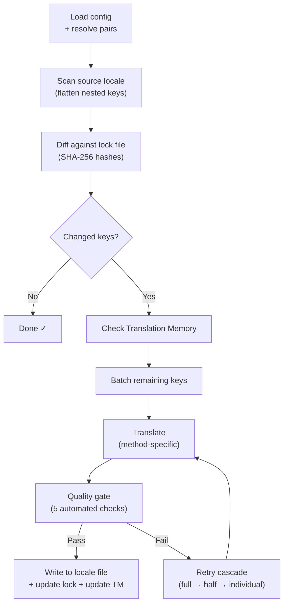

# วิธีการทำงานของ i18n-rosetta

i18n-rosetta แปลไฟล์ locale ของแอปพลิเคชันของคุณด้วยคำสั่งเดียว นี่คือสิ่งที่เกิดขึ้นเบื้องหลัง

## กระบวนการทำงาน

เมื่อคุณรัน `npx i18n-rosetta sync` rosetta จะดำเนินการตามกระบวนการทำงาน 6 ขั้นตอน:



**การตัดสินใจในการออกแบบที่สำคัญ:**

- **การตรวจจับการเปลี่ยนแปลงผ่านแฮช SHA-256** Rosetta ติดตามทุกค่าต้นทางด้วยแฮชใน `.i18n-rosetta.lock` เมื่อคุณอัปเดตข้อความภาษาอังกฤษ จะมีเพียงคีย์นั้นเท่านั้นที่ถูกแปลใหม่ นี่คือเหตุผลที่ `sync` ทำงานได้เร็วในการรันซ้ำ — เพราะมันทำงานน้อยที่สุด

- **การแคช Translation Memory** ก่อนที่จะเรียกใช้ API ใดๆ rosetta จะตรวจสอบ `.rosetta/tm.json` เพื่อหาคำแปลที่ถูกแคชไว้ (โดยใช้ข้อความต้นทาง + locale + method เป็นคีย์) ในการซิงค์ใหม่โดยทั่วไปหลังจากเปลี่ยนคีย์หนึ่งคีย์ 142 คีย์จะมาจากแคช และ 1 คีย์จะเรียกใช้ API

- **ด่านตรวจสอบคุณภาพก่อนเขียน** ทุกคำแปลจะผ่านการตรวจสอบอัตโนมัติ 5 ขั้นตอน (ค่าว่าง, การสะท้อนต้นทาง, ลูปการหลอน, การขยายความยาวเกินจริง, ความถูกต้องของสคริปต์) ก่อนที่จะถูกบันทึกลงในไฟล์ของคุณ หากล้มเหลวจะถูกบันทึกไว้ในล็อก และจะไม่มีการยอมรับโดยไม่แจ้งเตือนเด็ดขาด

- **การลองใหม่แบบลดหลั่นเมื่อล้มเหลว** หากชุดข้อมูลล้มเหลว (ข้อผิดพลาดในการแยกวิเคราะห์ JSON, API หมดเวลา) rosetta จะลองใหม่ด้วยชุดข้อมูลที่เล็กลงเรื่อยๆ: เต็มชุด → ครึ่งชุด → รายตัว วิธีนี้ช่วยแยกคีย์ที่มีปัญหาออกโดยไม่ปิดกั้นส่วนที่เหลือ

## วิธีการแปล

Rosetta รองรับวิธีการแปล 4 วิธี ซึ่งแต่ละวิธีเหมาะสำหรับสถานการณ์ที่แตกต่างกัน:

| วิธีการ | วิธีการทำงาน | เหมาะที่สุดสำหรับ |
|--------|-------------|----------|
| **`llm`** | พรอมต์แบบมีโครงสร้างไปยังโมเดล OpenRouter ใดๆ | ภาษาที่มีทรัพยากรสูง |
| **`llm-coached`** | พรอมต์เดียวกัน + กฎไวยากรณ์, พจนานุกรม และหมายเหตุรูปแบบ | ภาษาที่ LLM มักทำข้อผิดพลาดที่คาดเดาได้ |
| **`google-translate`** | คำขอแบบชุด (batch request) ของ Google Cloud Translation API | ภาษาที่มีทรัพยากรสูงและรองรับ GT ได้ดี |
| **`api`** | HTTP POST ไปยังปลายทาง (endpoint) ของคุณเอง | ไปป์ไลน์แบบกำหนดเอง, โมเดลที่ควบคุมโดยชุมชน |

วิธีการต่างๆ จะถูกกำหนดค่าตามคู่ภาษา คุณอาจใช้ `google-translate` สำหรับภาษาฝรั่งเศส แต่ใช้ `llm-coached` สำหรับภาษา Plains Cree — แต่ละคู่ภาษาจะได้รับวิธีการที่ทำงานได้ดีที่สุดสำหรับภาษานั้นๆ

## ข้อมูลการสอน

สำหรับคู่ภาษา `llm-coached` ข้อมูลการสอนจะให้ความรู้ทางภาษาศาสตร์ที่ชัดเจนแก่ LLM เช่น กฎไวยากรณ์, คำศัพท์บังคับ และความชอบด้านรูปแบบ ข้อมูลนี้จะถูกแทรกเข้าไปในทุกพรอมต์ในฐานะบริบทที่มีโครงสร้าง

```json title="coaching/crk.json"
{
  "grammar_rules": ["Animate nouns take different plural forms than inanimate nouns"],
  "dictionary": {"welcome": "ᑕᓂᓯ", "settings": "ᐃᑕᐢᑌᐘᐃᓇ"},
  "style_notes": "Use Standard Roman Orthography (SRO) unless explicitly configured otherwise."
}
```

ข้อมูลการสอนเป็นกลไกหลักในการปรับปรุงคุณภาพการแปลโดยไม่ต้องทำ fine-tuning โมเดล เปลี่ยนกฎ → รันการซิงค์ใหม่ → ดูว่าช่วยได้หรือไม่ การทำซ้ำสามารถทำได้ในทันที

## ปลั๊กอิน

ปลั๊กอินคือสูตรการแปลที่จัดเตรียมไว้ล่วงหน้าสำหรับคู่ภาษาเฉพาะ ปลั๊กอินเหล่านี้เป็น JSON manifest — ไม่ใช่โค้ด — ที่บอก rosetta ว่าควรใช้วิธีใด ด้วยการตั้งค่าใด และคุณภาพที่ได้รับการวัดผล (benchmark) ไว้คือเท่าใด

```bash
i18n-rosetta plugin install ./crk-coached-v3/
i18n-rosetta sync   # uses the installed plugin for en→crk
```

ปลั๊กอินช่วยเชื่อมช่องว่างระหว่างการวิจัยและการใช้งานจริง: วิธีการที่ได้คะแนนดีใน [MT Eval Arena](https://mtevalarena.org) สามารถนำมาจัดทำเป็นปลั๊กอินและปรับใช้ที่นี่ได้

## ภาพรวม

i18n-rosetta เป็นครึ่งหนึ่งของระบบนิเวศที่มีสองส่วน:

- **[MT Eval Arena](https://mtevalarena.org)** — ที่ซึ่งวิธีการแปลถูก**พัฒนาและพิสูจน์**ด้วยการวัดผลที่สามารถทำซ้ำได้
- **i18n-rosetta** — ที่ซึ่งวิธีการที่ได้รับการพิสูจน์แล้วถูก**นำไปใช้งาน**เพื่อแปลเนื้อหาจริง

[Eval Harness Bridge](/docs/guides/bridge) จะเชื่อมต่อทั้งสองส่วนเข้าด้วยกัน วิธีการที่พิสูจน์ตัวเองใน Arena จะถูกนำมาใช้งานที่นี่ ข้อเสนอแนะจากผู้พูดในสภาพแวดล้อมจริงจะช่วยปรับปรุงเวอร์ชันถัดไป

---

## เจาะลึกเพิ่มเติม

- [วิธีการทำงานของ Sync](/docs/concepts/how-sync-works) — คำอธิบายกระบวนการทำงานทีละขั้นตอนอย่างละเอียด
- [ด่านตรวจสอบคุณภาพ](/docs/concepts/quality-gate) — การตรวจสอบอัตโนมัติ 5 ขั้นตอน
- [Translation Memory](/docs/concepts/translation-memory) — การแคชและการประหยัดต้นทุน
- [วิธีการแปล](/docs/guides/translation-methods) — การเปรียบเทียบวิธีการอย่างละเอียด
- [สถาปัตยกรรม](/docs/concepts/architecture) — ภาพรวมการออกแบบระบบ