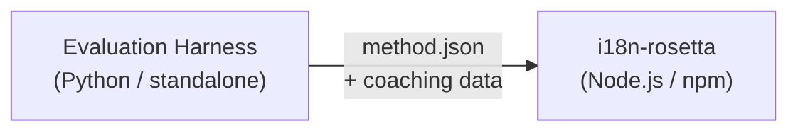

# ข้อกำหนดของ Method Plugin

> **เวอร์ชัน**: 1.1  
> **กลุ่มเป้าหมาย**: นักพัฒนา Plugin  
> **Canonical Schema**: [`schemas/rosetta-plugin.schema.json`](https://github.com/gamedaysuits/i18n-rosetta/blob/main/schemas/rosetta-plugin.schema.json)

## ภาพรวม

i18n-rosetta ใช้ **ระบบ method แบบปลั๊กอิน (pluggable method system)** แต่ละคู่ภาษาสามารถใช้วิธีการแปล (translation method) ที่แตกต่างกันได้ (เช่น LLM, coached, script-converter เป็นต้น) Method ต่างๆ จะถูกลงทะเบียนใน `lib/translate.js` และถูกเรียกใช้ตามแต่ละคู่ภาษาผ่าน `lib/pairs.js`

หน้าที่ของ eval harness คือการ **พัฒนา ทดสอบ และส่งออก** translation method ส่วนหน้าที่ของ i18n-rosetta คือการ **นำไปใช้และประมวลผล** method เหล่านั้น harness จะไม่ทำงานอยู่ภายใน rosetta

### การไหลของข้อมูล (Data Flow)



---

## รูปแบบของ Method Plugin

Method plugin คือไฟล์ JSON เดี่ยว (`method.json`) ซึ่งอาจมีไฟล์ข้อมูล coaching รวมอยู่ด้วยหรือไม่ก็ได้

### `method.json` — จำเป็นต้องมี

```json
{
  "name": "french-formal-v1",
  "type": "llm-coached",
  "version": "1.0.0",
  "description": "Formally-tuned French with terminology enforcement and grammar coaching",
  "author": "Plugin Author",

  "config": {
    "model": "google/gemini-3.5-flash",
    "register": "formal",
    "batchSize": 80,
    "temperature": 0.2
  },

  "locales": ["fr"],

  "benchmarks": {
    "fr": {
      "date": "2026-05-11T00:00:00Z",
      "corpus_size": 500,
      "exact_match_rate": 0.42,
      "corpus_chrf": 72.3,
      "corpus_bleu": 45.1,
      "model": "google/gemini-3.5-flash",
      "harness_version": "1.0.0"
    }
  },

  "provenance": {
    "resources": [],
    "commercialReady": false,
    "flags": ["license-unclear"]
  },

  "coaching": {
    "dir": "coaching"
  }
}
```

### ข้อมูลอ้างอิงฟิลด์ (Field Reference)

| ฟิลด์ | ประเภท | จำเป็น | คำอธิบาย |
|-------|------|----------|-------------|
| `name` | string | ✅ | ตัวระบุ method ที่ไม่ซ้ำกัน (รูปแบบ kebab-case) |
| `type` | string | ✅ | ประเภท method ของ Rosetta: `llm`, `llm-coached`, `api`, `google-translate`, `deepl`, `microsoft-translator`, `libretranslate`, `openai`, `anthropic`, `gemini` |
| `version` | string | ✅ | เวอร์ชันแบบ Semver (เช่น `1.0.0`) |
| `locales` | string[] | ✅ | รหัส locale ที่ method นี้รองรับ (อย่างน้อย 1) |
| `description` | string | — | คำอธิบายที่มนุษย์อ่านเข้าใจได้ |
| `author` | string | — | ผู้ที่พัฒนา/ทดสอบ method นี้ |
| `config.model` | string | — | ตัวระบุโมเดล OpenRouter |
| `config.register` | string | — | ระดับภาษา/น้ำเสียง (register/tone) ของภาษาเป้าหมาย |
| `config.batchSize` | number | — | จำนวนคีย์ต่อ API batch (1–200, ค่าเริ่มต้น: 80) |
| `config.temperature` | number | — | ค่า temperature ของ LLM (0.0–2.0, ค่าเริ่มต้น: 0.3) |
| `benchmarks` | object | — | ผลลัพธ์ benchmark ของแต่ละ locale |
| `provenance` | object | — | ข้อมูลสิทธิ์การใช้งาน (Licensing) และ resource dependencies |
| `coaching.dir` | string | — | Path สัมพัทธ์ไปยังไดเรกทอรีข้อมูล coaching |

### ออบเจ็กต์ Benchmark (ต่อ locale)

| ฟิลด์ | ประเภท | จำเป็น | คำอธิบาย |
|-------|------|----------|-------------|
| `date` | string | ✅ | Timestamp รูปแบบ ISO 8601 ของการรัน benchmark |
| `corpus_size` | number | ✅ | จำนวนรายการที่ถูกประเมิน |
| `exact_match_rate` | number | ✅ | 0.0–1.0, สัดส่วนของการจับคู่ที่ตรงกันทุกประการ (exact matches) |
| `corpus_chrf` | number | — | คะแนน chrF++ (0–100) |
| `corpus_bleu` | number | — | คะแนน BLEU (0–100) |
| `model` | string | ✅ | โมเดลที่ใช้ระหว่างการประเมิน (eval) |
| `harness_version` | string | ✅ | เวอร์ชันของ evaluation harness ที่ใช้ |

:::info เมตริกใดบ้างที่ถูกแสดงผล?
คำสั่ง `rosetta status` จะแสดง **chrF++** และ **อัตราการจับคู่ที่ตรงกันทุกประการ (exact match rate)** จากบล็อก benchmark `corpus_bleu` ได้รับการยอมรับใน manifest แต่ปัจจุบันยังไม่ถูกแสดงผลหรือใช้งานโดยคำสั่งใดๆ ของ rosetta [Method Leaderboard](/leaderboard) จะติดตามคะแนน chrF++, exact match และอัตราการยอมรับของ FST (FST acceptance rate)
:::

---

### ออบเจ็กต์ Provenance

บล็อก provenance ใช้สื่อสารสถานะสิทธิ์การใช้งานของทรัพยากรที่รวมอยู่ในปลั๊กอิน

| ฟิลด์ | ประเภท | ค่าเริ่มต้น | คำอธิบาย |
|-------|------|---------|-------------|
| `resources` | object[] | `[]` | รายการทรัพยากรที่รวมอยู่ด้วย พร้อม `name`, `license` และ `type` |
| `commercialReady` | boolean | `false` | ระบุว่าปลั๊กอินนี้ได้รับอนุญาตให้แจกจ่ายในเชิงพาณิชย์หรือไม่ |
| `flags` | string[] | `["license-unclear"]` | แฟล็กสถานะที่เครื่องอ่านได้ (Machine-readable status flags) |

**สถานะเริ่มต้น** — ปลั๊กอินที่ส่งออกมาจะมาพร้อมกับ `commercialReady: false` และ `flags: ["license-unclear"]`

**สถานะที่ได้รับอนุญาตแล้ว (Cleared state)** — เมื่อตรวจสอบสิทธิ์การใช้งานเรียบร้อยแล้ว: ให้ตั้งค่า `commercialReady: true` และล้างค่าแฟล็กต่างๆ

---

## รูปแบบข้อมูล Coaching

หาก `type` เป็น `llm-coached` ปลั๊กอินควรมีไฟล์ข้อมูล coaching อยู่ในไดเรกทอรีย่อย `coaching/`

### `coaching/<locale>.json`

```json
{
  "grammar_rules": [
    "French adjectives agree in gender and number with the noun they modify",
    "Use 'vous' for formal contexts, 'tu' for informal"
  ],
  "dictionary": {
    "dashboard": "tableau de bord",
    "deployment": "déploiement",
    "settings": "paramètres"
  },
  "style_notes": "Prefer active voice. Avoid anglicisms where a native French term exists."
}
```

| ฟิลด์ | ประเภท | จำเป็น | คำอธิบาย |
|-------|------|----------|-------------|
| `grammar_rules` | string[] | — | กฎที่ถูกแทรกเข้าไปในทุกๆ LLM prompt สำหรับ locale นี้ |
| `dictionary` | object | — | แมปคำศัพท์ → คำแปล คำศัพท์ที่ตรงกันจะถูกแทรกเป็นคำศัพท์บังคับ (required terminology) |
| `style_notes` | string | — | คำแนะนำสไตล์แบบอิสระ (Freeform style instructions) ที่ต่อท้าย prompt |

---

## โครงสร้างไดเรกทอรี

```
french-formal-v1/
  method.json                 # Method manifest with benchmarks
  coaching/
    fr.json                   # Coaching data for French
```

สำหรับ method ที่รองรับหลาย locale:

```
european-formal-v2/
  method.json                 # locales: ["fr", "de", "es", "it"]
  coaching/
    fr.json
    de.json
    es.json
    it.json
```

---

## วิธีที่ Rosetta นำปลั๊กอินไปใช้งาน

### การติดตั้ง

```bash
i18n-rosetta plugin install ./french-formal-v1/
```

บันทึกลงใน `.rosetta/methods/french-formal-v1/`

### การตั้งค่า (Configuration)

```json title="i18n-rosetta.config.json"
{
  "pairs": {
    "en:fr": {
      "methodPlugin": "french-formal-v1"
    }
  }
}
```

:::info ความหมายของการผสานข้อมูล (Merge semantics)
ปลั๊กอินจะกำหนดว่า *ต้องใช้ method ใด* (`type`) การตั้งค่าของคู่ภาษา (pair config) จะปรับแต่งว่า *จะรันมันอย่างไร* (`model`, `register`, `batchSize`) หากคู่ภาษามีการตั้งค่า `model` ค่านี้จะทับซ้อน (override) ค่าเริ่มต้นของปลั๊กอิน
:::

### ช่วงเวลาการทำงาน (Runtime)

1. Rosetta อ่าน `method.json` จาก `.rosetta/methods/french-formal-v1/`
2. ฟิลด์ `type` ของปลั๊กอินจะกำหนด translation method (เช่น `llm-coached`)
3. โหลดข้อมูล coaching จากไดเรกทอรี `coaching/` ของปลั๊กอิน
4. ใช้บล็อก `config` เพื่อเติมเต็มข้อมูลที่ขาดหายไปในส่วนของ model/register/temperature
5. บล็อก `benchmarks` จะถูกแสดงในผลลัพธ์ของ `rosetta status`
6. บล็อก `provenance` จะถูกตรวจสอบโดย `rosetta provenance` เพื่อหาแฟล็กสิทธิ์การใช้งาน (licensing flags)

---

## การตรวจสอบความถูกต้องของ Schema (Schema Validation)

Plugin manifests จะถูกตรวจสอบความถูกต้องในขณะติดตั้งโดยเทียบกับ [`schemas/rosetta-plugin.schema.json`](https://github.com/gamedaysuits/i18n-rosetta/blob/main/schemas/rosetta-plugin.schema.json)

อ้างอิง schema ใน `method.json` ของคุณเพื่อให้ IDE เติมโค้ดอัตโนมัติ (autocompletion):

```json
{
  "$schema": "./node_modules/i18n-rosetta/schemas/rosetta-plugin.schema.json",
  "name": "my-method-v1"
}
```

---

## สิ่งที่ "ห้าม" รวมไว้

- ❌ ไม่มีโค้ด Python หรือ harness dependencies
- ❌ ไม่มีข้อมูล corpus ดิบหรือบันทึกการรัน (run logs)
- ❌ ไม่มี API keys หรือข้อมูลประจำตัว (credentials)
- ❌ ไม่มีการตั้งค่า harness
- ❌ ไม่มีเทมเพลต prompt ภายใน (สิ่งเหล่านี้จะอยู่ใน method implementations ของ rosetta)

ปลั๊กอินนี้เป็น **ข้อมูลเท่านั้น (data only)**: การตั้งค่า, เนื้อหา coaching และผลลัพธ์ benchmark

---

## ดูเพิ่มเติม

- [วิธีการแปล (Translation Methods)](/docs/guides/translation-methods) — วิธีการทำงานของแต่ละ method ที่มีให้ในตัว
- [การตั้งค่า (Configuration)](/docs/getting-started/configuration) — การตั้งค่าต่อคู่ภาษาและต่อภาษา
- [การให้บริการ Method ผ่าน API (Serving a Method via API)](/docs/guides/serving-a-method) — การโฮสต์ method เป็นบริการ HTTP
- [Cookbook: FST-Gated Pipeline](https://mtevalarena.org/docs/tutorials/fst-gated-pipeline) — การสร้างและแพ็กเกจไปป์ไลน์
- [การประเมิน MT (MT Evaluation)](https://mtevalarena.org/docs/leaderboard/rules) — การรัน benchmark ของ method เพื่อส่งไปยังกระดานผู้นำ (leaderboard)
- [การสนับสนุนภาษาที่มีทรัพยากรน้อย (Support a Low-Resource Language)](https://mtevalarena.org/docs/community/low-resource-languages) — กรณีการใช้งานสำหรับปลั๊กอินจากชุมชน