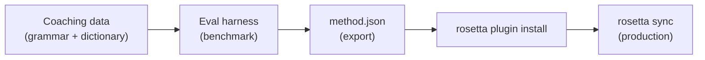

# บทช่วยสอน: สร้าง Translation Plugin

สร้าง custom translation method ตั้งแต่เริ่มต้น, ทำการ benchmark, และ deploy เป็น rosetta plugin นี่คือเวิร์กโฟลว์ที่สมบูรณ์สำหรับการเพิ่มคู่ภาษาใหม่ที่ไม่มี API สำเร็จรูปรองรับ

**สิ่งที่คุณจะได้สร้าง:** coached translation plugin สำหรับภาษาฝรั่งเศสแบบเป็นทางการ พร้อมการบังคับใช้คำศัพท์, กฎไวยากรณ์, และคะแนน benchmark

**เวลา:** 30–45 นาที

**ข้อกำหนดเบื้องต้น:**
- ติดตั้ง i18n-rosetta แล้ว (`npm install --save-dev i18n-rosetta`)
- OpenRouter API key (`OPENROUTER_API_KEY`)
- Python 3.10+ (สำหรับ eval harness)

---

## ขั้นตอนที่ 1: ระบุปัญหา

คุณกำลังแปล SaaS dashboard เป็นภาษาฝรั่งเศส วิธี `llm` ที่เป็นค่าเริ่มต้นให้คำแปลที่ถูกต้องแต่ไม่สม่ำเสมอ:

- บางครั้ง "dashboard" ถูกแปลเป็น "tableau de bord" และบางครั้งเป็น "panneau de contrôle"
- น้ำเสียงสลับไปมาระหว่างรูปแบบ `tu` และ `vous`
- คำศัพท์ทางเทคนิคถูกทับศัพท์ภาษาอังกฤษอย่างไม่สม่ำเสมอ

คุณต้องการ **terminology enforcement** (การบังคับใช้คำศัพท์) และ **register control** (การควบคุมระดับภาษา) ซึ่ง prompt ของ LLM ทั่วไปไม่มีให้

## ขั้นตอนที่ 2: สร้าง Coaching Data

สร้างไฟล์ coaching ที่เข้ารหัสข้อกำหนดทางภาษาของคุณ:

```bash
mkdir -p .rosetta/coaching
```

```json title=".rosetta/coaching/fr.json"
{
  "grammar_rules": [
    "Always use the 'vous' form for formal register",
    "French adjectives agree in gender and number with their noun",
    "Use the present tense for UI instructions, not the imperative",
    "Preserve sentence-final punctuation style from the source"
  ],
  "dictionary": {
    "dashboard": "tableau de bord",
    "deployment": "déploiement",
    "settings": "paramètres",
    "environment variable": "variable d'environnement",
    "webhook": "webhook",
    "API key": "clé API",
    "sign in": "se connecter",
    "sign out": "se déconnecter",
    "repository": "dépôt",
    "pull request": "demande de tirage"
  },
  "style_notes": "Formal technical French. Prefer native French terms over anglicisms where established equivalents exist. Keep UI labels concise — 3 words maximum where possible."
}
```

**หน้าที่ของแต่ละฟิลด์:**
- **`grammar_rules`** — ถูกแทรกเข้าไปใน system prompt ของ LLM เพื่อเป็นข้อจำกัดที่ชัดเจน
- **`dictionary`** — จับคู่กับ source keys; เมื่อมีคำศัพท์ในพจนานุกรมปรากฏขึ้น จะถูกแทรกเป็น "required terminology" (คำศัพท์ที่บังคับใช้) ใน prompt
- **`style_notes`** — ต่อท้าย system prompt เพื่อเป็นคำแนะนำรูปแบบทั่วไป

## ขั้นตอนที่ 3: กำหนดค่า Pair

บอกให้ rosetta ใช้ `llm-coached` สำหรับภาษาฝรั่งเศส:

```json title="i18n-rosetta.config.json"
{
  "version": 3,
  "inputLocale": "en",
  "localesDir": "./locales",
  "pairs": {
    "en:fr": {
      "method": "llm-coached",
      "model": "google/gemini-3.5-flash"
    }
  },
  "languages": {
    "fr": {
      "register": "Formal technical French (vous-form)",
      "name": "French"
    }
  }
}
```

## ขั้นตอนที่ 4: ทดสอบ

```bash
npx i18n-rosetta sync --dry
```

ตรวจสอบผลลัพธ์ของ dry-run ตรวจดูว่า:
- ✅ คำศัพท์ในพจนานุกรมถูกใช้อย่างสม่ำเสมอ ("tableau de bord" ไม่ใช่ "panneau de contrôle")
- ✅ มีการใช้รูปแบบ `vous` ตลอดทั้งข้อความ
- ✅ คำศัพท์ทางเทคนิคตรงกับพจนานุกรมของคุณ

จากนั้นรันการซิงค์จริง:

```bash
npx i18n-rosetta sync
```

## ขั้นตอนที่ 5: ทำ Benchmark ด้วย Eval Harness (ไม่บังคับ)

หากคุณต้องการคะแนนคุณภาพ — ซึ่งคุณต้องการแน่นอน เพราะปลั๊กอินจะมาพร้อมกับข้อมูล benchmark — ให้ใช้ eval harness ที่มาคู่กัน

### ติดตั้ง Harness

```bash
git clone https://github.com/gamedaysuits/gds-mt-eval-harness.git
cd gds-mt-eval-harness
pip install -r requirements.txt
```

### สร้าง Reference Corpus

สร้างไฟล์ที่มี source strings และคำแปลที่ถูกต้องแน่นอน:

```json title="corpus/french-formal.json"
[
  {
    "source": "Dashboard",
    "reference": "Tableau de bord"
  },
  {
    "source": "Sign in to your account",
    "reference": "Connectez-vous à votre compte"
  },
  {
    "source": "Your deployment is ready",
    "reference": "Votre déploiement est prêt"
  },
  {
    "source": "Environment variables",
    "reference": "Variables d'environnement"
  }
]
```

### รัน Benchmark

```bash
python harness.py eval \
  --corpus corpus/french-formal.json \
  --source en \
  --target fr \
  --method llm-coached \
  --model google/gemini-3.5-flash
```

ผลลัพธ์จาก harness:
- **chrF++** — Character-level F-score (0–100) ค่าที่สูงกว่า 70 ถือว่าดีมาก
- **BLEU** — N-gram overlap (0–100) ค่าที่สูงกว่า 40 ถือว่าแข็งแกร่งสำหรับ coached translation
- **Exact match rate** — สัดส่วนของคำแปลที่ตรงกับข้อมูลอ้างอิงแบบเป๊ะๆ

### Export ปลั๊กอิน

เมื่อคุณพอใจกับคะแนนแล้ว:

```bash
python harness.py export \
  --name french-formal-v1 \
  --output ./french-formal-v1/
```

สิ่งนี้จะสร้าง:

```
french-formal-v1/
├── method.json          # Manifest with config + benchmarks
└── coaching/
    └── fr.json          # Your coaching data
```

## ขั้นตอนที่ 6: ติดตั้งปลั๊กอินใน Rosetta

```bash
npx i18n-rosetta plugin install ./french-formal-v1/
```

คำสั่งนี้จะคัดลอกปลั๊กอินไปยัง `.rosetta/methods/french-formal-v1/`

อัปเดต config ของคุณเพื่อใช้งาน:

```json title="i18n-rosetta.config.json"
{
  "pairs": {
    "en:fr": {
      "methodPlugin": "french-formal-v1"
    }
  }
}
```

## ขั้นตอนที่ 7: ตรวจสอบความถูกต้อง

```bash
# Check plugin is installed and shows benchmark scores
npx i18n-rosetta status

# Run a sync with the plugin
npx i18n-rosetta sync

# Audit licensing status
npx i18n-rosetta provenance
```

ผลลัพธ์ `status` จะแสดง:

```
en → fr
  Method:    french-formal-v1 (llm-coached)
  Model:     google/gemini-3.5-flash
  Quality:   high
  chrF++:    74.2
  BLEU:      46.8
  Exact:     42%
```

## สิ่งที่คุณได้สร้างขึ้น



ตอนนี้คุณมี:
1. **Coaching data** — กฎไวยากรณ์และคำศัพท์ที่บังคับใช้เพื่อความสม่ำเสมอ
2. **Benchmark scores** — คุณภาพที่วัดผลได้ซึ่งมาพร้อมกับปลั๊กอิน
3. **A portable plugin** — `method.json` + coaching data ที่สามารถติดตั้งได้บนทุกเครื่อง
4. **Production deployment** — ผสานรวมเข้ากับ sync pipeline ของคุณ

## ขั้นตอนต่อไป

- **[Plugin Specification](/docs/reference/plugin-spec)** — ข้อมูลอ้างอิงรูปแบบ manifest ฉบับเต็ม
- **[Translation Methods](/docs/guides/translation-methods)** — เปรียบเทียบวิธีการแปลทั้งสี่วิธี
- **[Low-Resource Languages](/docs/guides/low-resource-languages)** — นำรูปแบบนี้ไปใช้กับภาษาที่ไม่มี API รองรับ
- **[Translate 30 Languages](/docs/tutorials/translate-30-languages)** — ขยายสเกลโปรเจกต์ของคุณสู่กลุ่มผู้ชมทั่วโลก