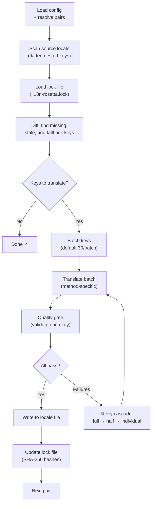

# Paano Gumagana ang Sync

Ang `sync` command ay ang core operation ng rosetta. Narito po ang nangyayari kapag nag-run kayo ng `npx i18n-rosetta sync`.

## Pipeline Overview



## Step by Step

### 1. Config Resolution

Ilo-load ng rosetta ang `i18n-rosetta.config.json` (o mag-a-auto-detect ng settings). Ire-resolve nito ang mga sumusunod:
- Source locale at target locales
- Ang pair graph (kung aling source→target combinations ang ipo-process)
- Per-pair method, model, at quality settings

### 2. Source Scanning

Ilo-load ang source locale file at ifa-flatten ito sa isang key→value map:

```json
// Input (nested)
{ "hero": { "title": "Welcome", "subtitle": "Build" } }

// Flattened
{ "hero.title": "Welcome", "hero.subtitle": "Build" }
```

### 3. Change Detection

Babasahin ng rosetta ang `.i18n-rosetta.lock`, na nag-i-store ng SHA-256 hashes ng mga previously translated na source values. Para sa bawat key, iche-check nito ang:

| Condition | Action |
|-----------|--------|
| Missing ang key sa target | **Translate** |
| Nagbago ang source hash since last sync | **Re-translate** (stale) |
| Nag-uumpisa ang target value sa `[EN]` | **Re-translate** (fallback placeholder) |
| Walang pagbabago sa source hash, nag-e-exist ang key | **Skip** |

Ito ang dahilan kung bakit tina-translate lang ng rosetta kung ano ang nagbago — hindi nito nire-re-translate ang buong file ninyo sa bawat sync.

### 4. Batching

Igagrupo ang mga keys sa mga batches (default: 30 keys/batch para sa LLM, 128 para sa Google Translate). Nare-reduce ng batching ang API round trips habang pinapanatiling manageable ang mga prompts.

### 5. Translation

Ipapadala ang bawat batch sa naka-configure na translation method:

- **`llm`**: Structured prompt sa OpenRouter na may kasamang register at gender guidance instructions
- **`llm-coached`**: Pareho, pero may naka-inject na grammar rules, dictionary, at style notes
- **`google-translate`**: Google Cloud Translation API v2 batch request
- **`api`**: HTTP POST sa isang remote endpoint

Ang system message (register, gender guidance, rules) ay identical across batches para sa isang given locale, kaya nag-e-enable ito ng **prompt caching** — kina-cache ng mga providers tulad ng Anthropic at Google ang mga repeated system messages, na nagpapababa sa token costs.

### 6. Quality Gate

Bina-validate ang bawat translation bago ito isulat sa disk. May limang checks na nagra-run:

| Check | Ano ang nade-detect nito | Example |
|-------|----------------|---------|
| **Empty/blank** | Walang ni-return ang model | `""` |
| **Source echo** | Ni-return ng model ang English input | `"Welcome"` para sa Japanese |
| **Hallucination loop** | Repeated trigrams | `"Qo' Qo' Qo' Qo'"` |
| **Length inflation** | Ang output ay 4×+ na mas mahaba kaysa sa source | 10-char source → 50-char output |
| **Script compliance** | Maling script para sa locale | Latin text para sa Arabic locale |

Nila-log ang mga failures gamit ang `[GATE]` prefix. Walang mga silent fallbacks.

Tingnan ang [Quality Gate](/docs/concepts/quality-gate) para sa mga detalye.

### 7. Retry Cascade

Kapag may JSON parse failure o batch-level errors, magre-retry ang rosetta gamit ang progressively smaller batches:

```
Full batch (30 keys) → Failed
Half batch (15 keys) → Failed
Individual keys (1 each) → Isolates the problem key
```

Naka-cap ang retry budget ng `maxRetries` (default: 3) para maiwasan ang runaway token spend.

### 8. Write & Lock

Ang mga pumapasang translations ay isinusulat sa target locale file, habang pini-preserve ang original nesting structure. Ina-update ang lock file gamit ang mga bagong SHA-256 hashes.

## Partial Success

Hindi bina-block ng isang failed batch ang iba. Kung 9 out of 10 batches ang nag-succeed, isusulat ang 9 na iyon. Ila-log ang failed batch, at pwede ninyong i-re-run ang `sync` para mag-retry.

## Dry Run

I-preview kung ano ang magbabago nang hindi nagsusulat ng kahit anong files:

```bash
npx i18n-rosetta sync --dry
```

## Force Re-translate

I-force ang mga specific keys na ma-re-translate kahit walang pagbabago:

```bash
npx i18n-rosetta sync --force-keys "hero.title,nav.about"
```

## Cost Estimation

Bago mag-translate, nagge-generate ang rosetta ng isang **pre-sync cost report** na nagpapakita ng estimated costs per pair. Nagra-run ito automatically sa bawat `sync` — makikita ninyo ito bago pa man gumawa ng kahit anong API calls.

```
╔══════════════════════════════════════════════════════════╗
║  Cost Estimate                                          ║
╠════════════╦═══════╦════════════╦════════════════════════╣
║ Pair       ║ Keys  ║ Est. Cost  ║ Method                 ║
╠════════════╬═══════╬════════════╬════════════════════════╣
║ en → fr    ║   142 ║ $0.07      ║ google-translate       ║
║ en → ja    ║    38 ║   —        ║ llm (model-dependent)  ║
║ en → crk   ║    38 ║   —        ║ llm-coached            ║
╚════════════╩═══════╩════════════╩════════════════════════╝
```

### Ano ang Nae-estimate

Nagpo-provide ang bawat translation method ng sarili nitong cost estimate:

| Method | Cost Basis | Precision |
|--------|-----------|-----------|
| `google-translate` | Published rate ng Google ($20/million chars) | Accurate |
| `llm` | Nag-iiba depende sa OpenRouter model | Model-dependent — i-check ang [OpenRouter pricing](https://openrouter.ai/models) |
| `llm-coached` | Pareho sa `llm` plus coaching context tokens | Model-dependent |
| `api` | Server-determined | Unknown — hindi ma-estimate nang hindi kini-query ang endpoint |

Kapag hindi ma-determine ng isang method ang cost (LLM methods, remote APIs), nagre-report ang rosetta ng `—` sa halip na manghula. Gamitin ang `--dry` para makita ang cost estimates nang hindi pa talaga nagta-translate.

---

## Tingnan Din

- [CLI Reference — sync](/docs/reference/cli#sync) — command flags at options
- [Quality Gate](/docs/concepts/quality-gate) — kung paano bina-validate ang mga translations
- [Translation Methods](/docs/guides/translation-methods) — kung paano gumagana ang bawat method
- [Configuration](/docs/getting-started/configuration) — config reference
- [CI/CD Guide](/docs/guides/ci-cd) — pag-automate ng mga syncs sa inyong pipeline