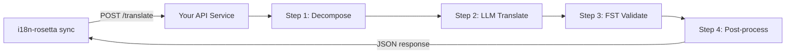

# Pag-serve ng Custom Method as an API

Hinahayaan po kayo ng **`api` method** ng i18n-rosetta na i-point ang anumang translation pair sa isang external HTTP endpoint. Ganito niyo po i-integrate ang mga pipelines na masyadong complex para sa isang single LLM prompt — morphological analyzers, finite-state transducers (FSTs), multi-step LLM chains, o anumang custom research method na na-build ninyo.

## Bakit isang API Service?

May mga translation pipelines po na hindi pwedeng mag-run sa loob ng isang simpleng prompt-response cycle:

| Pipeline step | Example |
|---|---|
| **Morphological decomposition** | I-split ang mga polysynthetic words into morphemes bago i-translate |
| **FST validation** | I-reject ang mga outputs na nag-violate ng phonological o morphological rules |
| **Multi-step LLM chains** | Generate → verify → correct cycles gamit ang iba't ibang models |
| **Dictionary lookup** | Mag-cross-reference sa isang curated bilingual dictionary mid-pipeline |
| **Human-in-the-loop** | I-queue ang mga uncertain translations para sa expert review |

Tinitingnan po ng `api` method ang inyong pipeline as a black box — magse-send ang i18n-rosetta ng source strings, tapos magre-return ang inyong service ng translations. Kung ano po ang nangyayari sa loob ay entirely up to you.

## Architecture



## Pag-set Up ng Inyong Service

Kailangan po mag-implement ang inyong API service ng isang single endpoint na nag-a-accept at nagre-return ng JSON:

### Request Format

Ise-send po ng rosetta ang eksaktong JSON body na ito (tingnan ang [api.js](https://github.com/gamedaysuits/i18n-rosetta/blob/main/lib/methods/api.js)):

```json
POST /translate
Content-Type: application/json
Authorization: Bearer <ROSETTA_API_KEY>

{
  "source_locale": "en",
  "target_locale": "crk",
  "method": "crk-coached-v1",
  "keys": {
    "greeting": "Hello, welcome to our app",
    "farewell": "Goodbye and thanks"
  }
}
```

| Field | Type | Description |
|-------|------|-------------|
| `source_locale` | string | BCP 47 source language code |
| `target_locale` | string | BCP 47 target language code |
| `method` | string | Plugin name o `"default"` |
| `keys` | object | Map ng key → source string na ita-translate |
```

### Response Format

Your service must return a `translations` object. An optional `meta` object can include cost and diagnostic info:

```json
{
  "translations": {
    "greeting": "tânisi, pê-kîwêw ôta",
    "farewell": "ekosi mâka, kinanâskomitin"
  },
  "meta": {
    "model": "my-custom-pipeline/v1",
    "cost_usd": 0.0042,
    "method": "decompose-translate-validate"
  }
}
```

| Field | Type | Required | Description |
|-------|------|----------|-------------|
| `translations` | object | ✅ | Map of key → translated string |
| `meta` | object | — | Optional metadata |
| `meta.cost_usd` | number | — | If present, displayed in rosetta's output |
| `errors` | object | — | For partial success (HTTP 207): map of key → `{ message }` |

### Minimal Express Server

```javascript
import express from 'express';

const app = express();
app.use(express.json());

/**
 * rosetta API contract:
 *
 * Request:  { source_locale, target_locale, method, keys: { "key": "source" } }
 * Response: { translations: { "key": "translated" }, meta: { ... } }
 */
app.post('/translate', async (req, res) => {
  const { source_locale, target_locale, method, keys } = req.body;

  const translations = {};

  for (const [key, source] of Object.entries(keys)) {
    // --- Your pipeline goes here ---
    // Step 1: Morphological decomposition
    const morphemes = await decompose(source, source_locale);

    // Step 2: LLM translation with context
    const draft = await llmTranslate(morphemes, target_locale);

    // Step 3: FST validation
    const validated = await fstValidate(draft, target_locale);

    // Step 4: Post-processing (orthography normalization, etc.)
    translations[key] = await postProcess(validated);
  }

  res.json({
    translations,
    meta: {
      model: 'my-custom-pipeline/v1',
      method: 'decompose-translate-validate',
    },
  });
});

app.listen(3001, () => {
  console.log('Translation API running on http://localhost:3001');
});
```

## Configuring i18n-rosetta

Point a translation pair at your running service in `i18n-rosetta.config.json`:

```json
{
  "inputLocale": "en",
  "pairs": {
    "en:crk": {
      "method": "api",
      "endpoint": "http://localhost:3001/translate",
      "register": "Formal Plains Cree. Use SRO orthography."
    }
  }
}
```

Then run sync as usual:

```bash
npx i18n-rosetta sync
```

i18n-rosetta will POST your source strings to the endpoint and write the returned translations to `crk.json`.

## Case Study: Plains Cree Pipeline

:::info Under Development
The Plains Cree pipeline described below is **under active development** and is not yet running in production. Details here reflect the current design direction and may change as the project evolves.
:::

The **gds-mt-eval-harness** project demonstrates this pattern. Its Plains Cree pipeline uses:

1. **Morphological decomposition** — Break polysynthetic Cree words into translatable morpheme chains
2. **LLM translation** — Context-enriched GPT-4o translation with coaching data (SRO orthography rules, register instructions)
3. **FST validation** — Finite-state transducer checks that outputs conform to Cree phonological rules
4. **Confidence scoring** — Each translation gets a confidence score based on FST pass rate and dictionary coverage

The entire pipeline runs as a single HTTP endpoint that i18n-rosetta calls via the `api` method.

### Running Evaluations

After translating, you can evaluate output quality using the harness directly:

```bash
# Clone the harness
git clone https://github.com/gamedaysuits/gds-mt-eval-harness.git
cd gds-mt-eval-harness
pip install -e .

# Run the evaluation against your method's output
python eval/baseline_experiment.py --dataset data/edtekla-dev-v1.json --submit
```

This produces structured evaluation records with chrF++, BLEU, and exact match scores that can be used as regression baselines.

## Authentication

If your API requires authentication, set the `apiKey` field or use an environment variable:

```json
{
  "pairs": {
    "en:crk": {
      "method": "api",
      "endpoint": "https://my-mt-service.example.com/translate",
      "apiKey": "${CRK_API_KEY}"
    }
  }
}
```

## Data Sovereignty & OCAP Principles

The `api` method is particularly important for **Indigenous language communities**. By self-hosting the translation pipeline, a community keeps full control over:

- **Proprietary coaching data** — register instructions, orthography rules, and domain glossaries never leave community infrastructure.
- **Linguistic resources** — curated dictionaries, FST grammars, and elder-verified translations remain under community ownership.
- **Access policies** — the community decides who can call the endpoint and under what terms.

This aligns with [OCAP® principles](/docs/guides/low-resource-languages#ocap-principles) (Ownership, Control, Access, Possession), ensuring that sensitive language data is governed by the community rather than a third-party platform.

:::tip
Combine the `api` method with a private deployment (e.g., a community-hosted VM or on-prem server) for the strongest data-sovereignty posture. See [Support a Low-Resource Language](/docs/guides/low-resource-languages) for a full walkthrough.
:::

## Cost Estimation

The `api` method returns `null` for cost estimation by default — your service controls pricing. If you want to provide cost transparency, have your API return a `cost` field in the metadata:

```json
{
  "translations": { "...": "..." },
  "metadata": {
    "cost": {
      "estimatedCost": 0.0042,
      "currency": "USD",
      "source": "my-service-pricing"
    }
  }
}
```

## Best Practices

1. **Mag-return ng empty strings para sa failures** — Huwag i-return ang source string as a "translation." Mag-return ng `""` at hayaan ang fallback prefix mechanism ng i18n-rosetta na mag-handle nito.
2. **I-include ang confidence scores** — Kung kaya ng inyong pipeline na mag-estimate ng quality, i-return ito sa metadata. Nakakatulong po ito sa quality auditing.
3. **Mag-implement ng health checks** — Mag-add ng `GET /health` endpoint para ma-verify ng i18n-rosetta ang connectivity bago mag-start ng isang malaking sync.
4. **Mag-rate limit gracefully** — Kung may throughput limits ang inyong pipeline, mag-return ng `429` status codes. Magba-back off po ang batch system ng i18n-rosetta.
5. **I-log ang lahat** — Pwedeng mag-fail silently ang mga multi-step pipelines. I-log ang input/output ng bawat step para sa debugging.

## Licensing

Fully open po ang `api` method pattern — walang licensing restrictions sa pag-wrap ng inyong sariling translation pipeline as an HTTP service. Available po ang `gds-mt-eval-harness` under MIT license para sa mga reference implementations.

## See Also

- [Translation Methods](/docs/guides/translation-methods) — overview ng bawat built-in method (`openai`, `google`, `api`, atbp.)
- [Plugin Specification](/docs/reference/plugin-spec) — full schema para sa `i18n-rosetta.config.json` kasama ang `api` method fields
- [Support a Low-Resource Language](/docs/guides/low-resource-languages) — end-to-end guide para sa mga under-resourced languages, kasama ang OCAP principles
- [Architecture](/docs/concepts/architecture) — paano nagwo-work ang sync loop, batching, at method dispatch ng i18n-rosetta
- [MT Evaluation](/docs/eval/) — evaluation methodology, metrics, at ang leaderboard submission process
- [Method Leaderboard](/leaderboard) — live quality rankings across methods at language pairs