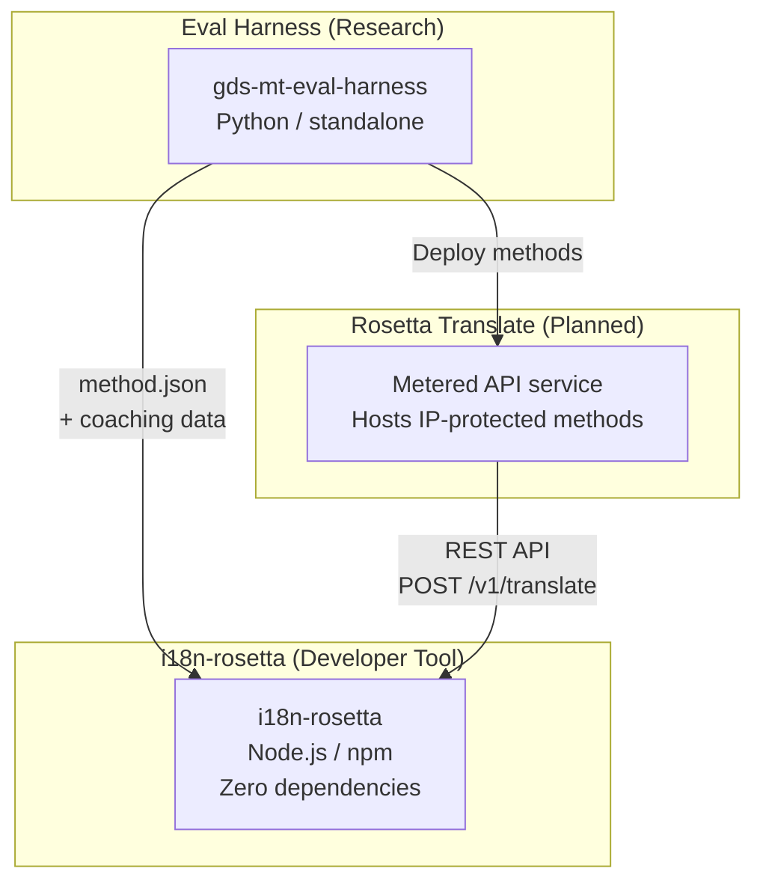
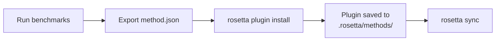
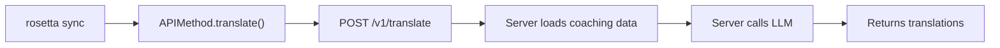

# Kiến trúc

Hệ sinh thái dịch thuật Rosetta bao gồm ba công cụ độc lập hoạt động cùng nhau thông qua các hợp đồng được xác định rõ ràng. Không có công cụ nào phụ thuộc lẫn nhau trong quá trình build. Chúng giao tiếp thông qua một **định dạng plugin phương thức** dùng chung và một **hợp đồng REST API**.

## Ba thành phần



### i18n-rosetta (dự án này)

Công cụ mã nguồn mở dành cho nhà phát triển. Dịch các tệp ngôn ngữ (locale) bằng cách sử dụng các phương thức dạng plugin. Không có dependency, cấu hình tùy chọn, hoạt động ngay sau khi cài đặt.

**Các phương thức tích hợp sẵn:**
- `llm` → OpenRouter / bất kỳ LLM nào
- `llm-coached` → LLM + huấn luyện ngữ pháp/từ điển
- `google-translate` → Google Cloud Translation API
- `api` → Kết nối trung gian mỏng (thin pipe) đến bất kỳ API từ xa nào

### Eval Harness (dự án đồng hành)

Một công cụ nghiên cứu để phát triển, thử nghiệm và đánh giá chuẩn các phương thức dịch thuật. Khi một phương thức đạt đến chất lượng có thể chấp nhận được, harness sẽ xuất ra một **plugin phương thức** — một tệp kê khai `method.json` và các tệp dữ liệu huấn luyện tùy chọn.

Harness không bao giờ chạy bên trong rosetta. Đây là một công cụ riêng biệt tạo ra đầu ra tĩnh (các tệp JSON). Rosetta chỉ đọc các tệp đó.

[→ Eval Harness trên GitHub](https://github.com/gamedaysuits/gds-mt-eval-harness)

### Rosetta Translate (dự kiến)

Một dịch vụ API tính phí theo mức sử dụng (metered API) lưu trữ các phương thức dịch thuật độc quyền ở phía máy chủ (server-side) — các prompt, dữ liệu huấn luyện và các luồng xử lý ngôn ngữ không bao giờ rời khỏi máy chủ.

## Cách thức kết nối

### Eval Harness → i18n-rosetta (xuất một chiều)



**Hợp đồng**: [Đặc tả Plugin](/docs/reference/plugin-spec)

### Rosetta Translate → i18n-rosetta (API tại thời điểm chạy)



`APIMethod` của Rosetta là một **đường ống thụ động (dumb pipe)**. Nó gửi các khóa (keys) đi và nhận lại các bản dịch. Nó không chứa bất kỳ logic dịch thuật nào và không có nội dung độc quyền nào.

## Mức độ nhận biết lẫn nhau giữa các thành phần

| Công cụ | Biết về rosetta? | Biết về Rosetta Translate? | Biết về harness? |
|------|---------------------|-------------------------------|---------------------|
| **i18n-rosetta** | *(chính là rosetta)* | Có — phương thức `api` gọi nó | Không — chỉ đọc các bản xuất plugin |
| **Rosetta Translate** | Có — phục vụ các yêu cầu của nó | *(chính là Rosetta Translate)* | Không — nhận các phương thức được triển khai |
| **Eval Harness** | Có — xuất định dạng plugin | Không — các phương thức được triển khai riêng biệt | *(chính là harness)* |

## Các kịch bản người dùng

### Kịch bản 1: Miễn phí, không cần cấu hình (hầu hết người dùng)

```bash
export OPENROUTER_API_KEY=sk-...
npx i18n-rosetta sync
```

Sử dụng phương thức `llm` tích hợp sẵn. Không có plugin, không có Rosetta Translate, không có harness.

### Kịch bản 2: Đường cơ sở (baseline) Google Translate

```bash
export GOOGLE_TRANSLATE_API_KEY=AIza...
npx i18n-rosetta sync
```

Sử dụng phương thức `google-translate` tích hợp sẵn. Không cần plugin.

### Kịch bản 3: Plugin mở với dữ liệu huấn luyện đi kèm

```bash
rosetta plugin install ./french-formal-v1/
rosetta sync
```

Plugin có `type: "llm-coached"` → rosetta sử dụng khóa OpenRouter của chính người dùng. Dữ liệu huấn luyện nằm ở máy cục bộ (không gọi máy chủ).

### Kịch bản 4: Tự huấn luyện (không plugin, không harness)

```json title="i18n-rosetta.config.json"
{
  "pairs": {
    "en:fr": { "method": "llm-coached" }
  }
}
```

Người dùng tự duy trì các quy tắc ngữ pháp và từ điển của riêng họ trong `.rosetta/coaching/fr.json`.

## Nguyên tắc thiết kế

1. **Không có phụ thuộc vòng (circular dependencies).** Các cầu nối đều là một chiều.
2. **Rosetta là lõi gọn nhẹ.** Không có dependency, cấu hình tùy chọn. Các plugin và API là những thành phần bổ sung.
3. **Bảo vệ sở hữu trí tuệ (IP) mang tính kiến trúc.** Các kỹ thuật độc quyền được giữ ở phía máy chủ. Gói npm không chứa bất kỳ thứ gì độc quyền.
4. **Định dạng plugin là hợp đồng.** Mọi thứ đều luân chuyển qua `method.json`.
5. **Mỗi công cụ có một nhiệm vụ duy nhất.** Harness → phát triển các phương thức. Rosetta Translate → lưu trữ các phương thức. Rosetta → dịch các tệp.