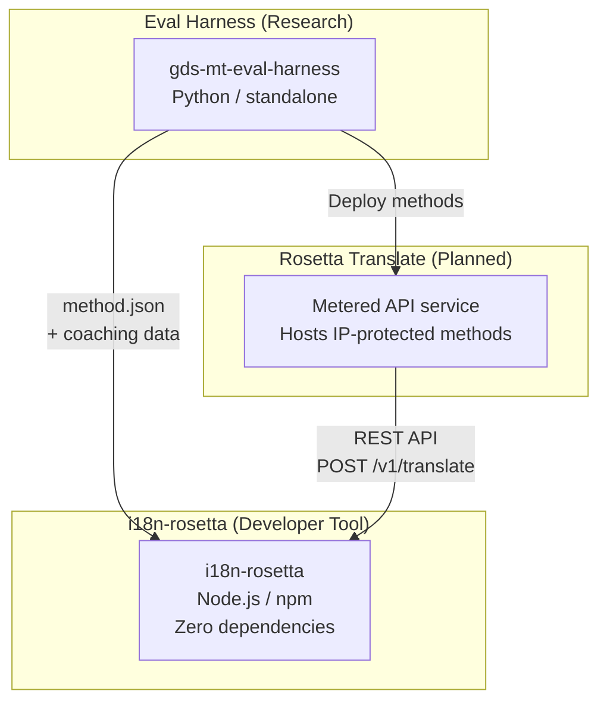
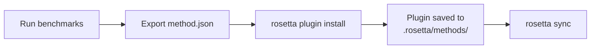
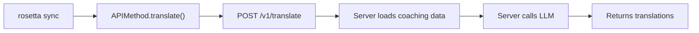

# Kiến trúc

Hệ sinh thái dịch thuật Rosetta bao gồm ba công cụ độc lập hoạt động cùng nhau thông qua các hợp đồng (contracts) được xác định rõ ràng. Không có công cụ nào phụ thuộc vào nhau tại thời điểm build (build time). Chúng giao tiếp thông qua một **định dạng plugin phương thức (method plugin format)** chung và một **hợp đồng REST API**.

## Ba thành phần



### i18n-rosetta (dự án này)

Công cụ dành cho nhà phát triển mã nguồn mở. Dịch các tệp ngôn ngữ (locale files) bằng cách sử dụng các phương thức có thể cắm (pluggable methods). Không có dependency, cấu hình tùy chọn, hoạt động ngay lập tức (works out of the box).

**Các phương thức tích hợp sẵn:**
- `llm` → OpenRouter / bất kỳ LLM nào (hơn 200 mô hình)
- `llm-coached` → LLM + hướng dẫn ngữ pháp/từ điển (grammar/dictionary coaching)
- `openai` → API OpenAI trực tiếp (GPT-4o, GPT-4o-mini)
- `anthropic` → API Anthropic trực tiếp (Claude Sonnet, Haiku, Opus)
- `gemini` → API Google Gemini trực tiếp (Flash, Pro — có gói miễn phí)
- `google-translate` → Google Cloud Translation API v2
- `deepl` → DeepL API có hỗ trợ thuật ngữ (glossary)
- `microsoft-translator` → Azure Cognitive Services Translator
- `libretranslate` → LibreTranslate tự lưu trữ (self-hosted) (AGPL, miễn phí)
- `api` → Đường ống mỏng (thin pipe) kết nối đến bất kỳ REST endpoint từ xa nào

### Eval Harness (dự án đồng hành)

Một công cụ nghiên cứu để phát triển, thử nghiệm và đánh giá chuẩn (benchmarking) các phương thức dịch thuật. Khi một phương thức đạt đến chất lượng có thể chấp nhận được, harness sẽ xuất ra một **plugin phương thức** — một tệp manifest `method.json` và các tệp dữ liệu hướng dẫn (coaching data) tùy chọn.

Harness không bao giờ chạy bên trong rosetta. Nó là một công cụ riêng biệt tạo ra đầu ra tĩnh (các tệp JSON). Rosetta chỉ đọc các tệp đó.

[→ Eval Harness trên GitHub](https://github.com/gamedaysuits/gds-mt-eval-harness)

### Rosetta Translate (dự kiến)

Một dịch vụ API tính phí theo mức sử dụng (metered API) lưu trữ các phương thức dịch thuật độc quyền ở phía máy chủ (server-side) — các prompt, dữ liệu hướng dẫn và pipeline ngôn ngữ không bao giờ rời khỏi máy chủ.

## Cách chúng kết nối

### Eval Harness → i18n-rosetta (xuất một chiều)



**Hợp đồng**: [Đặc tả Plugin](/docs/reference/plugin-spec)

### Rosetta Translate → i18n-rosetta (API tại runtime)



`APIMethod` của Rosetta là một **đường ống thụ động (dumb pipe)**. Nó gửi các key đi và nhận lại các bản dịch. Nó không chứa bất kỳ logic dịch thuật nào và không có nội dung độc quyền.

## Những gì mỗi thành phần biết về các thành phần khác

| Công cụ | Biết về rosetta? | Biết về Rosetta Translate? | Biết về harness? |
|------|---------------------|-------------------------------|---------------------|
| **i18n-rosetta** | *(chính là rosetta)* | Có — phương thức `api` gọi nó | Không — chỉ đọc các bản xuất plugin |
| **Rosetta Translate** | Có — phục vụ các request của nó | *(chính là Rosetta Translate)* | Không — nhận các phương thức đã triển khai |
| **Eval Harness** | Có — xuất định dạng plugin | Không — các phương thức được triển khai riêng | *(chính là harness)* |

## Kịch bản người dùng

### Kịch bản 1: Miễn phí, không cần cấu hình (hầu hết người dùng)

```bash
export OPENROUTER_API_KEY=sk-...
npx i18n-rosetta sync
```

Sử dụng phương thức `llm` tích hợp sẵn. Không có plugin, không có Rosetta Translate, không có harness.

### Kịch bản 2: Cơ sở (baseline) Google Translate

```bash
export GOOGLE_TRANSLATE_API_KEY=AIza...
npx i18n-rosetta sync
```

Sử dụng phương thức `google-translate` tích hợp sẵn. Không cần plugin.

### Kịch bản 3: Plugin mở với hướng dẫn (coaching) đi kèm

```bash
rosetta plugin install ./french-formal-v1/
rosetta sync
```

Plugin có `type: "llm-coached"` → rosetta sử dụng key OpenRouter của chính người dùng. Dữ liệu hướng dẫn nằm ở máy cục bộ (không gọi máy chủ).

### Kịch bản 4: Tự làm hướng dẫn (không có plugin, không có harness)

```json title="i18n-rosetta.config.json"
{
  "pairs": {
    "en:fr": { "method": "llm-coached" }
  }
}
```

Người dùng tự duy trì các quy tắc ngữ pháp và từ điển của riêng họ trong `.rosetta/coaching/fr.json`.

## Nguyên tắc thiết kế

1. **Không có phụ thuộc vòng (circular dependencies).** Các cầu nối đều là một chiều.
2. **Rosetta là lõi nhẹ (lightweight core).** Không có dependency, cấu hình tùy chọn. Các plugin và API là các thành phần bổ sung.
3. **Bảo vệ sở hữu trí tuệ (IP) mang tính kiến trúc.** Các kỹ thuật độc quyền nằm ở phía máy chủ. Gói npm không chứa bất kỳ thứ gì độc quyền.
4. **Định dạng plugin là hợp đồng.** Mọi thứ đều chảy qua `method.json`.
5. **Mỗi công cụ có một nhiệm vụ duy nhất.** Harness → phát triển phương thức. Rosetta Translate → lưu trữ phương thức. Rosetta → dịch tệp.

---

## Xem thêm

- [Các phương thức dịch thuật](/docs/guides/translation-methods) — cách hoạt động của từng phương thức tích hợp sẵn
- [Đặc tả Plugin](/docs/reference/plugin-spec) — định dạng manifest method.json
- [Eval Harness](/docs/eval/harness) — công cụ nghiên cứu đồng hành
- [Phục vụ một phương thức qua API](/docs/guides/serving-a-method) — lưu trữ các pipeline dịch thuật tùy chỉnh
- [Hỗ trợ ngôn ngữ ít tài nguyên (Low-Resource Language)](/docs/guides/low-resource-languages) — use case đã thúc đẩy kiến trúc này