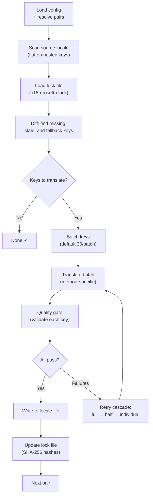

# Cách thức hoạt động của Sync

Lệnh `sync` là hoạt động cốt lõi của rosetta. Dưới đây là những gì diễn ra khi bạn chạy `npx i18n-rosetta sync`.

## Tổng quan về quy trình xử lý



## Từng bước thực hiện

### 1. Phân giải cấu hình

Rosetta tải `i18n-rosetta.config.json` (hoặc tự động phát hiện các cài đặt). Hệ thống sẽ phân giải:
- Locale nguồn và các locale đích
- Đồ thị cặp (các tổ hợp nguồn→đích nào cần xử lý)
- Các cài đặt về phương thức, model và chất lượng cho từng cặp

### 2. Quét nguồn

Tệp locale nguồn được tải và làm phẳng thành một bản đồ key→value:

```json
// Input (nested)
{ "hero": { "title": "Welcome", "subtitle": "Build" } }

// Flattened
{ "hero.title": "Welcome", "hero.subtitle": "Build" }
```

### 3. Phát hiện thay đổi

Rosetta đọc `.i18n-rosetta.lock`, nơi lưu trữ các mã băm SHA-256 của các giá trị nguồn đã được dịch trước đó. Đối với mỗi key, hệ thống sẽ kiểm tra:

| Điều kiện | Hành động |
|-----------|--------|
| Key bị thiếu ở đích | **Dịch** |
| Mã băm nguồn đã thay đổi kể từ lần đồng bộ cuối | **Dịch lại** (cũ) |
| Giá trị đích bắt đầu bằng `[EN]` | **Dịch lại** (placeholder dự phòng) |
| Mã băm nguồn không đổi, key đã tồn tại | **Bỏ qua** |

Đây là lý do tại sao rosetta chỉ dịch những gì đã thay đổi — hệ thống không dịch lại toàn bộ tệp của bạn trong mỗi lần đồng bộ.

### 4. Chia lô

Các key được gom thành các lô (mặc định: 30 key/lô đối với LLM, 128 đối với Google Translate). Việc chia lô giúp giảm số vòng lặp gọi API trong khi vẫn giữ cho các prompt ở mức dễ quản lý.

### 5. Dịch thuật

Mỗi lô được gửi đến phương thức dịch thuật đã được cấu hình:

- **`llm`**: Prompt có cấu trúc gửi đến OpenRouter kèm theo các chỉ thị về văn phong
- **`llm-coached`**: Tương tự, nhưng được tiêm thêm các quy tắc ngữ pháp, từ điển và ghi chú về văn phong
- **`google-translate`**: Yêu cầu theo lô của Google Cloud Translation API v2
- **`api`**: HTTP POST đến một endpoint từ xa

Thông điệp hệ thống (văn phong, quy tắc) là giống hệt nhau giữa các lô cho một locale nhất định, cho phép **prompt caching** — các nhà cung cấp như Anthropic và Google sẽ lưu trữ bộ nhớ đệm (cache) các thông điệp hệ thống lặp lại, giúp giảm chi phí token.

### 6. Kiểm soát chất lượng

Mọi bản dịch đều được xác thực trước khi ghi vào ổ đĩa. Có năm bước kiểm tra được thực thi:

| Kiểm tra | Lỗi phát hiện | Ví dụ |
|-------|----------------|---------|
| **Trống/rỗng** | Model không trả về gì | `""` |
| **Lặp lại nguồn** | Model trả về đầu vào tiếng Anh | `"Welcome"` cho tiếng Nhật |
| **Vòng lặp ảo giác** | Các trigram bị lặp lại | `"Qo' Qo' Qo' Qo'"` |
| **Độ dài tăng bất thường** | Đầu ra dài gấp 4 lần trở lên so với nguồn | Nguồn 10 ký tự → Đầu ra 50 ký tự |
| **Tuân thủ hệ thống chữ viết** | Sai hệ thống chữ viết cho locale | Văn bản Latinh cho locale tiếng Ả Rập |

Các lỗi được ghi log với tiền tố `[GATE]`. Không có các dự phòng ngầm (silent fallbacks).

Xem [Quality Gate](/docs/concepts/quality-gate) để biết thêm chi tiết.

### 7. Thử lại theo tầng

Khi phân tích cú pháp JSON thất bại hoặc có lỗi ở cấp độ lô, rosetta sẽ thử lại với các lô nhỏ dần:

```
Full batch (30 keys) → Failed
Half batch (15 keys) → Failed
Individual keys (1 each) → Isolates the problem key
```

Ngân sách thử lại được giới hạn bởi `maxRetries` (mặc định: 3) để ngăn chặn việc tiêu tốn token vượt kiểm soát.

### 8. Ghi và Khóa

Các bản dịch đạt yêu cầu sẽ được ghi vào tệp locale đích, bảo toàn cấu trúc lồng nhau ban đầu. Tệp khóa (lock file) được cập nhật với các mã băm SHA-256 mới.

## Thành công một phần

Một lô thất bại sẽ không chặn các lô còn lại. Nếu 9 trong số 10 lô thành công, 9 lô đó sẽ được ghi lại. Lô thất bại sẽ được ghi log và bạn có thể chạy lại `sync` để thử lại.

## Chạy thử

Xem trước những gì sẽ thay đổi mà không ghi bất kỳ tệp nào:

```bash
npx i18n-rosetta sync --dry
```

## Bắt buộc dịch lại

Bắt buộc dịch lại các key cụ thể ngay cả khi không có thay đổi:

```bash
npx i18n-rosetta sync --force-keys "hero.title,nav.about"
```

## Ước tính chi phí

Trước khi dịch, rosetta tạo một **báo cáo chi phí trước đồng bộ (pre-sync cost report)** hiển thị chi phí ước tính cho từng cặp. Quá trình này chạy tự động trong mỗi lần `sync` — bạn sẽ thấy báo cáo này trước khi bất kỳ lệnh gọi API nào được thực hiện.

```
╔══════════════════════════════════════════════════════════╗
║  Cost Estimate                                          ║
╠════════════╦═══════╦════════════╦════════════════════════╣
║ Pair       ║ Keys  ║ Est. Cost  ║ Method                 ║
╠════════════╬═══════╬════════════╬════════════════════════╣
║ en → fr    ║   142 ║ $0.07      ║ google-translate       ║
║ en → ja    ║    38 ║   —        ║ llm (model-dependent)  ║
║ en → crk   ║    38 ║   —        ║ llm-coached            ║
╚════════════╩═══════╩════════════╩════════════════════════╝
```

### Những gì được ước tính

Mỗi phương thức dịch thuật cung cấp ước tính chi phí riêng:

| Phương thức | Cơ sở tính phí | Độ chính xác |
|--------|-----------|-----------|
| `google-translate` | Mức giá công bố của Google ($20/triệu ký tự) | Chính xác |
| `llm` | Thay đổi theo model của OpenRouter | Phụ thuộc vào model — xem [Bảng giá OpenRouter](https://openrouter.ai/models) |
| `llm-coached` | Giống như `llm` cộng thêm các token ngữ cảnh huấn luyện (coaching context) | Phụ thuộc vào model |
| `api` | Do máy chủ quyết định | Không xác định — không thể ước tính nếu không truy vấn endpoint |

Khi một phương thức không thể xác định chi phí (các phương thức LLM, API từ xa), rosetta sẽ báo cáo `—` thay vì phỏng đoán. Sử dụng `--dry` để xem các ước tính chi phí mà không thực sự tiến hành dịch.