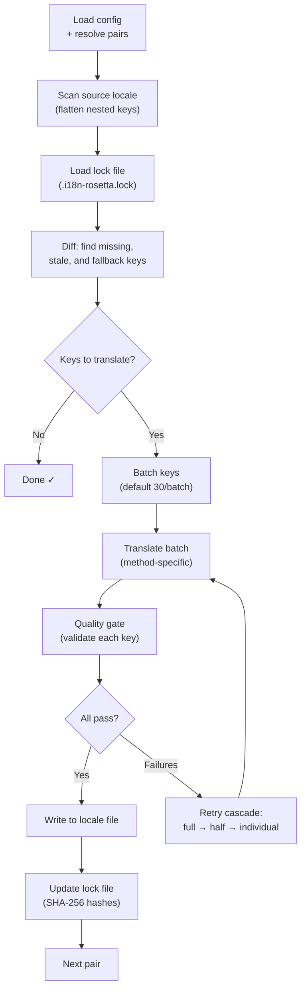

# Cách hoạt động của Sync

Lệnh `sync` là hoạt động cốt lõi của rosetta. Dưới đây là những gì xảy ra khi bạn chạy `npx i18n-rosetta sync`.

## Tổng quan về Pipeline



## Chi tiết các bước

### 1. Xác định Config

Rosetta tải `i18n-rosetta.config.json` (hoặc tự động phát hiện các cài đặt). Nó sẽ xác định:
- Locale nguồn và các locale đích
- Đồ thị cặp (các tổ hợp nguồn→đích nào cần xử lý)
- Các cài đặt về phương thức, model và chất lượng cho từng cặp

### 2. Quét nguồn

File locale nguồn được tải và làm phẳng (flatten) thành một map dạng key→value:

```json
// Input (nested)
{ "hero": { "title": "Welcome", "subtitle": "Build" } }

// Flattened
{ "hero.title": "Welcome", "hero.subtitle": "Build" }
```

### 3. Phát hiện thay đổi

Rosetta đọc `.i18n-rosetta.lock`, nơi lưu trữ các mã băm SHA-256 của các giá trị nguồn đã được dịch trước đó. Với mỗi key, nó sẽ kiểm tra:

| Điều kiện | Hành động |
|-----------|--------|
| Key bị thiếu ở đích | **Dịch** |
| Mã băm nguồn đã thay đổi kể từ lần sync trước | **Dịch lại** (cũ) |
| Giá trị đích bắt đầu bằng `[EN]` | **Dịch lại** (placeholder dự phòng) |
| Mã băm nguồn không đổi, key đã tồn tại | **Bỏ qua** |

Đây là lý do tại sao rosetta chỉ dịch những gì đã thay đổi — nó không dịch lại toàn bộ file của bạn trong mỗi lần sync.

### 4. Chia batch

Các key được nhóm thành các batch (mặc định: 30 key/batch đối với LLM, 128 đối với Google Translate). Việc chia batch giúp giảm số lần gọi API (round trips) trong khi vẫn giữ cho các prompt ở mức dễ quản lý.

### 5. Dịch thuật

Mỗi batch được gửi đến phương thức dịch đã cấu hình:

- **`llm`**: Prompt có cấu trúc gửi đến OpenRouter kèm theo các hướng dẫn về văn phong (register) và giới tính
- **`llm-coached`**: Tương tự, nhưng được tiêm thêm các quy tắc ngữ pháp, từ điển và ghi chú về văn phong
- **`google-translate`**: Request dạng batch của Google Cloud Translation API v2
- **`api`**: HTTP POST đến một endpoint từ xa

System message (văn phong, hướng dẫn giới tính, quy tắc) là giống hệt nhau giữa các batch cho một locale nhất định, cho phép **prompt caching** — các nhà cung cấp như Anthropic và Google sẽ cache lại các system message lặp lại, giúp giảm chi phí token.

### 6. Quality Gate

Mọi bản dịch đều được xác thực trước khi ghi vào ổ đĩa. Có 5 bài kiểm tra được chạy:

| Bài kiểm tra | Lỗi phát hiện | Ví dụ |
|-------|----------------|---------|
| **Trống/rỗng** | Model không trả về gì cả | `""` |
| **Lặp lại nguồn (Source echo)** | Model trả về đầu vào tiếng Anh | `"Welcome"` cho tiếng Nhật |
| **Vòng lặp ảo giác (Hallucination loop)** | Lặp lại các trigram | `"Qo' Qo' Qo' Qo'"` |
| **Độ dài tăng bất thường** | Đầu ra dài hơn 4 lần trở lên so với nguồn | Nguồn 10 ký tự → Đầu ra 50 ký tự |
| **Tuân thủ hệ chữ viết (Script compliance)** | Sai hệ chữ viết cho locale | Văn bản Latinh cho locale tiếng Ả Rập |

Các lỗi được log lại với tiền tố `[GATE]`. Không có fallback ngầm.

Xem [Quality Gate](/docs/concepts/quality-gate) để biết thêm chi tiết.

### 7. Thử lại theo tầng (Retry Cascade)

Khi lỗi phân tích cú pháp JSON hoặc lỗi cấp độ batch, rosetta sẽ thử lại với các batch nhỏ dần:

```
Full batch (30 keys) → Failed
Half batch (15 keys) → Failed
Individual keys (1 each) → Isolates the problem key
```

Ngân sách thử lại được giới hạn bởi `maxRetries` (mặc định: 3) để ngăn chặn việc tiêu tốn token vượt kiểm soát.

### 8. Ghi & Khóa (Write & Lock)

Các bản dịch đạt yêu cầu sẽ được ghi vào file locale đích, giữ nguyên cấu trúc lồng nhau ban đầu. File lock được cập nhật với các mã băm SHA-256 mới.

## Thành công một phần

Một batch thất bại không làm chặn các batch còn lại. Nếu 9 trong số 10 batch thành công, 9 batch đó sẽ được ghi lại. Batch thất bại sẽ được log lại và bạn có thể chạy lại `sync` để thử lại.

## Chạy thử (Dry Run)

Xem trước những gì sẽ thay đổi mà không ghi bất kỳ file nào:

```bash
npx i18n-rosetta sync --dry
```

## Bắt buộc dịch lại

Bắt buộc dịch lại các key cụ thể ngay cả khi không có thay đổi:

```bash
npx i18n-rosetta sync --force-keys "hero.title,nav.about"
```

## Ước tính chi phí

Trước khi dịch, rosetta tạo ra một **báo cáo chi phí trước khi sync (pre-sync cost report)** hiển thị chi phí ước tính cho từng cặp. Quá trình này chạy tự động trong mỗi lần `sync` — bạn sẽ thấy nó trước khi bất kỳ lệnh gọi API nào được thực hiện.

```
╔══════════════════════════════════════════════════════════╗
║  Cost Estimate                                          ║
╠════════════╦═══════╦════════════╦════════════════════════╣
║ Pair       ║ Keys  ║ Est. Cost  ║ Method                 ║
╠════════════╬═══════╬════════════╬════════════════════════╣
║ en → fr    ║   142 ║ $0.07      ║ google-translate       ║
║ en → ja    ║    38 ║   —        ║ llm (model-dependent)  ║
║ en → crk   ║    38 ║   —        ║ llm-coached            ║
╚════════════╩═══════╩════════════╩════════════════════════╝
```

### Những gì được ước tính

Mỗi phương thức dịch cung cấp ước tính chi phí riêng:

| Phương thức | Cơ sở tính phí | Độ chính xác |
|--------|-----------|-----------|
| `google-translate` | Mức giá công bố của Google ($20/triệu ký tự) | Chính xác |
| `llm` | Thay đổi theo model OpenRouter | Phụ thuộc vào model — xem [Bảng giá OpenRouter](https://openrouter.ai/models) |
| `llm-coached` | Giống như `llm` cộng thêm token ngữ cảnh huấn luyện (coaching context) | Phụ thuộc vào model |
| `api` | Do server quyết định | Không xác định — không thể ước tính nếu không truy vấn endpoint |

Khi một phương thức không thể xác định chi phí (các phương thức LLM, API từ xa), rosetta sẽ báo cáo `—` thay vì đoán. Sử dụng `--dry` để xem ước tính chi phí mà không thực sự dịch.

---

## Xem thêm

- [Tham chiếu CLI — sync](/docs/reference/cli#sync) — các cờ và tùy chọn của lệnh
- [Quality Gate](/docs/concepts/quality-gate) — cách các bản dịch được xác thực
- [Phương thức dịch](/docs/guides/translation-methods) — cách mỗi phương thức hoạt động
- [Cấu hình](/docs/getting-started/configuration) — tham chiếu cấu hình
- [Hướng dẫn CI/CD](/docs/guides/ci-cd) — tự động hóa việc sync trong pipeline của bạn