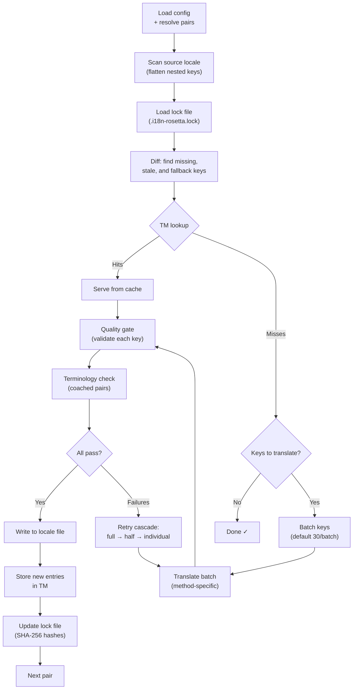

# Cách hoạt động của Sync

Lệnh `sync` là hoạt động cốt lõi của rosetta. Dưới đây là những gì diễn ra khi bạn chạy `npx i18n-rosetta sync`.

## Tổng quan về Pipeline



## Chi tiết từng bước

### 1. Phân giải cấu hình

Rosetta tải `i18n-rosetta.config.json` (hoặc tự động phát hiện các cài đặt). Nó sẽ phân giải:
- Locale nguồn và các locale đích
- Đồ thị cặp (các tổ hợp nguồn→đích nào cần xử lý)
- Các cài đặt về phương thức, model và chất lượng cho từng cặp

### 2. Quét nguồn

Tệp locale nguồn được tải và làm phẳng (flatten) thành một map dạng key→value:

```json
// Input (nested)
{ "hero": { "title": "Welcome", "subtitle": "Build" } }

// Flattened
{ "hero.title": "Welcome", "hero.subtitle": "Build" }
```

### 3. Phát hiện thay đổi

Rosetta đọc `.i18n-rosetta.lock`, nơi lưu trữ các mã băm SHA-256 của các giá trị nguồn đã được dịch trước đó. Với mỗi key, nó sẽ kiểm tra:

| Điều kiện | Hành động |
|-----------|--------|
| Key bị thiếu ở đích | **Dịch** |
| Mã băm nguồn đã thay đổi kể từ lần sync trước | **Dịch lại** (cũ) |
| Giá trị đích bắt đầu bằng `[EN]` | **Dịch lại** (placeholder dự phòng) |
| Mã băm nguồn không đổi, key đã tồn tại | **Bỏ qua** |

Đây là lý do tại sao rosetta chỉ dịch những gì đã thay đổi — nó không dịch lại toàn bộ tệp của bạn trong mỗi lần sync.

### 4. Gom nhóm (Batching)

Các key được gom thành các batch (mặc định: 30 key/batch đối với LLM, 128 đối với Google Translate). Việc gom batch giúp giảm số lần gọi API trong khi vẫn giữ cho các prompt ở mức dễ quản lý.

### 4b. Translation Memory

Trước khi gom batch, rosetta sẽ kiểm tra bộ nhớ cache của Translation Memory (`.rosetta/tm.json`). Các key có văn bản nguồn + locale + phương thức khớp với một bản dịch trước đó sẽ được phục vụ ngay lập tức từ cache — không cần gọi API.

```
  [TM] 142 key(s) served from cache
  Translating 3 key(s) to French (llm)... [OK]
```

TM là cơ chế tiết kiệm chi phí chính. Việc chạy lại sync sau khi thay đổi một key duy nhất sẽ chỉ dịch key đó, chứ không phải toàn bộ tệp. Xem [Translation Memory](/docs/concepts/translation-memory) để biết thêm chi tiết.

Để bỏ qua cache cho một lần chạy duy nhất: `i18n-rosetta sync --no-tm`

### 5. Dịch thuật

Mỗi batch được gửi đến phương thức dịch đã cấu hình:

- **`llm`**: Prompt có cấu trúc gửi đến OpenRouter kèm theo các hướng dẫn về văn phong (register) và giới tính
- **`llm-coached`**: Tương tự, nhưng được tiêm thêm các quy tắc ngữ pháp, từ điển và ghi chú về phong cách
- **`google-translate`**: Request dạng batch của Google Cloud Translation API v2
- **`api`**: HTTP POST đến một endpoint từ xa

System message (văn phong, hướng dẫn giới tính, quy tắc) là giống hệt nhau giữa các batch cho một locale nhất định, cho phép **prompt caching** — các nhà cung cấp như Anthropic và Google sẽ cache các system message lặp lại, giúp giảm chi phí token.

### 6. Quality Gate

Mọi bản dịch đều được xác thực trước khi ghi vào ổ đĩa. Có 5 bước kiểm tra được chạy:

| Kiểm tra | Lỗi phát hiện | Ví dụ |
|-------|----------------|---------|
| **Trống/rỗng** | Model không trả về gì cả | `""` |
| **Lặp lại nguồn** | Model trả về đầu vào tiếng Anh | `"Welcome"` cho tiếng Nhật |
| **Vòng lặp ảo giác** | Các trigram bị lặp lại | `"Qo' Qo' Qo' Qo'"` |
| **Độ dài tăng bất thường** | Đầu ra dài hơn 4 lần so với nguồn | Nguồn 10 ký tự → Đầu ra 50 ký tự |
| **Tuân thủ hệ chữ viết** | Sai hệ chữ viết (script) cho locale | Văn bản Latinh cho locale tiếng Ả Rập |

Các lỗi thất bại được ghi log với tiền tố `[GATE]`. Không có fallback ngầm.

Xem [Quality Gate](/docs/concepts/quality-gate) để biết thêm chi tiết.

### 6b. Xác minh thuật ngữ

Đối với các cặp được huấn luyện (coached pairs) có từ điển, rosetta sẽ kiểm tra xem LLM có thực sự sử dụng thuật ngữ được yêu cầu sau khi dịch hay không. Các vi phạm được ghi log dưới dạng cảnh báo `[TERM]`:

```
[TERM] en→fr: 2 term violation(s)
  • "dashboard" → expected "tableau de bord" but got "panneau"
```

Đây chỉ là các cảnh báo, không phải lỗi chặn (blocking errors) — bản dịch vẫn được ghi lại.

### 7. Thử lại theo tầng (Retry Cascade)

Khi gặp lỗi phân tích cú pháp JSON hoặc lỗi cấp độ batch, rosetta sẽ thử lại với các batch nhỏ dần:

```
Full batch (30 keys) → Failed
Half batch (15 keys) → Failed
Individual keys (1 each) → Isolates the problem key
```

Ngân sách thử lại được giới hạn bởi `maxRetries` (mặc định: 3) để ngăn chặn việc tiêu tốn token vượt kiểm soát.

### 8. Ghi & Khóa (Write & Lock)

Các bản dịch đạt yêu cầu sẽ được ghi vào tệp locale đích, giữ nguyên cấu trúc lồng nhau ban đầu. Tệp lock sẽ được cập nhật với các mã băm SHA-256 mới.

## Dịch nội dung (Giai đoạn 2)

Đối với các dự án Docusaurus và Hugo, `sync` sẽ chạy giai đoạn thứ hai sau khi dịch các key JSON. Giai đoạn này dịch các tệp Markdown và MDX (tài liệu, bài đăng blog, hướng dẫn) bằng cách sử dụng cùng các phương thức và Quality Gate.

### Cách hoạt động

1. Rosetta khám phá tất cả các tệp nội dung nguồn (`.md`, `.mdx`) bằng cách duyệt qua thư mục content/docs
2. Với mỗi cặp tệp × locale, nó kiểm tra một tệp lock nội dung riêng biệt (`.i18n-rosetta-content.lock`) để tìm các thay đổi của mã băm SHA-256
3. Các tệp bị thay đổi hoặc bị thiếu được thu thập vào một pool công việc phẳng (flat work-item pool)
4. Pool này được xử lý với **tính đồng thời song song** (mặc định: 12 lệnh gọi API cùng lúc)

```
Phase 2: content (79 translations to process, 341 skipped, concurrency: 12)

    [1/79] (1%)  docs/concepts/security.md → ja [RE-TRANSLATE] (~3328s left)
    [2/79] (3%)  docs/concepts/security.md → th [RE-TRANSLATE] (~1821s left)
    ...
    [79/79] (100%) blog/v3-2-quality.md → de [OK]

  [OK] Created 79 content file(s), 341 unchanged
```

### Xử lý song song dạng flat-pool

Khác với Giai đoạn 1 (các key JSON, chạy tuần tự theo từng locale), Giai đoạn 2 xử lý tất cả các tổ hợp tệp×locale dưới dạng một danh sách phẳng. Điều này có nghĩa là các tệp khác nhau và các locale khác nhau sẽ được dịch đồng thời:

- `docs/configuration.md → fr` và `docs/cli.md → ja` chạy cùng lúc
- Một tập dữ liệu gồm 420 bản dịch hoàn thành trong khoảng 11 phút ở mức đồng thời là 12
- Việc ghi manifest tăng dần sau mỗi 10 lần hoàn thành giúp ngăn chặn mất tiến trình nếu quá trình bị buộc dừng

Kiểm soát tính đồng thời bằng `--concurrency` hoặc trường cấu hình `concurrency`:

```bash
# Faster (more parallel calls, higher API load)
npx i18n-rosetta sync --concurrency 20

# Slower (gentler on rate limits)
npx i18n-rosetta sync --concurrency 4
```

### Bảo vệ nội dung

Trong quá trình dịch, rosetta sẽ bảo vệ các nội dung không thể dịch:

- **Khối mã (Code blocks)** (dạng rào - fenced và thụt lề - indented) được thay thế bằng các placeholder
- Các trường **Frontmatter** không nằm trong danh sách `translatableFields` được giữ nguyên trạng
- **Liên kết**, đường dẫn hình ảnh và các thẻ HTML được bảo vệ
- **Shortcode** và các biến nội suy (ví dụ: `{count}`, `{{.Params.title}}`) được che chắn

Sau khi dịch, tất cả các placeholder sẽ được khôi phục và xác thực. Nếu có bất kỳ placeholder nào bị thiếu hoặc hỏng, bản dịch sẽ bị từ chối và thử lại.

## Thành công một phần

Một batch thất bại sẽ không chặn các batch còn lại. Nếu 9 trên 10 batch thành công, 9 batch đó sẽ được ghi lại. Batch thất bại sẽ được ghi log và bạn có thể chạy lại `sync` để thử lại.

## Chạy thử (Dry Run)

Xem trước những gì sẽ thay đổi mà không ghi bất kỳ tệp nào:

```bash
npx i18n-rosetta sync --dry-run
```

## Bắt buộc dịch lại

Bắt buộc dịch lại các key cụ thể ngay cả khi chúng không thay đổi:

```bash
npx i18n-rosetta sync --force-keys "hero.title,nav.about"
```

## Ước tính chi phí

Trước khi dịch, rosetta tạo một **báo cáo chi phí trước khi sync** hiển thị chi phí ước tính cho từng cặp. Quá trình này chạy tự động trong mỗi lần `sync` — bạn sẽ thấy nó trước khi bất kỳ lệnh gọi API nào được thực hiện.

```
╔══════════════════════════════════════════════════════════╗
║  Cost Estimate                                          ║
╠════════════╦═══════╦════════════╦════════════════════════╣
║ Pair       ║ Keys  ║ Est. Cost  ║ Method                 ║
╠════════════╬═══════╬════════════╬════════════════════════╣
║ en → fr    ║   142 ║ $0.07      ║ google-translate       ║
║ en → ja    ║    38 ║   —        ║ llm (model-dependent)  ║
║ en → crk   ║    38 ║   —        ║ llm-coached            ║
╚════════════╩═══════╩════════════╩════════════════════════╝
```

### Những gì được ước tính

Mỗi phương thức dịch cung cấp ước tính chi phí riêng:

| Phương thức | Cơ sở chi phí | Độ chính xác |
|--------|-----------|-----------|
| `google-translate` | Mức giá công bố của Google ($20/triệu ký tự) | Chính xác |
| `llm` | Thay đổi theo model OpenRouter | Phụ thuộc vào model — xem [Bảng giá OpenRouter](https://openrouter.ai/models) |
| `llm-coached` | Giống như `llm` cộng thêm token ngữ cảnh huấn luyện | Phụ thuộc vào model |
| `api` | Do máy chủ quyết định | Không xác định — không thể ước tính nếu không truy vấn endpoint |

Khi một phương thức không thể xác định chi phí (các phương thức LLM, API từ xa), rosetta sẽ báo cáo `—` thay vì đoán. Sử dụng `--dry` để xem ước tính chi phí mà không thực sự thực hiện dịch.

---

## Xem thêm

- [Tham chiếu CLI — sync](/docs/reference/cli#sync) — các cờ và tùy chọn của lệnh
- [Translation Memory](/docs/concepts/translation-memory) — caching và tiết kiệm chi phí
- [Quality Gate](/docs/concepts/quality-gate) — cách các bản dịch được xác thực
- [Phương thức dịch](/docs/guides/translation-methods) — cách hoạt động của từng phương thức
- [Làm việc với dịch giả chuyên nghiệp](/docs/guides/professional-translators) — luồng công việc XLIFF
- [Cấu hình](/docs/getting-started/configuration) — tham chiếu cấu hình
- [Hướng dẫn CI/CD](/docs/guides/ci-cd) — tự động hóa quá trình sync trong pipeline của bạn